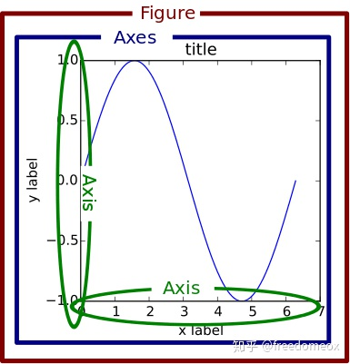
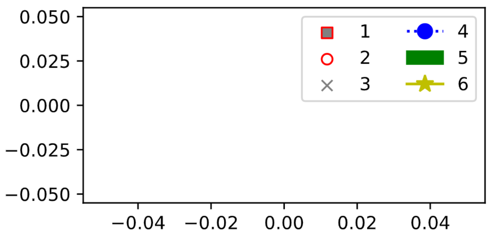

# matplotlib
> 见： [matplotlib：先搞明白plt. /ax./ fig再画](https://zhuanlan.zhihu.com/p/93423829)
## plt, ax, fig 分别是什么

在matplotlib中，有两种画图方式：
* `fig = plt.figure()`：通过`plt.xxx`来画图，其实是取了一个捷径。这是通过matplotlib提供的一个api，这个plt提供了很多基本的function可以让你很快的画出图来，但是如果你想要更细致的精调，就要使用另外一种方法
    ```python
    plt.figure(1)  
    plt.subplot(211)   
    plt.plot(A,B)   
    plt.show()
    ```
* `fig, ax = plt.subplot()`：这个就是正统的稍微复杂一点的画图方法了。指定figure（画布）和axes（子图），然后对axes单独操作。当明白`figure/axes/axis`都是控制什么的时候，如果想要简单的制作一个quick and dirty的图，用`plt.xxx`才是OK的
    ```python
    fig, ax = plt.subplots(figsize=(14,7))
    # fig, ax = plt.subplots(2,1,figsize(14,7))
    # ax[0].***
    # ax[1].***
    ```


<p align="center" >
    
</p>


## 用 plt.***：容易引起混淆
```python
def plot_radar_heatmap(self, points, img_size, bboxes, save_path):
    """
    plot and save 
    """
    plt.figure(figsize=(16, 9))

    h, _, _, _ = plt.hist2d(points[0, :], points[1, :], [26,26], [[0, img_size[0]], [0, img_size[1]]])
    plt.gca().imshow(h)     # gca means get_current_axes

    # change the original point from down-left corner to top-left corner
    plt.gca().invert_yaxis()
    plt.axis('on') 
    
    # show ground truth bboxes and classes
    for idx, box in enumerate(bboxes): 
        rect = plt.Rectangle((box[0], box[1]), box[2]-box[0], box[3]-box[1], fill=False, edgecolor ='red')
        plt.gca().add_patch(rect)
        plt.text(box[0], box[1], s="aaa", color="red", verticalalignment="top", fontsize=15)

    plt.savefig(save_path)
    plt.close('all')
```

## 用 ax.***
```python
def plot_radar_heatmap(self, points, img_size, bboxes, save_path):
    """
    plot and save 
    """
    fig, ax = plt.subplots(figsize=(16, 9))

    h, _, _, _ = ax.hist2d(points[0, :], points[1, :], [26,26], [[0, img_size[0]], [0, img_size[1]]])
    ax.imshow(h)

    # change the original point from down-left corner to top-left corner
    ax.invert_yaxis()
    ax.axis('on')   
    
    # show ground truth bboxes and classes
    for idx, box in enumerate(bboxes): 
        rect = plt.Rectangle((box[0], box[1]), box[2]-box[0], box[3]-box[1], fill=False, edgecolor ='red')
        ax.add_patch(rect)
        ax.text(box[0], box[1], s="aaa", color="red", verticalalignment="top", fontsize=15)

    fig.savefig(save_path)  # to save figure, use fig.savefig()  
    plt.close('all')
```

## 自定义legend
```python
import matplotlib.pyplot as plt
from matplotlib.pyplot import scatter
from matplotlib.patches import Patch
from matplotlib.lines import Line2D

fig = plt.figure(figsize=(4,2))


legend_elements = [
    scatter([], [], marker='s', lw=1, color='grey', edgecolor='r', label='1'), 
    scatter([], [], marker='o', lw=1, color='w', edgecolor='r', label='2'), 
    scatter([], [], marker='x', lw=1, color='grey', label='3'),
    plt.plot([],[], marker="o", ms=8, ls=":", color='b', label="4")[0],
    Patch(color='g', label="5"),
    Line2D([], [], color='y', marker='*', markersize=10, label='6')
    ]

plt.legend(handles=legend_elements, loc='best', ncol=2)

plt.show()
```
用到了 legend 的 handler，结果如图：
<p align="center" >
    
</p>


## 其他
* 查看 matplotlib 默认颜色循环：
`print(plt.rcParams['axes.prop_cycle'].by_key()['color'])`
