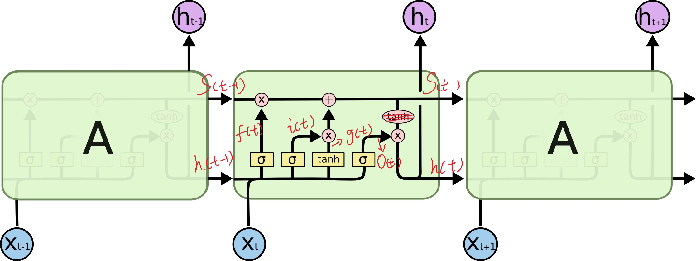

## 关于Loss Function
> https://zhuanlan.zhihu.com/p/36670444   
> https://www.cnblogs.com/yinheyi/p/6131262.html
* `Softmax Function + Cross Entropy` 和 `Logistic Function + Logistic Loss` 关系？
    * 前者是后者从二分到多分类的推广
* Softmax, Logistic的主要作用？
    * 将负无穷到正无穷映射到 [0, 1]
* 为什么Loss Function要用对数？  
    * 对于Logistic Loss Function: 最小化Loss Function = 最大化二项分布的似然函数 = 最大化二项分布的对数似然函数
    * 同理，对于Cross Entropy: 最小化Loss Function = 最大化多项分布的对数似然函数

## 关于 One-hot Coding
> https://www.zhihu.com/question/53802526/answer/515535985

为了使得各种结果之间距离相等

## LSTM
> https://www.zhihu.com/question/64470274

	

* A被称作cell，LSTM的`cell`在每个`time_step`是复用的
* `num_units` = `h_t` 和 `s_t` 的维度大小（两者相同维度）= 最后一个time step输出维度大小（输出为h） = 黄色框的输出维度大小 = `hidden_size`
* LSTM参数量：`(hidden_size * (hidden_size + x_dim ) + hidden_size) *4 `，因为 `f = sigma(W[h, x] + b)`，相当于将维度 `(hidden_size + x_dim)` 变到了 `hidden_size`