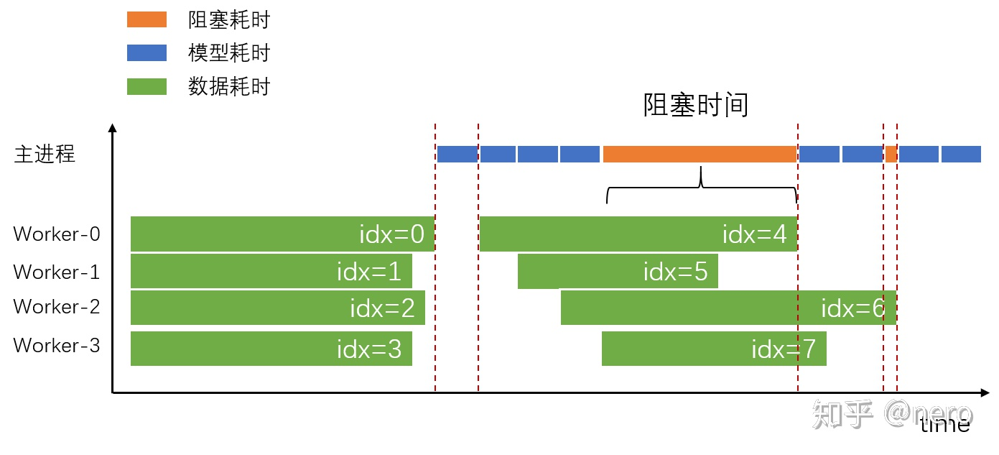

# pytorch多gpu并行训练  
> https://zhuanlan.zhihu.com/p/86441879  
> https://zhuanlan.zhihu.com/p/95700549  
> https://zhuanlan.zhihu.com/p/68717029   

`python -m torch.distributed.launch main.py`
* 按模块启动：https://www.cnblogs.com/xueweihan/p/5118222.html
    * 直接启动 `python xxx.py` 是把 `xxx.py` 文件所在的目录放到了sys.path属性中
    * 按模块启动 `python -m xxx.py` 是把你输入命令的目录（也就是当前路径），放到了sys.path属性中  

<br>

# Pytorch Internals
## Folders
* `torch/`：包含导入和使用的实际Python模块。Python代码，很容易上手调试。

* `torch/csrc/`：它实现了在Python和C++之间进行转换的绑定代码，以及一些非常重要的PyTorch功能，如autograd引擎和JIT编译器。它还包含C++前台代码。
    * `torch._C` 模块在 `torch/csrc/Module.cpp` 中定义。这个模块被称为是一个扩展模块（一个用C实现的Python模块），它允许我们定义新的内建对象类型（例如：Tensor）并调用 C/C++ 函数。

* `aten/`：“A Tensor Library”的缩写（由Zachary DeVito创造），是一个实现Tensors操作的C++库。存放一些内核代码存在的地方，尽量不要在那里花太多时间。

* `c10/`：这是一个双关语。C代表Caffe，10既是二级制的2 (Caffe2)，也是十进制的10（英文Ten，同时也是Tensor的前半部分）。包含PyTorch的核心抽象，包括Tensor和Storage数据结构的实际实现。

<br>

# Pytorch Features
> https://speakerdeck.com/perone/pytorch-under-the-hood?slide=21

## Tensors
* Although PyTorch has an elegant python first design, all PyTorch heavy work is actually implemented in C++. The integration of C++ code is usually done using what is called an **extension**.

* zero-copy tensors
    ```python
    # a copy is made
    np_array = np.ones((1,2))
    torch_array = torch.tensor(np_array)    # This make a copy
    torch_array.add_(1.0)   # underline after an operation means an in-place operation
    print(np_array)     # array([[1., 1.]])

    # zero-copy
    np_array = np.ones((1,2))
    torch_array = torch.from_numpy(np_array)    # This make a copy
    torch_array.add_(1.0) # or torch_array += 1.0 (in place operation)
    print(np_array)     # array([[2., 2.]])

    # zero-copy
    np_array = np.ones((1,2))
    torch_array = torch.from_numpy(np_array)    # This make a copy
    torch_array = torch_array + 1.0     # not an in-place operatio on torch_array 
    print(np_array)     # array([[1., 1.]])
    ```
    The tensor **FloatTensor** did a copy of the **numpy array data pointer** instead of the contents. The reference is kept safe by Python reference counting mechanism.

* The abstraction responsible for holding the data isn't actually the Tensor, but the Storage. We can have multiple tensors sharing the same storage, but with different interpretations, also called views, but without duplicating memory.

    ```python 
    t_a = torch.ones((2,2))
    t_b = t_a.view(4)
    t_a_data = t_a.storage().data_ptr()
    t_b_data = t_b.storage().data_ptr()
    t_a_data == t_b_data

    # True
    ```


## JIT: just-in-time compiler 
> https://zhuanlan.zhihu.com/p/52154049  
> https://zhpmatrix.github.io/2019/03/01/c++-with-pytorch/

早期的PyTorch只有Python前端，但对于工业界的实际部署问题，Python语言太慢，可移植性和适用性根本无法和C++相比。当时的一个想法是，PyTorch训练模型，然后前向推断时将结构和参数灌入到C++代码中，这估计也是早些年的一些做法。但是调研之后，将PyTorch的C++后端拉出来并不容易，而且如果从C++原生代码来写起，工作量也很大。因此，希望有一个C++前端方便做推断部署。

千呼万唤始出来。PyTorch1.0发布了，这样业界部署的工作流程可以变成这样：

> 论文发布->PyTorch开源代码(或者自己实现)->训练模型->导出模型->载入模型(C++/Python/其他框架/其他硬件平台)

PyTorch1.0后，可以通过两种方式，分别是Tracing和Script，将一个Python代码转化为TorchScript代码，继而导出相应的模型可以继续被优化，同时被C++所调用，最终实现对生产环境下的支持（考虑到多线程执行和性能原因，一般Python代码并不适合做部署）

* Tracing  
Tracing方式对于含有if和for-loop的场景失效，需要用script方式

* Script  
https://zhpmatrix.github.io/2019/03/09/torch-jit-pytorch/   


## Dataloader
* Dataloader 数据装载阻塞的问题: https://bbs.cvmart.net/topics/2066  
    <p align="center" >
        
    </p>

    * 一个 worker 独立的处理一个 batch，而不是多个 worker 同时处理一个 batch
    * dataloader **不是** 等所有worker数据取完才进行下一批次的数据读取，worker 之间并没有同步
    * 输出的数据必须保持顺序性：主线程（进行反front/back propagation）按照`idx=0, 1, 2, 3...`依次处理 worker 产生的 batch
* 用 GPU 来完成 dataloader 中的 transform:   
https://zhuanlan.zhihu.com/p/77633542  
https://github.com/pytorch/pytorch/issues/31359  

## APEX