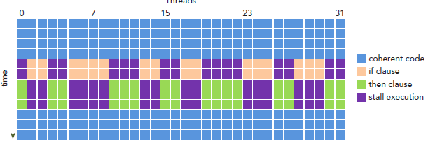
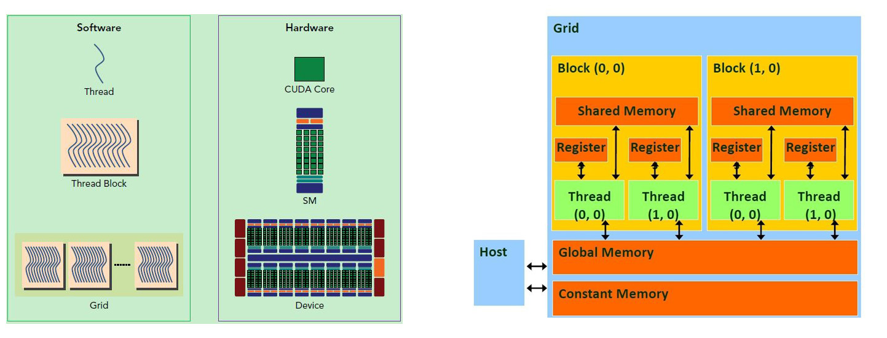

# 背景
## 硬件概念：`SM -> warps -> threads (sp)`
> SM (streaming multiprocessors), warp, SP (streaming processor)
* SM：以TX2为例，其 GPU 只有2个SM
* warp：warp 是 SM 执行和调度的最小单元。一般一个 warp 包含32个 thread，warp 中的 SP 的工作遵循 `SIMT （Single Instruction Multiple Thread）`，也就是说这些 thread 以不同数据资源执行相同的指令。也因此，分支语句在 GPU 的效率很低
<p align="center" >

</p>

* SP：在 GPU 中最小的硬件单元（在 Nvidia 的 fermi 构架之后也叫 CUDA core，现在这个术语现在通常也使用 thread 来代替，可以简单将 `thread == CUDA core == SP`）


## 软件概念：`grid -> block -> thread`
<p align="center" >

</p>

> 与上面3个硬件概念是相对的 
* 由于 warp 的大小一般为32，所以 block 所含的 thread 的大小一般要设置为32的倍数 (软件的 block 对应于硬件上的 warp)
* 同一个 block 中的 thread 可以同步（上文 SIMT），也可以通过 shared memory 进行通信


## 线程标识 threadIdx  
一个 block 包含多个thread，这些 thread 的组织方式也可以是一维，二维或者三维的。`CUDA 中每一个线程都有一个唯一的标识 ID 即 threadIdx`，这个 ID 随着 block 的划分方式的不同而变化，例如：
```
// 一维的block，一维的thread
int tid = blockIdx.x * blockDim.x + threadIdx.x;
```

## GPU 存储构架：global memory > shared memory > register
* 每个 thread 都有自己的一份 register 和 local memory 
* 一组 thread 构成一个 block，这些 thread 则共享有一份 shared memory
* 不同 block 的所有 thread 都共享一份 global memory、constant memory、和 texture memory

## Tiling 技术：减少对低速存储的访问
> https://zhuanlan.zhihu.com/p/367644657  
 
将 global memory 中的数据 load 到每个 block 的 shared memory 中去