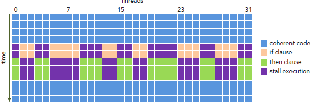
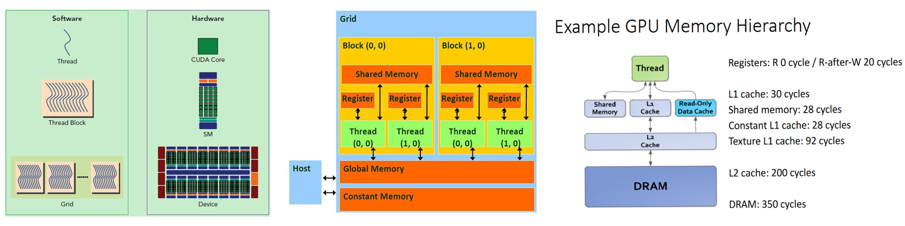
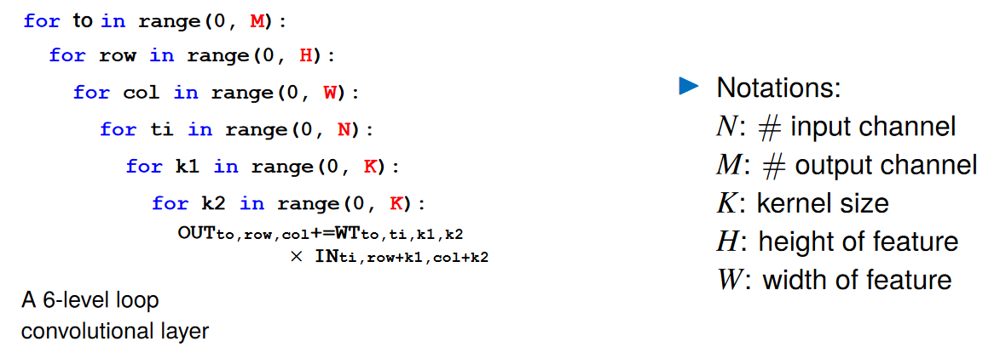
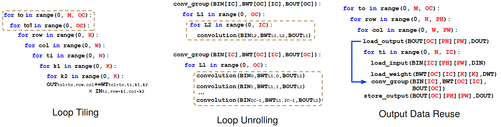
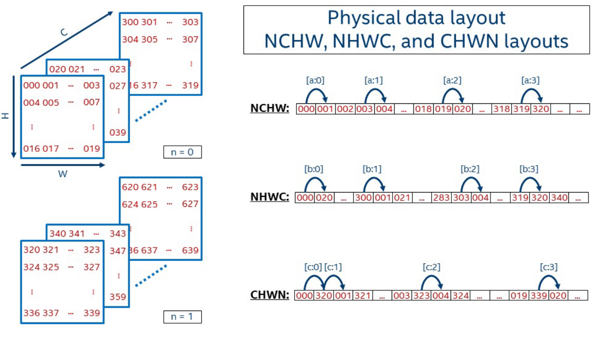
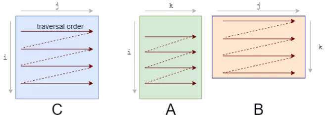
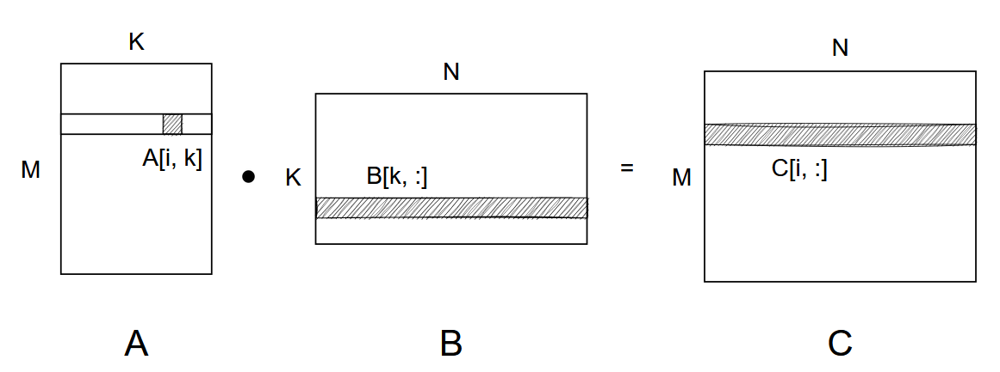
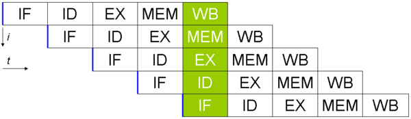
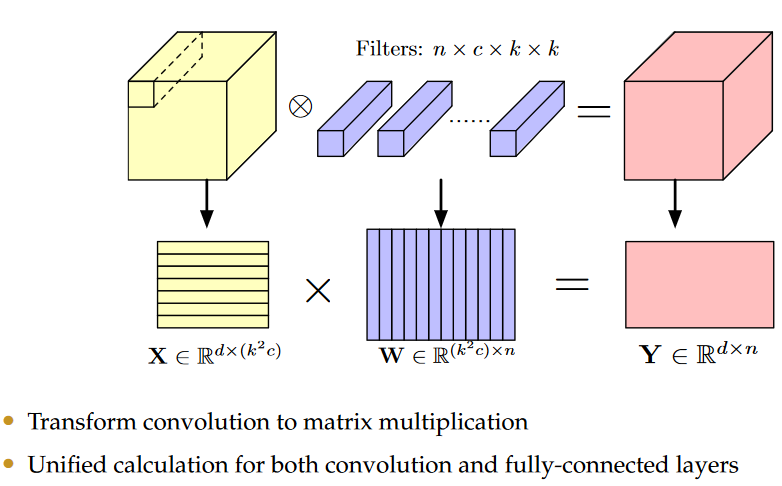

# 背景
## GPU 硬件概念：`SM -> warps -> threads (sp)`
> SM (streaming multiprocessors), warp, SP (streaming processor)
* SM：以TX2为例，其 GPU 只有2个SM
* warp：warp 是 SM 执行和调度的最小单元。一般一个 warp 包含32个 thread（Nvidia GPU），warp 中的 SP 的工作遵循 `SIMT （Single Instruction Multiple Thread）`，也就是说这些 thread 以不同数据资源执行相同的指令。也因此，分支语句在 GPU 的效率很低
<p align="center" >

</p>

* SP：在 GPU 中最小的硬件单元（在 Nvidia 的 fermi 构架之后也叫 CUDA core，现在这个术语现在通常也使用 thread 来代替，可以简单将 `thread == CUDA core == SP`）


## GPU 软件概念：`grid -> block -> thread`
<p align="center" >

</p>

> 与上面3个硬件概念是相对的 
* 由于 warp 的大小一般为32，所以 block 所含的 thread 的大小一般要设置为32的倍数 (软件的 block 对应于硬件上的 warp)
* 同一个 block 中的 thread 可以同步（上文 SIMT），也可以通过 shared memory 进行通信

## GPU 存储构架：global memory > shared memory > register/local memory


* 每个 thread 都有自己的一份 register 
* 一组 thread 构成一个 block，**`这些 thread 则共享一份 shared memory / L1 cache / Texture L1 cache `**
* 不同 block 的所有 thread 都共享一份 global memory、constant memory
* Server 和 Mobile GPU 也不同（See Romou Mobicom'22）
    * Server GPU 上 shared memory 和 L1 cache 几乎一样快，如上图最右边
    * Mobile GPU 上 shared memory 可能比 L1 cache 慢 

## 线程标识 threadIdx  
一个 block 包含多个thread，这些 thread 的组织方式也可以是一维，二维或者三维的。`CUDA 中每一个线程都有一个唯一的标识 ID 即 threadIdx`，这个 ID 随着 block 的划分方式的不同而变化，例如：
```
// 一维的block，一维的thread
int tid = blockIdx.x * blockDim.x + threadIdx.x;
```

## CPU 缓存命中
> https://zhuanlan.zhihu.com/p/209181629  

* CPU 访问各级存储的时钟周期（一个周期时间是主频的倒数）：内存 >100，L3 ~40，L2 ~12，L1 ~4
    * 三级缓存的大小的量级（每个CPU不一样）：一级32KB，二级256KB，三级20MB。其中每个CPU核心都有自己的一、二级缓存，**`但三级缓存却是一颗 CPU 上所有核心共享的`**
    * 程序执行时，会先将内存中的数据载入到共享的三级缓存中，再进入每颗核心独有的二级缓存，最后进入最快的一级缓存，之后才会被 CPU 使用

* 从内存搬运数据到缓存时，一次需要缓存 cache line 大小的数据（linux 可以通过 `coherency_line_size` 查看），当需要用的数据已经被载入 cache 时，就称作命中。例如，遍历访问数组时，按照内存布局顺序访问将会带来很大的性能提升（当访问某个元素时，缓存已经把紧随其后的元素也载入了，提升了命中率）。好的CPU会有一些预测的技术，如果找到一种pattern的话，就会预先加载更多的内存，包括指令也可以预加载，这叫 Prefetching 技术。  

    一个例子：假设我们有一个64M长的数组，设想一下下面的两个循环：
    ```c
    const int LEN = 64*1024*1024;
    int *arr = new int[LEN];
    for (int i = 0; i < LEN; i += 2) arr[i] *= i;
    for (int i = 0; i < LEN; i += 8) arr[i] *= i;
    ```

    按我们的想法来看，第二个循环要比第一个循环少4倍的计算量，其应该也是要快4倍的。但实际跑下来并不是，在我的机器上，第一个循环需要127毫秒，第二个循环则需要121毫秒，相差无几。这里最主要的原因就是 Cache Line，因为CPU会以一个Cache Line 64Bytes最小时单位加载，也就是16个 32bits 的整型，所以，无论你步长是2还是8，都差不多，而后面的乘法其实是不怎么耗CPU时间的。

<br>
<br>


# 矩阵乘法/卷积优化
> [tvm schedule详细举例](https://zhuanlan.zhihu.com/p/94846767)

<p align="center" >

</p>

H*W*M 的 K*K 卷积（假设stride=1）实现需要 6 层 for 循环（一张2d image和1个卷积核需要4层循环）。有如下三种常见优化方式：
<p align="center" >

</p>

## Loop Reorder
* 不同的 data layout 使得最优的内存访问顺序不同。例如 PyTorch 用的是 NCHW，最后一维为W，也就是按照 W 的方向遍历最高效（NCHW遍历时，001是000朝W方向移动一个），能增加缓存命中  

<center class="half">
	
</center>


* 例如 A*B=C 的矩阵卷积，`i->k->j` 比 `i->j->k` 高效

    因为矩阵虽然是3维的，但是在内存中还是按一维线性在存储；对于行主序，要想矩阵A的访问高效，要`i->k`；对B要`k->j`，所以要都满足只能是 `i->k->j`

    <center class="half">
        
    </center>

    ```python
    for i in 0..M:  # i->j->k
        for j in 0..N:
            for k in 0..K:
                C[i, j] += A[i, k] * B[k, j]

    # loop re-order 增加缓存命中
    for i in 0..M:  # i->k->j
        for k in 0..K:
            for j in 0..N:
                C[i, j] += A[i, k] * B[k, j]
    ```  
* 进一步优化：矩阵在内存中也是存成一个一维向量的，所以可以手动写指针直接访问元素代替类似 `A[i, k]` 的索引，减少寻址时间
    * 假设矩阵乘法：A * B = C，维度分别为 (M, K)，(K, N)，(M, N)
    * 每个 `C[i * W + j]` 的值，是 A 第 i 行和 B 第 j 列两个向量的点乘。假设存储是行主序的，未进行 loop order 时每次读取 B 都会产生 cache miss：
        ```c
        for (i = 0; i < M; i++)
        {
            for (j = 0; j < N; j++)
            {
                tmp = 0;
                for (k = 0; k < K; k++)
                {   // 内存里面矩阵是按行主序一维线性存储，input[k * W + j] 按列访问了
                    tmp += A[i * K + k] * B[k * M + j];
                }  
                C[i * M + j] = tmp;
            }
        }
        ```
    * 可以把中间层和最内层循环调换位置，按行读取右矩阵：
        > 见：https://zhuanlan.zhihu.com/p/383115932 
    
        <center class="half">
        
        </center>

        ```c
        for (i = 0; i < M; i++) // 对于A和C的第i行
        {
            for (k = 0; k < K; k++)     // 选定B的第k行
            {
                tmp = A[i * K+ k];          // A[i, k]
                cur_dst = C + i * N;        // C第i行
                cur_src = B + k * N;        // 右矩阵B的第k行地址
                for (j = 0; j < N; j++)     // C[i:,] = A[i,k]*B[k,:]
                {   
                    cur_dst[j] += tmp * cur_src[j];   
                }
            }
        }
        
        ```
        这样计算顺序就变为了：左矩阵第 i 行的第 k 个数与右矩阵第 k 行所有数做乘法，并累加到输出矩阵第 i 行的每个位置。如图中 `C[i,:]` 那一行的结果，可以通过 `A[i,k] 和 B[K,:]` 对k的累加得到。在最内层循环中右矩阵和输出矩阵都是按行访存，大大减少了 cache miss 的次数


## Data Reuse
> P20/21: http://www.cse.cuhk.edu.hk/~byu/CMSC5743/2021Fall/slides/Lec02-conv.pdf  

避免重复计算，例如在卷积中把需要被重复使用多次元素先算出来（通过 Loop Reodering）

## Loop Tiling: Ultilize Shared Memory
> https://zhuanlan.zhihu.com/p/367644657  
> [Loop Tiling 的 CUDA 代码实现](./CUDA_Program.md#loop-tiling)
有两个作用：
* 将 global memory 中的数据按照 block load 到 shared memory 中去，减少对低速存储的访问
* 多个 block 的运算 GPU 上可以实现并行

## 使用 Share memery 并避免 bank conflict
见 [Loop Tiling 的 CUDA 代码实现](./CUDA_Program.md#avoid-bank-conflict)

## Loop Unrolling
> [Why is it faster to process a sorted array than an unsorted array?](https://zhuanlan.zhihu.com/p/22469702)  
> 在大规模循环逻辑中要尽量避免数据强依赖的分支结构 (data-dependent branching），例如 for loop 里面有判断数据的 if 

* 将 loop 的一些循环展开，能够减少分支预测失败的几率
* 什么是分支预测？ 首先要了解 CPU pipeline 
    * CPU pipeline 是通过增加额外计算机硬件来实现的，以同时执行多条指令。加速原理类似 CPU/GPU pipline（CPU 等待 GPU 返回的时间内做下一帧的预处理）
    * 典型的 RISC（精简指令集 Reduced instruction set computer）流水线被分解成五个阶段，每个阶段之间使用触发器链接：`读取指令fetch，指令解码decode，运行execute，存储器访问memoery access，写回寄存器write-back`。通过流水线结构，下图是 5 层流水线结构
        <p align="center" >
        
        </p>
            
        ```c
        // 原代码
        for (i = 1; i <= 60; i++) 
            a[i] = a[i] * b + c;

        // 展开后
        for (i = 1; i <= 58; i+=3)
        {
            a[i] = a[i] * b + c;
            a[i+1] = a[i+1] * b + c;
            a[i+2] = a[i+2] * b + c;
        }
        ```
* 分支预测
    * Why？  
    如果没有流水线机制，一条指令大概会花费数个时钟周期，而如果采用流水线机制，当第一条指令完成Fetch后，第二条指令就可以进行Fetch了，极大提高了指令的执行效率。  
    上面是我们的期待的理想情况，而在现实环境中，`如果遇到的指令是 条件跳转指令，只要当前面的指令运行到 EX，才能知道要选择的分支`，显然这种 `停顿` 对于 CPU pipeline 机制是非常不友好的。而 `分支预测技术` 正是为了解决上述问题而诞生的，CPU 会根据分支预测的结果，选择下一条指令进入流水线。待跳转指令执行完成，如果预测正确，则流水线继续执行，不会受到跳转指令的影响。如果分支预测失败，那么便需要清空流水线，重新加载正确的分支（实际上目前市面上所有处理器都采用了类似的技术）

    * 分支预测器（Branch predictor）  
    是一种数字电路，在分支指令执行结束之前猜测哪一路分支将会被运行（下图中的一行也即一个分支），以提高处理器的指令流水线（pipeline）的性能 


## 卷积优化 Im2Col (Image2Column)
将卷积转化为矩阵乘法：将每个卷积核`（k^2*c）`，和 X 对应的感受野数据 `（k^2*c）`提前展开，利用成熟的矩阵乘法加速库
<p align="center" >

</p>


<br>
<br>


# TVM
## Schedule
> 知乎：https://zhuanlan.zhihu.com/p/360385060   
> TVM documents: [Schedule Primitives in TVM](https://tvm.apache.org/docs/how_to/work_with_schedules/schedule_primitives.html#)

* compute_at：将某个 axis 的 compute 移到另外一个 axis，见 https://tvm.apache.org/docs/reference/api/python/tir.html?highlight=compute_at#tvm.tir.Schedule.compute_at 
* rfactor(loop, factor_axis)

    One problem of building a reduction is that we cannot simply parallelize over the reduction axis. We need to (1) divide the computation of the reduction, (2) store the local reduction result in a temporal array, and (3) do a reduction over the temporal array. The rfactor primitive does such rewrite of the computation. 其中第二步可以引入并行  

    对于 `B = numpy.sum(A, axis=1)` 的操作：

    ```python        
    import tvm
    from tvm import te
    n = te.var("n")
    m = te.var("m")
    A = te.placeholder((n, m), name="A")
    k = te.reduce_axis((0, m), "k")
    B = te.compute((n,), lambda i: te.sum(A[i, k], axis=k), name="B")

    s = te.create_schedule(B.op)
    ko, ki = s[B].split(B.op.reduce_axis[0], factor=16) // ki的遍历区间为16
    BF = s.rfactor(B, ki)   // 间隔16做reduction，也即分为16组，idx相差16的为一组
    print(tvm.lower(s, [A, B], simple_mode=True))
    ```
    Output: 
    ```c
    primfn(A_1: handle, B_1: handle) -> ()
    attr = {"from_legacy_te_schedule": True, "global_symbol": "main", "tir.noalias": True}

    // stride 指的是 int float 等类型每个占多少字节
    buffers = {B: Buffer(B_2: Pointer(float32), float32, [n: int32], [stride: int32], type="auto"), 
                A: Buffer(A_2: Pointer(float32), float32, [n, m: int32], [stride_1: int32, stride_2: int32], type="auto")}
    buffer_map = {A_1: A, B_1: B} {
    allocate(B.rf: Pointer(global float32), float32, [(n*16)]), storage_scope = global {
        // 对于 k.inner loop 中每个给定的 k.inner，k.outer*16 + k.inner 代表是按 stride=16 进行累加，得到包含16个元素的 B.rf。这一步可以引入并行加速
        for (k.inner: int32, 0, 16) {
        for (i: int32, 0, n) {
            B.rf[((k.inner*n) + i)] = 0f32
            for (k.outer: int32, 0, floordiv((m + 15), 16)) {
            if @tir.likely((((k.outer*16) + k.inner) < m), dtype=bool) {
                B.rf[((k.inner*n) + i)] = ((float32*)B.rf[((k.inner*n) + i)] + (float32*)A_2[((i*stride_1) + (((k.outer*16) + k.inner)*stride_2))])
            }
            }
        }
        }

        // 将 B.rf 中的16个元素加起来
        for (ax0: int32, 0, n) {
        B_2[(ax0*stride)] = 0f32
        for (k.inner.v: int32, 0, 16) {
            B_2[(ax0*stride)] = ((float32*)B_2[(ax0*stride)] + (float32*)B.rf[((k.inner.v*n) + ax0)])
        }
        }
    }
    }
    ```


## 一个矩阵乘法的例子：tiling (local memory) + split + re-ordering + vectorize

> https://tvm.apache.org/docs/how_to/optimize_operators/opt_gemm.html#loop-permutation

* outer loop 的 index 始终放在 inner loop 的外面
* inner loop 用 m, k, n 的顺序遍历
* reduce_axis 见 https://tvm.apache.org/docs/how_to/work_with_schedules/reduction.html  
* split can split a specified axis into two axes by factor
    ```python
    import tvm
    from tvm import te

    M = 1024
    K = 1024
    N = 1024
    dtype = "float32"
    target = "llvm"
    dev = tvm.device(target, 0)
    bn = 32     # blocking size
    kfactor = 4

    k = te.reduce_axis((0, K), "k")     # reduce_axis 在 te.sum 的 axis=k 中使用
    A = te.placeholder((M, K), name="A")
    B = te.placeholder((K, N), name="B")
    C = te.compute((M, N), lambda m, n: te.sum(A[m, k] * B[k, n], axis=k), name="C")    # 提供一个计算描述

    s = te.create_schedule(C.op)    # 创建一个 scheduler

    "用户手动定义 sceduler 规则"
    mo, no, mi, ni = s[C].tile(C.op.axis[0], C.op.axis[1], bn, bn)  # block 大小 32 * 32 * sizeof(float) = 4KB
    (kaxis,) = s[C].op.reduce_axis  # 返回 k 这个轴的对象
    ko, ki = s[C].split(kaxis, factor=kfactor)  # split 作用于 k 对应的 axis，把该 axis 上的 iter 以 factor 为间隔分成 outer 与 inner 两层迭代，增加循环层数。这样是为了利用 GPU 等硬件的 grid/block 层级结构
    s[C].reorder(mo, no, ko, mi, ki, ni)   # Loop re-ordering
    s[C].vectorize(ni)  # 在数据size为常数、且分割的iter为2的幂时，LLVM 等编译器会自动生成支持 SIMD 的代码，这是SIMD 计算设备（如Intel CPU、Arm CPU）的常用schedule

    func = tvm.build(s, [A, B, C], target=target, name="mmult") # 得到一个 tvm module
    assert func

    # Random generated tensor for testing
    a = tvm.nd.array(numpy.random.rand(M, K).astype(dtype), dev)
    b = tvm.nd.array(numpy.random.rand(K, N).astype(dtype), dev)
    c = tvm.nd.array(numpy.zeros((M, N), dtype=dtype), dev)
    func(a, b, c)
    tvm.testing.assert_allclose(c.numpy(), answer, rtol=1e-5)

    evaluator = func.time_evaluator(func.entry_name, dev, number=10)
    print("Baseline: %f" % evaluator(a, b, c).mean)     # print running time
    print(s)
    print(tvm.lower(s, [A, B, C], simple_mode=True))    # print lower-level IR for debugging
    print("source code:\n", func.get_source())          # print source code
    ```

### Genrated Sample Program
> https://jcf94.com/2021/08/28/2021-08-28-simd/ 

例子为 `A * B = C` 的矩阵乘法，大小均为 `128*128`；索引的哑元是：`A(i,k), B(k,j), C(i,j)`
* `print(s)` 打印出的 schedule，使用了 tiling，unroll，vectorize
    ```c
    Placeholder: placeholder, placeholder
    parallel i.0@ (0,16)    // i方向分成16块（parallel实现在GPU以外的CPU等设备上并行）
        for j.0 (0,4)           // j方向分成4块
            for i.1 (0,2)       // i方向分成16块后，每块再细分成2块
                for j.1 (0,2)       // i方向分成4块后，每块再细分成2块

                    c.local auto_unroll: 16     // 使用 local memory c.local; 进行 unrolling
                    for k.0 (0,16)              // [4, 128] x [128, 16] = [4, 16] 的运算，使用 local memory  
                        for k.1 (0,8)           // [4, 8] x [8, 16] = [4, 16] 的运算
                            for i_c.3 (0,4)
                                vectorize j_c.3 (0,16)  // SIMD 代替 for 
                                    c.local = ...

                    for i.2 (0,4)               // 将所有 [4, 16] 的 c.local 赋给 c 的相应位置，完成运算
                        vectorize j.2 (0,16)
                            c = ...
    ```

* 对应的 TVM Lower IR 
    ```c
    primfn(placeholder_2: handle, placeholder_3: handle, c_1: handle) -> ()
    attr = {"from_legacy_te_schedule": True, "global_symbol": "main", "tir.noalias": True}
    buffers = {c: Buffer(c_2: Pointer(float32), float32, [128, 128], []),
                placeholder_1: Buffer(placeholder_4: Pointer(float32), float32, [128, 128], []),
                placeholder: Buffer(placeholder_5: Pointer(float32), float32, [128, 128], [])}
    buffer_map = {placeholder_2: placeholder, placeholder_3: placeholder_1, c_1: c} {
    for (i.outer.outer: int32, 0, 16) "parallel" {
        allocate(c.local: Pointer(local float32x16), float32x16, [4]), storage_scope = local;
        for (j.outer.outer: int32, 0, 4) {
        for (i.outer.inner: int32, 0, 2) {
            for (j.outer.inner: int32, 0, 2) {  
            // 这里 unrolling 了
            c.local[ramp(0, 1, 16)] = broadcast(0f32, 16)
            c.local[ramp(16, 1, 16)] = broadcast(0f32, 16)
            c.local[ramp(32, 1, 16)] = broadcast(0f32, 16)
            c.local[ramp(48, 1, 16)] = broadcast(0f32, 16)
            for (k.outer: int32, 0, 16) {
                for (k.inner: int32, 0, 8) {    
                // 这里 unrolling 了
                c.local[ramp(0, 1, 16)] = ((float32x16*)c.local[ramp(0, 1, 16)] + (broadcast((float32*)placeholder_5[((((i.outer.outer*1024) + (i.outer.inner*512)) + (k.outer*8)) + k.inner)], 16)*(float32x16*)placeholder_4[ramp(((((k.outer*1024) + (k.inner*128)) + (j.outer.outer*32)) + (j.outer.inner*16)), 1, 16)]))   
                c.local[ramp(16, 1, 16)] = ((float32x16*)c.local[ramp(16, 1, 16)] + (broadcast((float32*)placeholder_5[(((((i.outer.outer*1024) + (i.outer.inner*512)) + (k.outer*8)) + k.inner) + 128)], 16)*(float32x16*)placeholder_4[ramp(((((k.outer*1024) + (k.inner*128)) + (j.outer.outer*32)) + (j.outer.inner*16)), 1, 16)]))
                c.local[ramp(32, 1, 16)] = ((float32x16*)c.local[ramp(32, 1, 16)] + (broadcast((float32*)placeholder_5[(((((i.outer.outer*1024) + (i.outer.inner*512)) + (k.outer*8)) + k.inner) + 256)], 16)*(float32x16*)placeholder_4[ramp(((((k.outer*1024) + (k.inner*128)) + (j.outer.outer*32)) + (j.outer.inner*16)), 1, 16)]))
                c.local[ramp(48, 1, 16)] = ((float32x16*)c.local[ramp(48, 1, 16)] + (broadcast((float32*)placeholder_5[(((((i.outer.outer*1024) + (i.outer.inner*512)) + (k.outer*8)) + k.inner) + 384)], 16)*(float32x16*)placeholder_4[ramp(((((k.outer*1024) + (k.inner*128)) + (j.outer.outer*32)) + (j.outer.inner*16)), 1, 16)]))
                }
            }
            for (i.inner: int32, 0, 4) {
                c_2[ramp((((((i.outer.outer*1024) + (i.outer.inner*512)) + (i.inner*128)) + (j.outer.outer*32)) + (j.outer.inner*16)), 1, 16)] = (float32x16*)c.local[ramp((i.inner*16), 1, 16)]
            }
            }
        }
        }
    }
    }
    ```