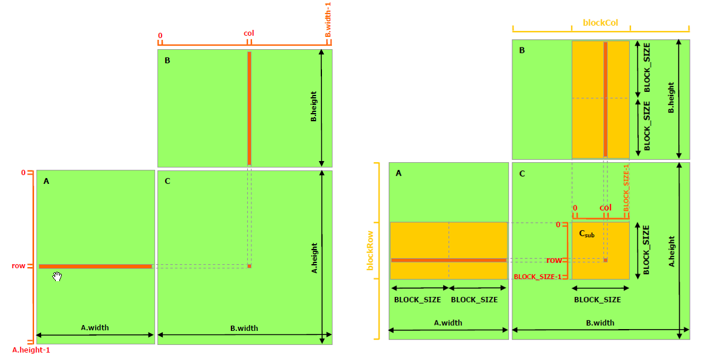
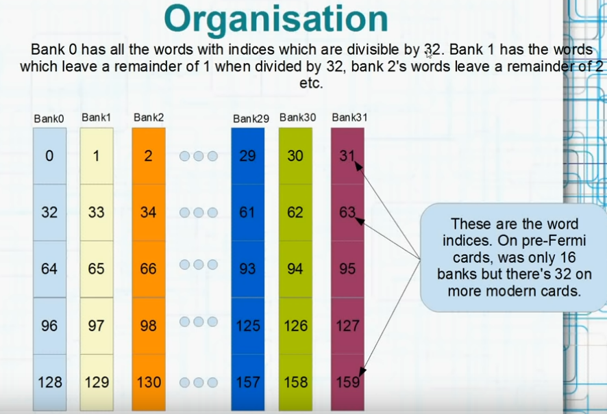

# Shared Memory
> https://docs.nvidia.com/cuda/cuda-c-programming-guide/index.html#shared-memory 

## Loop Tiling
将 global memory 中的数据 load 到每个 block 的 shared memory 中去，减少对低速存储（global memory）的访问次数

### Without shared memory
* `MatMulKernel<<<dimGrid, dimBlock>>>(d_A, d_B, d_C);`：invoke kernel，`dimGrid, dimBlock` 代表 thread grid 和 block 的数量，是 int 类型或者 dim3（3维向量，因为 grid 和 block 最多可以是3维）
* 每个 thread 都执行 `__global__ void MatMulKernel(Matrix A, Matrix B, Matrix C)`，因为不同 thread 的 blockIdx 和 threadIdx 不同，所以 thread 会被分到计算矩阵不同的部分，以实现并行

    ```c
    // Matrices are stored in row-major order:
    // M(row, col) = *(M.elements + row * M.width + col)
    typedef struct {
        int width;
        int height;
        float* elements;
    } Matrix;

    // Thread block size
    #define BLOCK_SIZE 16

    // Forward declaration of the matrix multiplication kernel
    __global__ void MatMulKernel(const Matrix, const Matrix, Matrix);

    // Matrix multiplication - Host code
    // Matrix dimensions are assumed to be multiples of BLOCK_SIZE
    void MatMul(const Matrix A, const Matrix B, Matrix C)
    {
        // Load A and B to device memory
        Matrix d_A;
        d_A.width = A.width; d_A.height = A.height;
        size_t size = A.width * A.height * sizeof(float);
        cudaMalloc(&d_A.elements, size);
        cudaMemcpy(d_A.elements, A.elements, size,
                cudaMemcpyHostToDevice);
        Matrix d_B;
        d_B.width = B.width; d_B.height = B.height;
        size = B.width * B.height * sizeof(float);
        cudaMalloc(&d_B.elements, size);
        cudaMemcpy(d_B.elements, B.elements, size,
                cudaMemcpyHostToDevice);

        // Allocate C in device memory
        Matrix d_C;
        d_C.width = C.width; d_C.height = C.height;
        size = C.width * C.height * sizeof(float);
        cudaMalloc(&d_C.elements, size);

        // Invoke kernel
        dim3 dimBlock(BLOCK_SIZE, BLOCK_SIZE);
        dim3 dimGrid(B.width / dimBlock.x, A.height / dimBlock.y);
        MatMulKernel<<<dimGrid, dimBlock>>>(d_A, d_B, d_C);

        // Read C from device memory
        cudaMemcpy(C.elements, d_C.elements, size,
                cudaMemcpyDeviceToHost);

        // Free device memory
        cudaFree(d_A.elements);
        cudaFree(d_B.elements);
        cudaFree(d_C.elements);
    }

    // Matrix multiplication kernel called by MatMul()
    __global__ void MatMulKernel(Matrix A, Matrix B, Matrix C)
    {
        // Each thread computes one element of C
        // by accumulating results into Cvalue
        float Cvalue = 0;
        int row = blockIdx.y * blockDim.y + threadIdx.y;
        int col = blockIdx.x * blockDim.x + threadIdx.x;
        for (int e = 0; e < A.width; ++e)
            Cvalue += A.elements[row * A.width + e]
                    * B.elements[e * B.width + col];
        C.elements[row * C.width + col] = Cvalue;
    }
    ```

### With shared memory

<center class="half">
    
    
</center>

* `__shared__` 定义了使用 shared memory，每次从 global memory 中 fetch `C_sub` 大小的 data 
* By blocking the computation this way, we take advantage of fast shared memory and save a lot of global memory bandwidth since A is only read `(B.width / block_size)` times from global memory and B is read `(A.height / block_size)` times. 


    ```c
    // Matrices are stored in row-major order:
    // M(row, col) = *(M.elements + row * M.stride + col)
    typedef struct {
        int width;
        int height;
        int stride; 
        float* elements;
    } Matrix;

    // Get a matrix element
    __device__ float GetElement(const Matrix A, int row, int col)
    {
        return A.elements[row * A.stride + col];
    }

    // Set a matrix element
    __device__ void SetElement(Matrix A, int row, int col,
                            float value)
    {
        A.elements[row * A.stride + col] = value;
    }

    // Get the BLOCK_SIZExBLOCK_SIZE sub-matrix Asub of A that is
    // located col sub-matrices to the right and row sub-matrices down
    // from the upper-left corner of A
    __device__ Matrix GetSubMatrix(Matrix A, int row, int col) 
    {
        Matrix Asub;
        Asub.width    = BLOCK_SIZE;
        Asub.height   = BLOCK_SIZE;
        Asub.stride   = A.stride;
        Asub.elements = &A.elements[A.stride * BLOCK_SIZE * row
                                            + BLOCK_SIZE * col];
        return Asub;
    }

    // Thread block size
    #define BLOCK_SIZE 16

    // Forward declaration of the matrix multiplication kernel
    __global__ void MatMulKernel(const Matrix, const Matrix, Matrix);

    // Matrix multiplication - Host code
    // Matrix dimensions are assumed to be multiples of BLOCK_SIZE
    void MatMul(const Matrix A, const Matrix B, Matrix C)
    {
        // Load A and B to device memory
        Matrix d_A;
        d_A.width = d_A.stride = A.width; d_A.height = A.height;
        size_t size = A.width * A.height * sizeof(float);
        cudaMalloc(&d_A.elements, size);
        cudaMemcpy(d_A.elements, A.elements, size,
                cudaMemcpyHostToDevice);
        Matrix d_B;
        d_B.width = d_B.stride = B.width; d_B.height = B.height;
        size = B.width * B.height * sizeof(float);

        cudaMalloc(&d_B.elements, size);
        cudaMemcpy(d_B.elements, B.elements, size,
        cudaMemcpyHostToDevice);

        // Allocate C in device memory
        Matrix d_C;
        d_C.width = d_C.stride = C.width; d_C.height = C.height;
        size = C.width * C.height * sizeof(float);
        cudaMalloc(&d_C.elements, size);

        // Invoke kernel
        dim3 dimBlock(BLOCK_SIZE, BLOCK_SIZE);
        dim3 dimGrid(B.width / dimBlock.x, A.height / dimBlock.y);
        MatMulKernel<<<dimGrid, dimBlock>>>(d_A, d_B, d_C);

        // Read C from device memory
        cudaMemcpy(C.elements, d_C.elements, size,
                cudaMemcpyDeviceToHost);

        // Free device memory
        cudaFree(d_A.elements);
        cudaFree(d_B.elements);
        cudaFree(d_C.elements);
    }

    // Matrix multiplication kernel called by MatMul()
    __global__ void MatMulKernel(Matrix A, Matrix B, Matrix C)
    {
        // Block row and column
        int blockRow = blockIdx.y;
        int blockCol = blockIdx.x;

        // Each thread block computes one sub-matrix Csub of C
        Matrix Csub = GetSubMatrix(C, blockRow, blockCol);

        // Each thread computes one element of Csub
        // by accumulating results into Cvalue
        float Cvalue = 0;

        // Thread row and column within Csub
        int row = threadIdx.y;
        int col = threadIdx.x;

        // Loop over all the sub-matrices of A and B that are
        // required to compute Csub
        // Multiply each pair of sub-matrices together
        // and accumulate the results
        for (int m = 0; m < (A.width / BLOCK_SIZE); ++m) {

            // Get sub-matrix Asub of A
            Matrix Asub = GetSubMatrix(A, blockRow, m);

            // Get sub-matrix Bsub of B
            Matrix Bsub = GetSubMatrix(B, m, blockCol);

            // Shared memory used to store Asub and Bsub respectively
            __shared__ float As[BLOCK_SIZE][BLOCK_SIZE];
            __shared__ float Bs[BLOCK_SIZE][BLOCK_SIZE];

            // Load Asub and Bsub from device memory to shared memory
            // Each thread loads one element of each sub-matrix
            As[row][col] = GetElement(Asub, row, col);
            Bs[row][col] = GetElement(Bsub, row, col);

            // Synchronize to make sure the sub-matrices are loaded
            // before starting the computation
            __syncthreads();

            // Multiply Asub and Bsub together
            for (int e = 0; e < BLOCK_SIZE; ++e)
                Cvalue += As[row][e] * Bs[e][col];

            // Synchronize to make sure that the preceding
            // computation is done before loading two new
            // sub-matrices of A and B in the next iteration
            __syncthreads();
        }

        // Write Csub to device memory
        // Each thread writes one element
        SetElement(Csub, row, col, Cvalue);
    }
    ```

<br>

## Code Sample for dynamic shared memory
> https://developer.nvidia.com/blog/using-shared-memory-cuda-cc/ 

* Depending on whether the amount of memory is known at compile time or at run time, there are multiple ways to declare shared memory inside a kernel.
    * Static: 人为给定 shared memory 大小
    * Dynamic：在 compile 之后才确定 shared memory 大小
        * `__syncthreads()`：Call `__syncthreads()` after the store to shared memory and before any threads load from shared memory to avoid race condition 
        * `dynamicReverse<<<1,n,n*sizeof(int)>>>(d_d, n);`：the shared memory allocation size per thread block must be specified 
        * `extern __shared__ int s[];`：Kernel 内部的 extern 标识符
    ```c
    #include <stdio.h>

    __global__ void staticReverse(int *d, int n)
    {
        __shared__ int s[64];
        int t = threadIdx.x;
        int tr = n-t-1;
        s[t] = d[t];        // 从 global memory d[t] 传到 shared memory s[t]
        __syncthreads();    // 让所有 thread 同步
        d[t] = s[tr];       // 从 shared memory 到 global memory
    }

    // 
    __global__ void dynamicReverse(int *d, int n)
    {
        extern __shared__ int s[];  // extern 标识符，未指定大小
        int t = threadIdx.x;
        int tr = n-t-1;
        s[t] = d[t];
        __syncthreads();
        d[t] = s[tr];
    }

    int main(void)
    {
        const int n = 64;
        int a[n], r[n], d[n];

        for (int i = 0; i < n; i++) {
            a[i] = i;
            r[i] = n-i-1;
            d[i] = 0;
    }

    int *d_d;
    cudaMalloc(&d_d, n * sizeof(int)); 

    // run version with static shared memory
    cudaMemcpy(d_d, a, n*sizeof(int), cudaMemcpyHostToDevice);
    staticReverse<<<1,n>>>(d_d, n);
    cudaMemcpy(d, d_d, n*sizeof(int), cudaMemcpyDeviceToHost);  
    for (int i = 0; i < n; i++) 
        if (d[i] != r[i]) printf("Error: d[%d]!=r[%d] (%d, %d)\n", i, i, d[i], r[i]);  

    // run dynamic shared memory version
    cudaMemcpy(d_d, a, n*sizeof(int), cudaMemcpyHostToDevice);
    dynamicReverse<<<1,n,n*sizeof(int)>>>(d_d, n);
    cudaMemcpy(d, d_d, n * sizeof(int), cudaMemcpyDeviceToHost);    // specify memory allocation size per thread block
    for (int i = 0; i < n; i++) 
        if (d[i] != r[i]) printf("Error: d[%d]!=r[%d] (%d, %d)\n", i, i, d[i], r[i]);
    }
    ```

* What if you need multiple dynamically sized arrays in a single kernel?  
    * You must declare a single extern unsized array as before, and use pointers into it to divide it into multiple arrays.
        ```c
        extern __shared__ int s[];
        int *integerData = s;                        // nI ints
        float *floatData = (float*)&integerData[nI]; // nF floats
        char *charData = (char*)&floatData[nF];      // nC chars
        ```
    * In the kernel launch, specify the total shared memory needed, as in the following.
        ```c
        myKernel<<<gridSize, blockSize, nI*sizeof(int)+nF*sizeof(float)+nC*sizeof(char)>>>(...);
        ```

<br>

## Avoid Bank Conflict
> https://docs.nvidia.com/cuda/cuda-c-programming-guide/index.html#shared-memory-5-x

Shared Memory 的访问速度
* Shared Memory 是一个 warp （32个threads）共享的，其中 Shared Memory 又分成 32 个 banks，每个 bank 里面又分很多个 words，每个 words 32 bits。如下图
    <p align="center" >
    
    </p>

* 如果同时每个 thread 是存取不同的 bank，就不会产生任何问题，速度很快。但如果同时有两个（或更多个） threads 存取同一个 bank 的数据，就会发生 bank conflict，会降低 Shared Memory 读取速度
    * 特例是：多个 thread 访问的是同一个 bank 里面的同一个 word，则会 multicast 和 broadcast，也不会 bank conflict
    * 例如两个 thread 分别访问第 0，32，64，96 个words，就会发生 4-way bank block，读取速度会变为 1/4

一个例子：
> https://www.youtube.com/watch?v=CZgM3DEBplE 
* 对于代码中的 `__shared__ floats shared[128]`，在结构体中如果没有padding，需要124个clocks；有padding，75个clocks，减少了 bank conflict
* 对于代码中的 `__shared__ float shared[1024]`，`MyKernel` 中的 `shared[0]++;`，` shared[threadIdx.x*2]++;`，`shared[threadIdx.x*32]++;` 分别需要 30，64，124 clocks
    * 因为 `shared[threadIdx.x*32]++;` 访问的是第 0,32,64...的 words，所以很慢

```cpp
#include <iostream>
#include <cuda_runtime.h>

using namespace std;

struct floats{
    float f[32]; 
    float padding;  // add padding will greatly accelerate 
};

__global__ void MyKernel(unsigned long long* time){
    
    // __shared__ float shared[1024];
    // unsigned long long StartTime = clock();
    // shared[0]++;                // Broadcast
    // shared[threadIdx.x*2]++;    
    // shared[threadIdx.x*32]++;    
    // unsigned long long finishTime = clock();
    // *time = (finishTime - StartTime);

    __shared__ floats shared[128];
    unsigned long long StartTime = clock();
    shared[threadIdx.x].f[0]++;   
    unsigned long long finishTime = clock();
    *time = (finishTime - StartTime);
}

int main(){
    unsigned long long time;
    unsigned long long* d_time;
    cudaMalloc(&d_time, sizeof(unsigned long long));

    for(int i=0; i<10; i++){
        MyKernel<<<1, 32>>>(d_time);
        cudaMemcpy(&time, d_time, sizeof(unsigned long long), cudaMemcpyDeviceToHost);
        cout<<"Time: "<<(time-14)<<endl;    // 14 is the overhead for calling clock
    }
    cudaFree(d_time);
    cudaDeviceReset();

    return 0;
}
```