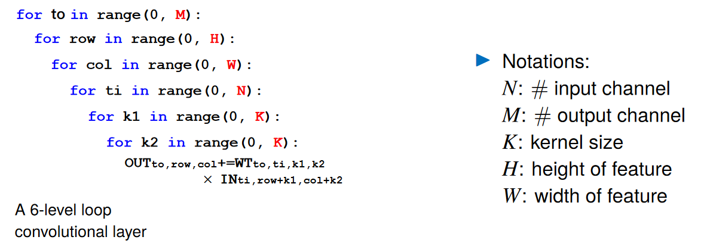
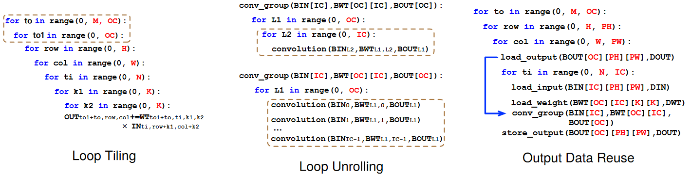

# 背景
## 硬件概念：`SM -> warps -> threads (sp)`
> SM (streaming multiprocessors), warp, SP (streaming processor)
* SM：以TX2为例，其 GPU 只有2个SM
* warp：warp 是 SM 执行和调度的最小单元。一般一个 warp 包含32个 thread，warp 中的 SP 的工作遵循 `SIMT （Single Instruction Multiple Thread）`，也就是说这些 thread 以不同数据资源执行相同的指令。也因此，分支语句在 GPU 的效率很低
<p align="center" >

</p>

* SP：在 GPU 中最小的硬件单元（在 Nvidia 的 fermi 构架之后也叫 CUDA core，现在这个术语现在通常也使用 thread 来代替，可以简单将 `thread == CUDA core == SP`）


## 软件概念：`grid -> block -> thread`
<p align="center" >

</p>

> 与上面3个硬件概念是相对的 
* 由于 warp 的大小一般为32，所以 block 所含的 thread 的大小一般要设置为32的倍数 (软件的 block 对应于硬件上的 warp)
* 同一个 block 中的 thread 可以同步（上文 SIMT），也可以通过 shared memory 进行通信


## 线程标识 threadIdx  
一个 block 包含多个thread，这些 thread 的组织方式也可以是一维，二维或者三维的。`CUDA 中每一个线程都有一个唯一的标识 ID 即 threadIdx`，这个 ID 随着 block 的划分方式的不同而变化，例如：
```
// 一维的block，一维的thread
int tid = blockIdx.x * blockDim.x + threadIdx.x;
```

## GPU 存储构架：global memory > shared memory > register/local memory
* 每个 thread 都有自己的一份 register 和 local memory 
* 一组 thread 构成一个 block，这些 thread 则共享有一份 shared memory
* 不同 block 的所有 thread 都共享一份 global memory、constant memory、和 texture memory


## 缓存命中
> https://zhuanlan.zhihu.com/p/209181629  

因为一次需要缓存 cache line 大小的数据（linux 可以通过 `coherency_line_size` 查看），当需要用的数据已经被载入 cache 时，就称作命中。例如，遍历访问数组时，按照内存布局顺序访问将会带来很大的性能提升（当访问某个元素时，缓存已经把紧随其后的元素也载入了，提升了命中率）。好的CPU会有一些预测的技术，如果找到一种pattern的话，就会预先加载更多的内存，包括指令也可以预加载，这叫 Prefetching 技术。

一个例子：假设我们有一个64M长的数组，设想一下下面的两个循环：
```c
const int LEN = 64*1024*1024;
int *arr = new int[LEN];
for (int i = 0; i < LEN; i += 2) arr[i] *= i;
for (int i = 0; i < LEN; i += 8) arr[i] *= i;
```
按我们的想法来看，第二个循环要比第一个循环少4倍的计算量，其应该也是要快4倍的。但实际跑下来并不是，在我的机器上，第一个循环需要127毫秒，第二个循环则需要121毫秒，相差无几。这里最主要的原因就是 Cache Line，因为CPU会以一个Cache Line 64Bytes最小时单位加载，也就是16个 32bits 的整型，所以，无论你步长是2还是8，都差不多。而后面的乘法其实是不怎么耗CPU时间的。

### An example
不同的 data layout 使得最优的内存访问顺序不同。例如 PyTorch 用的是 NCHW，最后一维为W，也就是按照 W 的方向遍历最高效，能增加 cache hit  
`A[i][k]` 内存访问是连续的，`A[k][i]` 内存访问是不连续的，导致 cache hit 低
<p align="center" >

</p>

<p align="center" >

</p>

<br>
<br>


# Loop Optimization
<p align="center" >

</p>

H*W*M 的 K*K 卷积（假设stride=1）实现需要 6 层 for 循环。一般有如下三种优化方式：
<p align="center" >

</p>

## Data Reuse
> P20/21: http://www.cse.cuhk.edu.hk/~byu/CMSC5743/2021Fall/slides/Lec02-conv.pdf  

避免重复计算，例如在卷积中把需要被重复使用多次元素先算出来

## Loop Tiling 
> https://zhuanlan.zhihu.com/p/367644657  
 
将 global memory 中的数据 load 到每个 block 的 shared memory 中去，减少对低速存储的访问:


## Loop Unrolling
> [Why is it faster to process a sorted array than an unsorted array?](https://zhuanlan.zhihu.com/p/22469702)  
> 在大规模循环逻辑中要尽量避免数据强依赖的分支结构 (data-dependent branching）

* 将 loop 的一些循环展开，能够减少分支预测失败的几率
* 什么是分支预测？ 首先要了解 CPU pipeline 
    * CPU pipeline 是通过增加额外计算机硬件来实现的，以同时执行多条指令。加速原理类似 CPU/GPU pipline（CPU 等待 GPU 返回的时间内做下一帧的预处理）
    * 典型的 RISC（精简指令集 Reduced instruction set computer）流水线被分解成五个阶段，每个阶段之间使用触发器链接：`读取指令fetch，指令解码decode，运行execute，存储器访问memoery access，写回寄存器write-back`。通过流水线结构，下图是 5 层流水线结构
        <p align="center" >
        
        </p>
            
        ```c
        // 原代码
        for (i = 1; i <= 60; i++) 
            a[i] = a[i] * b + c;

        // 展开后
        for (i = 1; i <= 58; i+=3)
        {
            a[i] = a[i] * b + c;
            a[i+1] = a[i+1] * b + c;
            a[i+2] = a[i+2] * b + c;
        }
        ```
* 分支预测
    * Why？  
    如果没有流水线机制，一条指令大概会花费数个时钟周期，而如果采用流水线机制，当第一条指令完成Fetch后，第二条指令就可以进行Fetch了，极大提高了指令的执行效率。  
    上面是我们的期待的理想情况，而在现实环境中，如果遇到的指令是 `条件跳转指令`，只要当前面的指令运行到 EX，才能知道要选择的分支，显然这种 `停顿` 对于 CPU pipeline 机制是非常不友好的。而 `分支预测技术` 正是为了解决上述问题而诞生的，CPU 会根据分支预测的结果，选择下一条指令进入流水线。待跳转指令执行完成，如果预测正确，则流水线继续执行，不会受到跳转指令的影响。如果分支预测失败，那么便需要清空流水线，重新加载正确的分支（实际上目前市面上所有处理器都采用了类似的技术）

    * 分支预测器（Branch predictor）  
    是一种数字电路，在分支指令执行结束之前猜测哪一路分支将会被运行（下图中的一行也即一个分支），以提高处理器的指令流水线（pipeline）的性能 
