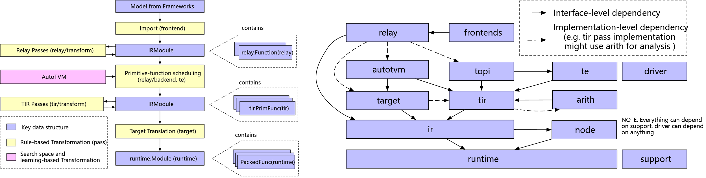

目录：https://github.com/BBuf/tvm_mlir_learn

# TVM Overview
<p align="center" >

</p>

> https://tvm.apache.org/docs/arch/index.html#example-compilation-flow

* 3种优化：relay pass，AutoTVM/Ansor，tir (Tensor Level IR) Pass
    * relay pass (Rule-based)：例如 tvm.relay.front 中的各种 attribute conversion，针对整个模型
    * AutoTVM/Ansor：search-based program configuration optimization
    * tir pass (Rule-based)：与 backend 硬件交互的底层 IR，例如 tvm.relay.backend 中 `tvm.transform.PassContext(opt_level=3)`，针对一个 subgraph

* 两种数据结构
    * 数据结构一 `IRModule`：包含两类，分别支持 relay 和 tir

        * `relay::Function`： high-level functional program representation. A `relay.Function` usually corresponds to an end-to-end model. You can view a `relay.Function` as a computational graph with additional support for control-flow, recursion, and complex data structures.

        * `tir::PrimFunc`：low-level program representation. Contain elements including loop-nest choices, multi-dimensional load/store, threading, and vector/tensor instructions. It is usually used to represent an operator program that executes a (possibly-fused) layer in a model.

    * 数据结构二 `runtime.Module`:   
    a class contains a `GetFunction` method to obtain the class `tvm.runtime.PackedFunc()` by name

* TVM 的几种使用方法：
    * 用 relay 写：https://tvm.apache.org/docs/how_to/extend_tvm/use_pass_infra.html  
        ```python
        import tvm
        import tvm.relay as relay

        def example():
            shape = (1, 64, 54, 54)
            c_data = np.empty(shape).astype("float32")
            c = relay.const(c_data)
            weight = relay.var("weight", shape=(64, 64, 3, 3))
            x = relay.var("x", relay.TensorType((1, 64, 56, 56), "float32"))
            conv = relay.nn.conv2d(x, weight)
            y = relay.add(c, c)
            y = relay.multiply(y, relay.const(2, "float32"))
            y = relay.add(conv, y)
            z = relay.add(y, c)
            z1 = relay.add(y, c)
            z2 = relay.add(z, z1)
            return relay.Function([x, weight], z2)

        f = example()
        mod = tvm.IRModule.from_expr(f)
        mod = relay.transform.FuseOps(fuse_opt_level=0)(mod)
        ```
    * 用 te 写，直接快速构造 tir：[见TVM源语_Baiyang](https://mp.weixin.qq.com/s/ohWy5yBrsKpzApfjQLXWJg)   
    This is a domain-specific language module that allows us to construct `tir::PrimFunc` variants quickly by writing tensor expressions. Importantly, a tensor expression itself is not a self-contained function that can be stored into IRModule. Instead, it is a fragment of IR that we can stitch together to build an IRModule.

<br> 
<br>

# tvm.relay.frontend 
> https://mp.weixin.qq.com/s/KFxd3zf76EP3DFcCAPZjvQ

## 从 ONNX model 如何转成 Relay 表达式：

1. [如SVG图所示：](./Pictures/relay_frontend.svg) 从 `from_onnx()` 一直可以追到 `_make.conv2d()`
    * 注意 `_make.conv2d()` 这些具体的算子返回的是计算结果
    * `op = GraphProto._convert_operator(op_name, inputs, ...)` 返回 `tvm.relay.function.Function` （类似computational graph）

1. 从 `_make.conv2d()` 进一步追踪：`/tvm/python/tvm/relay/op/nn/_make.py` 中 `tvm._ffi._init_api("relay.op.nn._make", __name__)`
1. `tvm._ffi._init_api()` 的定义在 `tvm/python/tvm/_ffi/registry.py` 中，它进一步调用了 `get_global_func()`（这个函数的返回值是一个 PackedFunc）
1. `get_global_func()` 会在编译好的 TVM 动态库中，按函数名称来匹配（用了 import ctypes）。获取到 C++ 注册的相应函数后就相当于在 `_make.py` 中定义了 conv2d 算子的函数了

反推回去：

* 从 `from_onnx()` 拿到一个 `tvm.IRModule`，也即一个网络的 IR 表达
* **在一个 op 类中实际上并没有包含这个 op 的计算过程，op 中的一系列操作只是拿到了 Relay 卷积 op 的 IR 和的输入输出以及属性的信息**；op 的计算过程是在 TVM 的 TOPI 中完成的。conv2d 算子的注册代码在 `tvm/src/relay/op/nn/convolution.cc`；

## relay pass
> Pass Infrastructure: [Chinese Version](https://mp.weixin.qq.com/s/IMm1nurpoESFRLxHcEYxcQ)  
> How to Use TVM Pass Infra?  https://tvm.apache.org/docs/how_to/extend_tvm/use_pass_infra.html

* Pass 其实是一种 rule-based transformation；类比 search-based transformation 的 autoTVM / Ansor  
* Relay IR 和 TIR 都包含一系列 passes，可提高模型的性能指标，例如平均推理速度、内存占用或特定设备的功耗。TVM有一套标准优化方法以及针对于机器学习的优化方法，包括常量折叠、死代码消除、运算符布局更改、算符融合、缓冲区处理和循环变换等。
同样，深度学习框架 Pytorch 和 MXNet Gluon，也有分别通过 Sequential 和 Block 启用pass-style 层构建的方案。有了这样的结构，这些现代框架能够方便地将模块/层添加到它们的容器中，并轻松地构建神经网络

* Design
    * PassContext：carry useful information for an optimization pass
    * PassNode：A pure virtual class to serve as the base of the different optimization passes
    * 各种各样不同级别的 pass：Module-Level Passes， Function-Level Passes，Sequential Passes
    * Pass Registration：在 C++ 中用 `TVM_REGISTER_GLOBAL("relay._transform.FoldConstant")` 注册，python 中加个修饰器就可以用了

* `with tvm.transform.PassContext(opt_level=3): ` 进行了3种 pass (optimization)：
    >https://mp.weixin.qq.com/s/5JAWE9RTTXwDJR5HqlsCzA  
    首先讲了抽象树 AST 表示下，data flow 和 let binding 表示的不同  
    data flow 更简单，let binding 显式地定义了计算的 scope （在哪计算），而不会产生歧义 

    * RemoveUnusedFunctions（去除Relay IR中的冗余节点）   
    * ToBasicBlockNormalForm（具有相同scope的节点压入到同一个let_list）  
    * EliminateCommonSubexpr（消除完全一样的表达式）

## relay build
* `lib = relay.build(mod, target, params)` 做了什么？  
    > https://mp.weixin.qq.com/s/CZzC5klWoFftUlOKkpvEZg   

    [如SVG图所示：](./Pictures/relay_backend.svg)最终会调用 C++ 中注册的类 `class RelayBuildModule()`，  
    见 `tvm/python/src/relay/backend/build_module.cc`


<br>

# TOPI
> > https://mp.weixin.qq.com/s/1YlTSUArDIzY-9zeUAIfhQ
* [TVM Codebase Walkthrough by Example](https://tvm.apache.org/docs/dev/tutorial/codebase_walkthrough.html)

    `src/relay` is the component that manages a computational graph. Nodes in a graph are compiled and executed using infrastructure implemented in the rest of `src`. python provides python bindings for the C++ API and driver code that users can use to execute compilation. Operators corresponding to each node are registered in `src/relay/op`. Implementations of operators are in `topi`, and they are **coded in either C++ or Python**.  
    
    简而言之，TVM 中的算子实现都在 topi 中，其中有一些是用 python 代码实现的；一些是在 C++ 的 TOPI 中实现的，但事先被编译成动态库并注册了，python 中可以直接调用

* 例子：`tvm/python/tvm/relay/op/image/` 文件夹
    * `tvm/python/tvm/relay/op/image/image.py`：文件名前无 `_`，是用来实现从 python 调 C++ 注册的动态库函数的。例如上面流程图中，`/relay/op/nn/nn.py` 的一个函数 `op.nn.conv2d()` ，进一步调用 `_make.conv2d()`

    * `tvm/python/tvm/relay/op/image/_image.py`：文件名前有 `_`，主要建立了 OP 和 TOPI 算子的连接。例如在 `topi.image.resize1d()` 中有具体实现，其返回值是一个 `tvm.te.Tensor`

        ```python
        # resize
        @reg.register_compute("image.resize1d")
        def compute_resize1d(attrs, inputs, out_type):
            """compute definition for resize1d op"""
            size = attrs.size
            roi = attrs.roi
            layout = attrs.layout
            method = attrs.method
            coord_trans = attrs.coordinate_transformation_mode
            rounding_method = attrs.rounding_method
            cubic_alpha = attrs.cubic_alpha
            cubic_exclude = attrs.cubic_exclude
            extrapolation_value = attrs.extrapolation_value
            out_dtype = attrs.out_dtype
            return [
                topi.image.resize1d(
                    inputs[0],
                    roi,
                    size,
                    layout,
                    method,
                    coord_trans,
                    rounding_method,
                    cubic_alpha,
                    cubic_exclude,
                    extrapolation_value,
                    out_dtype,
                )
            ]

        reg.register_injective_schedule("image.resize1d")
        ```

        * `reg.register_injective_schedule("image.resize1d")` 完成了 schedule primitive。一些 scedule template 例子见 `tvm/python/tvm/topi/gpu/conv2d_nhwc.py`，`tvm/python/tvm/topi/arm_cpu/injective.py`

<br>


