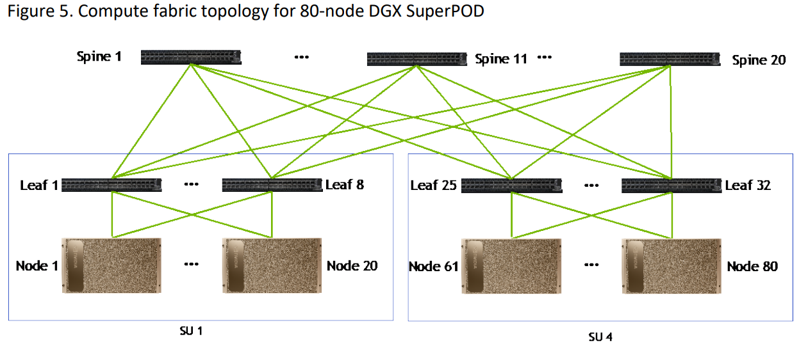
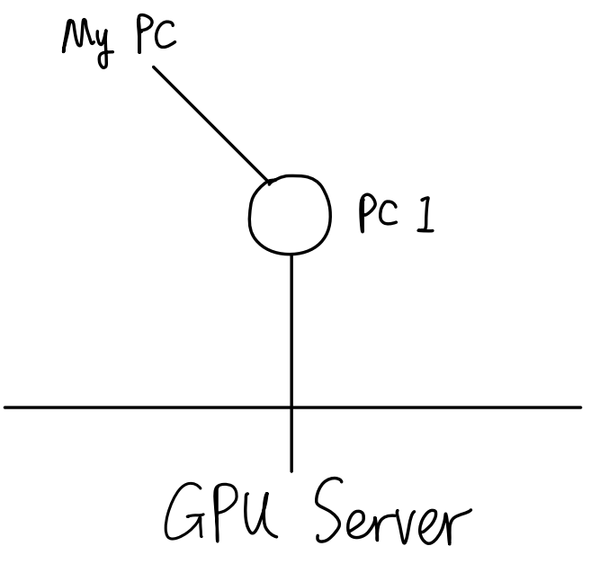

# 基本概念
## 网络模型、协议相关
* OSI 七层协议，与 TCP/IP 四层协议
    * 物理层：解决了硬件之间如何通信，主要功能为定义物理设备标准（如接口类型、传
输速率等），从而实现比特流（一种以 0、1 表示的数据流）的传输   
    * 数据链路层：主要功能为帧编码和误差纠正控制。具体工作为接受来自物理层的数据，并封装为帧，然后传输到上一层。同样也可以将来自网络层的数据拆为比特流传输给物理层。之所以能实现纠错的功能，是因为每帧除了要传输的数据外，还包括校验信息    
    * 网络层：在节点之间创建逻辑电路，通过 IP 寻找地址（在网络中每个节点都有一个IP）。这一层传输的数据以包为单位
    * 传输层：负责监督数据传输的质量，处理丢包等问题
    * 会话层：主要功能为管理网络设备的会话连接   
    * 表示层：主要负责数据格式转换、加密等   
    * 应用层：提供应用接口，可以为用户直接提供各种网络服务，完成各种网络工作

        <p align="center" >
            
            
        </p>

    可以看到，越往底层，越会在上层数据前面加一些数据段（例如 IP头，MAC等，TCP/UCP等）

* HTTP，HTTPS
    * HTTP，HTTPS 都是应用层协议，两者区别在于是否有用 SSL/TLS 加密；HTTP 是明文传输，
    * TLS 是 SSL（Secure Socket Layer）的改进版本，是属于工作在 TCP传输层-应用层 之间的一种协议
* SSL，SSH 的加密方法：非对称加密（例如RSA） + 对称加密（例如AES）
    * SSL
        * SSL公钥是包含在SSL证书中的，向用户公开，用于加密会话密钥；私钥由申请 SSL 证书的网站服务器端保存，用于解密由公钥加密的会话密钥。SSL加密具体过程如下:
            * 用户访问网站，网站向用户发送SSL证书，证书中包含网站的公钥
            * 用户使用网站的公钥加密一个随机生成的会话密钥，并发送给网站
            * 网站使用自己保存的私钥解密用户发送来的会话密钥
            * 网站和用户两端都获得会话密钥后，使用该密钥加密后续通信内容
        * 回话密钥是通过 **非对称加密** 保护的，而会话内容是通过回话密钥通过 **对称加密形式** 保护的（堆成加密速度快）
    * SSH：加密方式和 SSL 有点类似
        * 客户端生成一对公钥和私钥，其中私钥需保密，公钥可以公开
        * 客户端将公钥发送到想要访问的服务器，服务器存储该公钥
        * 当客户端连接服务器时，服务器随机生成一个对话密钥，使用客户端提供的公钥加密这个对话密钥，然后发送给客户端
        * 客户端使用自己的私钥解密出对话密钥
        * 客户端和服务器使用这个对话密钥和对称加密算法（如AES）来加密传输实际的数据通信
        * 数据传输结束后，对话密钥被销毁
    * 为什么对称加密比非对称加密快？https://cloud.tencent.com/developer/article/1672173   
    因为对称加密主要是位运算，非对称加密涉及幂运算

## 路由器/交换机：两者工作的层不同  
* 交换机（Switch）工作在数据链路层，基于 MAC 识别，能完成封装转发数据包功能  
* 路由器工作在网络层，基于 IP 实现寻址。所以路由器要完成数据转发，需要从原始数据中拆的包比交换机多一层

## 计算中心网络架构 
> https://cloud.tencent.com/developer/article/2226221 
* 传统三层架构：核心层、汇聚层、接入层
    * 传统的三层机构中，路由器位于核心交换机的上层。这种构通常是为南北向流量设计的，用于处理东西向流量时，核心层和汇聚层交换机的压力很大
        * 南北向流量：数据中心之外的客户端-数据中心内服务器之间的流量
        * 东西向流量：数据中心内的服务器之间的流量
    * 常用的接入交换机是 TOR（Top of Rack）交换机：一般可以支持 48、64卡之间的互联

  
* 叶-脊架构  
    路由器放在叶节点下面；某一个 spine 出现问题，吞吐只会有轻微的下降； 

    <p align="center" >
        
    </p>


* 胖树架构：通过增加交换机设备数量，使得汇聚层-核心层的带宽不是收敛的（上面和下面同样大，而不是上小下大）

    <p align="center" >
        
    </p>

* RDMA 
    * InfiniteBind，RoCE，iWARP 三种。RoCE 走 Ethernet，用以太网交换机即可；IB 有专门的协议，需要用 IB 交换机
    * 在大规模的运算场景中，IB 采用较多
        <p align="center" >
            
        </p>
* DGXA100 SuperPOD 组网网络
    20 台 Node 连 8 台交换机
    <p align="center" >
        
    </p>


<br><br>


# 实战案例
## 将笔记本 wifi 通过有线共享给多个设备，并能 ssh remote
> [win10将wlan网络共享给以太网](https://cloud.tencent.com/developer/article/1678119)  

* 笔记本 A 连 wifi，然后将设备 A B 用交换机通过网线连起来 
* 笔记本上 A
    * WLAN 网络共享设置
        勾选 “允许其他网络用户通过此计算机的Internet连接来连接 ”在家庭网络连接的下拉列表选项中选择以太网，
    * 配置以太网ip，dns；选择以太网 -> internet协议版本4(TCP/IPV4) -> 属性，可配置如下   
        ip：192.168.137.1（表示C类私网ip地址，只可用于局域网的访问，不能访问公网），子网掩码 255.255.255.0   
        DNS 服务器地址：必须配置为 WLAN 中的 DNS 服务器 ip 地址，否则无法打开网页
* 设备B上
    * ifconfig查看ip，应该就能ping上；如果不行，手动配置ip和dns，如下
    * IP和设备A同网段，默认网关设置为A的IP（192.168.137.1），子网掩码/DNS服务器和A相同

<br>

## 自建跳板机直连 GPU Server
> [SSH Tunnelling 讲解](https://johnliu55.tw/ssh-tunnel.html)
### 背景
实验室给我们分了几台多卡 GPU Server，但是必须通过网页的跳板机才能连接，而且不支持 Vscode Remote，所以调试和传文件很不方便。于是我想绕开它的跳板机，而用自己的电脑搭建一个跳板机，这样就可以实现 Vscode Remote 和 Winscp 传文件等功能

### 概念
#### Reverse Proxy 反向代理
> https://segmentfault.com/a/1190000018262215  

正向代理代理的对象是客户端，例如 VPN，多（客户端）对一（服务端）  
反向代理代理的对象是服务端，例如服务器的负载均衡（后端有很多台机器），一（客户端）对多（客户端）

#### Reverse Tunnel 反向隧道
> https://www.howtogeek.com/428413/what-is-reverse-ssh-tunneling-and-how-to-use-it/   

* Because the original connection came from the remote computer to you, using it to go in the other direction is using it “in reverse.” And because SSH is secure, you’re putting a secure connection inside an existing secure connection. This means your connection to the remote computer acts as a private tunnel inside the original connection. Therefore, we arrive at the name “reverse SSH tunneling.”

* 通常我们使用的正向隧道一般用于内网访问公网，而反向隧道 (Reverse SSH Tunneling) 则是可以用于公网访问内网，例如内网穿透/NAT穿透（NAT：网络地址转换。从外网发往内网的数据包将被NAT设备丢弃，这使得位于不同NAT设备之后的主机之间无法直接交换信息，当然也保护了内网主机免于来自外部网络的攻击）

* 代理和隧道 https://blog.csdn.net/qq_41800366/article/details/106332555  
    隧道本身不会去处理 HTTP 请求

### 实现1：用 v2ray
> 适用于：PC1 用的是 ip 在内地的节点。因为有墙，所以要用 v2ray 这样的有代理功能的，理解为 PC1 上跑了一个 VPN

* 因为 GPU Server 没有无法直接 SSH，但它自己能上网。所以可以找一个有公网 ip 的 PC1 （作为 ***跳板机***），让它和 GPU Server 建立一个通道。具体步骤：  
    * 在 GPU Server 和 PC1 上都安装配置 v2ray。v2ray 和 Shadowsocks 一样都是开源的 VPN 框架。因为 PC1 不能直接 pin 到 GPU Server，所以本质上是 GPU Server 不断监听 PC1 的某个端口，然后维持一个通道。这个通道的作用是：任何送往 PC1 特定端口的请求，PC1 都会将它送往 GPU Server 的某个端口
    * 之后再在 My PC，也即用户最终使用的电脑上，也安装一个 v2rayN（作用相当于 VPN)，用 VMess 协议进行配置。配置好后，一旦每次开启 v2rayN，My PC 和 PC1 的通道就建立了。例如下图，My PC 所有经 10080 端口的流量都最终被送到 GPU Server 了
        <p align="center" >
            
            
        </p>
    * Vscode Remote   
    `127.0.0.1`是指本机名，也就是让流量从 My PC 的 10080 端口出去，发给 PC1，由 PC1 代理一下。并且 PC1 某个端口会一直被 GPU Server 监听，这样间接的建立了 My PC 和 GPU Server 的连接。`~/.ssh/my_id_rsa` 是我们的私钥，公钥已经提前放在 PC1 上了
        > 所谓"公钥登录"，原理很简单，就是用户将自己的公钥储存在远程主机上。登录的时候，远程主机会向用户发送一段随机字符串，用户用自己的私钥加密后，再发回来。远程主机用事先储存的公钥进行解密，如果成功，就证明用户是可信的，直接允许登录shell，不再要求密码

        ``` 
        Host cpii_bj
        HostName localhost
        IdentityFile ~/.ssh/my_id_rsa
        User XXXXXX
        ForwardX11 Yes
        ProxyCommand E:\\Git\\mingw64\\bin\\connect.exe -S 127.0.0.1:10080 %h %p
        ```
    * WinScp  
    左图 `127.0.0.1` 是代指 GPU Server，自己 SSH 自己。Scp 的全程是 secure copy，也即 `cp + SSH`，所以只要能 SSH，就能用 Scp 传文件。这里 File Protocol 选 SCP  
    右图 `127.0.0.1` 代指 My PC，通过 SOCKS5 代理协议和 10080 端口通信，和 v2rayN 的配置相吻合 
        <p align="center" >
            
            
        </p>

### 实现2：用 SSH Tunnel（更简单）

* 适用于 PC1 用 ip 在国外的没有墙的服务器（公网），因为不用代理了，只用 SSH Reverse Tunnel 即可。对于 My PC 的配置就和普通 SSH 差不多：                                                                            
    ```
    Host cpii_bj_zhang
    HostName XXX
    Port 2222   # 访问公网主机的 2222 端口
    User XXX
    IdentityFile ~/.ssh/cpii_id_rsa # 访问公网PC的私钥
    ForwardX11 Yes
    ```
* 公网 PC 上的 setting
    * 这里可以白嫖一下阿里云服务器，1vCPU  1G内存即可：https://www.cfanpc.com/hd/20200420/2450.html，实例随便什么系统，按个 Ubuntu 18.04 就 OK
    * 在阿里云的公网 PC 上配置实例
        * 把公钥放在 `~/.ssh/authorized_keys` 里面（被登录的存公钥），然后 My PC 和内网 PC 存私钥，相当于 My PC 和内网 PC 都是在访问公网 PC。内网 PC 和 My PC 的私钥可以一样（因为都是通过 SSH 访问公网 PC）  
        * 在安全组里面开启端口，例如 2222，2223 等等
        * 将 `/etc/ssh/sshd_config` 中的 GatewayPorts 设为 yes（确保外网 PC 也能监听本机的端口），保存后重启 sshd 服务：`systemctl restart sshd`
* 内网 PC（GPU server）上输入：`autossh -M 3332 -CNR 2222:localhost:22 root@XX.XX.XX.XX`，启动反向 SSH Tunnel，其中：
    * 内网主机的 3332 端口负责监事 ssh 状态，负责出了问题自动重连，这个随便选个没用的端口就行
    * `2222:localhost:22`：内网 PC 通过监听，不断地将公网主机的 2222 端口的流量转发到内网主机的 22 端口上。所以 My PC 只要访问公网主机的 2222 端口，就间接访问到内网 GPU server 了。2222 这个端口号在三个 PC 上要配置成一致的   
    * SSH Tunnel 介绍：https://zhuanlan.zhihu.com/p/112227542

* 知识点补充：
`~/.ssh` 文件夹里，有几个文件 `authorized_keys`, `id_rsa`, `id_rsa.pub`, `known_hosts`。分别功能如下：
    * `authorized_keys`：存的是公钥。例如 A 想 SSH 连接 B，A 就需要把公钥发给 B，然后 B 存在 authorized_keys 里面即可。换句话说，被访问的设备将别人给的公钥放在这个文件中，使得其他设备可以免密访问自己。
    * `id_rsa`和`id_rsa.pub`就是自己的私钥和公钥，私钥自己保存，公钥可以分发，例如可以发给 server，以实现免密登录呀。
    * `known_hosts`：记录每个访问过的ip的公钥，删除后可以重新自动建立

* 安全性
    * 因为公网 PC 直接暴露于整个互联网，所以应该设置成只允许秘钥登录。因为在内网 PC 已经连上了公网 PC 时，一旦再有黑客在连上了 2222 端口，就相当于 SSH 到了内网 PC，会造成危险

<br>

## 在 Amazon 上搭建 VPN
### 1. 用Amazon Lightsail创建实例
Lightsail是亚马逊提供的适用于个人的虚拟服务器，每月收取固定的费用，而不像EC2安装使用的资源收费。  
详见 https://www.heartnn.com/2018/05/11/deploy-shadowsocks-on-amazon-lightsail/ 
> 在不用了之后，为避免扣款，需要 1.删除实例 2.同时删除未附着实例的静态IP

### 2. 用虚拟机ssh登录Server
这一步的目的是为了方便复制第3步的命令，详见 https://www.cnblogs.com/liubin0509/p/6211909.html
* 给Server设置一个静态ip
* 下载密钥，例如`this_is_a_key.pem`
* 将复制密钥到`~/.ssh`目录
* 设置密钥权限为600，例如 `sudo chmod 600 ~/.ssh/this_is_a_key.pem`
* 加入ssh agent，例如：`ssh-add this_is_a_key`
* ssh连接，例如：`ssh ubuntu@52.199.223.188`  

### 3. 在Server上安装Shadowsocks
详见 https://www.heartnn.com/2018/05/11/deploy-shadowsocks-on-amazon-lightsail/ 
关键步骤：
```bash
# 更新apt，将内核更新到最新版
sudo apt update && sudo apt upgrade -y
sudo apt install --install-recommends linux-generic-hwe-16.04
sudo apt autoremove  # 重启后可选择删除旧内核

# 重启后执行uname -r，查看内核版本是否大于4.9。如果是则为成功，可以继续进行。

# 切换为root账户(可以先通过sudo passwd root来更改root账户的密码)
su

# 执行lsmod | grep bbr，此时结果中应该没有tcp_bbr。如果有则为成功，可以继续进行。

modprobe tcp_bbr
echo "tcp_bbr" >> /etc/modules-load.d/modules.conf
echo "net.core.default_qdisc=fq" >> /etc/sysctl.conf
echo "net.ipv4.tcp_congestion_control=bbr" >> /etc/sysctl.conf
sysctl -p

# 验证下面两条语句，如果上面的执行结果都包含bbr，则说明内核开启bbr成功。
sysctl net.ipv4.tcp_available_congestion_control
sysctl net.ipv4.tcp_congestion_control

# 再次验证 lsmod | grep bbr，查看是否有tcp_bbr模块。应该会有了。

# 最后使用Shadowsocks一键安装脚本，依旧是使用root账户，执行：
wget --no-check-certificate -O shadowsocks-all.sh https://raw.githubusercontent.com/teddysun/shadowsocks_install/master/shadowsocks-all.sh
chmod +x shadowsocks-all.sh
./shadowsocks-all.sh 2>&1 | tee shadowsocks-all.log
# 如果提示没有wget，可以先执行apt install wget。安装时选择Shadowsocks-libev版，加密方式可以选择aes-256-gcm或xchacha20-ietf-poly1305。
# 安装时最好安装simple-obfs，混淆选http还是tls可随意。(这里执行autoconf --version查询版本应该是没有问题的，所以可以正常安装。)
```

### 4. 使用Shadowsocks
详见 https://ssr.tools/386  
* Shadowsocks Windows版本下载 https://github.com/shadowsocks/shadowsocks-windows/releases/
，选PAC模式或全局模式（PAC使用GFWList列表，绕过大陆地址，但不一定稳定）
* iOS可用Outline，Android可用Shadowsocks

------
<br><br>
