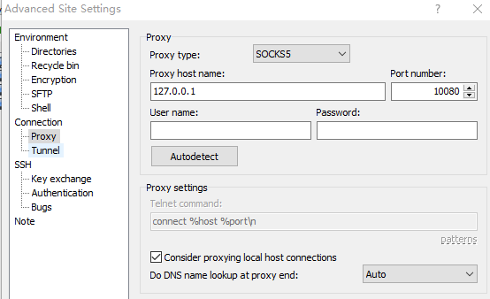

# 自建跳板机直连 GPU Server
## 背景
实验室给我们分了几台多卡 GPU Server，但是必须通过网页的跳板机才能连接，而且不支持 Vscode Remote，所以调试和传文件很不方便。于是我想绕开它的跳板机，而用自己的电脑搭建一个跳板机，这样就可以实现 Vscode Remote 和 Winscp 传文件等功能

## 概念
### Reverse Proxy 反向代理
> https://segmentfault.com/a/1190000018262215  

    正向代理代理的对象是客户端，例如 VPN，多（客户端）对一（服务端）
    反向代理代理的对象是服务端，例如服务器的负载均衡（后端有很多台机器），一（客户端）对多（客户端）

### Reverse Tunnel 反向隧道
> https://www.howtogeek.com/428413/what-is-reverse-ssh-tunneling-and-how-to-use-it/   

* Because the original connection came from the remote computer to you, using it to go in the other direction is using it “in reverse.” And because SSH is secure, you’re putting a secure connection inside an existing secure connection. This means your connection to the remote computer acts as a private tunnel inside the original connection. Therefore, we arrive at the name “reverse SSH tunneling.”

* 通常我们使用的正向隧道一般用于内网访问公网，而反向隧道 (Reverse SSH Tunneling) 则是可以用于公网访问内网，例如内网穿透/NAT穿透（NAT：网络地址转换。从外网发往内网的数据包将被NAT设备丢弃，这使得位于不同NAT设备之后的主机之间无法直接交换信息，当然也保护了内网主机免于来自外部网络的攻击）

* 代理和隧道 https://blog.csdn.net/qq_41800366/article/details/106332555  
    隧道本身不会去处理 HTTP 请求

## 实现1：用 v2ray
> 适用于：PC1 用的是 ip 在内地的节点。因为有墙，所以要用 v2ray 这样的有代理功能的，理解为 PC1 上跑了一个 VPN

* 因为 GPU Server 没有无法直接 SSH，但它自己能上网。所以可以找一个有公网 ip 的 PC1 （作为 ***跳板机***），让它和 GPU Server 建立一个通道。具体步骤：  
    * 在 GPU Server 和 PC1 上都安装配置 v2ray。v2ray 和 Shadowsocks 一样都是开源的 VPN 框架。因为 PC1 不能直接 pin 到 GPU Server，所以本质上是 GPU Server 不断监听 PC1 的某个端口，然后维持一个通道。这个通道的作用是：任何送往 PC1 特定端口的请求，PC1 都会将它送往 GPU Server 的某个端口
    * 之后再在 My PC，也即用户最终使用的电脑上，也安装一个 v2rayN（作用相当于 VPN)，用 VMess 协议进行配置。配置好后，一旦每次开启 v2rayN，My PC 和 PC1 的通道就建立了。例如下图，My PC 所有经 10080 端口的流量就直接被送到 GPU Server 了
        <p align="center" >
            
            
        </p>
    * Vscode Remote   
    `~/.ssh/config` 文件，`127.0.0.1`是指本机名，也就是让流量从 My PC 的 10080 端口出去，发给 PC1，然后 PC1 作为 Proxy，将收到的流量从 22222 发出，而这个端口一直被 GPU Server 监听，这样间接的建立了 My PC 和 GPU Server 的连接。`~/.ssh/my_id_rsa` 是我们的私钥，公钥已经提前放在 PC1 上了
        > 所谓"公钥登录"，原理很简单，就是用户将自己的公钥储存在远程主机上。登录的时候，远程主机会向用户发送一段随机字符串，用户用自己的私钥加密后，再发回来。远程主机用事先储存的公钥进行解密，如果成功，就证明用户是可信的，直接允许登录shell，不再要求密码

        ``` 
        Host cpii_bj
        HostName localhost
        IdentityFile ~/.ssh/my_id_rsa
        User XXXXXX
        ForwardX11 Yes
        ProxyCommand E:\\Git\\mingw64\\bin\\connect.exe -S 127.0.0.1:10080 %h %p
        ```
    * WinScp  
    左图 `127.0.0.1` 是代指 GPU Server，自己 SSH 自己。Scp 的全程是 secure copy，也即 `cp + SSH`，所以只要能 SSH，就能用 Scp 传文件。这里 File Protocol 选 SCP  
    右图 `127.0.0.1` 代指 My PC，通过 SOCKS5 代理协议和 10080 端口通信，和 v2rayN 的配置相吻合 
        <p align="center" >
            
            
        </p>

## 实现2：用 SSH Tunnel
适用于 PC1 用 ip 在国外的没有墙的服务器，因为不用代理了，只用 SSH Reverse Tunnel，对于 My PC 的配置就和普通 SSH 差不多
> SSH Tunnel 介绍：https://pohsienshih.github.io/2019/SSH-Tunnel-Introduction/#%E4%B8%80%E8%88%AC%E6%83%85%E5%A2%83     

```
Host cpii_bj_zhang
HostName XXX
Port XXX
User XXX
IdentityFile ~/.ssh/cpii_id_rsa
ForwardX11 Yes
```


<br>

# 在 Amazon 上搭建 VPN
## 1. 用Amazon Lightsail创建实例
Lightsail是亚马逊提供的适用于个人的虚拟服务器，每月收取固定的费用，而不像EC2安装使用的资源收费。  
详见 https://www.heartnn.com/2018/05/11/deploy-shadowsocks-on-amazon-lightsail/ 
> 在不用了之后，为避免扣款，需要 1.删除实例 2.同时删除未附着实例的静态IP

<br>

## 2. 用虚拟机ssh登录Server
这一步的目的是为了方便复制第3步的命令，详见 https://www.cnblogs.com/liubin0509/p/6211909.html
* 给Server设置一个静态ip
* 下载密钥，例如`this_is_a_key.pem`
* 将复制密钥到`~/.ssh`目录
* 设置密钥权限为600，例如 `sudo chmod 600 ~/.ssh/this_is_a_key.pem`
* 加入ssh agent，例如：`ssh-add this_is_a_key`
* ssh连接，例如：`ssh ubuntu@52.199.223.188`  

<br>

## 3. 在Server上安装Shadowsocks
详见 https://www.heartnn.com/2018/05/11/deploy-shadowsocks-on-amazon-lightsail/ 
关键步骤：
```bash
# 更新apt，将内核更新到最新版
sudo apt update && sudo apt upgrade -y
sudo apt install --install-recommends linux-generic-hwe-16.04
sudo apt autoremove  # 重启后可选择删除旧内核

# 重启后执行uname -r，查看内核版本是否大于4.9。如果是则为成功，可以继续进行。

# 切换为root账户(可以先通过sudo passwd root来更改root账户的密码)
su

# 执行lsmod | grep bbr，此时结果中应该没有tcp_bbr。如果有则为成功，可以继续进行。

modprobe tcp_bbr
echo "tcp_bbr" >> /etc/modules-load.d/modules.conf
echo "net.core.default_qdisc=fq" >> /etc/sysctl.conf
echo "net.ipv4.tcp_congestion_control=bbr" >> /etc/sysctl.conf
sysctl -p

# 验证下面两条语句，如果上面的执行结果都包含bbr，则说明内核开启bbr成功。
sysctl net.ipv4.tcp_available_congestion_control
sysctl net.ipv4.tcp_congestion_control

# 再次验证 lsmod | grep bbr，查看是否有tcp_bbr模块。应该会有了。

# 最后使用Shadowsocks一键安装脚本，依旧是使用root账户，执行：
wget --no-check-certificate -O shadowsocks-all.sh https://raw.githubusercontent.com/teddysun/shadowsocks_install/master/shadowsocks-all.sh
chmod +x shadowsocks-all.sh
./shadowsocks-all.sh 2>&1 | tee shadowsocks-all.log
# 如果提示没有wget，可以先执行apt install wget。安装时选择Shadowsocks-libev版，加密方式可以选择aes-256-gcm或xchacha20-ietf-poly1305。
# 安装时最好安装simple-obfs，混淆选http还是tls可随意。(这里执行autoconf --version查询版本应该是没有问题的，所以可以正常安装。)
```

<br>


## 4. 使用Shadowsocks
详见 https://ssr.tools/386  
* Shadowsocks Windows版本下载 https://github.com/shadowsocks/shadowsocks-windows/releases/
，选PAC模式或全局模式（PAC使用GFWList列表，绕过大陆地址，但不一定稳定）
* iOS可用Outline，Android可用Shadowsocks

------
<br><br>
