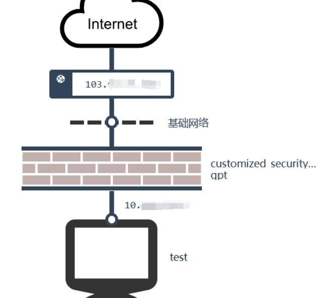

# FastGPT
* 青云服务器
    * 参见 fastgpt 需求，先暂时租 2c4g 60GB https://console.qingcloud.com/ap2a
    * 申请公网 ip（付费），配置 ssh，rsa 密钥
* docker-compose 部署 fastgpt：http://doc.fastai.site/docs/development/docker/
    * docker 安装 oneapi，mongo，pg，fastgpt，mysql
        ```
        # 安装 Docker
        curl -fsSL https://get.docker.com | bash -s docker --mirror Aliyun
        systemctl enable --now docker
        # 安装 docker-compose
        curl -L https://github.com/docker/compose/releases/download/v2.20.3/docker-compose-`uname -s`-`uname -m` -o /usr/local/bin/docker-compose
        chmod +x /usr/local/bin/docker-compose
        # 验证安装
        docker -v
        docker-compose -v

        mkdir fastgpt
        cd fastgpt
        curl -O https://raw.githubusercontent.com/labring/FastGPT/main/files/deploy/fastgpt/docker-compose.yml
        curl -O https://raw.githubusercontent.com/labring/FastGPT/main/projects/app/data/config.json

        # 启动容器
        docker-compose up -d
        # 等待10s，OneAPI第一次总是要重启几次才能连上Mysql
        sleep 10
        # 重启一次oneapi(由于OneAPI的默认Key有点问题，不重启的话会提示找不到渠道，临时手动重启一次解决，等待作者修复)
        docker restart oneapi
        ```
    * vscode 配置端口转发 3000，3001 remote 到 localhost
        * fastgpt 端口 3000
            * root，DEFAULT_ROOT_PSW 是 1234
        * oneapi 端口 3001，root 123456 登录
            * 新建一个 kimi 渠道：sk-XXX
            * oneapi 令牌：sk-XXX
    * fastgpt 中构建应用之后，可以用下面命令测试：
        ```bash
        curl --location --request POST 'http://10.XXX.XXX.XXX:3000/api/v1/chat/completions' \
        --header 'Authorization: Bearer fastgpt-XXX' \
        --header 'Content-Type: application/json' \
        --data-raw '{
            "chatId": "abcd",
            "stream": false,
            "detail": false,
            "variables": {
                "uid": "asdfadsfasfd2323",
                "name": "张三"
            },
            "messages": [
                {
                    "content": "导演是谁",
                    "role": "user"
                }
            ]
        }'
        ```
        其中 `10.XXX.XXX.XXX:3000` 用于在部署 fastgpt 的服务器上测试，`103.XXX.XXX.XXX` 用于外部访问


    * 云务器端：创建安全组 3000 端口，然后让云服务器的防火墙绑定这个安全组
        * 如果想开放 OneAPI，可同时开放 3001 端口
    <p align="center" >
    
    </p>


* FAQ
    * 找不到渠道 
        * OneAPI 中的渠道测试成功后，令牌名称可以随便填 比如 kimi-8k。但 fastgpt 中模型 "llmModels" 中的 "model" 必须和 OneAPI 渠道中的模型名一致。例如 moonshot-v1-8k 之类的，不能是 kimi-8k
    * OneAPI 中测试通过，但 fastGPT 中 Connection Error
        * 主要是 `OPENAI_BASE_URL=http://10.XXX.XXX.XXX:3001/v1` 必须要填对
        * 这里输入命令 `ifconfig | grep "inet " | grep -v 127.0.0.1`，找到 eth0 的地址，也即本机 host 地址（是为了让 fastgpt 的镜像能访问 oneapi）
            * oneapi 的端口映射是 `0.0.0.0:3001->3000/tcp`，把本机的 3001 映射到镜像内的 3000；所以要访问 oneapi，访问本机的 3001 即可
            * 见 https://github.com/labring/FastGPT/issues/973#issuecomment-2017411436 

* chatgpt-on-wechat
    * https://github.com/zhayujie/chatgpt-on-wechat
    * 想要用语音输入的话，需要 `apt install ffmpeg`。注意用了 fastgpt-api 占用了 `open_ai_api_key`，需要用 whisper 的话需要加 `open_ai_api_key_asr`，然后更改 `openai_voice.py`


