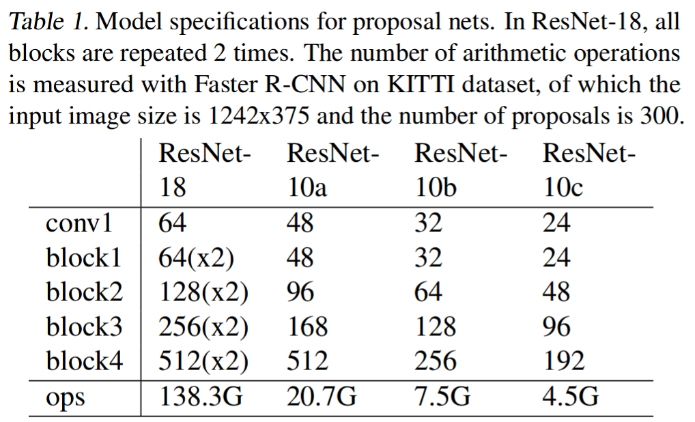
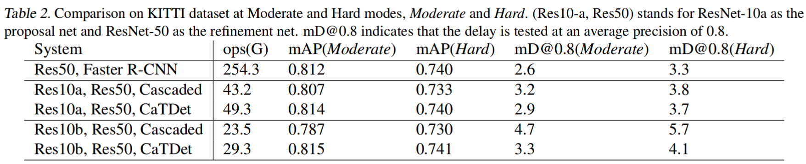
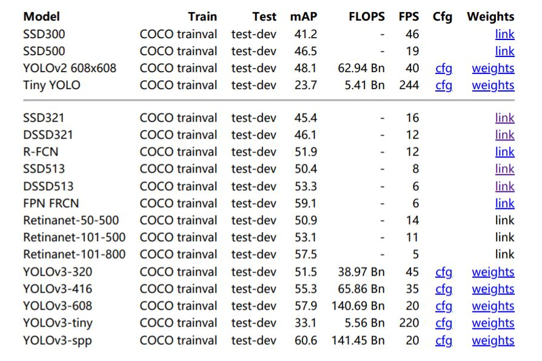

# Model Complexity Analysis

## Introduction
* Nowadays network model = backbone + head  
    * Backbone, i.e. the feature extractor: VGG, GoogleNet, ResNet, Darknet, MobileNet, ShuffeNet...  
    * Head: Regression head, classification head, segmentation head  
    * For different networks, the portion of operations between the backbone and the head could vary a lot.

* One-stage or two-stage?  
    Both one-stage and two-stage can be modified by changing either backbones or heads.  
    [Light-Head R-CNN: In Defense of Two-Stage Object Detector](https://arxiv.org/abs/1711.07264)
    [Single-Shot Refinement Neural Network for Object Detection](http://openaccess.thecvf.com/content_cvpr_2018/papers/Zhang_Single-Shot_Refinement_Neural_CVPR_2018_paper.pdf)

* How to calculate FLOPs?  
https://blog.csdn.net/shwan_ma/article/details/84924142

 

## Ops of backbones
> Classical backbones: https://zhuanlan.zhihu.com/p/49842046  
> Resnet: https://arxiv.org/pdf/1512.03385.pdf  
> Darknet: https://pjreddie.com/media/files/papers/YOLOv3.pdf  

* Resnet (Input suze 224*224) -- not consider the constant 2
    

        
    

    * Some Ops results do not consider constant 2 (summationa and multiplication need 2 operations) while others do. For example, for ResNet-101: 19.7 = 7.6*(256\*2)*2/(224^2)

* Darknet (Input size 256*256) -- consider the constant 2
    

        
    

    * Yolov2 uses Darknet-19 as backbone. Yolov3 uses Darknet-53.  
    * Models with the same FLOPS may have different fps (or BFLOP/s) on devicesdue do the discrepancy of runtime efficiency.
    * Only look at accuracy and FLOPs, Darknet-53 is just slightly better than ResNet-101.

 

## Ops of the whole model
> [Faster-RCNN (CatDet)](https://arxiv.org/pdf/1810.00434.pdf)  
[Yolo Overview](https://yongtaoge.github.io/2018/08/07/%E7%9B%AE%E6%A0%87%E6%A3%80%E6%B5%8B%EF%BC%9AYOLO-%E7%B3%BB%E5%88%97/)  
[Yolov3 Tiny Structure](http://www.tcsae.org/nygcxb/ch/reader/create_pdf.aspx?file_no=20190814)
* Faster-RCNN with different backbones
    * input size 1243*375
    * RPN predicts 3 types of anchors with 4 different scales for each loacation
    * 300 proposals after NMS
    

        
    

    

        
    

* Yolo
    

        
    

 

## Conclusion
* About backbones  
    In terms of the backbone, under the same resolution (256*256):
    
    |Darknet53|Darknet19|ResNet50|ResNet18|ResNet10/ShuffleNet/MobileNet varients|
    |:--:|:--:|:--:|:--:|:--:|
    |18.7G|7.3G|9.7G|4.3G|could <1G|

* About the whole model

    |Model|Dataset|Totoal GFLOPS|
    |--|:--:|:--:|
    |Res50 + Faster-RCNN| KITTI, 1242*375|254.3|
    |Res18 + Faster-RCNN| KITTI, 1242*375|138.3|
    |Res10a + Faster-RCNN| KITTI, 1242*375|20.7|
    |Res10b + Faster-RCNN| KITTI, 1242*375|7.5|
    |Yolov3|coco, 416*416|65.9|
    |Yolov3 tiny|coco, 416*416|5.6|

    * Faster-RCNN(1242*375): FC layers which deal with those 300 region proposals cost most  
    --- Heavy head，see __[Light-Head R-CNN: In Defense of Two-Stage Object Detector](https://arxiv.org/abs/1711.07264)__
        * ResNet50: 77 GFLOPS
        * Others: 177 GFLOPS
    * Yolov3(416*416): backbone cost most
        * Darknet53 backbone: 49.4 GFLOPS
        * Others: 16.5 GLOPS

* About Hardware
    * Yolov3 (416\*416) on TX2, without TensorRT: 3~4 fps; with TensorRT: ~14fps  
    * Due to the memory access cost (MAC) and other costs, for TX2 (1 TFLOPS), only about 25% of theoretical FLOPS can be achieved in practical. __FLOPs could tell the upper bound of the model complexity given the desired fps.__
    * FLOPs itself might not be an accurate enough estimation of actual runtime, __[see shuffleNetv2](https://www.cnblogs.com/ansang/p/9406659.html)__.  
    Structure like shuffleNet is more suitable for CPU than GPU. https://www.zhihu.com/question/68483928/answer/267957881

