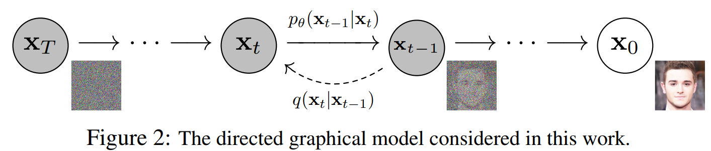

# 一些 MileStones & 背景知识
## 重要工作
* 2017：VQ-VAE -- Deep Mind NIPS17
* 2020：
    * DDPM：一作 UCB 的 Jonathan Ho, 现在在 Google Brain
    * GPT-3 -- OpenAI
* 2021：
    * CLIP： 文章名 Learning Transferable Visual Models From Natural Language Supervision
        * OpenAI 21年初    
    * DALLE（GPT like model，不是diffusion based）：文章名 Zero-Shot Text-to-Image Generation
        * 和 CLIP 是 OpenAI 的同一帮人在几乎同一时间发出来的，DALLE 用了 CLIP；等于是一个大 work 的 contribution 够多，拆成了两篇文章
    * VQGAN：主要用于 image-to-image，和 DALLE 几乎是 concurrent 的工作，所以 DALLE 没用 VQGAN，用的 VQVAE
        * 一作海德堡大学 Patrick Esser, 也是 Stable Diffusion 作者，现在在 RunWAY.ml
    
    * 四个 Diffusion 的工作：串讲见 https://zhuanlan.zhihu.com/p/449284962  
        * Guided Diffusion：文章名 Diffusion Models Beat GANs on Image Synthesis -- OpenAI  
        在每一步逆扩散时，在计算高斯分布的均值时加上方差和分类梯度项的乘积
        * Semantic Diffusion Guidance：文章名 More Control for Free! Image Synthesis with Semantic Diffusion Guidance -- Liu Xihui  
        将类别引导拓展成了基于参考图引导以及基于文本引导两种形式
        * Classifier-Free Diffusion Guidance  
        分别计算有 y 的情况下和无 y 的条件下噪声的差，来模拟类别引导。作者 Jonathan Ho，也是 DDPM 作者，Google Brain  
        * GLIDE: Towards Photorealistic Image Generation and Editing with Text-Guided Diffusion Models -- OpenAI   
        将类别条件的变为以 CLIP 输出的语言条件
* 2022：
    * DALLE2 -- OpenAI
        * 上半部分是预训练的 CLIP
        * 不是从 noise 开始逆扩散，而是从 CLIP image encoding 开始，其余类似 GLIDE，用了 **up-sampling diffusion model**
        * 像是 GLIDE，而非 DALLE2

    * Stable Diffusion：文章名 High-Resolution Image Synthesis with Latent Diffusion Models
        * 一作和 Patrick Esser 一样，也来自海德堡大学；stability.AI 做了该模型的开源
    * Imagen：文章名 Photorealistic Text-to-Image Diffusion Models
with Deep Language Understanding 
        * from Google Brain，比 stable diffusion 晚，但未开源
        * 用了更轻量化的 U-Net，和更强的文本编码器 T5 (**11B 参数**，训练中固定），对比 Stable diffusion 用的 Bert。总的来说对于文字中复杂的逻辑理解更好 https://zhuanlan.zhihu.com/p/522381808
        * 同 DALLE2，用了 **upsampling classifier-free diffusion**
    * Parti：文章名 Scaling Autoregressive Models for Content-Rich Text-to-Image Generation  
        * from Google Brain，基于 VQGAN
        * **Autoregressive model** 也能达到和 diffusion model 一样好的效果（对于 256*256 的生成），再 upsampling 可以借助 diffusion model

    
* 总结一下：
分为三派：Deepmind，OpenAI 和 其他
    * Google Brain：DDPM，Classifier-free Diffusion Guidance，Imagen，Parti
        * BTW，Deepmind 是 google 亲儿子，Brain 是买来的；Alpha Zero 这些是 Deepmind 的成果
    * OpenAI：GPT系列，CLIP，DALLE系列，GLIDE
    * 海德堡大学/Runway.ML/stability.AI：VQGAN，Stable Diffusion  
    
    

## Repo 及模型参数量
* 重要
    * CLIP：https://github.com/openai/CLIP
        * text encoder 是传统的 12 层 transformer，**63M 参数**
    * Disco Diffusion：https://github.com/alembics/disco-diffusion
        * CLIP + Guided Diffusion
    * DALLE from OpenAI
        * DALLE （非官方实现）：https://github.com/lucidrains/DALLE-pytorch 
            * **12B 参数**
        * DALLE-mini：https://github.com/borisdayma/dalle-mini 
            * DALLE mini 使用预训练好的模型（VQGAN、BART，CLIP)，而 DALLE 从头开始训练；训练数据对数 15M vs. 0.25B

            * **0.4B 参数**，媒体：https://www.leiphone.com/category/academic/lrCG1TvFt2SuHAuv.html 
        * DALLE2：大小基本同 GLIDE，**3.5B 参数**
    * GLIDE：https://github.com/openai/glide-text2im
        * **3.5B 参数**
    * Stable Diffusion：https://github.com/CompVis/latent-diffusion 
        * **1.45B 参数**，媒体：  
        https://mp.weixin.qq.com/s/QLAwtrVeCx5vLOELr6cXUQ   
        https://mp.weixin.qq.com/s/Q4ZYjUxt22Jsx2W2179C8Q
    * Imagen **300M~2B餐参数**，Parti **20B 参数** 都比较封闭
* 其他
    * 中文 
        * CogView（**4B 参数**）
        * Cogview2（**6B 参数**）
        * Cogvideo（**9.4B 参数**）
    * 俄罗斯 ruDALL-E：https://rudalle.ru/en/

 

## 对比学习方法回顾：
[见 PDF 文档](./pictures/contrastive_learning_summary.pdf)

 

## ELBO 和变分推断
> https://zhuanlan.zhihu.com/p/91640654  

* 目标及背景：  
想从一系列数据 x 中推理出隐变量 `z` 的分布，也即想求解条件概率：`p(z|x) = p(z,x)/p(x)`   
其中 `p(z,x)` 可以由专家根据他们的知识给出。例如 GMM 模型中，每个点属于哪个高斯分布就是隐变量，`p(z,x)` 代表每个点属于某一个高斯分布的概率，这个由正态分布根据距中心的距离即可给出。  
但实际中，从 `p(x|z)` 积分来计算分母 `p(x)` 很困难（假设k个隐变量，积分需要k重，计算复杂度 k^n 会随着数据量 n 指数增长）。所以要用到变分推断，想用一个比较容易实现的分布 `q_θ(z)` 去逼近 `p(z|x)`。所以在这个过程中，我们的关键点转变了，从求分布的推断问题，变成了缩小距离的优化问题。

* 用KL散度衡量两个分布的相似度：  
`KL(q(z)||p(z|x)) = E_q[log q_θ(z)] - E_q[log p(z,x)] + log p(x)`，其中 `ELBO(q_θ) = E_q[log p(z,x)] - E_q[log q(z)]`  
 可以看到 **`log p(x) = ELBO(q_θ) + KL(q(z)||p(z|x)) >= ELBO(q_θ)`** 恒成立（KL 散度永远大于0），  
 所以 ELBO 叫做 Evidence Lower Bound（或 variational lower bound），也即证据下界，这里证据指数据或可观测变量的概率密度，也即 `log p(x)`
* 变分推断的过程（可以带入GMM模型方便理解） 
    > 一个例子：https://www.zhihu.com/question/41765860/answer/331070683  
    * 先写出 `p(z,x)` 和 `q_θ(z)`
    * 带入公式 `ELBO(q_θ) = E_q[log p(z,x)] - E_q[log q(z)]`  
    实际中，求期望这一步有挺多技巧，可能还会用到指数簇分布，用累积函数 A 的导数作为期望值：https://qianyang-hfut.blog.csdn.net/article/details/87247363 
    * 将 `ELBO(q_θ)` 对 `θ` 求偏导，且使偏导等于0，最大化 ELBO

* 为什么叫变分推断？  
其实和求泛函（最速曲线）用的变分法其实有相关性。求 `ELBO(q_θ)` 的极值需要对 `θ` 的偏导，其实相当于是对一个函数求导数

 

## EM算法（一般收敛到局部最优，不能确保全局最优）
> https://zhuanlan.zhihu.com/p/330638095 

EM算法分为 E-step 和 M-step。和变分推断原理一样，不断迭代提高 ELBO，直到KL散度接近于0（KL恒大于零），也即 `q(z)` 逼近了 `p(z|x)`    
总结来讲 EM 算法是变分推断的一个特例，K-means是一种 EM 算法。EM 算法在 E-step 时，认为 `q_θ(z)` 是给定的（由于迭代更新）

* E-step：给定参数 `θ_t`，求出最合适的隐变量 `z_(t+1)`  
比如 k-means 中隐变量 `z_(t+1)` 确定每个点属于哪个聚类  
* M-step：给定隐变量 `z_(t+1)`，用极大似然估计来计算 `θ_(t+1)`  
比如 k-means 中的更新类中心位置，使得 distance 的 loss 最小化

 

## VAE：Variational AutoEncoder，2014
> https://zhuanlan.zhihu.com/p/27865705  

* 目标  
我们希望学习出一个模型，能产生训练样本中没有，但与训练集相似的数据。换一种说法，对于样本空间，当以抽取数据时，我们希望以较高概率抽取到与训练样本近似的数据。推理时，可以直接在隐空间采样生成图像，且根据隐变量 z 进行生成风格的调整

* 实现方法  
    * 网络结构上还是一个 encoder + decoder，但在 loss 的设计上在自编码器的基础上还加了一个关于隐变量的 KL loss 作为规范项
    * VAE中，强制假设了隐变量 `p(z)` 是标准正态分布，而让 encoder 的输出 `q(z|x)` 去拟合 `p(z)`，也即 KL loss。这一步也即用到了 ELBO 的公式
    * 此外，为了可以反传梯度，用了一个 **重参数化 `Reparameterization Trick`**，将 `z~N(μ,∑)` 采样转变到 `z=μ+σ*e`，其中 `e`是从正态分布采样的，因此对于每一个 sample 可以认为是个常数，变得可微。

        

        
        

        

        
        

  

# Diffusion Model
> 主要有：DDPM，GLIDE，DALLE2，Stable Diffusion，IMAGEN    
https://zhuanlan.zhihu.com/p/513387691 

Diffusion model 与其他生成方法不同点是：在时序上需要运行多步，且隐变量 z 的维度和 x 原始尺寸相同

## DDPM：Denoising Diffusion Probabilistic Models, NIPS20
> 原理和代码：https://www.zhihu.com/question/530608581/answer/2608721843   
> https://zhuanlan.zhihu.com/p/550967884

* 背景：
从 `x_(t-1）`到`x_t`通过加噪音就可以得到，但怎么从`x_t`去噪得到`x_(t-1)`，也即求得 `p_θ(x_(t-1)|x_t)`? 

* 方法：
    * 进行逆扩散 `p_θ(x_(t-1)|x_t)` 时，当step很小时，也可以用一个正态分布来模拟，最重要的就是正态分布均值 `μ_θ(x_(t-1))` 是多少？这个可以借助将 `p_θ(x_(t-1)|x_t)` 近似转化为 `p_θ(x_(t-1)|x_t, x_0)`，也即考虑加上 `x_0` 的条件概率：
        

        
        

    * 为了求 `p_θ`，DDPM最大化其似然估计：` log p_θ(x_0)`。下图是省略版的思路（怎么从最大化似然估计到最小化平方差loss），其中会用到上面求的`μ_t`，具体推导见：https://zhuanlan.zhihu.com/p/558462214   
        

        
        

    * 网络训练方法如下，上面公式推导的 `ε_θ(...)` 一项就代表的是 U-Net 网络，loss定义如下：
        

        
        

        也即在已知 x_0 和 ε （也即 x_t）的情况，用 U-net 去拟合 ε（每一个时间 t 网络都是复用的，类比RNN）。Sampling 阶段第 4 行的由来见上面推导的公式浅蓝色部分
        
 
        
        

 

## Stable Diffusion
相比原始diffusion，优点是用 encoder 将 image 从原始 pixel space 映射到 latent space，减少了计算量。因为 diffusion model 偏向进行 semnatic compression（人眼易察觉的），GAN/AutoEncoder 这些偏向进行 perceptual compression（也就是人眼很难察觉到高频信息），所以可以先用 encoder 对图像类似进行一个低通滤波。Endocer 能有效地将图像边长缩小到原来的 1/4 到 1/16，在生成的样本质量上甚至还有提升。  

方法上，首先预训练一个 autoencoder，然后在多个diffusion model的训练，这个autoencoder 都可以复用。
开源的模型在 `LAION-400M（Open Dataset of CLIP-Filtered 400 Million Image-Text Pairs）` 数据集上训练，模型大小5.7GB，对应 1.45B 参数。  
推理：在1个 V100 GPU day 大概能推理10000张，每一张大概 8s；训练在30个V100 day就差不多了，相比之前的需要150-1000个，大幅降低了。

 

## DALLE2 和 Imagen

  

# Auto-regressive Model
> 主要有 CLIP 和 DALLE（both from OpenAI），还有 Parti (Google)  
[介绍：DALL·E—从文本到图像，超现实主义的图像生成器](https://zhuanlan.zhihu.com/p/394467135)

## CLIP：Contrastive Language-Image Pre-training

* 引子：  
    * 在2013年，斯坦福大学的Richer Socher教授就曾在训练CIFAR-10的模型时，在词向量嵌入空间中进行预测，并发现该模型可以预测未见过的类别。在 Text-Image 数据集上预训练的 CLIP，能根据文字描述在 zero-shot 下实现与全监督 ResNet50 在 1.28M ImageNet 上相匹配的效果
    * 任务难度：Transformer Language Model（Image Caption） > Bag of Words Prediction > Bag of Words Contrastive (CLIP)，CLIP 选用了难度最低的任务反而训练效率更高，这是因为训练数据所包含的 text-image pair 从互联网收集来的，它们存在一噪音，也就是说并不完全匹配。这个时候适当的降低训练目标，反而能取得更好的收敛  
    * 基于 CLIP 的 detection 模型：ViLD：用了 CLIP pre-trained 的 Image Encoder和 Text Encoder  

* 方法：本质上是利用大量 image-text pair，强制在特征空间强制对齐  
    * text encoder 用的 12 层的 transformer，image encoder 试了 ResNet 或 Vision Transformer (ViT)；根据 evaluation，ViT 结果普遍好于 ResNet
    * 一切从简：encoder representation 线性投影到 multi-modal embedding space，没用 non-linear projection；对称的cross-entropy loss；**ADAM + train from scratch**
    * 定义任务是 text-to-image，而不是一句话中的 exact work to image，因为后者训练会有困难；并且是 N texts- N images，一个 batch 会产生 N^2 个 score
    * 数据
        * 数据集：用了大概 400M 个 Text-Image pair，称作 WebImageText；GPT-2 用的 WebText 数据集，也差不多是 400 M
        * 数据增强：只用了random square crop from resized images 
* 局限：  
    * 对于特别专业的 domain 例如 EuroSAT/MNIST；或需要预测物品数量、预测图片中物品的位置距离等更抽象的任务上，zero-shot 性能仍有限 
    * 需要比较好的 prompt engineering，有时需要试验和错误“提示引擎”的辅助

 

## DALLE: Language-Image Pre-training

* VQ-VAE：隐空间是离散的 VAE
    * 选取与 cookbook 中与 encoder 输出的 embedding 最接近的那个。但会带来不可导的问题（无法像 VAE 那样可以重参数化）。DALLE 用 Gumbel Softmax trick 来解决这个问题（简单来说就是arg max不可导，可以用 softmax 来近似代替 max，而 arg softmax 是可导的)
* 训练阶段：（参数可能有出入）
    * Stage One 先单独做 dVAE 的训练（得到encoder、visual codebook、decoder）。`256x256` 的图片先被 encoder 处理成 latent space `32x32xD`，也即分成 `32x32` 个 patch，每个 patch 都由一个 D 维的 token 表示（这里 D 就是 codebook 的尺寸，DALLE 用的 512）。每个 D 维的向量都能在词汇量为 8192 的 codebook 中找到一个最邻近的一个 token，然后变成 one-hot coding：`32x32x8192`。这 1024 个图像 token 会和 text token 汇合，汇合处理后，decoder 还原图像
        * 这里说 token 就是指长度为 512 的向量
        * 8192 是 image 的 codebook 大小，文本是 16384
    * Stage Two，固定 dVAE，text 和 image 分别做编码，concat 在一起之后（text 得到 256 个 token，和 32x32 个 image 一起共 1280 个）做类似 GPT-3 的 autoregressive 
* 推理阶段：只输入 text  
    * BPE Encoder 会生成 text 的 token
    * 图像生成过程和下图 VQGAN 有点类似（不同是 DALLE 有来自文本的 token，且 DALLE 用的 VQVAE）
        * 基于文本的 token 和已经得到的 image patch 的 token，会过一个 transfomer，生成一个 logits，这个 logits 会决定从 codebook 中选哪个 token。如此往复，直至所有 image token 都被生成好（也即图像后生成的像素其实也取决于先生成的像素）
        * VQGAN 的 Transformer 为 GPT-2
            

            
            

    * 按 patch 采样完毕，通过 decoder
    * DALLE 用了 CLIP 用于选择最佳生成的图像

 

## CLIP-GEN
> https://www.high-flyer.cn/blog/clip_gen/   

* 一个缝合 CLIP 和 VQGAN 的工作，优点是只用图片并借助预训练好的 CLIP 模型，也能实现 text-to-image 的网络训练，训练步骤
    * 预训练 VQGAN
    * 训练 condition transformer：用预训练的 VQGAN，已经能够通过 image tokens 来生成图片了。这一步是为了把 VQGAN encoder 生成的 image token 和 CLIP 对于图像的 token align 起来。因为 CLIP 本身已经实现了文本和图像 token 的 align，所以间接地把文本的 token 和 VQGAN encoder 产生的 token align起 来了。 训练的过程中 VQGAN 和 CLIP 参数都保持不变

        

        
        

 
