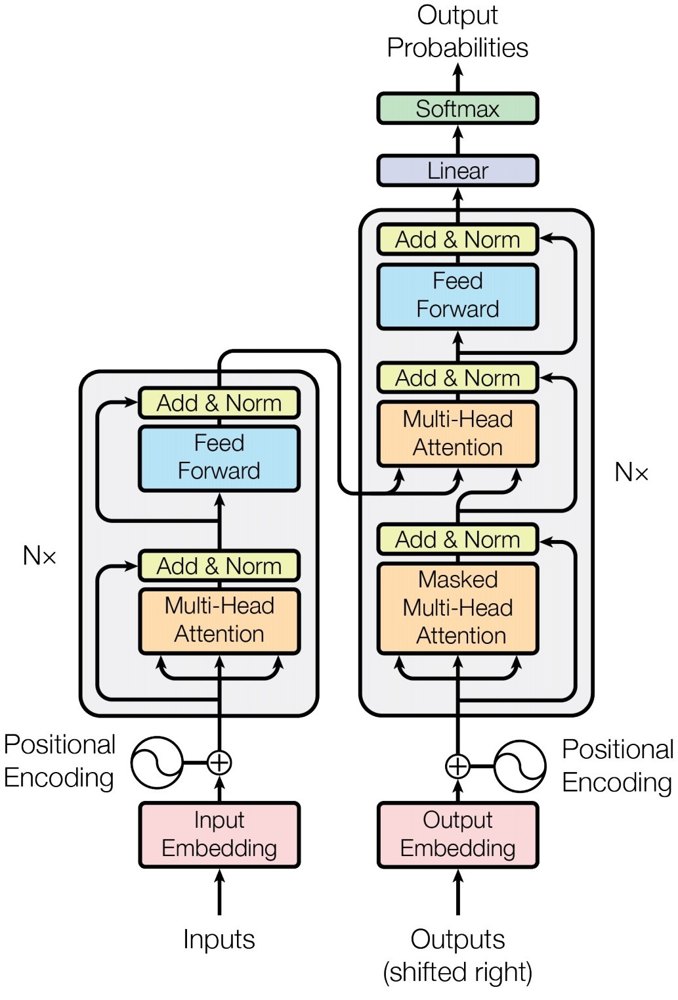

## 关于Loss Function
> https://zhuanlan.zhihu.com/p/36670444   
> https://www.cnblogs.com/yinheyi/p/6131262.html

* `Softmax Function + Cross Entropy Loss` 和 `Logistic Function + Logistic Loss` 关系？
    > https://www.zhihu.com/question/36981158 
    * 前者是后者从二分到多分类的推广
    * softmax 和 logistic 函数都将负无穷到正无穷映射到 [0, 1] 
    * softmax强调互斥性，多个类的概率加起来为1；logistic没有互斥性。
        * 例如people包含male，那么应该对people和male两类分别用求logistic loss，再相加；而不是用softmax
        * 例如要判断一张图是笑脸还是哭脸，推荐做法：  
        网络输出`1*2`的向量-> softmax -> focal loss/BCE loss -> 看两个数哪个大，得到结果   
        如果只输出一个标量，用sigmoid，那么只最后得到一个score，还需要手动选取阈值确定是笑脸还是哭脸，而这个阈值可能和训练数据分布有很大关系。

* 为什么 Loss Function 要用对数？  
    * 对于 Logistic Loss Function: 最小化Loss Function = 最大化二项分布的对数似然函数 = 最大化二项分布的似然函数
    * 同理，对于Cross Entropy: 最小化Loss Function = 最大化多项分布的对数似然函数

 

## 关于 One-hot Coding
> https://www.zhihu.com/question/53802526/answer/515535985

为了使得各种结果之间距离相等

 

## LSTM
> https://www.zhihu.com/question/64470274

	

* A被称作cell，LSTM的`cell`在每个`time_step`是复用的
* `num_units` = `h_t` 和 `s_t` 的维度大小（两者相同维度）= 最后一个time step输出维度大小（输出为h） = 黄色框的输出维度大小 = `hidden_size`
* LSTM参数量：`(hidden_size * (hidden_size + x_dim ) + hidden_size) *4 `，因为 `f = sigma(W[h, x] + b)`，相当于将维度 `(hidden_size + x_dim)` 变到了 `hidden_size`

 

## Transformer
> https://zhuanlan.zhihu.com/p/80986272

	

### 一些细节：  
Positional Embedding:  
* Word embedding 和 positional encoding （位置的正余弦函数值）相加  
* Size：`(nbatches，L, 512)`，其中 L 为 sequence length（句子单词数），512 为 embedding size

Encoder
* Multi-Head Attention （橙色）
    * 首先把输入数据 split 成 m 份，输入 m 个 head，相当于每个 head 分到的 embedding feature size 是: 512/m
    * 每个Head：`K = linear_k(x)`，`Q = linear_q(x)`，`V = linear_v(x)`，Q (query) 是词的查询向量，K (key) 是被查向量，V (value) 是内容向量
    * Attention(Q, K, V)：`QK^T` 可以理解为构成一个相似度评分的权重（注意力加权）
        

        
        

    * 多个 Head 得到的 Attention concat 之后再经过一个 linear 层，使得 output 与 input 的 shape 是完全一致的，输入 Multi-head Attention 模块的分叉箭头代表多个 head

* Position-wise Fully Connected Feed-Forward Network （蓝色）
    

	
    

### 一些对比：
* 数据集本身比较小，Transform 要训练好所需要的数据量比较大，这时用 train from scratch LSTM 也比较好
* 数据并行的问题，一次可以输入多个单词，而不像 LSTM/RNN 需要一个接一个
* transfer learning：LSTM几乎不支持transfer learning，Transformer可以
* 相比最原始的 Sequence-to-sequence 的架构：Transformer 中的 Encoder 可以并行计算，一次性输入全部 encoding 出来。但 decoder 不是一次把所有序列解出来的，而是像 rnn 一样一个一个解出来的。第二级 decoder 也被称作 encoder-decoder attention layer，它的 query （也即上一个预测得到的词）来自于之前一级的 decoder 层的输出，但其 key 和 value 来自于 encoder 的输出，这使得 decoder 的每一个位置都可以和输入序列的每一个位置产生关联。
    

	
    

* LSTM is still good when sequence too long, transformer is O(N^2)