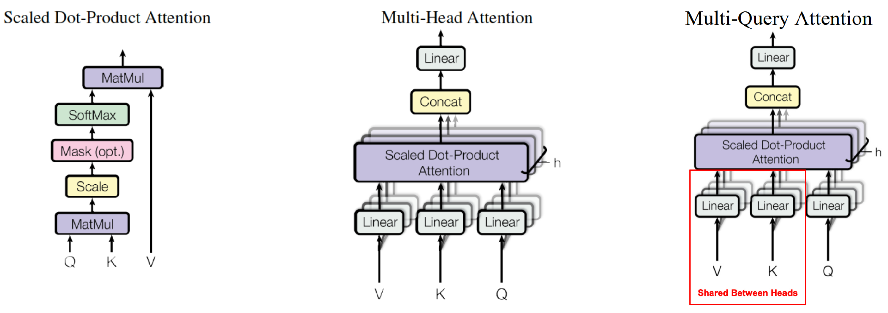

# 基本概念
## 图灵机和图灵完备
* 图灵机：https://www.bilibili.com/video/BV1br4y1N762/?spm_id_from=333.788.recommend_more_video.0  
它可以模拟计算机的任何算法，无论这个算法有多复杂。原型是一个只带，由非常多01构成。然后有一个读写头，它可以在纸带上左右移动，能读出当前所指的格子上的符号，并能改变它。还有一个控制表，它根据当前机器所处的状态以及当前读写头所指的格子上的符号来确定读写头下一步的动作，并改变状态寄存器的值  

* 图灵完备：https://www.bilibili.com/video/BV18L4y15786/?vd_source=93c3a9b0afc9334d69915ec59d8c3a87   
图灵完备是针对语言的，一个语言图灵完备意味着用这个语言，能实现图灵机所有的功能。 
C，C++，java 这些高级语言都是图灵完备的，有 if else / for / go to 这些逻辑（底层汇编语言是离不开 go to 的）。


<br>
<br>


# 深度学习知识
## 反向传播
### BP 基础
* [代码见：bp.py](./bp.py)

* 原理 https://blog.csdn.net/qq_27361945/article/details/109760708
    * 先计算前向，过程中存储矩阵乘的结果 z，以及z的激活值 h
    * 再计算 loss，以及计算每一层 z 的误差 delta
        * sigmoid `y = 1/(1+e^(-x))`，反向 `y' = y(1-y)`  
    * 最后更新权重
        * 线性层 `Y = X W`，反向 `dL/dW = X^T dL/dy --> W' = X^T Y'`，https://zhuanlan.zhihu.com/p/25496760 

* BP 的计算复杂度
    * 约等于两倍前向，算 loss + 算梯度（未考虑更新权重）
    * 如果有重计算，那么还要加一个算 z 的过程

### 并行中的 BP 
https://zhuanlan.zhihu.com/p/367908419

| 特性 | DP | 简单模型并行 |
| --- | --- | --- |
| 参数初始化 | Broadcast 参数同步 | Scatter 参数分发 |
| 前传 | 无操作 | AllGather 权重 |
| BP处理梯度 | AllReduce | ReduceScatter |


## Optimizer
### Adam，L2, weight decay 和 AdamW
> https://www.jiqizhixin.com/articles/2018-07-03-14   

* 背景：2014年被提出的 Adam 优化器的收敛性被证明是错误的，之前大部分机器学习框架中对于Adam的权重衰减的实现也都是错误的。`Fixing Weight Decay Regularization in Adam` （ICLR 2017 Best Paper）提出了一种新的方法用于修复 Adam 的权重衰减错误，命名为 AdamW，Pytorch 中也有一个优化器叫 AdamW
* L2正则化和权重衰减在大部分情况下并不等价，只在 SGD 优化的情况下是等价的。而大多数框架中对于 `Adam+L2` 正则使用的是权重衰减的方式，但事实上两者不能混为一谈

### Adam、Adafactor、CAME
* Adam 是每个参数，维护一个自己的动量 m（来源于一阶梯度） 和速度 v（来源于二阶梯度，用于lr的自适应）
    *  `m_t` 和 `v_t` 要除以 `(1-beta^t)` 是为了使得 `m_hat_t` 量级上和 `g_t` 一样（可以假设每一步的 `g_t` 都相等，然后把 `m_t` 展开，会发现除了 `(1-beta^t)` 之后 `m_hat_t = g_t` ）
    *  Adam 的调参技巧：beta2 增加可以帮助收敛，但减少 beta2 可以获得更大自适应度
	    <p align="left" >
	        
	    </p>
* Adafactor 是利用矩阵的低秩分解，用向量 r 和 c 去替代矩阵 v
    * v 用于 lr 的自适应缩放：`u_t = g_t/sqrt(v_t)` 为缩放过后的梯度，然后会再进行一个 clip
    * Adafactor 需要保存 m、r、c，产生中间变量 v（但 v 可以复用 g 的内存）
* CAME
    * 需要比 Adafactor 多算一个 U_t，作为一个 confidence 的补偿：在 `m_t` 和 `u_hat_t` 差别较小时，`S_t` 也较小，从而步长更大
    * 需要保存 r、c、m、R、C。而 v、u、u_hat 都可以复用 g 的内存
    	* beta1 影响 momentum 的更新，beta2/eps1 影响 rc 的更新（从而影响 v，控制 g 的缩放），beta3/eps2 影响 R/C 的更新（从而影响 S，加入了 confidence-guided 的对 m 的缩放）
    	* 实际实现中，beta1/beta3 的作用对应于 adam 的 beta1/beta2，默认值为 0.9/0.999；beta2 是一个随时间增加逼近 1 的值，`beta2t = 1.0 - math.pow(state['step'], group['decay_rate'])`

* ADAM、Adafactor、CAME 比较  
    * CAME 和 Adafactor 所需要存储的优化器参数几乎为 Adam 的一半。但 CAME 和 ADAM 训练的模型精度可比，Adafactor 会差一点
    * 混合精度训练，总计所需内存从 `16*参数量 -> 12*参数量（多一点）`，16 = 4 (m) + 4(v) + 4 (master_weight) + 2 (model_weight) + 2 (grad)
    
    <p align="center" >
        
    </p>

<br>

## Unstructure Pruning: Lottery Hypothesis
* `The Lottery Hypothesis`：一个网络，先train到收敛，然后我剪枝，剪枝之后呢，我把那些还没有被剪的参数重新初始化到刚开始初始化的样子，然后再train，发现效果还挺好，有时候甚至更好。和之前的 pruning 的区别是，pruning 是 `先train网络 --> prune --> 再 finetune pruned 过后的网络（整个过程重复多次）`；Lottery 直接用的是最古老的原网络的权重
* `Rethinking the Value of Network Pruning_ICLR19`: 这篇文章也是差不多的结论，只是有一点不同：剪枝之后，Lottery 要把未被剪的参数重新变成之前初始化的样子，而 Rethinking 则更简单一些，不需要变成之前初始化的样子，你随便再随机初始化也是一样的。这篇文章说明：网络结构也许比权重更重要
* `Deconstructing Lottery Tickets Zeros, Signs, and the Supermask_NIPS19`：
    > https://www.cnblogs.com/chenbong/p/14118965.html  
    * 直接mask一个随机初始化的网络，得到的非结构化稀疏网络，可以比原随机初始化网络准确度高很多
    * 权重的正负号，比权重的数值更重要：`We also showed that the only element of the original initialization that is crucial to the performance of LT networks is the sign, not the relative magnitude of the weights`
    * 可以通过训练 mask，而不是原网络的权值，来优化网络，得到近似于原网络的准确度：`we demonstrated that the masking procedure can be thought of as a training operation`


<br>

## Loss Function
> https://zhuanlan.zhihu.com/p/36670444   
> https://www.cnblogs.com/yinheyi/p/6131262.html

### Softmax Function + Cross Entropy Loss 和 Logistic Function + Logistic Loss 关系？
> https://www.zhihu.com/question/36981158 
* 前者是后者从二分到多分类的推广
* softmax 和 logistic 函数都将负无穷到正无穷映射到 [0, 1] 
* softmax强调互斥性，多个类的概率加起来为1；logistic没有互斥性。
    * 例如people包含male，那么应该对people和male两类分别用求logistic loss，再相加；而不是用softmax
    * 例如要判断一张图是笑脸还是哭脸，推荐做法：  
    网络输出`1*2`的向量-> softmax -> focal loss/BCE loss -> 看两个数哪个大，得到结果   
    如果只输出一个标量，用sigmoid，那么只最后得到一个score，还需要手动选取阈值确定是笑脸还是哭脸，而这个阈值可能和训练数据分布有很大关系

### 求 Loss 过程中，Why Log and One-hot Coding？  
>  https://blog.csdn.net/saltriver/article/details/63683092  
* 原理上：最大化似然函数时，将乘方变成乘法
    * 对于 Logistic Loss Function: 最小化Loss Function = 最大化二项分布的对数似然函数 `log L(θ)` = 最大化二项分布的似然函数 `L(θ)=P(y=1|x)^y * P(y=0|x)^(1-y)`
    * 同理，对于Cross Entropy: 最小化Loss Function = 最大化多项分布的对数似然函数
* 从优化效率的角度看，为什么要用 log loss？
    > https://zhuanlan.zhihu.com/p/242763826  

    从 https://kexue.fm/archives/6620 中可以看出：`max(x)` 的光滑近似是 `logsumexp()`，`Softmax(x)` 其实是 `onehot(argmax(x))` 的光滑近似。讲道理，准确的光滑近似应该是优化一个没有 log 的 loss
    <p align="center" >
        
    </p>
    但由于不好优化，其会导致：误差特别大时，梯度反而变小了。加了 `log` 之后才方便优化  
* One-hot Coding：  
初衷是为了使得各种结果之间距离相等：如果是0-9这10个数字，如果不用编码，那么0和9的距离就是9，但是，如果用了one hot 编码后，编码后0与9，或者0与任何其他的值，距离都是一样的，都是为1

### Softmax 和 Cross Entropy 的梯度？
* Softmax + cross-entropy 的前向传播和反向传播:  https://zhuanlan.zhihu.com/p/86184547   
    loss对logits的梯度，形式很简洁：`∂L/∂z=a-y`，其中 `logits是z，a是z经过softmax，y是one-hot label`

### 解决正负样本不均  
* OHEM: online hard example mining，Faster-RCNN 用了这个，正负样本数量为 1:3，正样本从 `IoU>0.5` 中选，负样本从 `0.1~0.5` 中选
* focal loss：相当于将上文的 OHEM 1:3 的硬截断的 soft version
    > https://www.cnblogs.com/leebxo/p/11291140.html  
    https://www.cnblogs.com/ymjyqsx/p/9508664.html  
    
<br>

## 知识蒸馏
* 几个要点：soft label，temperature scaling（注意前面有 \tau ^ 2），两种 loss

    Hinton 提出知识蒸馏基于这样一个观察：一个训练好的模型在测试时，给出的预测结果并不是 one-hot 形式（某一类为1，其余类全0）的，对于某一张测试图像，即使模型分类正确，在错误的类别上模型仍然会给出一些值较小但非零的概率  
    Hinton 认为这些小而非零的值包含类与类之间的相似度关系，例如输入一张狗的图像，模型可能在狗的类别上给出 0.7 的概率，而在猫和狼的类别上给出 0.1 的概率，这种类间关系是模型在训练过程中基于数据集自动学会的，能够提供比人工标注的 one-hot 标签更丰富的信息，用一个训好的大模型的输出来监督另一个小模型，其结果比只用人工标签 （hard label）更好

    <p align="center" >
	
    </p>


<br>

## BatchNorm
> https://blog.csdn.net/LoseInVain/article/details/86476010  

<p align="center" >
    
</p>

* 要学习的两个参数：`gamma` 和 `beta` 都是和通道数同维度的
* 而第一、二步得到的方差，都是统计得到的。在 `model.train()`时，running_mean 和 running_var 都会变，以不断追踪整个数据集上的均值和方差。`optimizer.step()` 则会改变 `gamma` 和 `beta`
* 只有当 `model.eval()` 时，running_mean 和 running_var 才不会变
    * `model.eval()`：会改变 BN，dropout 等特性，会计算梯度，但不反向传播
    * `with torch.no_grad()`：直接不计算梯度了，节省显存
* 某些情况下，即便整体的模型处于 `model.train()` 的状态，但是某些BN层也可能需要按照需求设置为 `model_bn.eval()`


<br>

## 其他
* Optimizer 常用技巧：Warm up   
One-Cycle SGD 能达到的最好效果会比 Adam 好：https://zhuanlan.zhihu.com/p/365873548   
Optimizer warm up 等同于One-Cycle SGD：https://www.codenong.com/cs106019396/ 
* AdamW 是一个比较通用的比较好的 optimizer


<br>
<br>


# 常见小型网络结构

## LSTM
> https://www.zhihu.com/question/64470274

<p align="center" >
	
</p>

* LSTM 是一种 RNN，主要解决的是原始 RNN 丧失到连接到远处信息的能力；A 被称作cell，LSTM 的 `cell` 在每个 `time_step` 是复用的
* `input_size` 也即 x 的维度，`hidden_size` 也即 h 和 s 的维度（两者相同维度）。每个黄色框里面都包含一个 FC 层，进行了从 `(input_size + hidden_size)` 到 `hidden_size` 的维度变换（h_{t-1} 先和 x_t 进行了 concat）
    ```python
    # input size: n*30*4096, output size: n*30*128, 30是 temporal size
    self.lstm = nn.Sequential(
        nn.LSTM(input_size=4096, hidden_size=128, num_layers=2, bidirectional=False, batch_first=True)
    )

    ...

    out = self.lstm(x)[:, -1, :]    # output the feature of the last time step, n*128
    ```
* LSTM参数量：`(hidden_size * (hidden_size + x_dim ) + hidden_size) *4 `，因为 `f = sigma(W[h, x] + b)`，相当于将维度 `(hidden_size + x_dim)` 变到了 `hidden_size`

* 双向 LSTM 主要的出发点是：预测可能需要由前面和后面输入共同决定。其输出是 backward RNN 和 Forward RNN 的结果 concat，所以输出 size 是单向 LSTM 的两倍
    <p align="center" >
        
    </p>


<br>

## ResNet 
* 常规的用于 ImagenNet 的 Resnet 是 224*224
    * 网络的前两层 kernel size 分别为 7 和 3，并降低采样了两次，使得输入第一个 Resnet Block 前的尺寸变为了 56*56
    * 变种包括：`Resnet-18/34/50/101/152`，编号的数字基本代表有多少个conv层（Resnet-18有17层，Resnet-50有49层）。Resnet-18/34用的是Basic Block，Resnet-50及以上用的是 BottleNeck Block
* ResNet for CIFAR：
    * 输入尺寸是 32*32，一共经历两次 `stride=2`，在 avg pooling 之前的输出尺寸是 `(N, feat_dim, 8, 8)`，参见：[链接1](https://github.com/KaihuaTang/Long-Tailed-Recognition.pytorch/blob/master/classification/models/ResNet32Feature.py)，[链接2](https://zhuanlan.zhihu.com/p/144665196)

<br>

## 简单的视频检测网络
可以用 3DCNN：https://dl.acm.org/doi/pdf/10.1145/3213344.3213351
```python
class C3D_reduced(nn.Module):
    """
    conv1 input (n*1*16*112*112), conv5 output (n*512*1*4*4)
    """
    def __init__(self, num_classes):
        super(C3D_reduced, self).__init__()

        self.conv1 = nn.Sequential(
            nn.Conv3d(1, 64, kernel_size=(3, 3, 3), padding=(1, 1, 1)),
            nn.BatchNorm3d(64),
            nn.MaxPool3d(kernel_size=(1, 2, 2), stride=(1, 2, 2))
            )
        self.conv2 = nn.Sequential(
            nn.Conv3d(64, 128, kernel_size=(3, 3, 3), padding=(1, 1, 1)),
            nn.BatchNorm3d(128),
            nn.MaxPool3d(kernel_size=(2, 2, 2), stride=(2, 2, 2)),
            )
        self.conv3 = nn.Sequential(
            nn.Conv3d(128, 256, kernel_size=(3, 3, 3), padding=(1, 1, 1)),
            nn.BatchNorm3d(256),
            nn.MaxPool3d(kernel_size=(2, 2, 2), stride=(2, 2, 2)),
            )
        self.conv4 = nn.Sequential(
            nn.Conv3d(256, 512, kernel_size=(3, 3, 3), padding=(1, 1, 1)),
            nn.BatchNorm3d(512),
            nn.MaxPool3d(kernel_size=(2, 2, 2), stride=(2, 2, 2)),
            )
        self.conv5 = nn.Sequential(
            nn.Conv3d(512, 512, kernel_size=(3, 3, 3), padding=(1, 1, 1)),
            nn.BatchNorm3d(512),
            nn.MaxPool3d(kernel_size=(2, 2, 2), stride=(2, 2, 2), padding=(0, 1, 1))
            )
        self.classifier = nn.Sequential(
            nn.Linear(8192, 500),
            nn.ReLU(),
            nn.Dropout(),
            nn.Linear(500, 128),
            nn.ReLU(),
            nn.Dropout(),
            nn.Linear(128, num_classes),
        )
        
    def forward(self, x):
        x = self.conv1(x)
        x = self.conv2(x)
        x = self.conv3(x)
        x = self.conv4(x)
        x = self.conv5(x)
        x = x.view(-1, 8192)
        out = self.classifier(x)
        return out
```

<br>
<br>


# Transformer
> https://zhuanlan.zhihu.com/p/80986272

<p align="center" >
	
</p>

上图左边是 `attention is all you need`，右边是 GPT-1，图里面显示的是 Post-Norm

但现在最新的模型一般默认 Pre-Norm，因为会有更稳定的梯度分布，差别见下面 Layernorm 一节：https://zhuanlan.zhihu.com/p/480783670 


## 一些细节  
### Positional Embedding 和长度外推
> https://kexue.fm/archives/9431
word embedding 和 positional encoding 相加得到输入网络的 embedding  

* 绝对位置编码：位置的正余弦函数值作为位置编码
    * work 和 position embedding 尺寸都是 `(nbatches，L, 512)`，其中 L 为 seq_length，512 为 embedding_size
    * word embedding 的词表大小由人定义，可以是 4w，甚至 10w+；position embedding 的词表大小为 seq_length，例如 512
* 训练得到的位置编码
    * T5 采用
* 用相对位置编码，例如 RoPE：https://blog.csdn.net/codename_cys/article/details/124652508
    * 通过绝对位置编码的方式实现相对位置编码，实现长度外推：用了对数 e，数学上具有美感，但效果有限：https://kexue.fm/archives/9431
    * 主要是为了服务于 Linear Attention：Linformer: Self-Attention with Linear Complexity
    * bias 项在其中也起了作用：https://blog.csdn.net/c9Yv2cf9I06K2A9E/article/details/130023049
* 在 attention 矩阵上加东西：ALibi，Kerple，Sandwich
    * 能外推的关键点：引入局部注意力

### Encoder 的结构简述
* Multi-Head Attention （橙色）
    * 首先把输入数据 split 成 m 份，输入 m 个 head，相当于每个 head 分到的 embedding feature size 是: 512/m
    * 每个Head：`K = linear_k(x)`，`Q = linear_q(x)`，`V = linear_v(x)`，Q (query) 是词的查询向量，K (key) 是被查向量，V (value) 是内容向量
    * Attention(Q, K, V)：`QK^T` 可以理解为构成一个相似度评分的权重（注意力加权）
        <p align="center" >
        
        </p>

    * 多个 Head 得到的 Attention concat 之后再经过一个 linear 层，使得 output 与 input 的 shape 是完全一致的，输入 Multi-head Attention 模块的分叉箭头代表多个 head

* Position-wise Fully Connected Feed-Forward Network：FFN（蓝色）
  * 这里表示的是一个两层 MLP 的 FFN，用的 ReLU 激活。FFN 的激活有很多方式：ReLU、GeLU、GeGLU、ReGLU、SwiGLU。其中后三个的 FFN 包含 3 层 MLP，见 [大模型常见架构总结](./Big_Models.md)
    <p align="center" >
	
    </p>

* Attention 模块是没有激活函数的（除开 softmax），本质是一个线性变换，解决长距离依赖；非线性是由 FFN 中的激活函数提供的，进行了选择性的特征提取

### Decoder
* 说 GPT 系列是 decoder-only 的意思：是说训练方式和 decoder 一样，只能看见上文，没有下文，不是说网络结构
    * 上图右边是 GPT-1 怎样将 decoder-only 用于 NLU 任务：先做 next word prediction 的预训练，预训练好微调 linear layer + softmax 做分类
* 网络结构上，decoder-only 的 GPT 系统，其实更像是用了 encoder block，而不像 decoder block 有中间那个 multi-head attention
    

### Normalization 层
* Pre-LayerNorm 和 Post-LayerNorm
GPT-1 用的是 Post-LayerNorm，GPT-2 就是 Pre-LayerNorm 了：`x_mid = x + Attn(LN(x))，x_output = x_mid + FFN(LN(x_mid))`
    <p align="center" >
        
    </p>

* PaLM 结构
        <p align="center" >
        
        </p>

    * 最大的改变是 FFN 和 Attention 并行，只用一个 LayerNorm。但是 PaLM 文章中的 standard 这个公式和 GPT-2 还是有点不一样，i.e. 第二个残差来源是 x 而不是 GPT-2 中的 `x_mid`

    * PaLM 中实验说用并行的架构，训练速度大概提升 15%，在小模型上会损失一些精度但大模型上能几乎无损

* 和 BatchNorm 对比
BatchNorm 一般用于 CNN，放在卷积和激活之间，是对 batch 求均值和方差      
LayerNorm 是 transformer 中标配，是对 hidden size 求均值和方差    
    <p align="center" >
        
    </p>


<br>

## 和 LSTM 的对比
> https://zhuanlan.zhihu.com/p/80986272  
* 数据集本身比较小，Transform 要训练好所需要的数据量比较大，这时用 train from scratch LSTM 也比较好
* 数据并行的问题，一次可以输入多个单词，而不像 LSTM/RNN 需要一个接一个
* transfer learning：LSTM几乎不支持transfer learning，Transformer可以
* 相比最原始的 Sequence-to-sequence 的架构：Transformer 中的 Encoder 可以并行计算，一次性输入全部 encoding 出来。但 decoder 不是一次把所有序列解出来的，而是像 rnn 一样一个一个解出来的。第二级 decoder 也被称作 encoder-decoder attention layer，它的 query （也即上一个预测得到的词）来自于之前一级的 decoder 层的输出，但其 key 和 value 来自于 encoder 的输出，这使得 decoder 的每一个位置都可以和输入序列的每一个位置产生关联。
    <p align="center" >
	
    </p>

* LSTM is still good when sequence too long, transformer is O(N^2). Transform 要训练好所需要的数据量比较大，在数据集本身比较小可能不会有好效果


<br>


## Transformer 如何处理大小可变的输入
> https://cloud.tencent.com/developer/article/1840259

* 将 Transformer 用于 NLP 中，一个 batch 的句子经过 embedding 层后，维度会变为 `[batch_size, seq_length, embedding_dim]`。不同 batch 之间的 seq_length 可以不同，同一个 batch 内 padding 成相同长度即可  
将序列里每一个时间点的数据叫做一个 token，只要把 embedding_dim 定死的，Transformer 能处理任意长度的序列：因为 transformer 对每一个 token 都做的是相同的操作，只是有时序上先后

* Transformer 的输出尺寸和输入是相等的，VIT 可以处理任意大小的图片
    * 例如输入 X，size 是 (b, ph\*pw, h\*w, d0)，ph*pw 是一个patch里面的像素数， h\*w 是一张图被分成了多少个 patch，d 是 feature dimension
    * X 通过一层无 bias 的 linear 层得到 QKV，尺寸都是 (b, ph\*pw, h\*w, d1)
    * 如果有 multi-head：假设是4个head，那 QKV 尺寸变换为 (b, ph\*pw, 4, h\*w, d1/4)
    * Attention：
        * Q 和 K 得到 relationship matrix，然后再乘 V
        * multi-head 分别各自得到输出然后 concat 起来
        * 计算 QKV 的 linear 层 `self.to_qkv()`，在 mulit-head 不共享；计算 Q，K，V 三者用的权重也是各自不同的
        ```python
        # 计算 qkv，尺寸均为 (b, p, h, n, d1/h)
        from einops import rearrange
        self.to_qkv = nn.Linear(d0, d1 * 3, bias = False)
        qkv = self.to_qkv(x).chunk(3, dim=-1)
        q, k, v = map(lambda t: rearrange(t, 'b p n (h d) -> b p h n d', h = 4), qkv)

        # q, k, v 和输出尺寸都是 (b, p, h, n, d1/h)
        scale = d1 ** -0.5   # dim_head 也即 d1/h
        dots = torch.matmul(q, k.transpose(-1, -2)) * scale # (b, p, h, n, n)
        attn = nn.Softmax(dim = -1)(dots)
        out = torch.matmul(attn, v)
        ```

        <p align="center" >
        
        </p>

    * 所以 ViT, mobileVit 也都能处理不同尺寸的 input image
        > 见 [mobileVit PyTorch 代码](./mobileVit.py)  


* Multi-head Attention 和 Single-head 对比
    * 两者在矩阵乘法计算量上是相同的，但是 multi-head 会产生 num_head 个 attention matrix，在这里加大了模型容量；另一方面，Multi-head 相比 Single-head 另一方面将特征空间强制分成 num_head 个子空间所以效果好过 Single-head

* Multi-Query Attention 见上图，和 multi-head 的区别是 KV 多个 head 之间共用一个权重，来源于 PaLM
    * 其初衷是服务与增量推理，而非训练；参数量减少约 `1/6`（transformer总参数 12d^2）
    * PaLM 原文：Multi-query attention has a neutral effect on model quality and **training speed (Shazeer, 2019)**, but results in a significant cost savings at autoregressive decoding time. This is because standard multi-headed attention has low efficiency on accelerator hardware during auto-regressive decoding, because the key/value tensors are not shared between examples, and only a single token is decoded at a time.
    * `Transformer Decoding: One Write-Head is All You Need`中
    	* 在增量推理时，multi-query 相比 multi-head 能降低 `memory access/compute ratio`，这来源于 KV Cache 太大，一般 Cache 这种 SRAM 存不下，只能存在显存 DRAM 里面。把 KV-cache 减少 head 倍，能减少 MAC，提升 compute intensity
 	* 同时减少长序列时的内存占用，kv cache 的理论大小是：`(batch_size, n_head, n_seq, per_head_size)`

<br>

