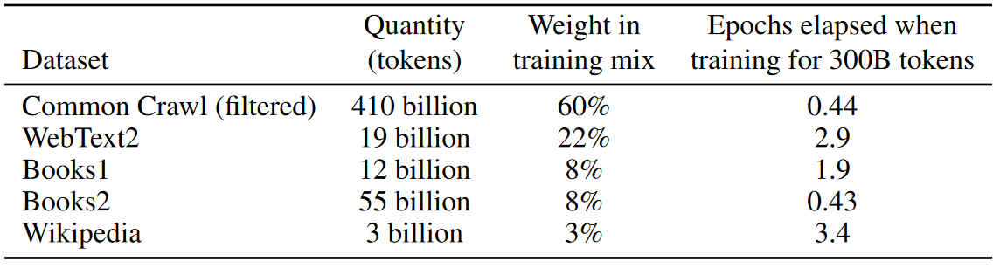
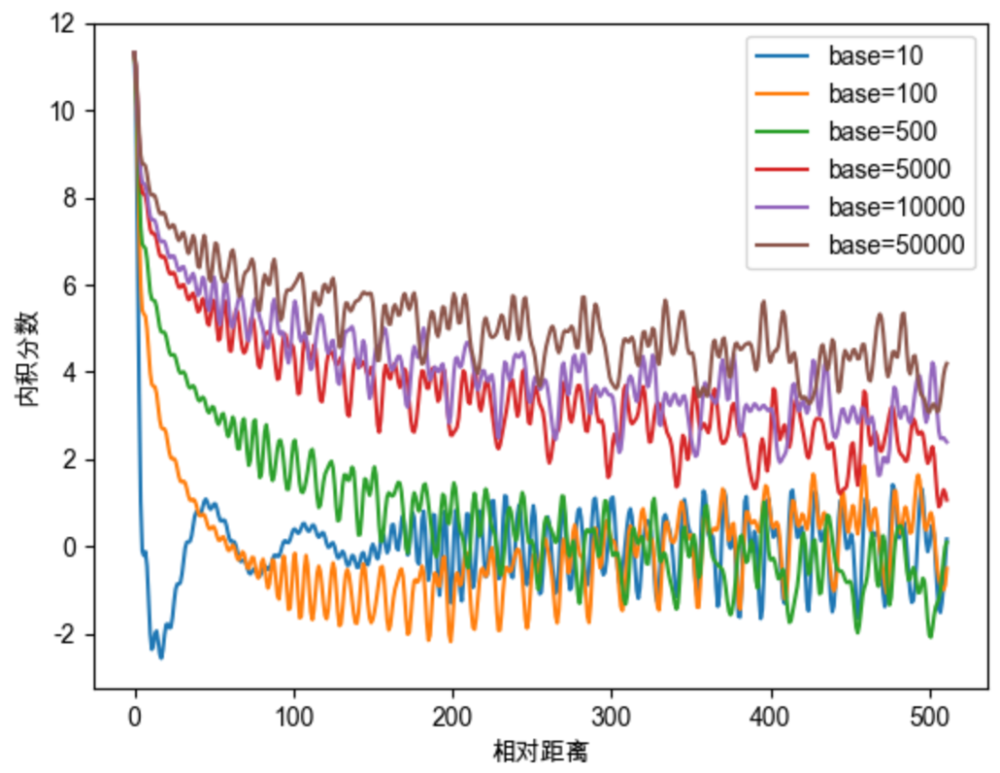

# LLM 背景
## Critical Question
> **为什么所有GPT-3复现都失败了？使用ChatGPT你应该知道这些?**：https://www.jiqizhixin.com/articles/2023-02-20-3  
* 闭源模型：GPT3，PALM；及其指令微调版本：Instruct-GPT、FLAN-PaLM
* 开源：OPT-175B，BLOOM-176B、GLM-130B；及其指令微调版本：OPT-IML、BLOOMZ
* 开源模型失败的一些猜想：
    * 语料库多样性、质量、语料库token数量
    * bfloat16 而不是 float16
    * 训练中途重启：包括改变截断梯度范数 (clip gradient norm)、学习率、改变优化器
    * 一些超参：词向量、layer normalization、激活函数、batch size 的逐渐增长

 

## 模型-数据 的 规模 
* 模型参数量
    | Model | Organization  | Date  | Size (# params)|
    | :---: | :-----------: | :---: | :-----:|
    | ELMo  | AI2 | Feb 2018 | 94M |
    | GPT   | OpenAI | Jun 2018 | 110M |
    | BERT  | Google | Oct 2018 | 340M |
    | XLM  | Facebook | Jan 2019 | 655M |
    | GPT-2  | OpenAI | Mar 2019 | 1500M |
    | RoBERTa  | Facebook | Jul 2019 | 355M |
    | Megatron-LM  | NVIDIA | Sep 2018 | 8.3B |
    |T5|	Google	|Oct 2019	|11B|
    |Turing-NLG	|Microsoft	|Feb 2020|	17B|
    |GPT-3	|OpenAI	|May 2020|	175B|
    |Megatron-Turing NLG|	Microsoft, NVIDIA|	Oct 2021|	530B|
    |Gopher	|DeepMind|	Dec 2021 |	280B|

* 千亿模型训练样本 token 数量：千亿到万亿
    * 见：Training Compute-Optimal Large Language Models

        

        
        

    * GPT-3 用了 300B token 训练数据，但总收集数据量为 500B token

        

        
        

 

## 大模型常见架构总结
* Transformer 模型结构及参数：https://zhuanlan.zhihu.com/p/107891957
* CLIP
    * Chinese CLIP：https://github.com/billjie1/Chinese-CLIP 
    * mCLIP：https://github.com/FreddeFrallan/Multilingual-CLIP 
* GPT Familty
    * GPT-1/2/3，[各代之间区别见：PDF文档](./pictures/GPTS.pdf)   
    * GPT-1 
        * 确认了单向 transformer 在 unsupervised pre-training + supervised finetuning 的范式下也可以 NLU
        * 在 9 out of 12 个下游任务上超过 SOTA
    * GPT-2 
        * 结构类似 GPT-1，但去掉了微调，而引入 `task conditioning: P(output|input, task)`
        * 相比一代，用了更大的网络（1.5B vs. 117M），更大数据（**40GB vs. 5GB**），规模大约是 10 倍
        * 在 zero-shot setting 下在 7 out of 8 数据集超过了 SOTA 
    * GPT-3
        * 见上图，175B 参数，其中 Common Crawl 有 45TB 原始数据，清洗后 **570GB**（400B BPE token），**所以千亿大模型大约 1-2 TB 高质量干净数据差不多够训练了**
    * GPT-3.5 / InstructGPT / ChatGPT
    
        > [1. **拆解追溯 GPT-3.5 各项能力的起源**](https://yaofu.notion.site/GPT-3-5-360081d91ec245f29029d37b54573756)  x
        > [2. **Model index for researchers**](https://platform.openai.com/docs/model-index-for-researchers)   
    
        code-davinci-002，text-davinci-002/003，ChatGPT 都叫 GPT-3.5，都是 code-davinci-002  的微调版本 

        

        
        

        * InstructGPT 三阶段：supervised fine-tuning on pre-trained GPT-3 --> Reward Model --> RL PPO；三阶段所用的标注的额外数据如下，总量并不大  

            

            
            

    
        * 结论：
            * code-davinci-002 的基础模型可能不是 initial GPT-3 davinci 模型，而是可能经过如图所示技术路线改造过的 
            * code-davinci-002 推理能力很强（很强的基础模型），但与人的 alignment 不够  
            text-davinci-002 alignment 能力增强了，但在很多任务上跑分变低（上下文 ICL 能力变弱）  
            text-davinci-003 加上了 RLHF，普遍的生成通常比 text-davinci-002 长，然后上下文能力有所恢复     
            ChatGPT swish
            * 1.3B 的经过 RLHF 的 InstructGPT（模型来源于 GPT-3 XL，见 GPT-3 论文 Table E1），在 labeler 评测中，就可优于原始 175B GPT-3
            * **模型规模超过阈值后的涌现能力（大约100B）**：突破 scaling law
            
* 其他系列：PaLM，GLM，LLama, BLOOM，OPT
    * GPT
        * GeLU、MHA、Absolute Embedding、Pre-LayerNorm
    * PaLM
        * FFN 用的 SwiGLU，`Swish(xW)·xV `，2层 MLP 而非 3 层
        * Parallel Layer、MQA、No bias、RoPE、Shared Vocab Embedding
    * Lamma2：吸收了 PaLM、Gopher 等模型上架构的微改变，是现被业界广泛采纳的方案（Baichuan、Yi、Mixtral）
        * MQA、Pre-RMSNorm、RoPE、No bias
        * SwishGLU FFN（3-Linear-layer）
           * 这里 **swish 也就是 siLU (Sigmoid Linear Unit)**, `SiLU = x*σ(x)`，σ 代表 `sigmoid(x) = 1/(1+e^(-x))`
           * GLU 是门控线性单元 `f(x) = x⊗σ(g(x))`，相当于相比 siLU 要多加一层 MLP
           * GeLU 是 ReLU 的一种平滑近似（GeLU可以用 fastGeLU 近似，y=x*σ(1.702x)，比 SiLU 多了个常数 1.792，见 https://arxiv.org/pdf/1606.08415）
            

            
            

    * Mixtral-7B 在 Lamma2 的基础上，结构上只加了 Sliding Window Attention
    * 其中 GLM 的训练方法特别一点：用的 Autoregressive Blank Infilling，目标是在 NLU NLG 都表现得好（这种方案未被其他模型广泛采纳）

* 趋势是：相对位置编码替代绝对位置编码，Pre-SwiGLU替代最早的GeLU，Causal-Decoder统治，AdamW+BF16混合精度，multi-query/group-query attention 

    | 模型 | 模型架构 | 注意力机制 | 激活函数 | 位置编码 | Normalization | 其他 |
    |-|-|-|-|-|-|-|  
    | GPT-3 | Causal-decoder | Multi-Head Attention | GeLU | 可学习绝对位置编码 | Pre-LayerNorm | - |
    | GPT-4 | Causal-decoder MoE | - | - | - | - | - |
    | PaLM | Causal-decoder | Multi-Query Attention | SwiGLU | 相对位置编码 RoPE | Pre-LN (每层只有一个LN) | Attention 层和 FFN 层并行；无 Bias 层；Adafactor 优化器 |  
    | Gopher 280B/Chinchilla 70B | Causal-decoder | MHA | GeLU | RoPE | Pre-RMSNorm | Gopher 用 Adam，Chinchilla 用 AdamW 优化器 |
    | Bloom | Causal-decoder | MHA | GeLU | ALiBi | Pre-LN | BF16混合精度 |
    | Falcon | Causal-decoder | MQA | GeLU | ALiBi | Pre-LN | - |
    | GLM-130B | **Prefix-Decoder** | MHA | GeGLU | RoPE | **Post-LN with Deep-Norm** | AdamW 优化器,FP16混合精度 |
    | ChatGLM2-6B | Causal-decoder | MQA | SwiGLU | RoPE | Pre-RMSNorm | - |
    | Baichuan-2 | Causal-decoder | MHA | SwiGLU | 7B-RoPE, 13B-ALiBi | Pre-RMSNorm | AdamW 优化器,BF16混合精度 |  
    | LaMMa1 | Causal-decoder | MHA | SwiGLU | RoPE | Pre-RMSNorm | AdamW 优化器,BF16混合精度 |
    | LaMMa2 | Causal-decoder | Group-Query Attention | SwiGLU | RoPE | Pre-RMSNorm | AdamW 优化器,BF16混合精度 |

 
 

# 技术细节
## 参数量、计算量、内存
### 参数量 O(12*lh^2)
* Embedding layer 参数量：`(seq_len + vocab_size) * hidden_size`
* 每层 transformer layer：`hidden_size*hidden_size*12`，和 h 是平方关系
    * Attention：`hidden_size*hidden_size*4` （QKV 3，concat 之后的 linear 1）
    * FFN：一个 hidden layer，两个权重：`hidden_size*hidden_size*4*2` 
* 所以 seq_len=4096, vocab_size=116444, hidden_size=768，12层
    * 两个 embedding layer 参数量一共 176M
    * transformer layer 参数量 81M
### 计算量
> https://zhuanlan.zhihu.com/p/624740065
* 前向：`l * (24bsh^2 + 4bs^2h) + 2bshV`，后向乘以2，如果训练中用了重计算，整体再加一个前向的flops
    * 计算 QKV：6bsh^2
    * 计算 QK^T：2bs^2d
    * 计算 V 的加权：2bs^2d
    * 计算 attention 后的线性：2bsh^2
    * 计算 FFN：8bsh^2
    * 计算词表：2bshV
    * Softmax：2bs^2
* 所以长序列 `s>h` 时，`4bs^2h` 不可忽略了
  * 非长序列场景，前向时，每 token 计算量约为参数量两倍

### 内存
训练时需要保存的信息包括：parameters，gradients，optimizer states，activations (用于BP) 

* 混合精度训练对内存的影响？
    * 混合精度时，静态内存 = 参数量*16（Bytes）
        * 参数量为 N 的模型，训练一般至少需要 16N Bytes 显存，其中模型参数 fp16、模型梯度 fp16、Adam状态（模型参数备份 fp32，momentum fp32，variance fp32），这里就 2+2+4+4+4。可以看到其中 Adam 的 optimizer states 最大（12/16），parameters 反而不大 
        * 混合精度训练 FP 和 BP 都用的 fp16，但在优化器参数更新时，用的 fp32。为了避免 fp16 的梯度下溢，要先 loss scaling，先放大 loss，计算好 fp32 的梯度后再缩小
    * 全 fp32 训练，静态内存也是 16N：优化器状态 8N，梯度和权重分别 4N。主要是提高了算力 FLOPS，然后减少了activation 这些非权重的动态显存

* 动态内存
    * 前向运行时，所需要的瞬时内存（即便用全部重计算）
    * 存储部分 Activation buffer 用于反传，关于大小可以参考 `Reducing Activation Recomputation in Large Transformer Models`
        * 每层的激活大小见下图，其中右图的 micro_batch_size 分别为 1,4,4,4（都是假设存储激活用的 fp16，表格中单位都是 byte）
            * 如果不进行 softmax recompute 的话，和 seq_len 成二次方，`O(s^2bh)`，对长序列、大batch很不友好
            * tensor并行 可以把一部分激活切成 t 份，但 LayerNorm，dropout 和 input activation 不能倍切分
            * sequence并行 进一步让 t 能够覆盖到所有激活，但仍然是 O(as^2bh)，a 是注意力头数量
                * `multi-head attention 中 s*s 的矩阵每个注意力头会出现一次，一共会出现 a 次；模型并行的话，每张卡需要存 a/t 个 s*s 矩阵` 
            * 经过 recompute 优化后可以变为一次方 `O(sbh)`    

                

                
                

* 但总的来说：大模型训练还是 compute-throughput-bound，memory 不是最主要的问题（非超长）
    * 100B 模型，模型和优化器参数需要 1600GB 显存；activation 需要 4800GB 的话，一共 6400GB，100张 A100 就能放下
    * LLama paper：65B模型，1.4T token，需要 100w 个 A100 hour。换算下，100B模型，1T token，100张卡，要训练 400 多天，太慢了，所以一般都是千卡起步

### 推理时的计算和访存

| 项 | 单位 | 公式 | 含义 |
|-|-|-|-|
| 权重访存量 (fp16) | Byte | `12*l*d*d*2 = 2P` | 模型参数量 `12*l*d*d`，省略了词表, layer_norm 等部分参数 |
| 推理计算量 - (Decode阶段) | Flop | `24*B*l*d*d = 2*B*P` | 每token的flops是参数量的两倍（未考虑长序列的Attention 计算量）|
| 访存量-KV缓存 (fp16) | Byte | `2*B*T*l*d*2` | 7B模型（4k维度32层），4k长度，KV-Cache占用 2GB|

其中，T 是序列长度，P 是参数量，d 是隐维度，B 是 bs

* 计算强度
   * Flops 计算量 `24Bld^2`   
   * fp/bf16 下，参数量访存 `24ld^2`，kv-cache访存 `4BTld`  
   * `I = 24Bld^2 / (24ld^2 + 4BTld)` ，增大 B 能增大计算强度，模型量化也能增大模型计算强度（但是设备的计算强度上限也变大了）

 
 

## 关于样本隔离
* 大模型在训练的时候，会把多个不同长度的样本拼成 2k、4k、8k 等。如果开样本隔离，会根据 
end-of-sentence token 将 mask 分成很多小下三角
    * 这会帮助真是训练的序列长度回归样本本身的真实长度
* 一些影响
    * 序列长度较短时，没有很大必要用样本隔离，也能训练：例如 GPT-3 没有做样本隔离（2k长度），但 LLama 3 用了（8k长度）
    * 关闭样本隔离对提升吞吐有帮助。flash Attention 1/2 等优化方法默认不支持开样本隔离，虽然也可以手动修改加上 https://www.zhihu.com/question/652311359/answer/3461508767 
    * 一些工作讨论，如果不开样本隔离，可能需要尽可能将相关的样本拼在一起（会影响 In Context 能力）
        * https://arxiv.org/pdf/2312.17296
* SFT 阶段
    * 默认样本隔离需要打开，以分离每条指令之间的人设
    * SFT 另外一个相比预训练的差别是，不计算 query 的 loss

 
 

## 长序列算法
绝对可学习的位置编码、相对位置编码 RoPE、ALibi、NoPE、LM-Infinite、StreamingLLM、LLM Maybe LongLM: Self-Extend LLM Context Window Without Tuning

### 绝对位置编码
只在第一层 transformer 层之前，实现是将 vocab embedding 和 positional embedding 相加

* cosine 写死，或用一个 `(hidden_size, seq_len)` 的矩阵进行学习
* 推理序列长度不能超过给定的 seq_len，否则程序直接报错

### 相对位置编码  
优势是当推理的序列长度大于训练的上下文长度时，至少在推理时程序不会报错（没有一个 `(hidden_size, seq_len)` 尺寸的 position embedding 矩阵）

* RoPE：https://zhuanlan.zhihu.com/p/662790439   
    

    
    

    * 对于每一层的 qk，分别乘一个 R 矩阵，使得注意力分数包含相对位置信息，也即注意力分数 `score(q_m, k_n) = (R_m q)^T(R_n k) = q^T R_{n-m} k`，和 `n-m` 有关（图式 4.1）
        * 实现上：对于左图矩阵的计算，可以通过右图所示 向量点乘方案 等效实现 
        * R 矩阵中参数的意义：有两个参数，token 的位置 `m` 和 旋转的角度 `θ_l`。其中 `θ_l` 包含两部分，图中的 10000 是 base，用于引入远程衰减，指数部分的 i 对应第 i 个分组
            * 关于 i：向量 q 长度为 d，会被分成 d/2 个分组。按公式，前面的分组 `l` 更小，也即频率更高。当 token 距离差相同时，前面的分组旋转的角度会更大（想象 `y=a^(-x)` 的曲线，先陡后平)  
            * 关于 base：一个理想的情况是，固定 qk，只改变 mn，`score(q_m, k_n)` 应该呈现远程衰减的特征（由于上图式 4.1 中，qk 固定了，其实只有 `R_{n-m}` 改变）  
            不同的 base 的衰减曲线见下图，可见 base 太小不太好

                

                
                

            
    * 从 `m` 和 `θ_l`出发可以产生不少外推算法，见外推方法一节

* ALibi：求出 qk 之后加对于 atention score 矩阵加一个 offset

    

    
    

### NoPE   
无位置编码，不管 token 之间距离为多少，都一样，https://arxiv.org/pdf/2305.19466.pdf    
不用位置编码也能 work，根本原因是 decoder-only transformer 用了 causal attention mask，不具有时不变性

### 基于 RoPE 的外推方法
* 基于 RoPE，ALibi 等相对位置编码。直接内插（例如将推理时 0~4096 的 position difference 压缩到 0~2048 之间），就能实现外推的效果。但均匀分配注意力显然不是最好的方式，所以出现了下面这些方案，有下面的特点：
    * 不需要 finetine，只是更改 inference 时的 attention 计算；当然有少量 finetuning 效果会很好
    * 计算的复杂度一般还是 O(n^2)，只是 LM-Infinite/StreamLLM 中一些被丢弃的 middle token 的注意力不再计算（其 KV cache 不再保留），理想情况下能减少到 O(n)

* 线性插值、NTK、YaRN 等：[详解基于调整RoPE旋转角度的大模型长度外推方法](https://mp.weixin.qq.com/s/RtI95hu-ZLxGkdGuNIkERQ)  
主要是在改变 RopE 公式中的 m 和 θ_l 
    * 线性内插：目标长度扩大 n 倍，所有的旋转弧度都减小至原来的 1/n
    * NTK-Aware Interpolation：在线性内插的基础上，将 RoPE 的 base 乘以 alpha，产生的效果是 **高频分量旋转速度降幅低、低频分量旋转速度降幅高**。其中第 0 分组的旋转弧度保持不变，最后一个分组的旋转弧度变为原来的 1/alpha
    * NTK-by-parts Interpolation：不改变高频部分，仅缩小低频部分的旋转弧度。
    * Dynamic NTK Interpolation：推理长度小于等于训练长度时，不进行插值；推理长度大于训练长度时，每多推理一个 token，就用 NTK-Aware Interpolation 重新生成一遍 Rk，Rq 等
        * 这种方法不能充分利用 kv cache。或者通过存储原始的 kv cache，外推时online计算新长度下旋转过后的 kv cache
    * YaRN：NTK-by-parts Interpolation + 通过温度系数修正注意力分布

        

        
        

### 基于更改 Attention score 的外推方法
* LM-Infinite
    * 文章基于几个关于 OOD 的观察：

        

        
        

        * 相对位置编码下，token distance 如果超过训练时所用数据，attention logits 会爆炸
        * 如果 logits 的最大值被要求强制限制在一个范围内，那么注意力的熵会很大 **（也即注意力在过长的窗口内被分散）**
        * initial token 的注意力非常重要
            * 即使没有显式位置编码，不同位置的 token 会占据特征空间中不同位置，下图蓝色/红色分别对应 initial 和 tail token
            * 潜在的原因可能是：1）initial token 在训练过程中被所有 token 可见；2）当所有 token confidence 都不是很高的情况下，会有置信度汇聚到一些 “语义上意义不大” 的 token 上，initial token 就是这种 token
                * softmax + 1 也是这个思路，让所有位置的 attention score 加起来可以小于 1，从而剩余一些 attention 到特定 token

    * 文章于是提出了一个 "梯子形" 的 mask
        * **左边一竖对应 global，右边一斜对应 local**；当超出预训练长度时，对距离进行截断，中间的一部分 token 直接扔掉 
        * 图中的 0 1 2 代表 token 之间的距离，可直接套用在 RoPE 或 ALibi 中。文中设置 `n_local = L_pretrain`，设置 `n_global` 在 10~100 之间即可
    
            

            
            

* StreamingLLM
    * 和 LM-Infinite 基本是相同的 idea，但做了更多实验验证 Attention Sink 的现象（initial several tokens）
        * 前面的层更倾向于 local attention（一斜），后面的层的注意力更倾向于 initial tokens
        * 推理时，将中间的 kv cache 按照滑窗机制扔掉（灰色的块的 kv cache 就不再保留）

            

            
            

* LLM Maybe LongLM: Self-Extend LLM Context Window Without Tuning    
    * Attention masl 矩阵中的最大距离差保持和训练时的 context window 一致，但是让 local 更稠密，而压缩距离更远的

        

        
        

### 基于 Finetuning 的方法
和上述魔改 RoPE 的方案是正交的
* LongLLaMA：通过 LoRA + Shifted Sparse Attention,降低微调时所需要占用的资源
    * 8*A100 可以跑：7B 100k，或者 70B 32k
* PoSE: Efficient Context Window Extension of LLMs via Positional Skip-wise Training
    * 不一定要用 full-length（例如8k）进行微调，用原始长度（2k）但随机进行一些拼接即可（token内容和位置编码仍来源于 8k 范围）即可

    

    
    

 
 

# Tuning 方法

## Fine-tuning
* 针对 BERT：How to Fine-Tune BERT for Text Classification?  
    * 可包含 3 stages：extensive pre-training, in-domain pre-training, in-domain finetuning 
* 针对 GPT，可以参考 OpenAI API：https://beta.openai.com/docs/guides/fine-tuning 

 

## Prompt tuning：白盒和黑盒
### Whit Box: 按时间顺序，有以下文章 

* `Prefix Tuning：Optimizing continuous prompts for generation_ACL21` ***(关注的是用 GPT/BART 做 NLG 任务)***
    * 在每一层 transformer layer 前都加一个前缀

* `P-Tuning: GPT Understands, Too` ***(NLU 任务)***
    * 提出 GPT 这种 decoder only 也可以做 NLU 任务，但由于人工模板构造不好构造，之前工作没做到
    * 提出了 `P-Tuning`，用了 pseudo prompts 和 prompt encoder；encoder 可以生成 learnable continuous prompts，但怎样 interleaved 在 input 中，还是用了一些 human design  

* `The Power of Scale for Parameter-Efficient Prompt Tuning_EMNLP21`：第一篇文章正式 ***term prompt tuning (NLU 任务)***
    * 是 Prefix Tuning 的一个简化版本：只对 input embedding 加前缀
    * 相比 P-Tuning：prompt 不经过人工设计插在 input 中了，直接 prepend 即可；另外 P-Tuning 和 model tuning 一起用以达到效果

* `P-Tuning v2: Prompt Tuning Can Be Comparable to Fine-tuning Universally Across Scales and Tasks_ACL22` ***(NLU 任务)***
    * 对 330M 大小的模型也有用（P-tuning v1 在 10B 大小模型和一些 tasks 上才能和 finetuning 可比）
    * 把 P-Tuning 的思想拓展到了每一层，把 tunable token 从 interleaving 变成了 prefix

        

        
        

* `SPoT: Better Frozen Model Adaptation through Soft Prompt Transfer_ACL22` ***(NLU 任务)***
    * 在 prompt tuning 开山之作的基础上，引入了从多个 source tasks 向 target task 进行 transfer 的设计
    * 预先训练很多个 source tasks 的 prompt，然后在 validation set 上选一个最好的，来初始化 target task 的 prompt 训练。然后根绝 prompt tokens 比对看哪个 source task 和 target task 最接近。最后再用选中的这个 source prompt 做为初始化训练，得到 target prompt
    
        

        
        

### Black Box
> 会用到一些无梯度优化，很多都来源于对一些自然现象的总结，例如遗传算法，见：  
[无梯度优化算法（上）](https://www.bilibili.com/video/BV1d5411475Y/?from=seopage&vd_source=93c3a9b0afc9334d69915ec59d8c3a87)  [无梯度优化算法（下）](https://www.bilibili.com/video/BV1uC4y1s7AQ/?vd_source=93c3a9b0afc9334d69915ec59d8c3a87)    

* Discrete
    * Black-Box Prompt Learning for Pre-trained Language Models
        * 不需要 LLM 反传梯度，用 policy gradient 算法直接优化 prompt；prompt 作为 input sentence 前缀
    * RLPROMPT: Optimizing Discrete Text Prompts with Reinforcement Learning
* Continuous
    * BBT：Black-Box Tuning for Language-Model-as-a-Service
    * BBTv2：Towards a Gradient-Free Future with Large Language Models 

 

## In-Context Learning（ICL）：提升 LLM 的 few-shot 能力
> 算是 prompt tuning 的一种：[How does in-context learning work?](http://ai.stanford.edu/blog/understanding-incontext/)  
Paper: Rethinking the Role of Demonstrations:
What Makes In-Context Learning Work?

* 方法
    * 将几对 sentence 和 label 作为 prompt（或称作 context），拼接在 input sentence 前面输入，不改变模型参数（算是 prompt engineering 的一种，也属于 black box）
    * 可以类比 few-shot learning 中的 transductive learning
* 一些 observation：
    * prompt 中的 Input-output pairing 有帮助，但不如正确的 input 重要。即便 output 变为 noise，也能相比原始模型大幅提高。这主要是因为模型与训练的时候，就见过非常多正确的 input-output pairing 了，所以 prompt 主要的目的是在 大模型 带来的大空间中，划定接下来的任务所处的语义空间。
    * output space（classes or answer choices）比较重要，例如是分类 “positive/neutral/negative”，还是分类 “tech/sports/finance”
    * 优点
        * 一个模型解决无数问题：GPT3 175B 做 in-context learning 性能约等于T5-large 770M 全数据 finetune 
    * 缺点
        * 模型对不同的 context 较为敏感，例如几个例子的顺序
        * 由于 context size 的限制（例如 2048 个字符），主要用于 NLU 分类任务，NLG 任务应用较少
        * few-shot 下的性能饱和问题，即随着 training examples 的数量的增加 (一般是 16 或者 32 左右)，in-context learning 的性能不再提升

### CoT 相关
> CoT Paper List：https://github.com/Timothyxxx/Chain-of-ThoughtsPapers   
> 解读：https://zhuanlan.zhihu.com/p/670193167 

* Chain-of-Thought Prompt（CoT）  
    * 上面的 ICL 在一些需要逻辑推理的任务上表现很差。所以考虑对任务进行拆分，在 prompt 中就给出一些 QA 的例子，并且这些例子中就包含一些推理的步骤（few-shot CoT）  

    * 但实验结果上，CoT 对 10B 参数量以下的模型不太有用

        

        
        

* Automatic Prompting
    * `Large Language Models Are Human-Level Prompt Engineers`：发现了比 `让我们一步一步思考` 更好的提示词，用 log probability 作为衡量，越大的 prompt 认为越好

        

        
        

* 上面解决了 few shot 问题，但对于 zero shot 怎么办呢？ 
    
    可以参考 Paper：[Large Language Models are Zero-Shot Reasoners](https://arxiv.org/pdf/2205.11916.pdf)  

    原理是用 pipeline 诱导出一些思考过程，“Let's think step by step” 会让 LLM 尽可能生成一些思考过程，然后再将生成的 rationale 和 question 拼在一起，重新配合一个 answer 指向的 prompt 如 “The answer is ” 来激励模型生成答案
        
    

    
    

* 怎么样解决更困难的问题呢？ 
    > [Paper: Least-to-Most Prompting Enables Complex Reasoning in Large Language Models](https://arxiv.org/pdf/2205.10625.pdf)  

    * 把一个困难的问题，分两个阶段解决  
        * 第一个阶段进行 problem reduction  
            * 用一些模板，例如 `To solve {problem}, we need to {XXX}` 等
            * 该阶段可以用上文的 CoT 
        * 第二个阶段做 problem solving  
            * 把 CoT 的输出作为输入    

            

            
            

* 更进一步：引入 self-consistency
    * `Self-Consistency Improves Chain of Thought Reasoning in Language Models`: 思想是通过小样本链式思考生成多个不同的推理路径，并利用生成结果选择最一致的答案 

### XoT、Reflection 系列
https://grave-agenda-fa5.notion.site/Agent-12d8f63b07dc452db5ea284218df651c?pvs=4 

 

## Instruction Tuning / RLHF
* 通过自然语言的形式，把预训练模型在多个已知任务上进行微调，然后再在某个 **新任务** 上进行 zero-shot 推理。所以主要是解决 **cross-task** 问题，其中微调是要模型学会理解指令，指令很大程度上有共通之处，这也是能 zero-shot 的缘由
    * FLAN: Finetuned Language Models Are Zero-Shot Learners 
    * NatInst: Cross-Task Generalization via Natural Language Crowdsourcing Instructions
    * MiltiInstruct: Improving Multi-Modal Zero-Shot Learning via Instruction Tuning  

* 引入 reward model，RL 进行模型训练 
    * WebGPT
    * InstructPT：有一个测试关于 truthfulQA

 

