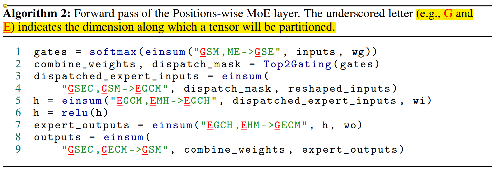

# LLM 背景
## Critical Question
> **为什么所有GPT-3复现都失败了？使用ChatGPT你应该知道这些?**：https://www.jiqizhixin.com/articles/2023-02-20-3  
* 闭源模型：GPT3，PALM；及其指令微调版本：Instruct-GPT、FLAN-PaLM
* 开源：OPT-175B，BLOOM-176B、GLM-130B；及其指令微调版本：OPT-IML、BLOOMZ
* 开源模型失败的一些猜想：
    * 语料库多样性、质量、语料库token数量
    * bfloat16 而不是 float16
    * 训练中途重启：包括改变截断梯度范数 (clip gradient norm)、学习率、改变优化器
    * 一些超参：词向量、layer normalization、激活函数、batch size 的逐渐增长

## 模型-数据 的 规模 
* 模型参数量
    | Model | Organization  | Date  | Size (# params)|
    | :---: | :-----------: | :---: | :-----:|
    | ELMo  | AI2 | Feb 2018 | 94M |
    | GPT   | OpenAI | Jun 2018 | 110M |
    | BERT  | Google | Oct 2018 | 340M |
    | XLM  | Facebook | Jan 2019 | 655M |
    | GPT-2  | OpenAI | Mar 2019 | 1500M |
    | RoBERTa  | Facebook | Jul 2019 | 355M |
    | Megatron-LM  | NVIDIA | Sep 2018 | 8.3B |
    |T5|	Google	|Oct 2019	|11B|
    |Turing-NLG	|Microsoft	|Feb 2020|	17B|
    |GPT-3	|OpenAI	|May 2020|	175B|
    |Megatron-Turing NLG|	Microsoft, NVIDIA|	Oct 2021|	530B|
    |Gopher	|DeepMind|	Dec 2021 |	280B|

* 千亿模型训练样本 token 数量：千亿到万亿
    * 见：Training Compute-Optimal Large Language Models

        

        
        

    * GPT-3 用了 300B token 训练数据，但总收集数据量为 500B token

        

        
        

## 常见模型
* Transformer 模型结构及参数：https://zhuanlan.zhihu.com/p/107891957
* CLIP
    * Chinese CLIP：https://github.com/billjie1/Chinese-CLIP 
    * mCLIP：https://github.com/FreddeFrallan/Multilingual-CLIP 
* GPT Familty
    * GPT-1/2/3，[各代之间区别见：PDF文档](./pictures/GPTS.pdf)   
    * GPT-1 
        * 确认了单向 transformer 在 unsupervised pre-training + supervised finetuning 的范式下也可以 NLU
        * 在 9 out of 12 个下游任务上超过 SOTA
    * GPT-2 
        * 结构类似 GPT-1，但去掉了微调，而引入 `task conditioning: P(output|input, task)`
        * 相比一代，用了更大的网络（1.5B vs. 117M），更大数据（**40GB vs. 5GB**），规模大约是 10 倍
        * 在 zero-shot setting 下在 7 out of 8 数据集超过了 SOTA 
    * GPT-3
        * 见上图，175B 参数，其中 Common Crawl 有 45TB 原始数据，清洗后 **570GB**（400B BPE token），**所以千亿大模型大约 1-2 TB 高质量干净数据差不多够训练了**
    * GPT-3.5 / InstructGPT / ChatGPT
    
        > [1. **拆解追溯 GPT-3.5 各项能力的起源**](https://yaofu.notion.site/GPT-3-5-360081d91ec245f29029d37b54573756)  
        > [2. **Model index for researchers**](https://platform.openai.com/docs/model-index-for-researchers)   
    
        code-davinci-002，text-davinci-002/003，ChatGPT 都叫 GPT-3.5，都是 code-davinci-002  的微调版本 

        

        
        

        * InstructGPT 三阶段：supervised fine-tuning on pre-trained GPT-3 --> Reward Model --> RL PPO；三阶段所用的标注的额外数据如下，总量并不大  

            

            
            

    
        * 结论：
            * code-davinci-002 的基础模型可能不是 initial GPT-3 davinci 模型，而是可能经过如图所示技术路线改造过的 
            * code-davinci-002 推理能力很强（很强的基础模型），但与人的 alignment 不够  
            text-davinci-002 alignment 能力增强了，但在很多任务上跑分变低（上下文 ICL 能力变弱）  
            text-davinci-003 加上了 RLHF，普遍的生成通常比 text-davinci-002 长，然后上下文能力有所恢复     
            ChatGPT 进一步接近和人对话
            * 1.3B 的经过 RLHF 的 InstructGPT（模型来源于 GPT-3 XL，见 GPT-3 论文 Table E1），在 labeler 评测中，就可优于原始 175B GPT-3
            * **模型规模超过阈值后的涌现能力（大约100B）**：突破 scaling law
* 其他系列：PaLM，GLM，LLama, BLOOM，OPT
    * 其中 GLM 的训练方法特别一点：用的 Autoregressive Blank Infilling，目标是在 NLU NLG 都表现得好

 
 

# 分布式训练
> https://mp.weixin.qq.com/s/cr-lYVvn1AQ7BN1VfzfuNg

## 训练并行方法
* 主要包含方法：数据并行、Pipeline 并行、tensor 并行、专家并行。后三者都可以笼统归为模型并行
* 带宽：NVLink > PCIE Switch >= infiniband > EtherNet    
### Tensor并行，有多种方法
* 1d 切分: Megatron-LM (NVIDIA)，并行切分 hidden dimension 了
    * FFN (两层MLP) 和 Attention Layer
        * 都有权重 AB，其中 A 竖切 B 横切，最后 all-reduce（element-wise相加），都有通信算子 f 和 g
            * f：no operation in FP (forward pass)，all-reduce in BP
            * g：all-reduce in FP, no operation in BP
        * MLP 是直接切权重，Attention 是按 head 来切：例如一共 24 个 head 切 4 份，那每张卡上计算 6 个 head

            

            
            

* 2d 切分
    * 1d 基础上加上 sequence parallel：`Reducing Activation Recomputation in Large Transformer Models`
        * tensor 并行如上如所示，权重被切分了，中间的计算结果的激活也被切分了（例如 XA_1，XA_2）；但每张卡的 input activation 都没被切分（例如 MLP/Attention 的最左边的 X）
        * 这篇文章提出的方法一： sequence 并行：不产生额外数量的通信算子，只是算子类型变了；同时会将所有 activation 都切分了 
            * g：all-gather in FP，reduce-scatter in BP
            * g'：reduce-scatter in FP, all-gather in BP

                

                
                

        * 方法二：recompute activation
            * 详见上面的 paper：softmax/dropout/attention over V 的激活占存储很大，但 FLOPs 不大，可以对它们进行重计算即可；其他 matrix 乘法相关部分就不进行重计算了，这样能减小 memory，但不增加很多计算开销

                

                
                

    * 1d 基础上再切分 batch：Optimus_An Efficient 2D Method for Training Super-Large Deep Learning
* 其他  
    * Tesseract: Parallelize the Tensor Parallelism Efficiently，可以配置成 2d 或者 3d 切分
    * 3d: Maximizing Parallelism in Distributed Training for Huge Neural Networks

### pipeline 并行
* GPipe，PipeDream 分别为 同步和异步
* GPipie 中每个 worker 都需要保存图中 mini-batch 1234 的 activation，用于 BP
* PipeDream-1F1B 可能会导致一个 mini-batch 在 forward 和 backward 的时候用的是不同的版本权重。例如下图红色箭头中 work-3 minibatch-4 的 forward 和 backward 之间被插入了 3 的 backward，使得权重改变了
    * 为了解决这个问题，Pipedream 最多需要存储 4 个版本的 weight（4 是 stage 数量）

        

        
        

        > 图中 W_i(v) indicates weights on worker i with version v  
        > 红色箭头表示了一个 minibatch-4 的 FP 和 BP

* PipeDream 之后又有两种变体 PipeDream-2BW，PipeDream-Flash；目标是减少 GPipie bubble，但同时也不想 PipeDream 一样存很多版本权重，并且尽可能同步 flash
    * Megatron-2 用的就是 PipeDream-Flash

### 数据并行
> [AI框架基础技术之深度学习中的通信优化](https://zhuanlan.zhihu.com/p/348982652)   
* 数据并行中通信的优化：从 Parameter Server 到 Ring All-Reduce
    * 前者是 torch 的 DP，总通信量随节点数 N 增加线性增加
    * 后者是 DDP，总通信时间随节点数 N 增加保持恒定
* 数据并行中的进一步优化：通信融合 commuincation fusion
    * 让 反向传播梯度的计算、梯度的传输 在时间上 overlap。但注意：结合结合通信融合时，不能全部融合成一个了，这样通信时间就不能 hidden 了
    
        

        
        

### MoE 专家并行

> Paper：GShard，Fast MoE，Faster MoE，PR-MoE，SE-MoE，Switch Transformer

* 例如：一共 24 个 experts，并行度为2。那么会有一半的 GPU 处理 12 个 experts，另外一半处理另外 12 个；如果并行度为 1，那么意味着每个 GPU 都完全包含了 24 个 experts
* MoE routing 原理：回顾一下 transformer 原理
    * 因为 Transformer 权重的作用其实是把 `d1` 维的隐变量变为 `d2` 维度的，所以 token 和 token 之间的处理是可以在时序上独立进行的（但共享权重）。Transformer 为了提高运行效率，会让多个 token 组成一个序列，然后几个序列组成 batch 一起吃进去，所以起来像是并行在执行。MoE 要做的是把这一组组的序列先合并再按 token 拆开，分给不同的专家（所以要 reshard）
* MoE routing 流程
    * input tensor 大小：(G, S, M)，分别为：group 的数量、每个 group 里面序列长度（或 token 的数量）、每个 token 的隐变量尺寸
    * Algo2 第一行是在计算每个 token 分到每个专家上的置信度。矩阵相乘使得在 feature dimension 上吸收了（M 维度）。权重 `wg` 对应的 `ME` 没下划线，表示没有在设备上进行 shard。而 `G` 代表不同的 group，代表在设备上 sharded，也即不同设备分别计算了自己拿到的 batch 要分给哪些专家  
    * Algo2 第三/四行 见 第二张图：input 要先和 mask 做爱因斯坦求和，再 all-to-all reshard
        * 其中爱因斯坦求和时，因为不同机器按照 group 切分数据，`(GSEC, GSM)` 在每个机器上其实是 `(SEC，SM)`；然后因为 `S` 这个维度代表一个 group 中 token 的数量，而上面说到 token 被分配给不同 expert 了，所以 `S` 这个维度消失了，每台机器上实际在做 `(SEC，SM) -> ECM`

        * 加上跨机器这个维度，`ECM` 变为 `GECM`，然后 `E-G` 进行 `reshard` 变为 `EGCM` 

        

        
        

        

        
        

### 总结
* 一般对通信量：Tensor并行 > 数据并行 > pipeline并行
    * 其中 数据并行和 pipeline并行 的比较，见 https://www.high-flyer.cn/blog/model_parallel-2/ ，当 Transform 变宽时，pipeline 并行通信量上更占优。**但这个规则不是死的，见下文**
    * 经验：
        * **首先满足 tensor 并行，把最高速的 intra-server gpu 通信留给 tensor 并行**
        * 然后考虑 数据并行 / pipeline并行，其中 pipeline并行 是为了使得能够适应 GPU memory（对于超大模型）
* 例子一：如下图两个八卡 node，那么
    * node 之间做的是 pipeline并行，如果 node 数对于 pipeline 数量有富余，node 之间再做数据并行  
    * 但如下图，node 数没富余，所以 node 内部三种并行都有做：pipeline并行（GPU 01 相对于 45）、数据并行（GPU 01 相对于 23）、tensor并行（GPU 0相对于 1）

        

        
        

* 例子二：Pangu-Alpha 训练的并行方式：
    * 同一个 server 的卡之间，tensor并行
    * 一个 rack 的 server 之间，pipeline 并行
    * 不同 rack 之间，数据并行
    * PS：pangu 的训练是用带宽最小的 Cross-Rack 通信做了数据并行，看起来和上面说的 `数据并行通信量一般 > pipeline并行` 矛盾了
        
        * **Paper 里面做了解释，数据并行的通信 可以和BP 在时间上重叠，所以不紧要，怎么方便怎么来**：Deploying data parallelism and optimizer parallelism across racks is due to that the induced communication operators are not on the critical path of the training iteration, which could be fused and overlapped with backward propagation to improve the performance
    
        

        
        

 

## fp32/fp16/bf16、混合精度、训练溢出
> [好文：如何解决混合精度训练大模型的局限性问题](https://www.51cto.com/article/746136.html)  

### fp32/fp16/bf16
* fp32/fp16 绝大多数硬件都支持，所以可以用混合精度训练提高吞吐；但 bf16/tf32 只有新的硬件才支持，V100/昇腾910等不支持
* bf16 具有和 fp32 相同的 range，但精度（也就是两个最小单位之间的间隔）降低
    * bf16/fp32 进行混合精度训练，可以减少溢出几率
    * 对于大型 transformer，bf16 损失的精度被证明不怎么影响收敛
* tf32 是 A100 中引入的新格式，用于替代 fp32，也即可以全程 tf32 训练或 bf16/tf32 混合训练

### 混合精度训练的要点
bf16/fp32 混合训练因为两种格式在 range 对齐了，并且 bf16 比 fp16 range 更大，所以比 fp16/fp32 混合训练稳定性更高。但 fp16/fp32 混合训练 GPT-3 大模型也是完全可行的，只要解决可溢出问题，有以下几个要点：
   
* fp32权重备份 + loss scaling 解决下溢出问题
    * 对 loss 进行 scale：见左图
    * 对 gradient 进行 scale：见右图  
    由于链式法则的存在，对梯度做直接做 scale 也是可以的，反而更划算。这样，所有前向后向都可以全用 fp16 (activation、weight、gradient 全用 fp16)，只在进行更新的时候，才用 fp32 和 master weight 更新

        

        
        

* 跳过 NaN 的 batch 
    * dynamic loss scale (PyTorch 中采用的这种方案）  
    在一个 window 内，如果没有 NaN，loss scale 变大（例如乘2）；如果有 NaN，则降低 loss scale，并跳过 NaN 的 batch，不更新梯度
    * 或将 INF 值改为 FP16 的最大值（需要实际验证）

* 基于 Tensorcore 进行矩阵乘加：在某些模型中，fp16 矩阵乘法的过程中，需要利用 fp32 来进行矩阵乘法中间结果的累加，以减少加法过程中的舍入误差，保证精度不损失   
这也是为什么有些人说，只有 Volta 之后有 TensorCore 的 GPU (例如V100)，才能利用 fp16+混合精度来进行加速。其他 GPU 如果硬要用 fp16，只能做 fp16 的 multiply-add operation，会有较大精度损失

    

    
    

### 溢出案例分析
* 有时，当 loss scale 降为 1，然后不再上升；同时训练 loss 要么跳涨，要么停滞不下降（相当于没在训练了）    
    * 解决方案：可以改变超参，**降低lr**，或** 增大 epsilon**（但这样做会损失一部分优化器自适应学习率的能力）
    * 原因如下：
        * loss scale 不再上升：因为每个 window 中都有 Nan
        * loss 跳涨：主要来源于 Adam 的缺陷
            * Adam 相比 SGD 的优势是会根据梯度自适应学习率，但当梯度的二阶矩过小，导致分母 `v_t+ε` 在 fp16 中下溢出变为0（fp16 最小值为 5.96e-8，但 epsilon 一般设为 1e-8），反而会上溢，模型的改变量变为很大，从而导致训练不收敛

            

            
            

            * 当出现一个难度较大的 batch，在这个 batch 中出现了 NaN，这些 NaN 的梯度被跳过了。但通过这组难度较大的情况后，因为有 momentum，之后 batch 的梯度可能就一直下溢了
        * loss 停滞：可能仍然发生了很多 NaN，但 Adam 中分母 `v_t+ε` 这一项没有严重到下溢，只是因为时不时有 NaN 发生，导致 loss scale 保持为1，使得模型几乎不再更新    

* 对 softmax 改造
    > [如何防止softmax函数上溢出 (overflow) 和下溢出 (underflow)](https://www.codelast.com/%E5%8E%9F%E5%88%9B-%E5%A6%82%E4%BD%95%E9%98%B2%E6%AD%A2softmax%E5%87%BD%E6%95%B0%E4%B8%8A%E6%BA%A2%E5%87%BAoverflow%E5%92%8C%E4%B8%8B%E6%BA%A2%E5%87%BAunderflow/)

    用 f(x-max) 代替 f(x)；再加上 logsoftmax；分子避免了下溢、分母避免了上溢

    

    
    

* 如何尽可能早地发现溢出的可能？  
如上所述，当梯度下溢加上 adam，反而可能变成上溢。一般经验是，在训练前期，可以用一个 Tensor Collection Hook (TCH)，收集溢出比率，比率在 1% 以下并保持稳定而非上升趋势，后期发生溢出可能性较小

 

## 参数量、计算量、内存
### 参数量
* Embedding layer 参数量：`(seq_len + vocab_size) * hidden_size`
* 每层 transformer layer：`hidden_size*hidden_size*12`，和 h 是平方关系
    * Attention：`hidden_size*hidden_size*4` （QKV 3，concat 之后的 linear 1）
    * FFN：一个 hidden layer，两个权重：`hidden_size*hidden_size*4*2` 
* 所以 seq_len=4096, vocab_size=116444, hidden_size=768，12层
    * 两个 embedding layer 参数量一共 176M
    * transformer layer 参数量 81M

### 计算量
* FC，transformer layer 参数量 和 FLOPS 都是 h 的平方关系：可以粗略估计：参数量几倍、运算量几倍（扣除 embedding layer 后）
### 内存
训练时需要保存的信息包括：parameters，gradients，optimizer states，activations (用于BP) 
* fp6/fp32 混合精度训练时，模型和优化器参数大小：参数量为 N 的模型，训练一般至少需要 16N Bytes 显存，其中模型参数 fp16、模型梯度 fp16、Adam状态（模型参数备份 fp32，momentum fp32，variance fp32），这里就 2+2+4+4+4。可以看到其中 Adam 的 optimizer states 最大（12/16），parameters 反而不大 
    * 混合精度训练，FP 和 BP 过程都用的 fp16，但在优化器参数更新时，用的 fp32。为了避免 fp16 的梯度下溢，要先 loss scaling，先放大 loss，cast 成 fp32后再缩小

* Activation buffer，关于大小可以参考 `Reducing Activation Recomputation in Large Transformer Models`
    * 每层的激活大小见下图，其中右图的 micro_batch_size 分别为 1,4,4,4（都是假设存储激活用的 fp16，表格中单位都是 byte）
        * 如果不进行 softmax recompute 的话，和 seq_len 成二次方，`O(s^2bh)`，对长序列、大batch很不友好
        * 经过 recompute 优化后可以变为一次方 `O(sbh)`    

            

            
            

* 但总的来说：大模型训练还是 compute-throughput-bound，memory 不是最主要的问题
    * 100B 模型，模型和优化器参数需要 1600GB 显存；activation 需要 4800GB 的话，一共 6400GB，100张 A100 就能放下
    * LLama paper：65B模型，1.4T token，需要 100w 个 A100 hour。换算下，100B模型，1T token，100张卡，要训练 400 多天，太慢了，所以一般都是千卡起步

 

## 位置编码
> https://zhuanlan.zhihu.com/p/525552086  
* 绝对位置编码
    * Sinusoidal 位置编码
    * 可学习的位置编码：weight 尺寸是 `（seq_len, hidden_size）`
    * 基于已有固定长度位置编码的层次分解
        * 其实是利用现有位置编码做线性组合 https://kexue.fm/archives/7947 
        * 仍需要 finetuning，效果损失可能较大
* 相对位置编码：推理长度可以大于训练长度，大多不加在 embedding 中，而加在 attention 矩阵上了
    * Rotary Position Embeddings
    * XLNet：Transformer-XL   
    * ALibi (ICLR22)：简单地在 attention 矩阵上加一个相对位置差距的矩阵，效果好于上述方法

 

## 分布式深度学习框架
### Overview  
* 分布式深度学习框架网络传输的抽象层次：[对抗软件系统复杂性：恰当分层，不多不少](https://mp.weixin.qq.com/s?__biz=MzU5ODY2MTk3Nw==&mid=2247485568&idx=1&sn=22dc2fdec7d30bcc9d50b8ed0d49acec&chksm=fe4186b6c9360fa0fd66c979af18d8e7afa2e7dd4de4561638294d11856bd7ea9501bb2cfb17&scene=21#wechat_redirect) 
    

    
    

    
    * Ray 基于 gRPC，不支持高性能网络 RDMA 协议，有性能瓶颈
    * TensorFlow 的最初设计里，无论是控制还是数据传输都基于 gRPC 实现，也不能调用 RDMA，有性能瓶颈（后来有了 networking TF 插件改善了）

* Communication Primitives 通信原语：Broadcast, Scatter, Gather, Reduce, Reduce-Scatter, All-gather, All-reduce, All-scatter, All-to-All (MoE 中数据 dispatch 用到), Barrier
    * [这个链接](https://downey.io/notes/omscs/cse6220/distributed-memory-model-mpi-collectives/) 和 GShard 论文有解释
    * 对偶算子：gather/reduce，all-gather/scatter-reduce 

### Megatron
> https://github.com/nvidia/megatron-lm 

* 运行步骤
    * Docker pull 和 执行
    * 数据处理，改造 Tokenizer
    * Megatron 自带 Tokenizer：BertWordPieceLowerCase, BertWordPieceCase, GPT2BPETokenizer
    * Compiling dataset index
    * Compiling (only the first time for running) and loading fused kernels
* Megatron 代码学习
    * Tokenizer 及并行原理：https://zhuanlan.zhihu.com/p/388830967 
    * 代码：https://zhuanlan.zhihu.com/p/470279673 
* Megatron 中 FFN 实现：https://zhuanlan.zhihu.com/p/366906920 
    * 第一个线性层：input broadcast 到每一个设备上，权重竖切，`XW = X[W1, W2] = [XW1, XW2]`
    * 第二个线性层：横切（结果需要 all-reduce 相加）
* 版本
    * 第一代：Megatron-LM: Training Multi-Billion Parameter Language Models Using Model Parallelism，是 **tensor 并行 + 数据并行**
    * 第二代：Efficient Large-Scale Language Model Training on GPU Clusters
Using Megatron-LM，**在第一代基础上，加上了 pipeline 并行（用的 PipeDream-Flush）**

### Deepspeed 

* Zero 

    * 所以 ZeRO 提出：不用每个数据并行的节点上都存上所有层的相关信息；activation 的存储也可以 re-compute 省掉

    * 通俗易懂的讲解：**[ZeRO & DeepSpeed: New system optimizations enable training models with over 100 billion parameters](https://www.microsoft.com/en-us/research/blog/zero-deepspeed-new-system-optimizations-enable-training-models-with-over-100-billion-parameters/)**
* DeepSpeed 的本质：略微降低的效率去节省显存
    * DeepSpeed 核心是 `ZeRO`，本质上是一种 “节省显存” 的 **数据并行**，即：在数据并行下如何以更少的机器去跑更大的模型。DeepSpeed 假设了单层参数量可以在单张显卡上放得下，如果不满足这个假设，那么仍然需要使用 tensor并行，DeepSpeed 的 tensor并行是通过调用 Megatron 来实现的
    * 根据 NVIDIA 最新的那篇论文（链接：https://arxiv.org/abs/2104.04473 )，Megatron 在大规模训练的效率是超过 DeepSpeed 不少的
    * DeepSpeed 的论文一直强调：可以用更少机器训练更大的模型，但没有突出过在效率上的优势。DeepSpeed 后来又出了一篇论文：ZeRO-Infinity（链接：https://arxiv.org/abs/2104.07857 ），当单层参数量在单张显卡上放不下的时候，它通过对这一层算子切片，一片一片来执行，使得单卡也能跑起来一个巨大的层，可以理解成一种 “时间” 轴上展开的模型并行

### Megatron-Deepspeed 
> https://github.com/microsoft/Megatron-DeepSpeed  

* DeepSpeed version of NVIDIA's Megatron-LM that adds additional support for several features such as MoE model training, Curriculum Learning, 3D Parallelism, and others， 
Tensor 并行还是调用的 Deepspeed  
* **一般经验：借鉴 deepspeed 的写法，然后作为 extension 加在 Megatron-LM 上**

### PyTorch / Mindspore 框架内实现的并行训练
* PyTorch 
    * Tensor Parallelism：Megatron 已经实现了
    * Pipeline 并行：[官方 Pipeline Parallelism API](https://pytorch.org/docs/stable/pipeline.html)，基于 touchgpipe
    * Data Parallelism
        * 之前的 DP/DDP
        * 和 V1.11 推出的 [PyTorch Fully Sharded Data Parallel (FSDP)](https://pytorch.org/blog/introducing-pytorch-fully-sharded-data-parallel-api/)，框架自身实现了 DeepSpeed ZeRO 的功能

* [Mindspore：Distributed Training Design](https://www.mindspore.cn/doc/note/en/r1.1/design/mindspore/distributed_training_design.html) 
    * 包含三种：auto、semi-auto、hybrid
    * semi-auto 是指定了切分方式的，就按指定的来，没指定的就框架 auto
        * 例如一个 BN 接一个 MatMul，分别是数据并行、模型并行。那中间会存在张量重排，会用到 allgather + concat。Mindspore 会自动取搜索出这个通信策略
    * hybrid 是全手动写切分逻辑：https://www.mindspore.cn/tutorial/training/en/r1.1/advanced_use/save_load_model_hybrid_parallel.html 

 
 

# LLM Tuning 方法

## Fine-tuning
* 针对 BERT：How to Fine-Tune BERT for Text Classification?  
    * 可包含 3 stages：extensive pre-training, in-domain pre-training, in-domain finetuning 
* 针对 GPT，可以参考 OpenAI API：https://beta.openai.com/docs/guides/fine-tuning 

 

## Prompt tuning：白盒和黑盒
### Whit Box: 按时间顺序，有以下文章 

* `Prefix Tuning：Optimizing continuous prompts for generation_ACL21` ***(关注的是用 GPT/BART 做 NLG 任务)***
    * 在每一层 transformer layer 前都加一个前缀

* `P-Tuning: GPT Understands, Too` ***(NLU 任务)***
    * 提出 GPT 这种 decoder only 也可以做 NLU 任务，但由于人工模板构造不好构造，之前工作没做到
    * 提出了 `P-Tuning`，用了 pseudo prompts 和 prompt encoder；encoder 可以生成 learnable continuous prompts，但怎样 interleaved 在 input 中，还是用了一些 human design  

* `The Power of Scale for Parameter-Efficient Prompt Tuning_EMNLP21`：第一篇文章正式 ***term prompt tuning (NLU 任务)***
    * 是 Prefix Tuning 的一个简化版本：只对 input embedding 加前缀
    * 相比 P-Tuning：prompt 不经过人工设计插在 input 中了，直接 prepend 即可；另外 P-Tuning 和 model tuning 一起用以达到效果

* `P-Tuning v2: Prompt Tuning Can Be Comparable to Fine-tuning Universally Across Scales and Tasks_ACL22` ***(NLU 任务)***
    * 对 330M 大小的模型也有用（P-tuning v1 在 10B 大小模型和一些 tasks 上才能和 finetuning 可比）
    * 把 P-Tuning 的思想拓展到了每一层，把 tunable token 从 interleaving 变成了 prefix

        

        
        

* `SPoT: Better Frozen Model Adaptation through Soft Prompt Transfer_ACL22` ***(NLU 任务)***
    * 在 prompt tuning 开山之作的基础上，引入了从多个 source tasks 向 target task 进行 transfer 的设计
    * 预先训练很多个 source tasks 的 prompt，然后在 validation set 上选一个最好的，来初始化 target task 的 prompt 训练。然后根绝 prompt tokens 比对看哪个 source task 和 target task 最接近。最后再用选中的这个 source prompt 做为初始化训练，得到 target prompt
    
        

        
        

 

### Black Box
> 会用到一些无梯度优化，很多都来源于对一些自然现象的总结，例如遗传算法，见：  
[无梯度优化算法（上）](https://www.bilibili.com/video/BV1d5411475Y/?from=seopage&vd_source=93c3a9b0afc9334d69915ec59d8c3a87)  [无梯度优化算法（下）](https://www.bilibili.com/video/BV1uC4y1s7AQ/?vd_source=93c3a9b0afc9334d69915ec59d8c3a87)    

* Discrete
    * Black-Box Prompt Learning for Pre-trained Language Models
        * 不需要 LLM 反传梯度，用 policy gradient 算法直接优化 prompt；prompt 作为 input sentence 前缀
    * RLPROMPT: Optimizing Discrete Text Prompts with Reinforcement Learning
* Continuous
    * BBT：Black-Box Tuning for Language-Model-as-a-Service
    * BBTv2：Towards a Gradient-Free Future with Large Language Models 

 

## In-Context Learning（ICL）：提升 LLM 的 few-shot 能力
> 算是 prompt tuning 的一种：[How does in-context learning work?](http://ai.stanford.edu/blog/understanding-incontext/)  
Paper: Rethinking the Role of Demonstrations:
What Makes In-Context Learning Work?

* 方法
    * 将几对 sentence 和 label 作为 prompt（或称作 context），拼接在 input sentence 前面输入，不改变模型参数（算是 prompt engineering 的一种，也属于 black box）
    * 可以类比 few-shot learning 中的 transductive learning
* 一些 observation：
    * prompt 中的 Input-output pairing 有帮助，但不如正确的 input 重要。即便 output 变为 noise，也能相比原始模型大幅提高。这主要是因为模型与训练的时候，就见过非常多正确的 input-output pairing 了，所以 prompt 主要的目的是在 大模型 带来的大空间中，划定接下来的任务所处的语义空间。
    * output space（classes or answer choices）比较重要，例如是分类 “positive/neutral/negative”，还是分类 “tech/sports/finance”
    * 优点
        * 一个模型解决无数问题：GPT3 175B 做 in-context learning 性能约等于T5-large 770M 全数据 finetune 
    * 缺点
        * 模型对不同的 context 较为敏感，例如几个例子的顺序
        * 由于 context size 的限制（例如 2048 个字符），主要用于 NLU 分类任务，NLG 任务应用较少
        * few-shot 下的性能饱和问题，即随着 training examples 的数量的增加 (一般是 16 或者 32 左右)，in-context learning 的性能不再提升

 

## CoT：提升 LLM 的推理能力
> CoT Paper List：https://github.com/Timothyxxx/Chain-of-ThoughtsPapers   
> 解读：https://zhuanlan.zhihu.com/p/589087074   

* Chain-of-Thought Prompt（CoT）  
    * 上面的 ICL 在一些需要逻辑推理的任务上表现很差。所以考虑对任务进行拆分，在 prompt 中就给出一些 QA 的例子，并且这些例子中就包含一些推理的步骤（few-shot CoT）  

    * 但实验结果上，CoT 对 10B 参数量以下的模型不太有用

        

        
        

* Automatic Prompting
    * `Large Language Models Are Human-Level Prompt Engineers`：发现了比 `让我们一步一步思考` 更好的提示词，用 log probability 作为衡量，越大的 prompt 认为越好

        

        
        

* 上面解决了 few shot 问题，但对于 zero shot 怎么办呢？ 可以参考 Paper：[Large Language Models are Zero-Shot Reasoners](https://arxiv.org/pdf/2205.11916.pdf)  

    原理是用 pipeline 诱导出一些思考过程，“Let's think step by step” 会让 LLM 尽可能生成一些思考过程，然后再将生成的 rationale 和 question 拼在一起，重新配合一个 answer 指向的 prompt 如 “The answer is ” 来激励模型生成答案
    
    

    
    

 

* 怎么样解决更困难的问题呢？ 
    > [Paper: Least-to-Most Prompting Enables Complex Reasoning in Large Language Models](https://arxiv.org/pdf/2205.10625.pdf)  

    * 把一个困难的问题，分两个阶段解决  
        * 第一个阶段进行 problem reduction  
            * 用一些模板，例如 `To solve {problem}, we need to {XXX}` 等
            * 该阶段可以用上文的 CoT 
        * 第二个阶段做 problem solving  
            * 把 CoT 的输出作为输入    

                

                
                

* 引入 self-consistency
    * `Self-Consistency Improves Chain of Thought Reasoning in Language Models`: 思想是通过小样本链式思考生成多个不同的推理路径，并利用生成结果选择最一致的答案 

 

## Instruction Tuning / RLHF
* 通过自然语言的形式，把预训练模型在多个已知任务上进行微调，然后再在某个 **新任务** 上进行 zero-shot 推理。所以主要是解决 **cross-task** 问题，其中微调是要模型学会理解指令，指令很大程度上有共通之处，这也是能 zero-shot 的缘由
    * FLAN: Finetuned Language Models Are Zero-Shot Learners 
    * NatInst: Cross-Task Generalization via Natural Language Crowdsourcing Instructions
    * MiltiInstruct: Improving Multi-Modal Zero-Shot Learning via Instruction Tuning  

* 引入 reward model，RL 进行模型训练 
    * WebGPT
    * InstructPT：有一个测试关于 truthfulQA

 

