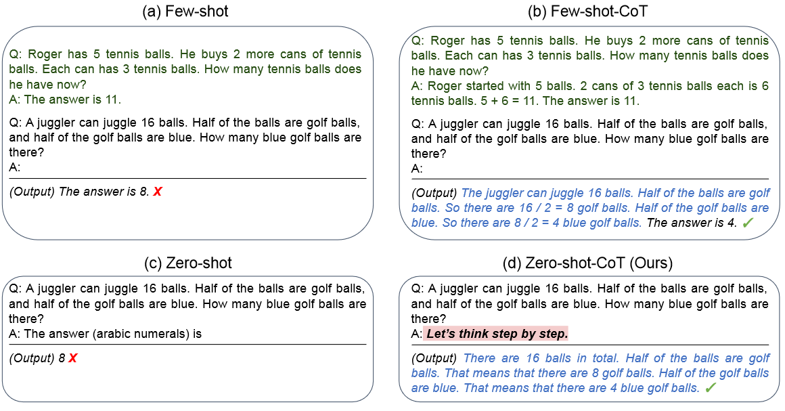

# 模型
* GPT 
    * [各代之间区别见 PDF 文档](./pictures/GPTS.pdf)    
* CLIP
    * Chinese CLIP：https://github.com/billjie1/Chinese-CLIP 
    * mCLIP：https://github.com/FreddeFrallan/Multilingual-CLIP 

 

# LLM Tuning 方法

## Fine-tuning
* 针对 BERT：How to Fine-Tune BERT for Text Classification?  
    * 可包含 3 stages：extensive pre-training, in-domain pre-training, in-domain finetuning 
* 针对 GPT，可以参考 OpenAI API：https://beta.openai.com/docs/guides/fine-tuning 

 

## Prompt tuning
### Whit Box: 时间顺序，有以下文章 

* `Prefix Tuning：Optimizing continuous prompts for generation_ACL21` ***(关注的是用 GPT/BART 做 NLG 任务)***
    * 在每一层 transformer layer 前都加一个前缀

* `P-Tuning: GPT Understands, Too` ***(NLU 任务)***
    * 提出 GPT 这种 decoder only 也可以做 NLU 任务，但之前人工模板构造不够好
    * 提出了 `P-Tuning`，用了 pseudo prompts 和 prompt encoder。encoder 可以生成 learnable continuous prompts，但怎样 interleaved 在 input 中，还是用了一些 human design  

* `The Power of Scale for Parameter-Efficient Prompt Tuning_EMNLP21`：第一篇文章正式 ***term prompt tuning (NLU 任务)***
    * 是 Prefix Tuning 的一个简化版本：只对 input embedding 加前缀
    * 相比 P-Tuning：prompt 不经过人工设计插在 input 中了，直接 prepend 即可；另外 P-Tuning 和 model tuning 一起用以达到效果

* `P-Tuning v2: Prompt Tuning Can Be Comparable to Fine-tuning Universally Across Scales and Tasks_ACL22` ***(NLU 任务)***
    * 把 P-Tuning 的思想拓展到了每一层
    * 把 tunable token 从 interleaving 变成了 prefix

        

        
        

* `SPoT: Better Frozen Model Adaptation through Soft Prompt Transfer_ACL22` ***(NLU 任务)***
    * 在 prompt tuning 开山之作的基础上，引入了从多个 source tasks 向 target task 进行 transfer 的设计
    * 预先训练很多个 source tasks 的 prompt，然后在 validation set 上选一个最好的，来初始化 target task 的 prompt 训练。然后根绝 prompt tokens 比对看哪个 source task 和 target task 最接近。最后再用选中的这个 source prompt 做为初始化训练，得到 target prompt
    
        

        
        

 

### Black Box
> 会用到一些无梯度优化，很多都来源于对一些自然现象的总结，例如遗传算法，见：  
[无梯度优化算法（上）](https://www.bilibili.com/video/BV1d5411475Y/?from=seopage&vd_source=93c3a9b0afc9334d69915ec59d8c3a87)  [无梯度优化算法（下）](https://www.bilibili.com/video/BV1uC4y1s7AQ/?vd_source=93c3a9b0afc9334d69915ec59d8c3a87)    

* Black-Box Prompt Learning for Pre-trained Language Models
    * 不需要 LLM 反传梯度，用 policy gradient 算法直接优化 prompt；prompt 作为 input sentence 前缀
* BBT：Black-Box Tuning for Language-Model-as-a-Service
* BBTv2：Towards a Gradient-Free Future with Large Language Models 

 

### LLM 的 few-shot 能力：In-Context Learning（ICL）
> [How does in-context learning work?](http://ai.stanford.edu/blog/understanding-incontext/)  
Paper: Rethinking the Role of Demonstrations:
What Makes In-Context Learning Work?

* 方法
    * 将几对 sentence 和 label 作为 prompt（或称作 context），拼接在 input sentence 前面输入，不改变模型参数（算是 prompt engineering 的一种，也属于 black box）
    * 可以类比 few-shot learning 中的 transductive learning
* 一些 observation：
    * prompt 中的 Input-output pairing 有帮助，但不如正确的 input 重要。即便 output 变为 noise，也能相比原始模型大幅提高。这主要是因为模型与训练的时候，就见过非常多正确的 input-output pairing 了，所以 prompt 主要的目的是在 大模型 带来的大空间中，划定接下来的任务所处的语义空间。
    * output space（classes or answer choices）比较重要，例如是分类 “positive/neutral/negative”，还是分类 “tech/sports/finance”
    * 优点
        * 一个模型解决无数问题：GPT3 175B 做 in-context learning 性能约等于T5-large 770M 全数据 finetune 
    * 缺点
        * 模型对不同的 context 较为敏感，例如几个例子的顺序
        * 由于 context size 的限制（例如 2048 个字符），主要用于 NLU 分类任务，NLG 任务应用较少
        * few-shot 下的性能饱和问题，即随着 training examples 的数量的增加 (一般是 16 或者 32 左右)，in-context learning 的性能不再提升

 

## 提升 LLM 的推理能力
> CoT Paper List：https://github.com/Timothyxxx/Chain-of-ThoughtsPapers   
> 解读：https://zhuanlan.zhihu.com/p/589087074   

* Chain-of-Thought Prompt（CoT）  
    * 上面的 ICL 在一些需要逻辑推理的任务上表现很差。所以考虑对任务进行拆分，在 prompt 中就给出一些 QA 的例子，并且这些例子中就包含一些推理的步骤（few-shot CoT）  

    * 但实验结果上，CoT 对 10B 参数量以下的模型不太有用

    

    
    

* 上面解决了 few shot 问题，但对于 zero shot 怎么办呢？ 可以参考 Paper：[Large Language Models are Zero-Shot Reasoners](https://arxiv.org/pdf/2205.11916.pdf)  

    原理是用 pipeline 诱导出一些思考过程，“Let's think step by step” 会让 LLM 尽可能生成一些思考过程，然后再将生成的 rationale 和 question 拼在一起，重新配合一个 answer 指向的 prompt 如 “The answer is ” 来激励模型生成答案
    

    
    

 

* 怎么样解决更困难的问题呢？ 
    > [Paper: Least-to-Most Prompting Enables Complex Reasoning in Large Language Models](https://arxiv.org/pdf/2205.10625.pdf)  

    * 把一个困难的问题，分两个阶段解决  
        * 第一个阶段进行 problem reduction  
            * 用一些模板，例如 `To solve {problem}, we need to {XXX}` 等
            * 该阶段可以用上文的 CoT 
        * 第二个阶段做 problem solving  

            * 把 CoT 的输出作为输入    

        

        
        

 

## Instruction Tuning / RLHF
* 仍然在预训练语言模型的基础上，先在多个已知任务上进行微调（通过自然语言的形式），然后再推理某个新任务上进行 zero-shot
    * FLAN: Finetuned Language Models Are Zero-Shot Learners 
    * NatInst: Cross-Task Generalization via Natural Language Crowdsourcing Instructions

* 引入 reward model，RL 进行模型训练 
    * WebGPT
    * InstructPT

 
