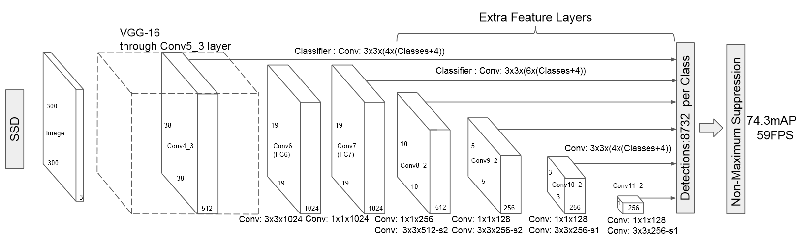
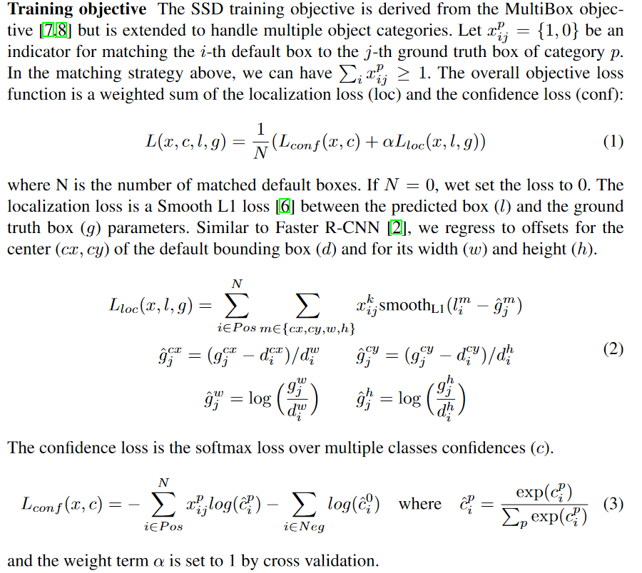
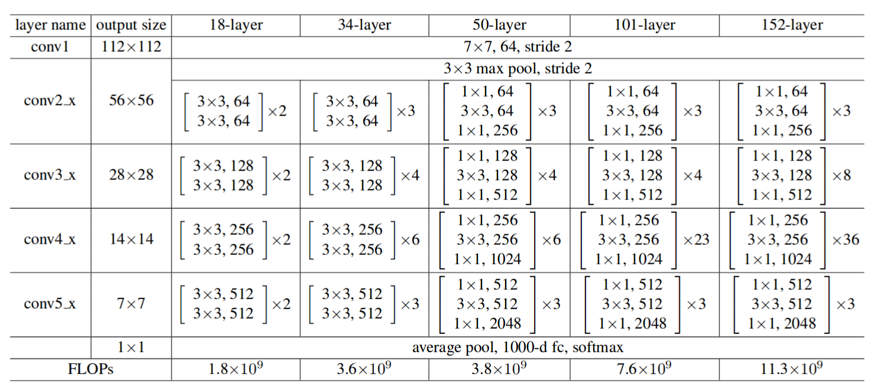
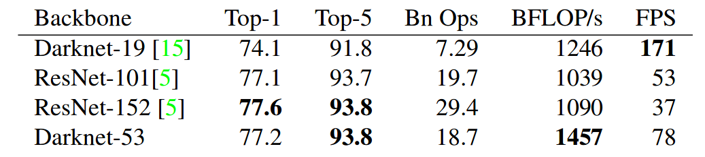

# SSD的细节
> https://zhuanlan.zhihu.com/p/33544892
## 网络结构
* SSD是全卷积网络。SSD对于一张图的输入，会产生8732个default boxes (先验框，简单理解为anchor)，其中：
`8732 = 38*38*4 + (19*19 + 10*10 + 5*5)*6 + (3*3 + 1*1)*4`
    * ssd是 8732 detections per class
    * yolov1 是 98 detections per class (7\*7的grid，每个grid预测两个)
    * yolov2 是 845 detection per class (13\*13\*5)
    * yolov3 是 10647 detection per class (13\*13\*3 + 26\*26\*3 + 52\*52\*3)
* 每个 default boxes 包含(c + 4)个浮点数信息，代表每个类别的置信度和bounding box regression所需的四个参数。  例如对于PASCAL VOC，c等于21，每个 default boxes 含有25个浮点数（20个物体类，1个背景类，4个位置参数）
    

    
    

## Training
* 正样本  
所有 default boxes 中：与某一个GT的IOU最大的 + 与某一个GT的IOU大于0.5的(若存在)

* 负样本  
除了正样本的 default boxes 都是负样本

* Loss Function
    * Xi,jp = 1 是正样本，= 0 是负样本
    * 每个Default box 都是正样本或负样本
    * 对正样本要计算位置和分类误差，对于负样本只计算分类误差 
    * 实际训练中，为了正负样本均衡，采用 hard negative mining。也即只选取部分负样本作为训练数据。具体一点，抽样时按照置信度误差进行降序排列，只选取最高的 k 个。这里就可以利用 k 来控制最后正、负样本的比例为 1 : 3

        > PS:  预测背景的置信度也即 ci0，是softmax得到的向量的第一个元素。ci0越低，confidence loss 越大，表明这个样本更hard，也即更需要被用来训练

        

            
        

## Inference 步骤
* SSD: 
    * 对于每个预测框，首先根据类别置信度确定其类别（置信度最大者）与置信度值，并过滤掉属于背景的预测框
    * 根据置信度阈值（如0.5）过滤掉阈值较低的预测框 
    * 对于留下的预测框进行解码，根据先验框得到真实的位置（解码后一般还需要做clip，防止预测框位置超出图片）
    * 根据置信度进行降序排列，然后仅保留top-k（如400）个预测框
    * 进行NMS
    
# Yolo 细节
## Training
> https://zhuanlan.zhihu.com/p/50595699  
* NMS在training时没有用到，NMS只在inference时使用
* loss = bbox loss + confidence loss + class loss
   * 假定一幅图的目标个数为20，YOLOv3的作法是为20个目标找到`13*13*3`个格子中的20格，来安放ground truth，然后把其余格子全部置0。这20个格子被称为正样本
   * `bbox loss`和`class loss`都只对正样本进行计算
   * confidence loss
      * 计算`confidence loss`时，对于正样本（即该格子有目标），计交叉熵。因为对于有目标的格子，如果预测有目标的可能性低，即输出值的`P_object`小，不正常，需要作惩罚。
      * 对于负样本（即该格子没有目标），只有`bbox`与`ground truth`的IOU小于阈值`ignore threshold`（通常为0.5），才计交叉熵。因为对于没目标的格子，如果预测出有目标的可能性高，即输出值的`P_object`高，这有可能是正常的，因为目标的中心点不在这个格子，可能在附近的格子，是否需要惩罚要视情况而定。
         * 如果IOU小于阈值，说明附近的格子没有目标，`P_object`高不正常，需要惩罚，即参与计算交叉熵。
         * 如果IOU大于阈值，说明附近的格子有目标，`P_object`高正常，不需要处罚，即计算交叉熵时忽略

## Inference
> https://blog.csdn.net/leviopku/article/details/82660381  

 * Yolov3中，对于coco数据集，最后每个anchor对应`80+4+1=85`个浮点数（80个物体类，4个位置参数，1个对于这个预测的confidence）  
 ssd也是85个，但是是：80个物体类 + 4个位置参数 + 1个背景类
 * Yolov3和ssd不一样的地方：Loss计算上，yolov3用80个logistic二分类代替ssd中的softmax，因为可能一个人既可能是people，又可能是women，也即一个box可以含有多个标签（Yolov2也是用的softmax loss）  
 * Yolov3在Inference时：
     * 先滤掉confidence小于某个阈值的box
     * 按类NMS
  

# Model Complexity Analysis
## Introduction
* Nowadays network model = backbone + head  
    * Backbone, i.e. the feature extractor: VGG, GoogleNet, ResNet, Darknet, MobileNet, ShuffeNet...  
    * Head: Regression head, classification head, segmentation head  
    * For different networks, the portion of operations between the backbone and the head could vary a lot.

* One-stage or two-stage?  
    Both one-stage and two-stage can be modified by changing either backbones or heads. See:  
    [Light-Head R-CNN: In Defense of Two-Stage Object Detector](https://arxiv.org/abs/1711.07264)  
    [Single-Shot Refinement Neural Network for Object Detection](http://openaccess.thecvf.com/content_cvpr_2018/papers/Zhang_Single-Shot_Refinement_Neural_CVPR_2018_paper.pdf)

* How to calculate FLOPs?  
   https://blog.csdn.net/shwan_ma/article/details/84924142

 

## Ops of backbones
> Classical backbones: https://zhuanlan.zhihu.com/p/49842046  
> Resnet: https://arxiv.org/pdf/1512.03385.pdf  
> Darknet: https://pjreddie.com/media/files/papers/YOLOv3.pdf  

* Resnet (Input suze 224*224) -- not consider the constant 2
    

        
    

    * Some Ops results do not consider constant 2 (summationa and multiplication need 2 operations) while others do. For example, for ResNet-101: 19.7 = 7.6*(256\*2)*2/(224^2)

* Darknet (Input size 256*256) -- consider the constant 2
    

        
    

    * Yolov2 uses Darknet-19 as backbone. Yolov3 uses Darknet-53.  
    * Models with the same FLOPS may have different fps (or BFLOP/s) on devicesdue do the discrepancy of runtime efficiency.
    * Only look at accuracy and FLOPs, Darknet-53 is just slightly better than ResNet-101.

 

## Ops of the whole model
> [Faster-RCNN (CatDet)](https://arxiv.org/pdf/1810.00434.pdf)  
[Yolo Overview](https://yongtaoge.github.io/2018/08/07/%E7%9B%AE%E6%A0%87%E6%A3%80%E6%B5%8B%EF%BC%9AYOLO-%E7%B3%BB%E5%88%97/)  
[Yolov3 Tiny Structure](http://www.tcsae.org/nygcxb/ch/reader/create_pdf.aspx?file_no=20190814)
* Faster-RCNN with different backbones
    * input size 1243*375
    * RPN predicts 3 types of anchors with 4 different scales for each loacation
    * 300 proposals after NMS
    

        
    

    

        
    

* Yolo
    

        
    

 

## Conclusion
* About backbones  
    In terms of the backbone, under the same resolution (256\*256), the FLOPS:  
    
    |Darknet53|Darknet19|ResNet50|ResNet18|ResNet10/ShuffleNet/MobileNet varients|
    |:--:|:--:|:--:|:--:|:--:|
    |18.7G|7.3G|9.7G|4.3G|could <1G|

* About the whole model

    |Model|Dataset|Totoal GFLOPS|
    |--|:--:|:--:|
    |Res50 + Faster-RCNN| KITTI, 1242*375|254.3|
    |Res18 + Faster-RCNN| KITTI, 1242*375|138.3|
    |Res10a + Faster-RCNN| KITTI, 1242*375|20.7|
    |Res10b + Faster-RCNN| KITTI, 1242*375|7.5|
    |Yolov3|coco, 416*416|65.9|
    |Yolov3 tiny|coco, 416*416|5.6|

    * Faster-RCNN(1242*375): FC layers which deal with those 300 region proposals cost most  
    --- Heavy head，see __[Light-Head R-CNN: In Defense of Two-Stage Object Detector](https://arxiv.org/abs/1711.07264)__
        * ResNet50: 77 GFLOPS
        * Others: 177 GFLOPS
    * Yolov3(416*416): backbone cost most
        * Darknet53 backbone: 49.4 GFLOPS
        * Others: 16.5 GLOPS

* About Hardware
    * Yolov3 (416\*416) on TX2, without TensorRT: 3~4 fps; with TensorRT: ~14fps  
    * Due to the memory access cost (MAC) and other costs, for TX2 (1 TFLOPS), only about 25% of theoretical FLOPS can be achieved in practical. __FLOPs could tell the upper bound of the model complexity given the desired fps.__
    * FLOPs itself might not be an accurate enough estimation of actual runtime, __[see shuffleNetv2](https://www.cnblogs.com/ansang/p/9406659.html)__.  
    Structure like shuffleNet is more suitable for CPU than GPU. https://www.zhihu.com/question/68483928/answer/267957881

