# Object Detection 一些最新的进展

## Network Neck 的结构
> https://blog.csdn.net/flyfish1986/article/details/110520667
* 基于多尺度特征提取：FPN，PANet，BiFPN，得到多尺度的 feature maps 
* PANet (Path Aggregation Network) 比 FPN 多了个 bottom-up 的结构


## SPP (spatial pyramid pooling)
> https://zhuanlan.zhihu.com/p/68027807  

* 相当于是 RoI pooling 的加强版，Faster-RCNN 中 RoI pooling 的尺寸是 7*7
* SPP 用了多个size 的 pooling kernel (例如`1*1, 3*3, 5*5, 7*7`)，然后 flatten 再 concat 到一起，作为 FC 层的输入


## Anchor-Free Object Detection
### One-stage anchor-free 检测器三个基本要素的表现形式
* classification 分类
* localization 边框定位
* quality estimation 质量估计


### FCOS: Fully Convolutional One-Stage Object Detection
> https://zhuanlan.zhihu.com/p/63868458    
* FPN：multi-head 使用了共享权重的检测头，即对FPN出来的多尺度Feature Map使用同一组卷积预测检测框，然后每一层使用一个可学习的Scale值作为系数，对预测出来的框进行缩放。
这么做的好处是能够将检测头的参数量降低为不共享权重状态下的1/5。这对于光是检测头就拥有数百通道的卷积的大模型来说非常有用。但是对于轻量化模型来说，共享权重检测头并没有很大的意义。由于移动端模型推理由CPU进行计算，共享权重并不会对推理过程进行加速，而且在检测头非常轻量的情况下，共享权重使得其检测能力进一步下降，因此还是选择每一层特征使用一组卷积比较合适

* 创新点：centerness branch，对于每一个像素都可以预测一个box，不用手动预先设定的anchor了。centerness介于0~1之间，越接近1，说明该点的位置越接近框中心
* FCOS v2 相对于 v1 的更新：https://blog.csdn.net/flyfish1986/article/details/110143467 


### Generalized Focal Loss
> https://blog.csdn.net/flyfish1986/article/details/110143467
* 将 Quality Focal Loss (QFL) 变为了 Generalized Focal Loss, 相当于从 hard label 变成了 soft label


### NanoDet: 上述各种技巧的综合
> https://zhuanlan.zhihu.com/p/306530300  
> https://github.com/RangiLyu/nanodet 
* shufflenet v2 + PAN + FCOS like Anchor-free + ATSS for target sampling + GFocalLoss 

<br><br>


# SSD的细节
> https://zhuanlan.zhihu.com/p/33544892
## 网络结构
* SSD是全卷积网络。SSD对于一张图的输入，会产生8732个default boxes (先验框，简单理解为anchor)，其中：
`8732 = 38*38*4 + (19*19 + 10*10 + 5*5)*6 + (3*3 + 1*1)*4`
    * ssd是 8732 detections per class
    * yolov1 是 98 detections per class (7\*7的grid，每个grid预测两个)
    * yolov2 是 845 detection per class (13\*13\*5)
    * yolov3 是 10647 detection per class (13\*13\*3 + 26\*26\*3 + 52\*52\*3)
* 每个 default boxes 包含(c + 4)个浮点数信息，代表每个类别的置信度和bounding box regression所需的四个参数。  例如对于PASCAL VOC，c等于21，每个 default boxes 含有25个浮点数（20个物体类，1个背景类，4个位置参数）
    <p align="center" >
    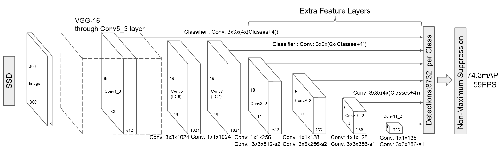
    </p>

## Training
* 正样本  
所有 default boxes 中：与某一个GT的IOU最大的 + 与某一个GT的IOU大于0.5的(若存在)

* 负样本  
除了正样本的 default boxes 都是负样本

* Loss Function
    * X<sub>i,j</sub><sup>p</sup> = 1 是正样本，= 0 是负样本
    * 每个Default box 都是正样本或负样本
    * 对正样本要计算位置和分类误差，对于负样本只计算分类误差 
    * 实际训练中，为了正负样本均衡，采用 hard negative mining。也即只选取部分负样本作为训练数据。具体一点，抽样时按照置信度误差进行降序排列，只选取最高的 k 个。这里就可以利用 k 来控制最后正、负样本的比例为 1 : 3

        > PS:  预测背景的置信度也即 c<sub>i</sub><sup>0</sup>，是softmax得到的向量的第一个元素。c<sub>i</sub><sup>0</sup>越低，confidence loss 越大，表明这个样本更hard，也即更需要被用来训练

        <p align="center" >
            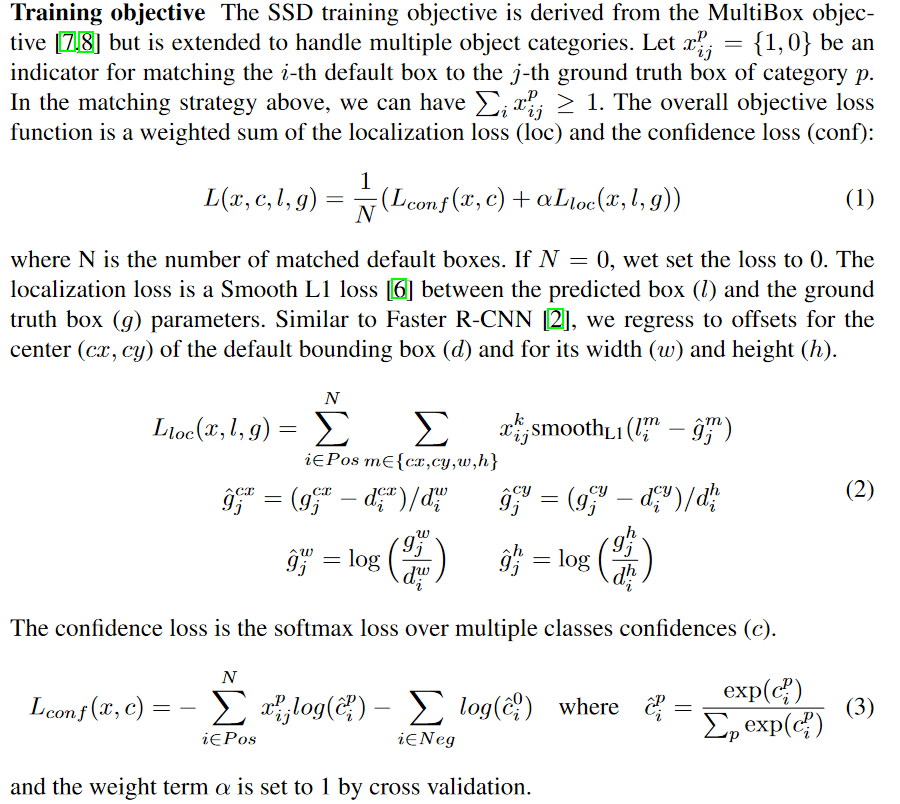
        </p>


## Inference 步骤
* SSD: 
    * 对于每个预测框，首先根据类别置信度确定其类别（置信度最大者）与置信度值，并过滤掉属于背景的预测框
    * 根据置信度阈值（如0.5）过滤掉阈值较低的预测框 
    * 对于留下的预测框进行解码，根据先验框得到真实的位置（解码后一般还需要做clip，防止预测框位置超出图片）
    * 根据置信度进行降序排列，然后仅保留top-k（如400）个预测框
    * 进行NMS
        
<br><br>

# Yolo v3 细节
## Training
> https://zhuanlan.zhihu.com/p/50595699  
* NMS在training时没有用到，NMS只在inference时使用
* loss = bbox loss + confidence loss + class loss
   * 假定一幅图的目标个数为20，YOLOv3的作法是为20个目标找到`13*13*3`个格子中的20格，来安放ground truth，然后把其余格子全部置0。这20个格子被称为正样本
   * `bbox loss`和`class loss`都只对正样本进行计算
   * confidence loss
      * 计算`confidence loss`时，对于正样本（即该格子有目标），计交叉熵。因为对于有目标的格子，如果预测有目标的可能性低，即输出值的`P_object`小，不正常，需要作惩罚。
      * 对于负样本（即该格子没有目标），只有`bbox`与`ground truth`的IOU小于阈值`ignore threshold`（通常为0.5），才计交叉熵。因为对于没目标的格子，如果预测出有目标的可能性高，即输出值的`P_object`高，这有可能是正常的，因为目标的中心点不在这个格子，可能在附近的格子，是否需要惩罚要视情况而定。
         * 如果IOU小于阈值，说明附近的格子没有目标，`P_object`高不正常，需要惩罚，即参与计算交叉熵。
         * 如果IOU大于阈值，说明附近的格子有目标，`P_object`高正常，不需要处罚，即计算交叉熵时忽略

## Inference
> https://blog.csdn.net/leviopku/article/details/82660381  

 * Yolov3中，对于coco数据集，最后每个anchor对应`80+4+1=85`个浮点数（80个物体类，4个位置参数，1个对于这个预测的confidence）  
 ssd也是85个，但是是：80个物体类 + 4个位置参数 + 1个背景类
 * Yolov3和ssd不一样的地方：Loss计算上，yolov3用c+1个logistic二分类代替ssd中的softmax，因为可能一个人既可能是people，又可能是women，也即一个box可以含有多个标签（Yolov2也是用的softmax loss）。相比较下，ssd的confidence普遍偏小，因为类别之间是互斥的，c+1个加起来为1。  
 * Yolov3在Inference时：
     * 先滤掉confidence小于某个阈值的box
     * 按类NMS

<br><br>

# Detection 的AP, mAP计算
步骤：
* NMS：对 batch 进行NMS，得到outputs
* `get_batch_statistics(outputs, targets, iou_threshold)`: 得到 batch_metrics：(true_positives, pred_scores, pred_labels)  
    * 对于 outputs 中的每一个 box: 在 targets 中找，有无 ground truth box (未与其他detected box 未匹配过的) 与其 IoU 大于 iou_threshold
    * 如果有 就是 true positive， 如果没有就是 false positive 
* 将所有 batch 的 batch_metrics concat 起来，得到 `(tp, conf, pred_cls)`
* `ap_per_class(tp, conf, pred_cls, target_cls)`: 
    * tp: True positives, e.g. array([0., 1., 1.]), 3 predicted bboxs
    * conf: Objectness value from 0-1, e.g. tensor([0.8247, 0.3907, 0.6466])  
    * pred_cls: Predicted object classes, e.g. tensor([1., 0., 18.])   
    * target_cls: True object classes, e.g. tensor([1., 2., 18.])  
    * 计算 average precision
        * 对所有框按 confidence 排序
        * 依次计算 confidence 前1,2,3,4...的框的 p, r，得到 precision-recall 曲线
        * pr 曲线的包络线的面积作为 ap


```python
def get_batch_statistics(outputs, targets, iou_threshold):
""" 
Compute true positives, predicted scores and predicted labels per sample 

Argus:
---
outputs: tensor with size (batch_size, n, 7)   
* [x1, y1, x2, y2, obj_conf, obj_score, class_pred]
* (x1, y1, x2, y2) is scaled to opt.img_size 

targets: tensor with size (m, 6)   
* [sample_i, class, x_center, y_center, w, h]  
* (x_center, y_center, w, h) is scaled to (0, 1)

Return:
---
* [[true_positives, pred_scores, pred_labels], [], ...]

"""
    batch_metrics = []
    
    # iter for each image, sample_i is the idx of the image in a batch
    for sample_i in range(len(outputs)):

        if outputs[sample_i] is None:
            continue

        output = outputs[sample_i]
        pred_boxes = output[:, :4]
        pred_scores = output[:, 4]
        pred_labels = output[:, -1]

        true_positives = np.zeros(pred_boxes.shape[0])

        annotations = targets[targets[:, 0] == sample_i][:, 1:]
        target_labels = annotations[:, 0] if len(annotations) else []
        if len(annotations):
            detected_boxes = []
            target_boxes = annotations[:, 1:]

            # iter for every detected box
            for pred_i, (pred_box, pred_label) in enumerate(zip(pred_boxes, pred_labels)):

                # If all targets are found, break
                if len(detected_boxes) == len(annotations):
                    break

                # Ignore if label is not one of the target labels
                if pred_label not in target_labels:
                    continue

                iou, box_index = bbox_iou(pred_box.unsqueeze(0), target_boxes).max(0)
                if iou >= iou_threshold and box_index not in detected_boxes:
                    true_positives[pred_i] = 1
                    detected_boxes += [box_index]
        batch_metrics.append([true_positives, pred_scores, pred_labels])
    return batch_metrics


def ap_per_class(tp, conf, pred_cls, target_cls):
    """ Compute the average precision, given the recall and precision curves.  
    Source: https://github.com/rafaelpadilla/Object-Detection-Metrics. 

    # Arguments 
        tp: True positives (list), e.g. array([0., 1., 1.]), 3 predicted bboxs
        conf: Objectness value from 0-1 (list), e.g. tensor([0.8247, 0.3907, 0.6466])  
        pred_cls: Predicted object classes (list), e.g. tensor([1., 0., 18.])   
        target_cls: True object classes (list), e.g. tensor([1., 2., 18.])  
    # Returns  
        The average precision as computed in py-faster-rcnn.
    """

    # Sort by objectness
    i = np.argsort(-conf)
    tp, conf, pred_cls = tp[i], conf[i], pred_cls[i]

    # Find unique classes
    unique_classes = np.unique(target_cls)

    # Create Precision-Recall curve and compute AP for each class
    ap, p, r = [], [], []
    for c in tqdm.tqdm(unique_classes, desc="Computing AP"):
        i = (pred_cls == c)     # only keep class c for predicted bboxs
        n_p = i.sum()  # Number of predicted objects
        n_gt = (target_cls == c).sum()  # Number of ground truth objects

        if n_p == 0 and n_gt == 0:
            continue
        elif n_p == 0 or n_gt == 0:
            ap.append(0)
            r.append(0)
            p.append(0)
        else:
            # Accumulate FPs and TPs
            fpc = (1 - tp[i]).cumsum()
            tpc = (tp[i]).cumsum()

            # Recall
            recall_curve = tpc / (n_gt + 1e-16)
            r.append(recall_curve[-1])

            # Precision
            precision_curve = tpc / (tpc + fpc)
            p.append(precision_curve[-1])

            # AP from recall-precision curve
            ap.append(compute_ap(recall_curve, precision_curve))

    # Compute F1 score (harmonic mean of precision and recall)
    p, r, ap = np.array(p), np.array(r), np.array(ap)
    f1 = 2 * p * r / (p + r + 1e-16)

    return p, r, ap, f1, unique_classes.astype("int32")


def compute_ap(recall, precision):
    """ Compute the average precision, given the recall and precision curves.
    Code originally from https://github.com/rbgirshick/py-faster-rcnn.

    # Arguments
        recall:    The recall curve (list).
        precision: The precision curve (list).
    # Returns
        The average precision as computed in py-faster-rcnn.
    """
    # correct AP calculation
    # first append sentinel values at the end
    mrec = np.concatenate(([0.0], recall, [1.0]))
    mpre = np.concatenate(([0.0], precision, [0.0]))

    # compute the precision envelope
    for i in range(mpre.size - 1, 0, -1):
        mpre[i - 1] = np.maximum(mpre[i - 1], mpre[i])

    # to calculate area under PR curve, look for points
    # where X axis (recall) changes value
    i = np.where(mrec[1:] != mrec[:-1])[0]

    # and sum (\Delta recall) * prec
    ap = np.sum((mrec[i + 1] - mrec[i]) * mpre[i + 1])
    return ap


if __name__ == "__main__": 

    ...

    sample_metrics = [] 
    labels = []

    for batch_i, (_, imgs, targets) in enumerate(dataloader)
        ...

        # Extract class labels
        labels += targets[:, 1].tolist()

        # Rescale target
        targets[:, 2:] = xywh2xyxy(targets[:, 2:])
        targets[:, 2:] *= img_size

        imgs = Variable(imgs.type(Tensor), requires_grad=False)
        with torch.no_grad():
            outputs = model(imgs)
            outputs = non_max_suppression(
                outputs, conf_thres=conf_thres, nms_thres=nms_thres
            )

        # Get sample statistics
        sample_metrics += get_batch_statistics(outputs, targets, iou_threshold=iou_thres)
        ...

    true_positives, pred_scores, pred_labels = [
        np.concatenate(x, 0) for x in list(zip(*sample_metrics))
        ]

    precision, recall, AP, f1, ap_class = ap_per_class(
        true_positives, pred_scores, pred_labels, labels
        )

```

<br><br>

# RCNN 细节
## Faster-RCNN
> https://zhuanlan.zhihu.com/p/32404424  

* RPN: 
    * RPN的输出: 从 ~20k anchors -> 2k/300 RoIs
        * anchor: ~20k，(H/16)*(W/16)*9
        * 选取为前景概率较大的 12k (for training)/6k (for inference)，得到regressed bboxes
        * 进行NMS
        * 从 NMS 之后的结果中选取 top 2k/ 300   
        For detection head training，RPN 输出2k个RoIs    
        For inference, RPN 输出 300个或100个（提速降Recall）RoIs  

    * 训练样本：从 ~20k anchors -> 256 training samples
        * 对于每一个 gt_bbox，选择和 IoU 最高的 anchor 作为正样本
        * 对于剩下的 anchor，从中选择和任意一个和 `gt_bbox IoU > 0.7` 的作为正样本，正样本的数目不超过128个
        * 随机选择和 `gt_bbox IoU < 0.3` 的 anchor 作为负样本，负样本和正样本的总数为256

    * 训练loss
        * RPN 分类损失：anchor是否为前景（二分类）
        * RPN 位置回归损失：只对正样本计算损失
* Detection head
    * 结构：  
    `7*7*512 -> 4096 -> 4096 -> (21, 84)`  
    21：20个类加背景类；84：21个类，每个类都有4个位置参数
    * 训练样本：从RPN产生的2k RoIs -> 128 RoIs
        * RoIs 和 gt_bboxes 的 IoU 大于0.5的，选择一些（比如32个）
        * 选择 RoIs 和 gt_bboxes 的IoU小于等于0（或者0.1）的，选择一些（比如 128-32=96个）作为负样本
    * 训练Loss
        * 对于分类问题，采用交叉熵损失，利用长度为21的向量  
        * 对于位置的回归损失，采用Smooth_L1Loss, 只对正样本进行计算。而且是只对正样本中的这个类别4个参数计算损失。例如：如果一个RoI是负样本，84维向量不参与L1_Loss计算；如果这个RoI是正样本，属于`label K`，那么它的第 `(K×4, K×4+1, K×4+2, K×4+3)` 这4个数参与计算损失，其余的不参与。

## R-FCN
> https://zhuanlan.zhihu.com/p/30867916

* 主要思想  
Faster-RCNN 效率低的一个主要原因是，Detection head 的 fc layers 部分要被重复300次；R-FCN 将 RoI-wise 的 fc layers 替换成简单的vote (用average pooling实现)
    <p align="center" >
        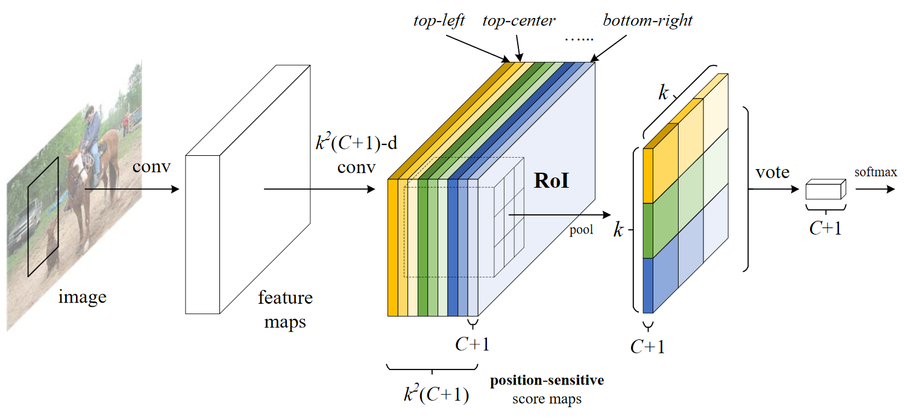
    </p>

* 细节  
    * k*k 是每个 RoI 被划分成多少个区域，也即 RoI pooling 后的尺寸；c 是类别数
    * position-sensitive feature map：`#channel  = k*k*(c+1)`
    * position-sensitive-RoI-pooling：对于每个 RoI 得到一个`k*k*(c+1)`的feature map。这里对于每个channel的pooling用的是average pooling (不同于Faster-RCNN中的RoI pooling用的是max pooling)
    * vote: 对每层的 `k*k` 进行 average pooling，得到 `1*(1+c)` 的vector，用softmax函数直接得出RoI属于每个类别的概率。
    * 上面是针对分类问题，对于边框回归问题同理，只不过 position-sensitive feature map 的 channel 数量为 `k*k*4`

## Light-head RCNN
> https://arxiv.org/pdf/1711.07264.pdf  
> https://zhuanlan.zhihu.com/p/106019344  
* 主要思想
    * Faster-RCNN 的 detection head，有两个4096的fc layers，太过沉重，但是这种 RoI-wise 的 DNN 确实效果好
    * R-FCN 利用一个 global feature map，每个 RoI 都在这个 global feature map 上裁剪，然后只用进行 average pooling。RoI-wise 的操作很快，但是 global feature map 的 channel 数量过多，并且效果不如 Faster-RCNN （简化了 RoI-wise 的操作）
    * Light-head RCNN 中实践了两种想法：
        <p align="center" >
            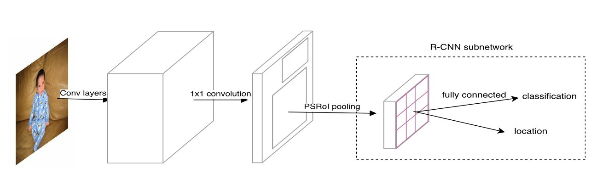
        </p>

        * Thin global feature map  
        将 R-FCN 中 `3969=81*7*7` 个 channel 减少到`490=10*7*7`个，也即每个小区域对应10个channel。Position-senstive RoI pooling之后，对于每个RoI，得到`k*k*10`的feature map，后面接全连接层：`k*k*10 -> 2048 -> (c+1, 4)`，其中`c+1`为类别，4为4个位置参数。

        * Large separable convolution  
        将 `k*k` 卷积变为 `(1*k, k*1)+(k*1, 1*k)`，其中`+`代表element-wise summation。文章中`k=15`，大的卷积核使得感受野更大，有利于RoI pooling捕获全局信息。

## Couple Net
<p align="center" >
    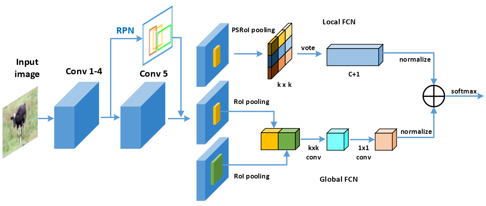
    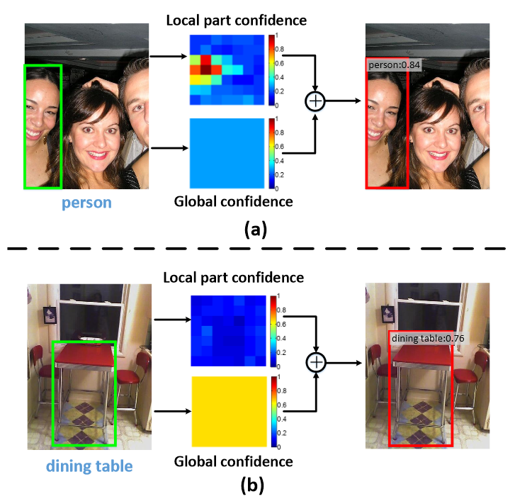
</p>

* R-FCN 中的 position-sensitive scores map 的某一层代表的是一每个位置上有多大可能出现某个类的某个部位。经过 PSRoI pooling 之后，得到的 `k*k` 的 map 每一个像素的值代表：RoI的相应部位上（例如top-left）有多大可能出现某个类物体的相应部位（例如top-left）
* Faster-RCNN 用的 RoI pooling 或 SPP (spatial pyramid pooling) 利用到了整个 RoI 的全局信息
* Couple Net 同时融合了局部信息和全局信息
    * (a)中，脸被裁剪了，所以 global confidence 分数不高；但是 local part confidence 有一些地方分数很高。此时 Local FCN 起主要作用。
    * (b)中，因为桌子腿下面空了很大部分，所以局部信息中这些部分分数很低，但是因为 bbox 很贴合桌子，global confidence 会较高。此时 global FCN 起主要作用。 

<br><br>

# 减小conv layer计算量方法
> 见 ShuffleNet v2, https://blog.csdn.net/tintinetmilou/article/details/81607721 
* group-wise + point-wise/ channel-shuffling
    * `depth-wise conv`其实是 `group-wise` 在 `group_size = 1` 时的特例
    * `point-wise conv`也即1*1卷积
* 将`k*k`的卷积层拆分成`(1*k, k*1)`的
* shuffleNet v2中的几个结论
    * conv layer输入卷积核数量和输出相等时， MAC 操作最少
    * group-wise 会增大 MAC
    * elemenet-wise flops小，但速度慢
    * 网络分支越少速度越快，并行度越好


<br><br>

# Model Complexity Analysis
## Introduction
* Nowadays network model = backbone + head  
    * Backbone, i.e. the feature extractor: VGG, GoogleNet, ResNet, Darknet, MobileNet, ShuffeNet...  
    * Head: Regression head, classification head, segmentation head  
    * For different networks, the portion of operations between the backbone and the head could vary a lot.

* One-stage or two-stage?  
    Both one-stage and two-stage can be modified by changing either backbones or heads. See:  
    [Light-Head R-CNN: In Defense of Two-Stage Object Detector](https://arxiv.org/abs/1711.07264)  
    [Single-Shot Refinement Neural Network for Object Detection](http://openaccess.thecvf.com/content_cvpr_2018/papers/Zhang_Single-Shot_Refinement_Neural_CVPR_2018_paper.pdf)

* How to calculate FLOPs?  
   https://blog.csdn.net/shwan_ma/article/details/84924142

<br>

## Ops of backbones
> Classical backbones: https://zhuanlan.zhihu.com/p/49842046  
> Resnet: https://arxiv.org/pdf/1512.03385.pdf  
> Darknet: https://pjreddie.com/media/files/papers/YOLOv3.pdf  

* Resnet (Input size 224*224) -- not consider the constant 2
    <p align="center" >
        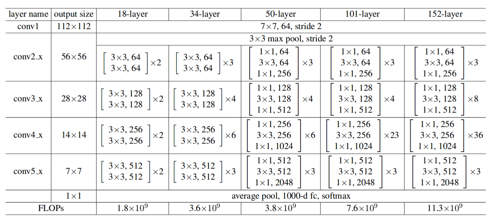
    </p>

    * Some Ops results do not consider constant 2 (summationa and multiplication need 2 operations) while others do. For example, for ResNet-101: 19.7 = 7.6*(256\*2)*2/(224^2)

* Darknet (Input size 256*256) -- consider the constant 2
    <p align="center" >
        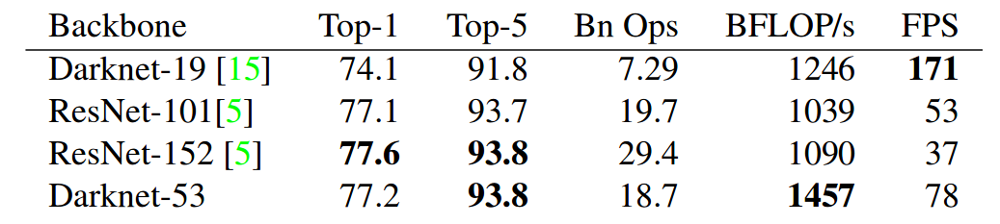
    </p>

    * Yolov2 uses Darknet-19 as backbone. Yolov3 uses Darknet-53.  
    * Models with the same FLOPS may have different fps (or BFLOP/s) on devicesdue do the discrepancy of runtime efficiency.
    * Only look at accuracy and FLOPs, Darknet-53 is just slightly better than ResNet-101.

<br>

## Ops of the whole model
> [Faster-RCNN (CatDet)](https://arxiv.org/pdf/1810.00434.pdf)  
[Yolo Overview](https://yongtaoge.github.io/2018/08/07/%E7%9B%AE%E6%A0%87%E6%A3%80%E6%B5%8B%EF%BC%9AYOLO-%E7%B3%BB%E5%88%97/)  
[Yolov3 Tiny Structure](http://www.tcsae.org/nygcxb/ch/reader/create_pdf.aspx?file_no=20190814)
* Faster-RCNN with different backbones
    * input size 1243*375
    * RPN predicts 3 types of anchors with 4 different scales for each loacation
    * 300 proposals after NMS
    <p align="center" >
        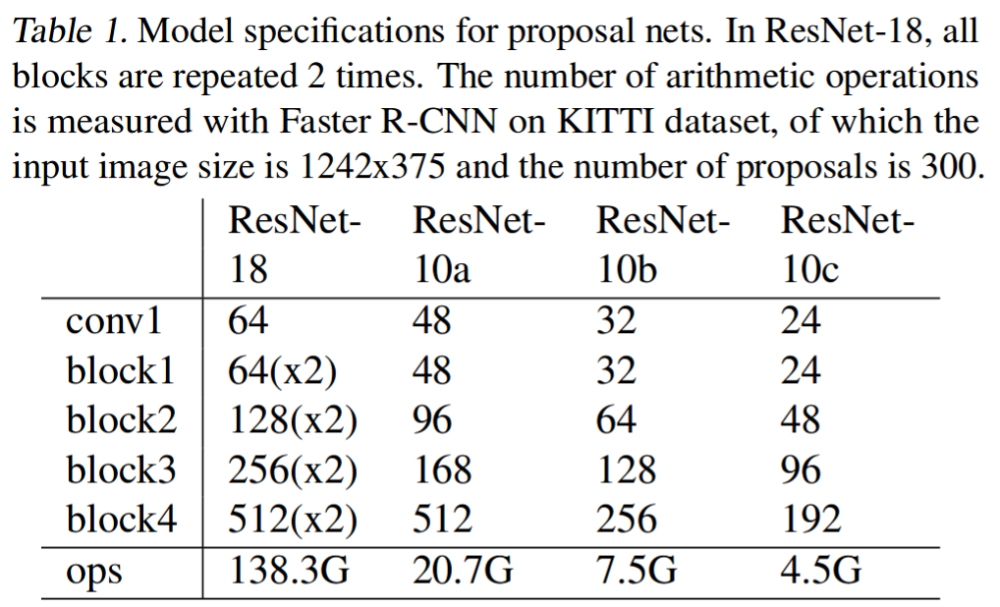
    </p>
    <p align="center" >
        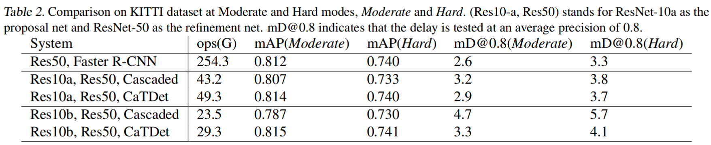
    </p>

* Yolo
    <p align="center" >
        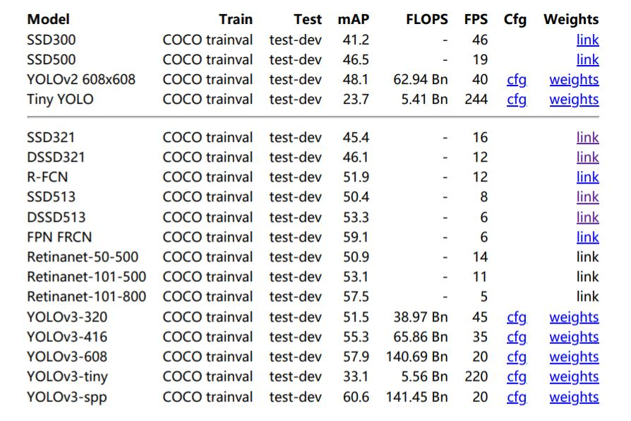
    </p>

<br>

## Conclusion
* About backbones  
    In terms of the backbone, under the same resolution (256\*256), the FLOPS:  
    
    |Darknet53|Darknet19|ResNet50|ResNet18|ResNet10/ShuffleNet/MobileNet varients|
    |:--:|:--:|:--:|:--:|:--:|
    |18.7G|7.3G|9.7G|4.3G|could <1G|


* About the whole model

    |Model|Dataset|Totoal GFLOPS|
    |--|:--:|:--:|
    |Res50 + Faster-RCNN| KITTI, 1242*375|254.3|
    |Res18 + Faster-RCNN| KITTI, 1242*375|138.3|
    |Res10a + Faster-RCNN| KITTI, 1242*375|20.7|
    |Res10b + Faster-RCNN| KITTI, 1242*375|7.5|
    |Yolov3|coco, 416*416|65.9|
    |Yolov3 tiny|coco, 416*416|5.6|

    * Faster-RCNN(1242*375): FC layers which deal with those 300 region proposals cost most  
    --- Heavy head，see __[Light-Head R-CNN: In Defense of Two-Stage Object Detector](https://arxiv.org/abs/1711.07264)__ and R-FCN
        * ResNet50: 77 GFLOPS
        * Others: 177 GFLOPS
    * Yolov3(416*416): backbone cost most
        * Darknet53 backbone: 49.4 GFLOPS
        * Others: 16.5 GLOPS

* About Hardware
    * Yolov3 (416\*416) on TX2, without TensorRT: 3~4 fps; with TensorRT: ~14fps  
    * Due to the memory access cost (MAC) and other costs, for TX2 (1 TFLOPS), only about 25% of theoretical FLOPS can be achieved in practical. __FLOPs could tell the upper bound of the model complexity given the desired fps.__
    * FLOPs itself might not be an accurate enough estimation of actual runtime, __[see shuffleNetv2](https://www.cnblogs.com/ansang/p/9406659.html)__.  
    Structure like shuffleNet is more suitable for CPU than GPU. https://www.zhihu.com/question/68483928/answer/267957881

