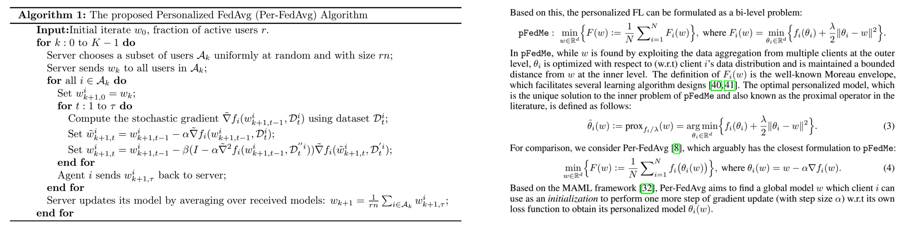

# Personalized FL
> 先是一个 survey: Towards Personalized Federated Learning  

可以分成 data-based, model-based；其中 model-based 按照 FL 阶段会产生多少个不同的 model，有可以分成 single-model，multi-model，和 n-model

    

 

---

下面根据上图，对一些分支的文献进行一个整理：

## Data-based
* `Federated Learning with Non-IID Data`：server 给 client 发一小部分 shared data，减少 weight deviation  
* 还可以对不均衡样本进行 over-sampling，down-sampling, GAN 之类的方法

## Model-based 
### Single model --> Meta-learning
众所周知，Reptile 和 FedAvg 有相似之处，也即 Federated Learning 提供了一个比较泛化的 model，自然有很多工作想要利用这种特性
* `Per-Fed: Personalized Federated Learning: A Meta-Learning
Approach_NIPS20`: 类似 FedAvg，但 client update 改成 MAML 的形式，见右边公式4，目标是求一个最优的 `w`，`f` 是普通训练时的loss（例如CE loss），`θ` 是 `w` 经过一步下降后的 model，整个过程需要求二阶导数
* `pFedMe: Personalized Federated Learning with MoreauEnvelopes_NIPS20`: 见右边公式3，`θ` 和 `w` 虽然相互纠缠，但可以通过迭代的方式逼近结果（固定一个优化另一个，不断循环）
`θ` is optimized with respect to (w.r.t) client i’s data distribution and is maintained a bounded
distance from `w` at the inner level. Compared to Per-FedAvg, our problem has a similar meaning of w as a “meta-model”, but instead
of using w as the initialization, we, in parallel, pursue both the personalized and global models by
solving a bi-level problem, which has several benefits. First, while Per-FedAvg is optimized for
one-step gradient update for its personalized model, pFedMe is agnostic to the inner optimizer, which
means (3) can be solved using any iterative approach with multi-step updates. 
    

        
    

* `FedFomo: Personalized Federated Learning with First Order Model 
Optimization_ICLR21`:  
propose a personalized federated learning method, which personalizes by computing a weighted combination of neighboring compatible models. 其中每个 model 的 weight，都可以由 client 自己算出来；代价是每个 client 都获取了其他任何 client 的 model，增加了通信开销，也会产生隐私问题
* `On Data Efficiency of Meta-learning_AISTATS21`: 详细对比分析了 Reptile，MAML，ProtoNet 3种 meta-learning 的方法  
MAML 偏好需要很多 task，每个task的 data point 可以比较少，而 reptile 正好相反

### Single model --> Regularization
* `Debiasing Model Updates for Improving Personalized Federated Training_ICML21`，见 [weights & Biases](https://wandb.ai/mckjoo/meta-proto-meta-set/reports/Federated-meta-learning--VmlldzoyMTEyMDY)
* 其他的比如 `Elastic Weight Consolidation (EWC)` 等

### Parameter-decoupling
* 左图：client 同时 end-to-end 训练 backbone 和 classifier，但是 FL 过程只上传 backbone，server 也只对 backbone 进行 aggregation    
`FedPav: Performance Optimization for Federated PersonRe-identification via Benchmark Analysis_MM20`  

* 右图：和上面一篇刚好反过来，FL 过程中只上传并 aggregate classifier；client 上的训练分两步：先固定 aggregate 的 classifier 训练 backbone，再训练 classifier。背后的思想是，FL 得到的 classifier 比较平均，有助于迫使 client 端训练的 backbone 不要过拟合，同时这种方法能减少通信代价
`LG-FEDAVG: Think Locally, Act Globally:Federated Learning with Local and Global Representations_NIPS19W`

    

        
    

### N-model
* Multi-task Learning  
    * `MOCHA_NIPS17`：每个 client 都要求参与每个 FL round，并且需要上传一个关于 raw data 的 linear transformation，而不仅是 model
* Transfer Leraning  
都不用上传 model 了，而上传对于一个 public dataset 的预测结果（作为 knowledge），server 对 knowledge 进行 aggregate，client 利用 aggregated knowledge 进行知识蒸馏。但这类方法需要一个 public dataset 来做知识蒸馏，算是传统 FL 形式的拓展，支持 heterogeneous models.
    * `Personalized Federated Learning for Intelligent IoT Applications: A
Cloud-Edge based Framework`  
    * `FedMD: Heterogenous Federated Learningvia Model Distillation`

### Non-iid
* 通过改 server 端 aggregation 算法
    * **`Federated Learning on Non-IID Data Silos: An Experimental Study`**：比较了 FedAvg, FedProx,  SCAFFOLD, FedNova 几种算法，有几个观察：
        * IID 时，FedAvg 不比其他3个方法差；Feature distribution skew, quantity skew 情况下，准确率下降不明显，并且 FedAvg 甚至比其他三个更好（The state-of-the-art algorithms signifi-cantly outperform FedAvg only in several cases）
        * Label distribution skew（也即 label non-iid）确实会带来巨大准确率下降。极端 non-iid 情况下，FedProx 比 FedAvg 稍好
        * SCAFFOLD, FedNova 在很多情况下不稳定（可以排除掉了）
        * Dirichlet 分布产生的 Label distribution skew 相比每个 client 只有一类这种极端情况，要稍微好一点。另外这篇文章也提到，只有一类这种极端情况在现实中也可能存在，比如 speaker recognition
    * `FedAdp: Fast-Convergent Federated Learning with Adaptive Weighting_IEEE_TCCN21`：server 通过计算每个 client 上传的梯度之间两两的夹角（相似度），得到对每个 model 的权重，而不是像 FedAvg 那样简单平均（权重都相等）
* 其他
    * `FedBN: Federated Learning on Non-IID Features via Local Batch Normalization_ICLR21`：server does not aggregate BN layers
    * `On The Convergence of FedAvg on Non-IID_ICLR20`：从理论和实验上证明对于 non-iid，Fedavg 需要 learning rate decay
* FedAvgM 好于 FedAvg
    * `Measuring the Effects of Non-Identical Data
Distribution for Federated Visual Classification`：人为产生 Non-iid 的数据，也可以用 Dirichlet 分布
    * `Federated Visual Classification with Real-World
Data Distribution_ECCV20`