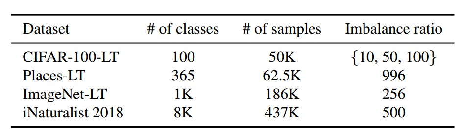

# 背景
## FL开山之作
https://blog.csdn.net/biongbiongdou/article/details/104358321  
## 框架
* FedIoT：https://arxiv.org/pdf/2106.07976.pdf    
* FedML：http://fedml.ai/ 
* PySyft：基于 pytorch 的联邦学习框架，但是运行速度比较慢：https://github.com/OpenMined/PySyft  
* 或者自己写一个 FL 的框架：
    * 注意事项
        * 每个 model 要有一个 optimizer，一个 dataloader
        * 多进程时，不要用类似 `函数返回值是一个类` (见 [create_model](https://github.com/hyperconnect/LADE/blob/cfe96b7ca6520f3410d4cae9cc10919e6114bbb9/models/DotProductClassifier.py#L34)) 的形式创建 model，因为 Python 的多进程实现中用的是 pickle 将数据序列化，这样写会导致没办法序列化

    * 单线程：用一个 class handle 所有，但多个 client 的 local update 是用 for 循环顺序执行的
    * 单进程 + 多线程：还是用一个 class handle 所有，但多个 client 的 local update 用多线程执行
        * 缺点：python 的多线程只会用一个 CPU Core，导致 client 数量一多，GPU 占用率仍然上不去；优点：线程比进程轻量，通信代价小
        * 子线程/进程中，dataloader 的 num_worker 必须设成 0，因为自线程不能再调用多进程了：https://zhuanlan.zhihu.com/p/133707658 
        * 由于 `num_worker=0`，pre-processing 可能是瓶颈，可以考虑将数据集预先加载在内存里面加速 dataloer，甚至可以考虑将数据集先预处理之后存成文件（但无法做 random augmentation/shuffle 之类的操作了）
    * 多进程：每个进程 handle 一个 client，优点是快，缺点是显存消耗大 
        > [链接1](https://stackoverflow.com/questions/57496285/why-is-the-memory-in-gpu-still-in-use-after-clearing-the-object)，[链接2](https://discuss.pytorch.org/t/does-cuda-cache-memory-for-future-usage/87680)  

        * 只要一个进程调用了 `xxx.to(cuda)`，就要占用 `700MB` 左右的显存，不管 xxx 是啥，甚至使用是一个 int 而已。并且 `del xxx; torch.cuda.empty_cache()` 这两个命令只能释放变量占的显存，而这700MB大多是 CUDA context 占用的，没办法释放
        * 用两个类：Fed_Server，Fed_Client，之间用多进程通信传 state_dict

## 横向/纵向
* 横向（同特征不同id）：Horizontal federated learning (HFL). HFL, also known as ***sample-based federated learning***, can be applied in scenarios in which datasets share the same feature space, but differ in sample space. In other words, different parties own datasets which are of the same format but collected from different sources. 例如两家不同地区的银行
* 纵向（同id不同特征）：例如一家银行一家电商，他们拿到的是同一个用户在不同平台上的数据
## 联邦学习和其他领域的联系（MAML, Reptile, FedAvg, FedSGD）
* FedAvg = FedSGD + 多次 FOMAML  
    > 见文章：Improving Federated Learning Personalization via MAML，https://ereebay.me/posts/6350/  

    FedAvg相当于是一系列在多轮本地更新后进行个性化效果优化的算法的线性组合。  
    直观上理解，FedAvg = FedSGD（即local端进行一次SGD，传梯度）+ 多个First Order MAML（local_ep产生的多次梯度下降）
* Reptile：如果将一个 FL round 视作 meta learning 的一个 episode，那么两者有相似之处，但也有以下不同：
    * 需要忽略 Reptile 的高阶梯度，FedAvg 中 local 都是用的同一个 global model 作为起点
    * 需要假设 FedAvg 中每个节点拥有同分布的数据 
* Per-FedAvg: 一个 personalized FL 的算法。在 local 端，将传统的梯度下降，变成用 maml 的方式更新，再经过FL，得到一个 global 的模型，这个模型具有较好泛华性，是一个很好的初始化模型
## Multi-task FL
* Dual problem  
    > https://cosx.org/2014/03/svm-series-add-1-duality/  
    * 基本思想：prime problem 最小化问题不好解，可以用 dual problem 的最大化来逼近
    * 其中，拉格朗日乘子法是其中一个将 prime 转化为 dual 的方法，解决 dual problem 一般可以用迭代法，每次迭代分别更新 x 和拉个朗日参数，例如 admm 方法：[admm介绍1](https://blog.csdn.net/shanglianlm/article/details/45919679), [admm介绍2](https://www.zhihu.com/question/36566112/answer/118715721) 

## Domain Shift in FL
* DA 常用数据集：Office-31，Office-Caltech-10，MINIST+USPS，更多的见：https://github.com/jindongwang/transferlearning/blob/master/data/dataset.md  
* 一个 baseline 方法：DDC，见：https://github.com/jindongwang/transferlearning/tree/master/code/DeepDA  
* domain adaption 的 setting: source domain 有 labeled data，target domain 没有或者只有少量 labeled data（可以有大量 unlabeled data）。在 FL 下可能的 setting：
    * client 有 target unlabeded data，server 有 source labeled data
    * client 有 target unlabeded data + server 共享的 source labeled data
    * client 之间 target unlabeled data 存在 non-iid

## Long tail in FL
* CIFAR10/100-LT, Places-LT, ImageNets-LT, iNaturalist 2018 

    

        
    

* 一些经验：
    * 实际的数据集，不会是一个绝对病态的 non-iid 的情况。绝对病态的 non-iid，`FedAWS` 会是比较好的能使得 backbone 学到东西的方法
    * head class 在数量和出现频率上都高（会在大多数client上都出现），类别缺失程度低，所以他们的特征学习在 FL 下面不会是一个问题；tail class 正相反，数量和出现频率都低，non-iid 的程度大。所以在实际中，主要还是 tail classes 的学习问题
* Personalized FL 和 Generic FL (例如 FedAvg):   
从现实角度看，都不是符合显示的完美解决方案。Gen-FL 想用一个 model 适应所有场景，p 目前的 Per-FL 在 eval 时都假设每个 client 上测试集和训练接同分布

 
 

# Personalized FL
> 先是一个 survey: Towards Personalized Federated Learning  

可以分成 data-based, model-based；其中 model-based 按照 FL 阶段会产生多少个不同的 model，有可以分成 single-model，multi-model，和 n-model

    

 
 

---

下面根据上图，对一些分支的文献进行一个整理：

## Data-based
* `FedPer_Federated Learning with Non-IID Data`：server 给 client 发一小部分 shared data，减少 weight deviation  
* 还可以对不均衡样本进行 over-sampling，down-sampling, GAN 之类的方法

## Model-based 
### Single model --> Meta-learning
众所周知，Reptile 和 FedAvg 有相似之处，也即 Federated Learning 提供了一个比较泛化的 model，自然有很多工作想要利用这种特性
* `Per-FedAvg: Personalized Federated Learning: A Meta-Learning
Approach_NIPS20`: 
    * 类似 FedAvg，但 client update 改成 MAML 的形式，见右边公式4，其中 `f` 是普通训练时的loss（例如CE loss），`θ` 是 `ω` 经过一步下降后的 model，而目标是求一个最优的 `ω`  
    * 整个算法需要求二阶梯度，所以文章的 evaluation 部分用了 First-order MAML，MNIST 上效果比 FedAvg 好；但在 CIFAR10 上不稳定，甚至不如 FedAvg。在 evaluation 时，作者让所有个性化 model 在 test set 上进行一步 SGD，以保持和训练时的 MAML 形式一致

    

        
    

* `pFedMe: Personalized Federated Learning with MoreauEnvelopes_NIPS20`: 见上图右边公式3，`θ` 和 `ω` 虽然相互纠缠，但可以通过迭代的方式逼近 `ω`（固定一个优化另一个，不断循环）
    * `θ` is optimized with respect to (w.r.t) client i’s data distribution and is maintained a bounded distance from `ω` at the inner level. 
    * Compared to Per-FedAvg, our problem has a similar meaning of `ω` as a “meta-model”. However, `Per-FedAvg` is optimized for one-step gradient update for its personalized model, `pFedMe` is agnostic to the inner optimizer, which means (3) can be solved using any iterative approach with multi-step updates.  
    * 这种方法在 client 上的计算复杂度是 FedAvg 的 k 倍，k 是公式(3)中 `ω` 需要下降多少步才能得到 `θ`。得到 θ 之后，local 的 `ω` 可以进行一次更新，这个过程要重复 R 次。Evaluation 时，将公式(3)得到的 `θ` 作为了个性化 model
* `FedFomo: Personalized Federated Learning with First Order Model 
Optimization_ICLR21`
    * 其中每个 client 每一轮要更新得到的 model，都是其他 client 的 weight 的一个线性组合，而这个线性组合的权重，文章给出了一个公式可以在 client 上直接算出来；代价是每个 client 在每一轮都要获取其他多个 client 的 model，增加了通信开销，也会产生隐私问题
    * 这篇文章的实验做的比较充分
* `On Data Efficiency of Meta-learning_AISTATS21`: 详细对比分析了 Reptile，MAML，ProtoNet 3种 meta-learning 的方法  
MAML 偏好需要很多 task，每个task的 data point 可以比较少，而 reptile 正好相反

### Single model --> Regularization
* `Debiasing Model Updates for Improving Personalized Federated Training_ICML21`，见 [weights & Biases](https://wandb.ai/mckjoo/meta-proto-meta-set/reports/Federated-meta-learning--VmlldzoyMTEyMDY)
* 其他的比如 `Elastic Weight Consolidation (EWC)` 等

### Parameter-decoupling
* 左图：client 同时 end-to-end 训练 backbone 和 classifier，但是 FL 过程只上传 backbone，server 也只对 backbone 进行 aggregation。下面3篇都是基于这个思想
    * `FedPav: Performance Optimization for Federated PersonRe-identification via Benchmark Analysis_MM20`  
    * `Federated Learning with Personalization Layers`  
    * `Exploiting Shared Representations for Personalized Federated Learning_ICML21`: local update 先固定 backbone 更新 classifier，再固定 classifier 更新 backbone，并上传   

* 右图：和上面一篇刚好反过来，FL 过程中只上传并 aggregate classifier；client 上的训练分两步：先固定 aggregate 的 classifier 训练 backbone，再训练 classifier。背后的思想是，FL 得到的 classifier 比较平均，有助于迫使 client 端训练的 backbone 不要过拟合，同时这种方法能减少通信代价
`LG-FEDAVG: Think Locally, Act Globally:Federated Learning with Local and Global Representations_NIPS19W`

    

        
    

### N-model
* Multi-task Learning  
    * `MOCHA_NIPS17`：每个 client 都要求参与每个 FL round，并且需要上传一个关于 raw data 的 linear transformation，而不仅是 model
* Transfer Leraning/ Knowledge Distillation  
连 model 都不用上传了，而上传对于一个 (public dataset + private dataset) 的 logit 预测结果（作为 knowledge）。server 对 knowledge 进行 aggregate，client 利用 aggregated knowledge 进行知识蒸馏（local model 作为学生）。但这类方法需要一个 public dataset 来做知识蒸馏，算是传统 FL 形式的拓展，支持 heterogeneous models
    * `Personalized Federated Learning for Intelligent IoT Applications: A Cloud-Edge based Framework`  
    * `FedMD: Heterogenous Federated Learningvia Model Distillation`：知识蒸馏在 client 端进行，server 负责 aggregate logit；classifier所需的分类数 = public dataset类别数 + private dataset类别数

### Multiple-Model --> Clustering
* 我们组现有的工作主要在这个方向，比如 `ClusterFL`, `FedDL`

 
 

# Non-iid
## 通过改 server 端 aggregation 算法
* ***`Federated Learning on Non-IID Data Silos: An Experimental Study`*** (挺有启发的一篇文章)：比较了 FedAvg, FedProx,  SCAFFOLD, FedNova 几种算法，有几个观察：
    * IID 时，FedAvg 不比其他3个方法差；Feature distribution skew, quantity skew 情况下，准确率下降不明显，并且 FedAvg 甚至比其他三个更好（The state-of-the-art algorithms signifi-cantly outperform FedAvg only in several cases）
    * Label distribution skew（也即 label non-iid）确实会带来巨大准确率下降。极端 non-iid 情况下，FedProx 比 FedAvg 稍好
    * SCAFFOLD, FedNova 在很多情况下不稳定（可以排除掉了）
        * 虽然感觉实现上不太优雅对称，scaffold 这篇文章的出发点还是有意思的
            

                
            

            这篇文章有两个假设：
            * 数据的异质性可以由 global model 在 local data 上的梯度来得到描述（第12行）  
            * 第12行从（i）到（ii）的近似假设了每一步的梯度都近似相等。(ii) 中，第二项是 teacher model 减去 new model，再除以更新的步数。第一项 `c_i-c` 是用来补偿第10行中的 `-ci+c`。将 (ii) 带入第17行，可以得到新的 `c` 其实是 (ii) 中的第二项的平均，也即所有 client 的一步梯度更新值的平均
    * Dirichlet 分布产生的 Label distribution skew 相比每个 client 只有一类这种极端情况，要稍微好一点。另外这篇文章也提到，只有一类这种极端情况在现实中也可能存在，比如 speaker recognition
* `FedMA_Federated learning withmatched averaging_ICLR20`：对于每一层（以FC为例），local dataset 训练得到的 weight 是 optimal 乘上一个 L*L 的矩阵，其中 L 是 hidden unit 数量。在 server 端，可以先求出来每一层的这个变换矩阵（通过迫使 global model 和 local model 变换后接近），再 aggregate；缺点是不支持 BN 层
* `FedBN: Federated Learning on Non-IID Features via Local Batch Normalization_ICLR21`：server does not aggregate BN layers，探索的是 BN 层怎么 aggregate 的问题

* `FedDF_Ensemble Distillation for Robust Model Fusion in Federated Learning_NIPS20`
    * 最终目标还是产生一个 model，不是 personalized FL；其中知识蒸馏在 server 端进行，client 还是只需要上传 model
    * 相比于 FedAvg（算法第6行为止），FedDF 多了在 server 上的 N 次迭代；每次迭代中，将 client models 对于 `samples d` 的 logit 的平均值作为 teacher，global model（`x_{t, j-1}`）作为 student
    

        
    

* `FedAdp: Fast-Convergent Federated Learning with Adaptive Weighting_IEEE_TCCN21`：server 通过计算每个 client 上传的梯度之间两两的夹角（相似度），得到对每个 model 的权重，而不是像 FedAvg 那样简单平均（client 样本数量相同时，权重都相等）

## 利用 Embedding 的方法
* `FedAWS_Federated Learning with Only Positive Labels_ICML20`：一篇很有意思的文章！！

    * 文章的 setting 是每个 client 只有一类数据，怎么在 FL 下训练一个多分类的 model，很明显是 extreme non-iid 的，FedAvg 肯定不行。并且本文说，classifier 本质上是 class embedding，是比较敏感的，所以本文假设 client 只能从 server 获取 classifier 中属于它的那一类的权重（***`但是 server 还是知道每个 client 是哪一类，这个并不算破坏了隐私，而应该算是 FL 上传 model 本身带来的问题`***）
    * 于是本文提出了一个在 server 端的规范项，强迫来自每个 client 的 class embedding 彼此之间有距离
    * 有两个有趣的发现：
        * 如果不要第14行，也即只有 positive loss，那么得到的 global model 对于所有类会产生几乎相同的 embedding。因为在这种情况下，classifier 本质上并没有被训练，而 backbone 收敛的条件是 local model 和 fedavg 之后的 global model 几乎相同，也即每个 client 上用不同类别的数据训练出来的 local model 是相同的（只有驱同的力，而没有将不同类别/local model分开的力）。
        * 在算法的第7行，如果把 classifier `ω_i` 固定，也能得到接近于 upper bound 的结果，见文章的 baseline2，文章中有解释
    * 剩下的解读见：https://zhuanlan.zhihu.com/p/168016399  
        

            
        

* `FedUV_Federated Learning of User Verification Models Without Sharing Embeddings_ICLR21_rej`

## 一些理论和实验
* `On The Convergence of FedAvg on Non-IID_ICLR20`：从理论和实验上证明在 strong-convex + smooth 条件下，FedAvg 在 iid 可收敛到全局最优；对于 non-iid，Fedavg 需要 learning rate decay

* FedAvgM 好于 FedAvg
    * `Measuring the Effects of Non-Identical Data
Distribution for Federated Visual Classification`：人为产生 Non-iid 的数据，也可以用 Dirichlet 分布
    * `Federated Visual Classification with Real-World
Data Distribution_ECCV20`

