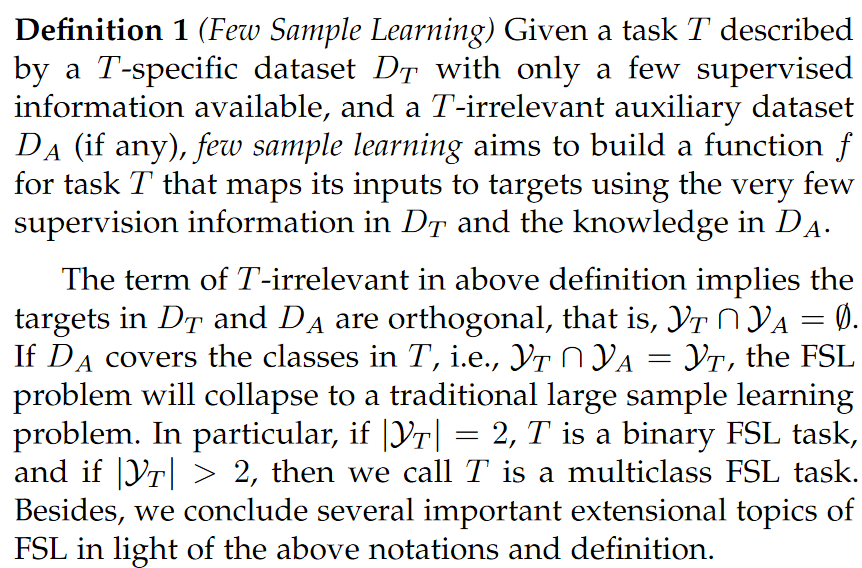
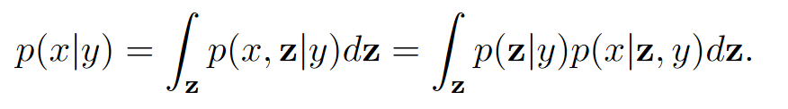
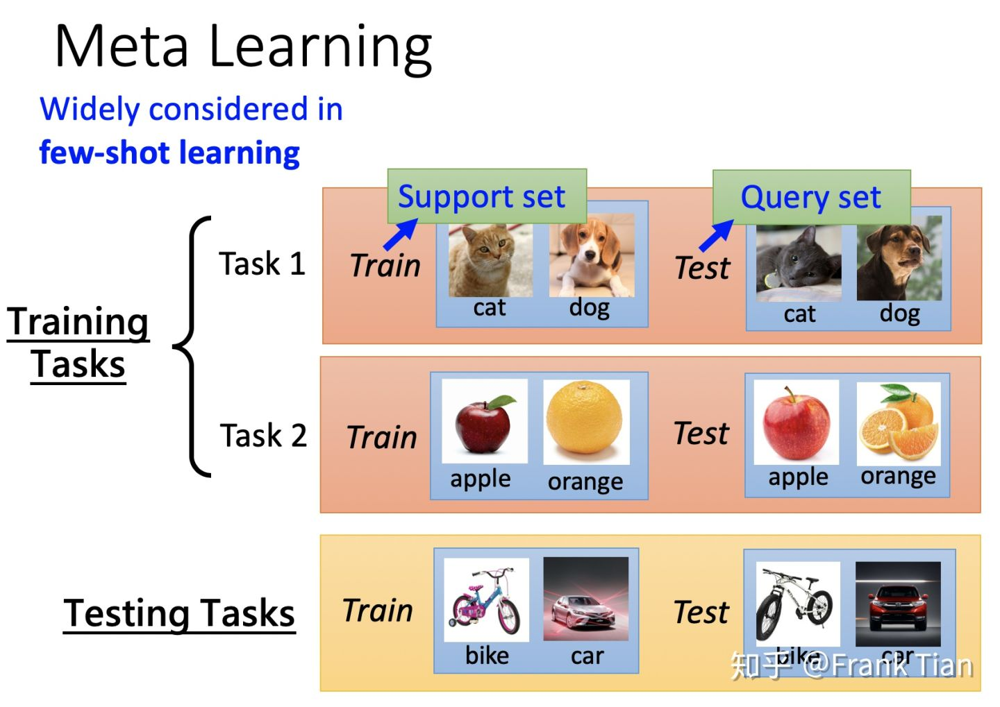
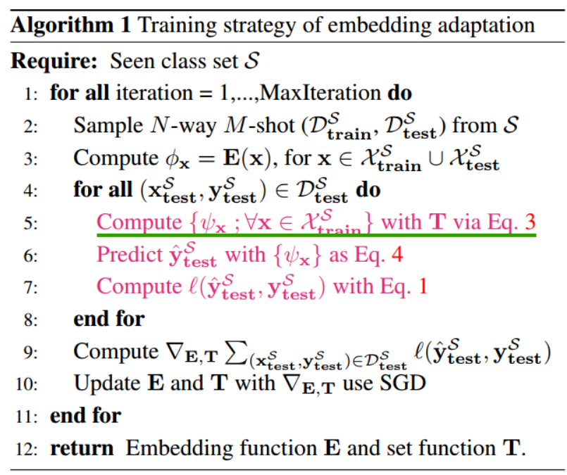
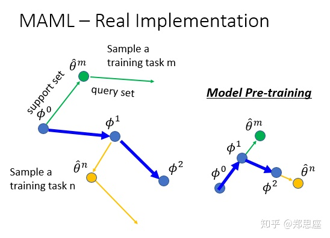
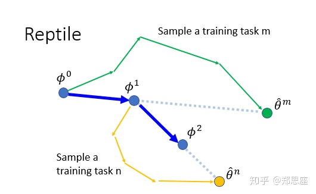

# Learning from Very Few Samples: A Survey  
> https://arxiv.org/abs/2009.02653

## Definition

* `D_A` 包含很多已标注数据，`D_T` 只包含少量标注数据，两者类别不重合，测试时在 `D_T` 上
* 方法上主要可分为 Generative 和 Deterministic

 

## Generative Methods

    
    

* 一般都用了一个 latent variable `z` 来求条件分布 `p(x|y)`。例如对于数字、字母识别等，每个类（也即`y`）都可以对应一个latent image（也即`z`），所有属于该类的图像（也即`x`）都可以由这个 latent image 经过变换之后得到；并且对于不同类，这个变换的分布可能是相同的
* 生成式的方法普遍只适用于特定一些场景，现在更多的基于深度学习的方式是判别式的

 

## Deterministic Methods
### Data Augmentation
* 利用 auxiliary dataset `D_A` 使得 GAN 能够扩充 `D_T` 的数据 
### Metric Learning
* 利用 auxiliary dataset `D_A` 训练一个网络，输入是 `x_i`，`x_j` （例如两张图），输出是他们之间的 distance。被称作 metric learning 的原因是因为这个网络能自动学习一个 metric 来衡量两个 embedding 之间的 distance
* 用 `D_A` 训练后，可在 `D_T` 上 finetune。inference 阶段：将输入数据和 `D_T` 中同类别的数据进行比较，计算 distance，从而完成分类。
### Meta-Learning

    
    

* 普通的learning，上图所有的方框步骤都是人指定的。Meta-learning 是使得网络具有 learn-to-learn 能力的一类方法的统称，也即把某些红框中的步骤留给模型自己学。任何一个红框改变，那么得到的learning Algorithm都是不同的，例如使用不同的初始化参数 `θ^0`，就得到了不同的learning algorithm，或者 NAS（对象是网络结构），AutoML（对象是超参数）都属于 meta-learning。

* 为什么 few-shot learning 经常和 meta learning 一起被提起？  
Meta-learning 是解决 Few-shot 问题的一种训练策略，可以和其他方法（例如data augmentation）一起使用来解决 few-shot 问题。 Meta-learning 的目标是使网络 learn-to-learn，而这种能力正是 few-shot 中所需要的

* Meta-Learning 主要方法
    * Learn-to-Measure (L2M)：The L2M approaches inherit the main idea of metric learning in essence, but they are different from the metric learning based FSL approaches in the implementation level: the L2M approaches adopt the meta learning policy to learn the similarity metric that is expected to be transferrable across different tasks. L2M has always been an important branch of meta learning based FSL approaches. 代表性的文章：`Matching Net，Relation Net，Prototypical Network，Imprinting`

    * Learn-to-Finetune：MAML，Reptile（这两篇文章讲的是用 meta-learning 用于寻找一个好的初始化权重，是通用的训练策略，而不局限于某个应用，例如object detection）

    * Learn-to-Parameterize: 直接让一个 meta-learner 生成 base learner 所需要的权重，当网络比较复杂时不太现实，本文不展开了

 

# Transductive Learning
* Transductive vs. Inductive  
    * 简单版本：在训练过程中，已知 testing data（unlabelled data）的是 transductive learning;在训练过程中，并不知道 testing data，训练好模型后去解决未知的 testing data 是 inductive learing
    * 详细版本：Inductive learning：监督学习中的 train 和 test 集是不交叉的，这种叫做 inductive learning。半监督学习中我们添加了额外的未标记数据辅助训练，它的 train 和 test 集依然是不交叉的，叫做 inductive semi-supervise learning。 假设我们添加的这部分未标注的数据部分或者全部来自 test set，那么这时候很明显 train 和 test 就相交了，这种叫做 transductive learning

* Transductive 在 few-shot 中的应用  
    * few shot 定义：首先有 base classes 和 novel classes，他们的类别都没有交叉。其中 base classes 有全部的 label，novel classes 中每一类有 support set 和 query set，support set 有 label ，但是数据是 few shot 的。目标是在 query set 上达到很好效果
    * Transductive inference：不仅要用 few-shot but labeled support set，也要用 unlabeled query set。每次 inference 时还得先再调调网络，自然效果要比只用 support set 训练的 inductive learning 好
* Transductive 方法的缺点  
    * 首当其冲的是 Overhead 也大，因为 inference 的时候需要现场训练，开销大概是 inductive 的100 倍以上
    * 针对 stream data 可能不行，也就是 query set 的数据是一张一张来的，它可能训练不好

    

 

# Meta learning 和 Federated Learning
> 一个详细讲 Reptile 的文章（特别是那张图）： https://openai.com/blog/reptile/ 
* Reptile 和 FedAvg 是有相似处的，都是一个 outerloop 和一个 innerloop（下图最左边一列）
    * meta-learning 中一个 episode（或称作task），对应一次 client update
    * 一个epoch，对应一个 FL round
    * Reptile 中，step 多少步，对应 FedAvg 中的 local epoch

        

            
        

* 但显然 Reptile 和 FL 也不能完全对应上
    * Reptile 中，model 在接受第二个 episode 的梯度时，已经被第一个 episode 的数据改变
    * 但 FedAvg 中，第二个 client 的梯度和第一个 client 的梯度相加后都是作用在同一个 global model 上

 

# Few-shot image classification 几篇串讲
先来两篇不是 CV 顶会，但我认为有价值的：
* 一文概括 ProtoNet，RelationNet: `A Comparison of Few-Shot Learning Methods for Underwater Optical and Sonar Image Classification`
* `Augmenting Few-Shot Learning With Supervised Contrastive Learning`：监督式对比学习 + Tranductive learning，虽然原创性的东西不多，但文章整体效果不错、得到的 lesson 很实在、文章写得也不错，发在 IEEE Access 上还是有点可惜了。一个insight是：**`在 train 和 test set 不存在 domain shift 的基础上，将对比学习用在小数据集（CUB）上训练 base class，也能提高 few shot 性能；但缺点是对比学习训练时所需的 batch size 大，耗时长`**

CV 顶会论文：
* `Low-Shot Learning with Imprinted Weights`：本质是将 embedding 归一化 + 最邻近（未 finetuning 的情况）；后续还可以 finetuning  
* `A New Meta-Baseline for Few-Shot Learning_arXiv20`：提出了两个 baseline，一个 classifier-basleine，本质上就是 imprinting；另外一个 meta-baseline，是用 meta learning 的方法训练 classifier。结果是 meta-baseline 效果要比 classifier-basleine 好两个点，这当然是很正常的啊，毕竟 imprinting 只用做一次 forwading，本质上只是做一个权重的初始化 
* `Rethinking Few-Shot Image Classification: a Good Embedding Is All You Need?`：把所有 meta training set 打包成一个训练集，然后用自监督蒸馏的方法来训练 encoder，再用 meta testing 中的 support set 用来训练 classifier（固定 encoder）。文中比较了 `最邻近NN` 和 `逻辑回归LR`（也即一层FC层），LR 比 NN 高两个点左右。这是一个比较重要的 insight: **`non-parameter 的方法例如 Protonet 没有用 meta testing 阶段的 support set 去更改任何的网络权重，被证明效果不如 support set 去微调了分类器权重的 LR 方法`**
* `CrossTransformers: spatially-aware few-shot transfer`：用对比学习训练 encoder，用一个 spatial-aware 的 transformer（用了 attention 机制） 将 encoder 得到的 embedding 再微调一下，classifier 用的 prototypical
* `A Baseline For Few-Shot Image Classification_ICLR20`：没细看，但本质上还是基于 imprinting。文章得出的两个结论：imprinting 这种权重初始化的方式很有用，finetuning 很有必要，这其实之前就知道了。本文属于 transductive inference，finetuning 时用到的 loss 用到了一个 query set 上的熵，也即每一次 inference 之前还得先训练一遍，运算量很大，但是带来的提升其实可以说不太显著  
* `Few-Shot Learning via Embedding Adaptation with Set-to-Set Functions (FEAT)`：简单理解就是 `ProtoNet + Transformer`，其中第5行是将 encoder 输出的 embedding 做一定排列之后输入 transformer 得到的新的 embedding

    

**所以总结下，few-shot classification 有几个重要部分：encoder，embedding layer，classifier：**
1. Encoder 部分可以有的创新比如对比学习、自监督蒸馏等，目的都是训练一个更有泛化性的 encoder  
1. Embedding layer 可以用简单的 normalization （比如 imprinting 那篇），或者用 transformer 把 embedding 再提升下  
1. Classifier 部分从很早之前就没怎么有革命性的方法：现在主流还是 NN （最邻近）或者 LR（也即一层 FC），一层 FC layer 在 one-shot 时等效于 ProtoNet（用了 NN 最邻近） + Cosine distance。当 shot 数变多时，ProtoNet 等直接将多张图的 embedding 求平均的做法略显粗暴，效果不如 LR。从效果上来说，ProtoNet 好于 RelationNet 和 MatchingNet。同时一般来讲 embedding L-2 normalization 可以有效果提升
1. 其他的方法诸如 tranductive learning 等放宽了 inductive learning 的设定也可以达到更好的效果

 

# Paper List
## MAML & Reptile

    
    

* MAML：
    > https://zhuanlan.zhihu.com/p/72920138
    > https://zhuanlan.zhihu.com/p/66926599

    MAML 要解决的问题，本质上是使得网络在所有 training task 的 query set 上的loss之和最小化。经过一些数学近似（忽略高阶项），训练策略可简化为：

    * 对于每一个training task：设初始模型为 M0，先在 support set 上迭代一次，进行一次BP，得到 M1。M1再在 query set 迭代一次，算出梯度，最终用该梯度对 M0 进行更新得到 M'，这就完成了在一个 training task 上的学习  

* Reptile
    > https://zhuanlan.zhihu.com/p/239929601

    * MAML 中 training tasks 是分为 support set 和 query set，Reptile 没有分（__实际上 meta-learning 不一定要分 support set 和 query set ！！__）
    * 对于每个 training task，MAML 和 Reptile 都只下降一步，但是方向不一样
    * Reptile 如果只step一次（绿色的箭头），那和一般的训练就没有任何区别

 

## Imprinting
> Low-Shot Learning with Imprinted Weights: https://openaccess.thecvf.com/content_cvpr_2018/papers/Qi_Low-Shot_Learning_With_CVPR_2018_paper.pdf

训练步骤：
* 用 existing classes 的大量数据训练 base classifier
* 用 novel classes 的 low-shot 数据进行 imprinting
* （optional）用 low-shot 数据进行 finetune

其他：
* 文中的贡献：解释了（FC layer + softmax classifier） 和 （triplet-based embedding training + Nearest Neighbor）两种方法原理上是相通的，将 metric learning 的思想巧妙地融入 FC 层
* 灵魂性的句子： Intuitively, one can think of the imprinting operation as
remembering the semantic embeddings of low-shot examples as the templates for new classes
* 严格意义上，本文运用了 metric-learning 的思想，并将它巧妙地融合在了FC层权重初始化之中，本文和 meta-learning 关系不大。本文相比于普通 CNN 分类器唯一的不同就是，矩阵 W 的初始化是由 imprinting 完成的。实验表明，imprinting 甚至无需在 low-shot examples 上 finetune，也可达到较好效果

 

## Few-Shot Attention RPN
> Few-Shot Attention RPN: https://openaccess.thecvf.com/content_CVPR_2020/papers/Fan_Few-Shot_Object_Detection_With_Attention-RPN_and_Multi-Relation_Detector_CVPR_2020_paper.pdf

Training：
* 一个 training task 是一个 episode（包含 support image 和 query image）：有两个loss，一个是match loss，另一个box regression loss （training task 和 test task 类别无交集） 

Fintuning（optional）：
* 在 test 之前可在 test task 的 support set 上进行 finetine（因为根据定义：test task 中，query set 和 support set 类别是相同的，且具有相似分布），

Inference（有两种方式进行）：
* support image 和 query image 一起输入网络（需要运行两个branch），最后 match 的分数可作为置信度
* 将 support images 对应的绿色 feature maps 存成离线的（提供大量prior），inference时就只用运行下面的branch即可

其他：  
* 严格意义上讲，本文运用了 meta-learning 的训练方式（将数据分成 episode，但和MAML没有关系），用 Siamese CNN 完成了特征提取，用Multi-Relation Head 完成了 metric-learning
    

    
    

