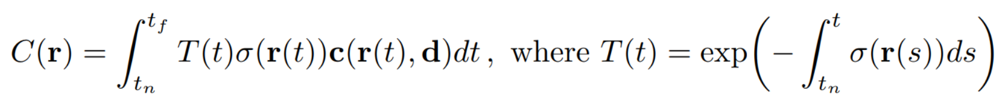
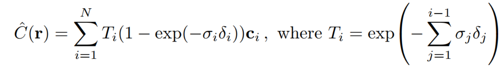
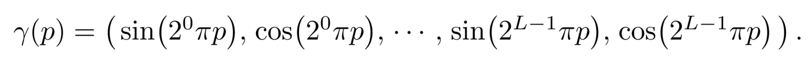
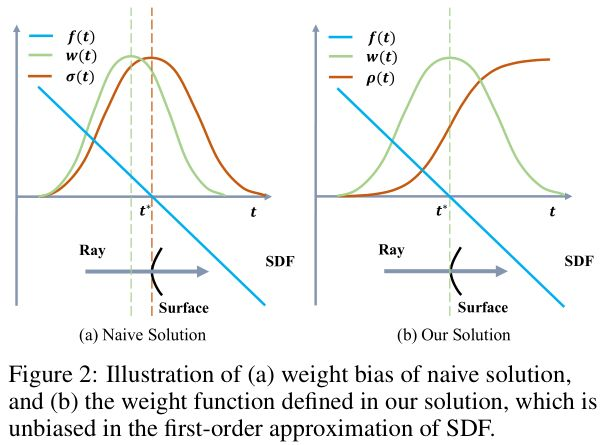
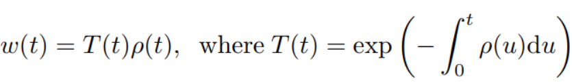
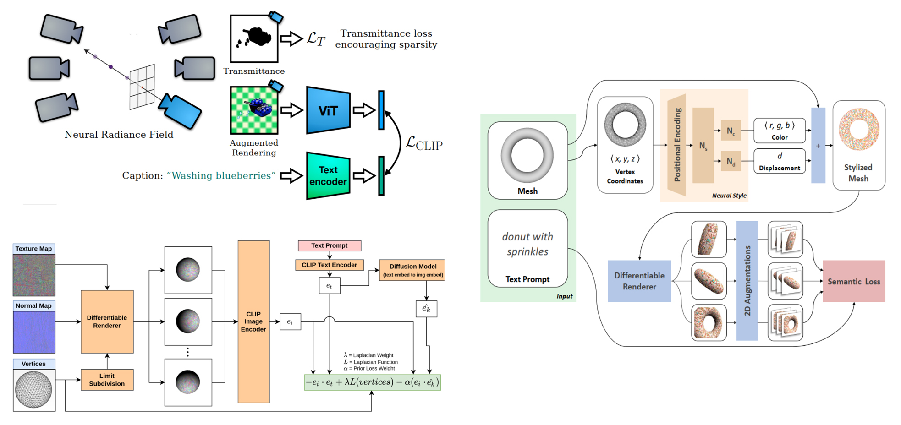

# NERF 相关
## NERF 开山之作
* 像素颜色是 ray 上每一点的颜色 `c(r(t), d)`、体积密度函数 `σ(r(t))`、和累计透射率 `T(t)` 的积分，其中 `r(t) = o + td`，`o` 是相机点，`d` 是光线方向，`t` 是前进了多长。原理是体积渲染，运用了光线吸收模型的 `dI/ds​ = −τ(s)I(s)`：

    

    
    

    
    离散形式，其中 `δi = t_{i+1} − t_i`，运用了 `e^(-x)` 的泰勒一阶展开：

    

    
    

* 用了两个技巧：position encoding，hierarchical volume sampling
    * Networks 倾向于学习低频的函数（平滑），但实际场景的神经辐射场基本上都是高频的。所以实现的不是直接将 `xyzθφ` 作为输入，而是对原始 `xyzθφ` 的每一维度都做如下 position encoding，然后再输入到网络中。
    

    
    
     

    * 使用两个网络同时进行训练 (coarse 和 fine 网络)， coarse 网络输入的点是通过对光线均匀采样得到的，根据 coarse 网络预测的体密度值，对光线的分布进行估计，然后根据估计出的分布进行第二次重要性采样，然后把所有的采样点一起输入到 fine 网络进行预测

## NeuS
> 这篇文章讲的很好：https://zhuanlan.zhihu.com/p/496752239  
* 引子：NERF用体积渲染，MLP 输出的是体积密度，有可能在空中也出现一个体积元素，重建的 mesh 不能很高质量。而 SDF 可以比较好的描绘物体轮廓。
* NeuS 方法：

    * 使得 MLP 直接输出不透明 (opaque) 密度函数 `ρ`，它是 SDF 的无偏估计
    * 用不透明度 `ρ` 替代了 NERF 中的体积密度函数 `σ`，这样估计出的 `w(t)` 有两个好处
        * 无偏，即此函数推导的光线与表面碰撞点要满足 SDF 为0

        * 可感知遮挡，即如果出现两个点SDF值相同的情况，此函数能够满足距相机更近的点具有更大权重

        

        
        
     

        

        
        
     

## 

# 3D 生成

* Dream Filed：把 NERF 和 CLIP 结合起来了  
目标是训练 NERF，用 CLIP 和一个透明度的规范项来监督
* 类似的工作：CLIP-Mesh  
用了 CLIP 和 diffusion，利用可微渲染来反推 mesh 和贴图

* Text2Mesh
    * Mesh 根据 text 进行 style 迁移
    * 也用了可微渲染

* AvatarCLIP
实现的是 Text-3D animation，分两步：静态 + 生成动作

    * 静态部分的方法类似 Dream Field，基于 CLIP 的 loss 去训练 NeuS
    
    * 动态部分 MotionVAE：第一步预训练一个 VAE + 第二步基于 CLIP 得到每个动作的 latent space code z 

    

    
    
  

