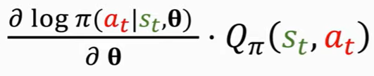
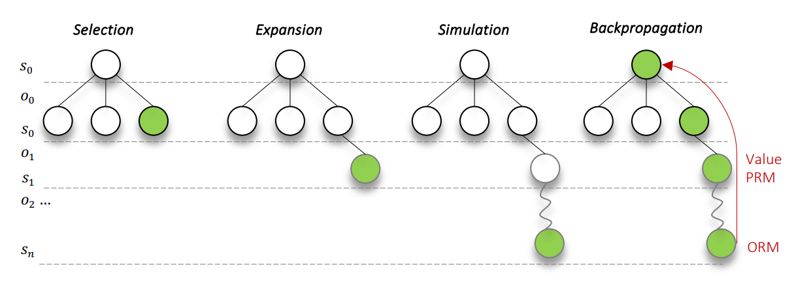
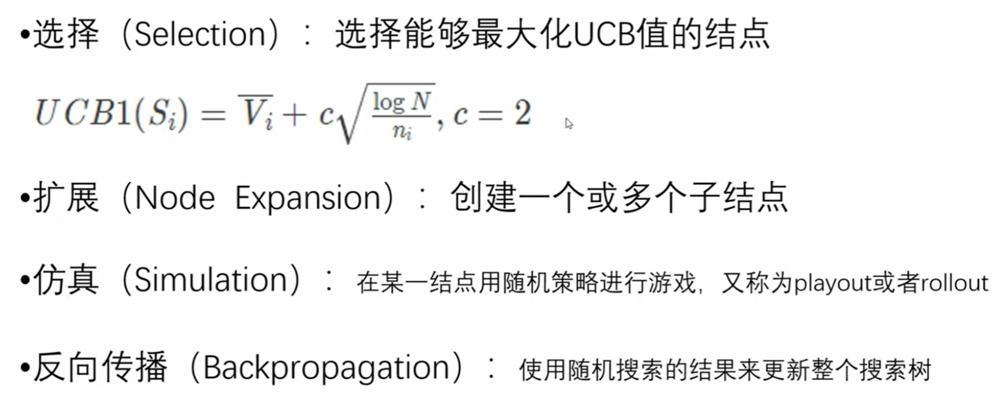
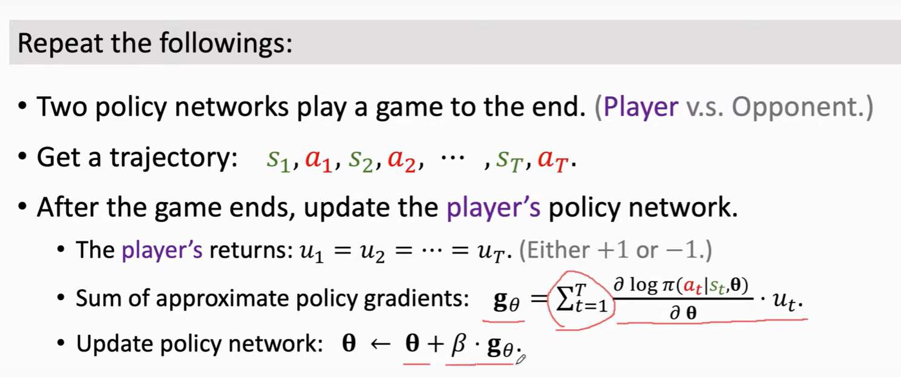
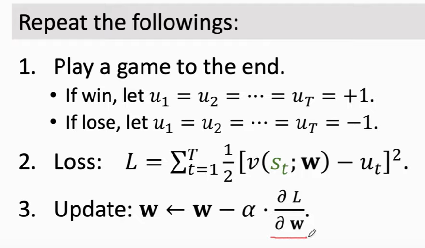
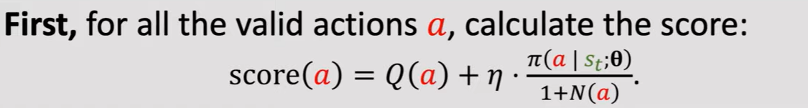
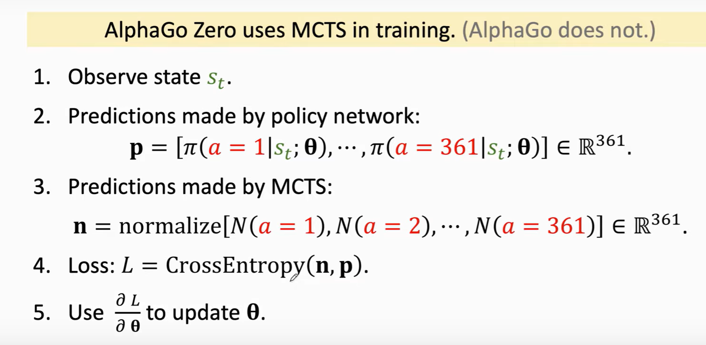
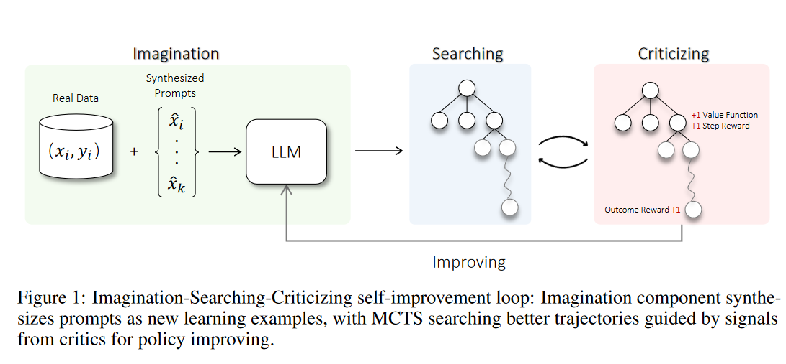

## MCTS

### 基础背景
*  符号定义
    * 状态 `s`、动作 `a`、奖励 `r`、回报 `u`（奖励的折现）。  
    例如，AlphaGo 中 `s_t` 是棋局，`a_t` 是下一步可以落子的位置，`U_t` 是回报。

    * `π` 代表策略网络，`θ` 是 `π` 的权重，`Q` 是动作价值函数，`V` 是状态价值函数。

* MCTS 需要用到哪些网络？一个策略网络、一个状态价值网络

### 策略网络 Policy Network：π_θ(a|s)
策略网络是根据现有状态 `s`，决定下一步做什么 `a` 的网络。可以通过 behavior cloning 和 policy gradient 进行训练

* behavior cloning 是监督训练，policy gradient 是 RL
* policy gradient 主要想要更新的是参数 `θ`，其梯度有如下近似

    

    
    

    可以看到，要更新策略网络的参数 `θ`，重要的是得到 `Q_π(s_t,a_t)`，也就是动作价值函数，下面讲

### 价值函数：动作价值和状态价值
* 动作价值：`Q_π(s_t,a_t) = E[U_t|s_t, a_t]`
    * 衡量的是当前状态下，每个 action 的回报，可以用观测到的回报 `u_t` 近似替代
    * 例如在 AlphaGo 中，两个策略网络互相博弈，胜出者 `u1 = u2 = ... = u_t = 1`，失败者 `u1 = u2 = ... = u_t = -1`

* 状态价值：`V_π(s_t) = E[U_t|s_t]`
    * 衡量的是当前状态下的胜率。可以用一个神经网络 `v(s;w)` 来近似 `V_π(s)`，其中 `w` 是网络权重

### MCTS 算法步骤：Selection、Expansion、Simulation、BP
> https://www.youtube.com/watch?v=y2avl6b5ObQ 

MCTS 算法一共4步：Selection、Expansion、Simulation、BP。整个过程会重复很多次

* Selection：选一个 **假想的** 要探索的动作
    * 例如下图用的是一个传统的 UCB 公式。其中 `N` 是总的探索次数，`n_i` 是当前节点的探索次数，`V` 是节点的 value。会鼓励选择：分数高并且探索次数少的节点。

        

        
        

* Expansion
    * 如果 Selection 的节点没被探索过，也即 `n=0`，那么枚举当前节点所有可能的动作，选取子节点为当前节点
* 对 Expansion 得到的子节点进行 Simulation（也叫 Playout/Rollout）
    * AlphaGo 中，会让两个策略网络博弈到游戏结束，分出胜负
* BP，更新蒙特卡洛树上的 `V`、`N`、`n` 等记录

### AlphaGo 中 MCTS 的 4个 步骤
> https://www.youtube.com/watch?v=zHojAp5vkRE&t=172s

* 用监督学习 Behavior Cloning 背棋谱
    * 主要作为 policy network 的初始化（但 behavior cloning 很难学到棋谱外的棋局）

* 训练策略网络 `π_θ(a|s)`
    * 让两个 policy 网络互相博弈，直到分出胜负（self-play）
    * 得到 trajectory：`s1，a1，s2，a2，...，S_t，a_t`
    * 根据胜负，更新 player 的策略网络。而 opponent 不更新，从过去的策略网络中随机选一个即可

        

        
        

    * 因为目标是最大化回报，所以用的是梯度上升

* 训练价值网络
    * 也是让两个策略网络博弈，目的是最小化策略网络 `v` 的估计和 `u` 的偏差，所以用梯度下降
        

        
        

    * 其中策略网络和价值网络可以用相同的主干网络得到，但用不同的 head。对于围棋（19*19），策略网络的输出是 361 维的向量，价值网络是标量。

* 在实战推理的时候用 MCTS（策略网络和价值网络都训练好了，只更新 MCTS 数中的值）

    * 其 selection 用的是如下公式
        

        
        

    * Simulation：AlphaGo 中，会让两个策略网络博弈到游戏结束。在这个过程中，用状态价值网络 `v(s;w)` 对每个状态打个分，最终的分数是也会考虑进胜负的奖励（±1），最终 `V(s_t+1) = 0.5*v(s_t+1; w) + 0.5*r_t`
    * 每次 BP，AlphaGo 会利用每个状态下，状态价值网络的分数平均值 `mean(the record of V's）`，更新第一步 selection 中每个节点的 `Q(a_t)`

### AlphaZero 
* AlphaGo 为什么要 MCTS？---如果只用策略网络，可能一个小错误就会导致出现大的偏差
* AlphaZero 和 AlphaGo 的区别？--- 策略网络训练没有用 Behavior Cloning，而是用了 MCTS，如下图

    

    
    

### MSTC 用于 LLM Reasoning
> Toward Self-Improvement of LLMs via Imagination,
Searching, and Criticizing 

* `策略网络 policy networks` 也即最终要回答问题的大模型
* `价值网络 value function` 用于在 MCTS 中给出相应分数（作为 critic）
    * 用策略网络 LLM 的权重初始化，加一个 MLP 层，尝试最小化基于每个 s 去预测 return u 的偏差

* 还有两个经常遇见的概念，作为 value function 的补充：`ORM（Outcome Reward Model），PRM（Process Reward Model`。他们功能和价值网络类似，分别是给出稀疏和稠密的 immediate reward
    * ORM：用于给出  a sequence of actions or options `o_{1:T}` 的整体的分数，代表整个 sequence 的成败或质量
    * PRM helps predicts the immediate action-specific reward given the state and the option (可以理解为动作): `R(s_t, o_t)`

* LLM 和 MCTS：一种可能的交互方式
    * 训练 `价值网络 value function`，还有 ORM，PRM 等，用于在 MCTS 中给出相应分数（作为 critic）
    * 用 MCTS 去构建更好的 trajectory（也即更高质量的数据）
    * 用新构建的数据对 `策略网络 policy networks` 进行 SFT

    

    
    

