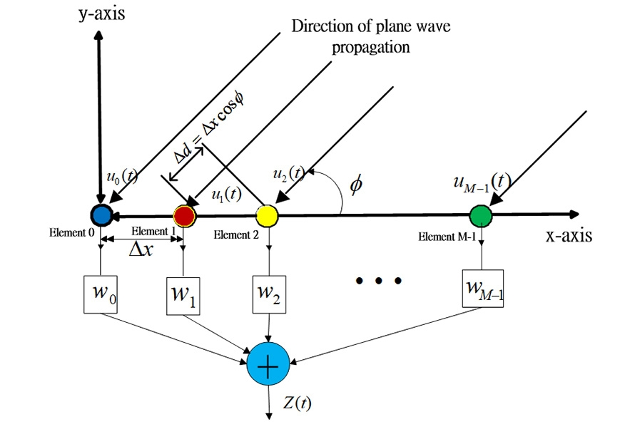
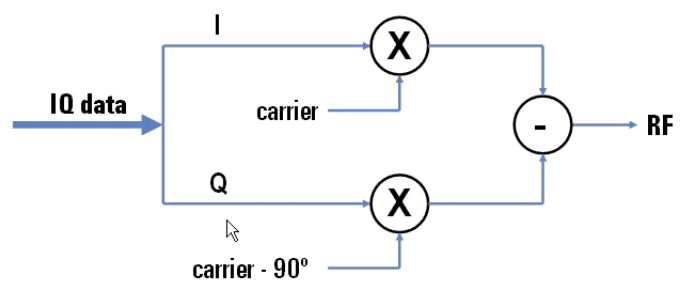
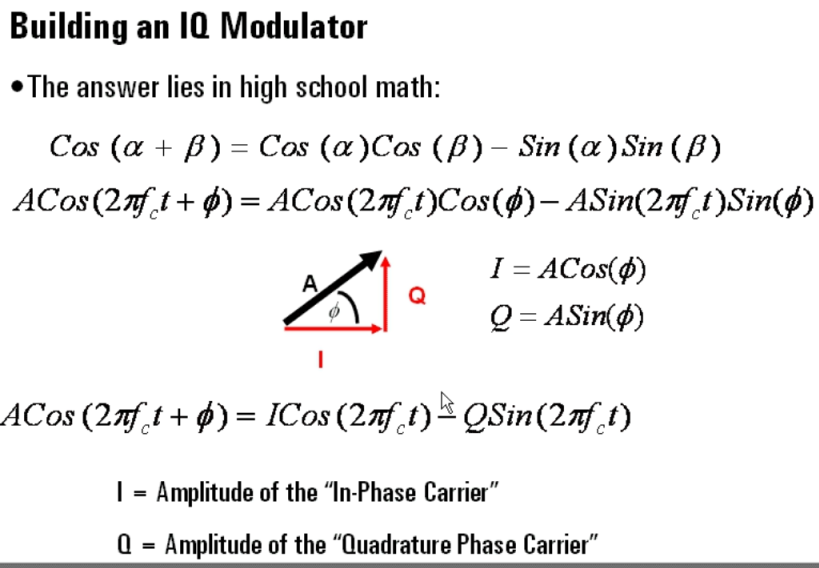
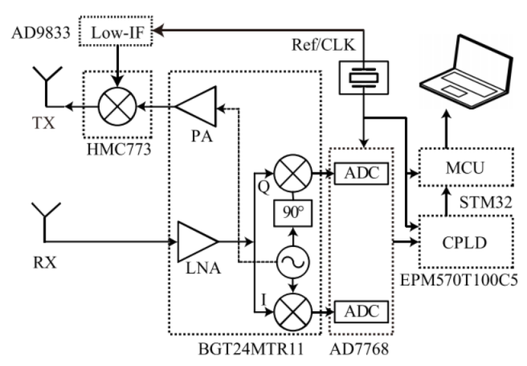
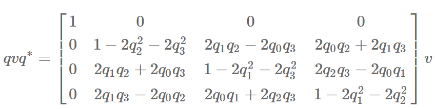
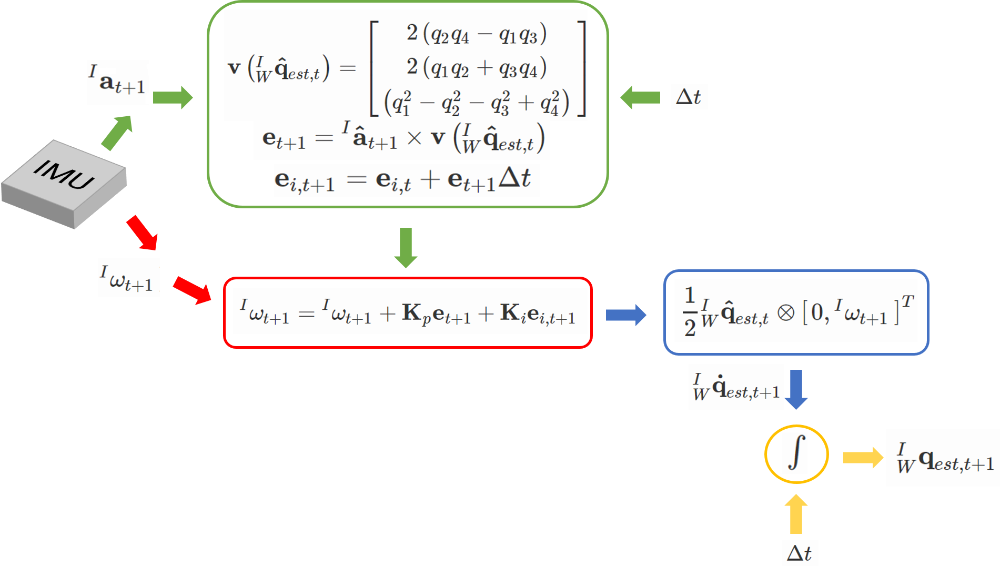

# Fourier Transformation
## 为什么 FFT 之后要 fftshift?
> https://www.zhihu.com/question/22611929/answer/621009581

fftshift 将零频点从四个角上移到频谱的中间，方便观察，主要利用的是平移不变性。

原因：离散信号的频谱是有周期性，采样点数为N的DTF变换，频谱的周期为N。FFT得到的频谱，在`0`、`f_s`、`2f_s` 都有较大的频率响应（f_s是采样频率）。因为 `(-f_s/2, 0)` 和 `(f_s/2, f_s)` 是一样的，所以fftshift操作并没有改变什么（DFT得到的一个连绵无限的周期性频谱图，我们显示的fft结果不过截取了其中一部分，fftshift本质上是将我们截取的这部分的窗口移动了一下，使得零频谱移到中央）

因为 matlab 中的 fft 算法都是将0放在第一个的，所以在要用 fftshift 将零频分量移动到数组中心
```
temp=fftshift(ifft(fftshift(TEMP)))
```

<br>

## 离散傅立叶变换 DFT
> https://zh.wikipedia.org/zh-hans/%E7%A6%BB%E6%95%A3%E5%82%85%E9%87%8C%E5%8F%B6%E5%8F%98%E6%8D%A2  
  <p align="center" >
	
  </p>

* 傅立叶变换的输出是复数吗？  
是的，求幅值可取绝对值，求相位可用`arctan(-real/image)`，一般是有一个求幅值的操作（因为要找到幅值最大的频率，然后该频率在FMCW下对应的距离、速度等）

* 为什么输出是复数？  
`x[n]`是实数，`x_hat[k]`明显是复数 
* 为什么 FFT 代表从时域到频域的变换？  
IDFT中，`x_hat[k]` 乘以不同频率的正弦/余弦信号，得到原信号 `x[n]`，所以可理解为 `x_hat[k]` 就是这些不同频率的正弦/余弦信号的幅值，也即频谱图（f-A）

<br>

# FFT
> 一个很好的讲解视频：https://www.youtube.com/watch?v=toj_IoCQE-4  

FFT 是 DFT 的加速版本，其原因是 DFT 所需要的矩阵运算能够二分为两个小的矩阵运算，不断递归下去，复杂度就从`O(n^2)`降低为`O(n logn)`

FFT中，对于给定的一段信号，增大采样点数能提高频谱信噪比，加窗函数一定程度上也可以获得更好效果。此外，有时在时域中肉眼看起来很有规律的信号，fft后得不到结果，一个很重要的原因是采样率没有大于最大频率的两倍。这种情况下唯一的办法就是提高采样率

下面是一段实例 Matlab 的 FFT 代码：
```matlab
Fs = 20;            % Sampling frequency                    
T = 1/Fs;           % Sampling period       
L = 1024;           % Length of signal
t = (0:L-1)*T;      % Time vector
n = 1;              % repreated times 
LL = L*n;

S = sin(0.5*pi*2*t);
X = S + 1*randn(size(t));
XX = X;

if n>1
    for i=2:n
        XX=[XX,X];
    end
end

figure,plot(0:size(XX,2)-1,XX)  % raw signal

Y = fft(XX);
P2 = abs(Y/LL*2);
P1 = P2(1:LL/2+1);
f = Fs*(0:(LL/2))/LL;

figure,plot(f,P1)   % frequency spectrum: (0, Fs/2)
```
  <p align="center" >
	
  </p>

<br>
<br>

# 波和信号
## 数字波束形成
> https://www.2cm.com.tw/2cm/zh-tw/tech/A540D94709A74EF7BE05F4BFF1D54451   

DBF：digital beamforming 一般用于MIMO中。目的是在接收端采用一定的算法对多个天线收到信号进行处理，改善接收端的信噪比。
通俗理解：通过数字信号处理技术，将阵列里面的一个个小天线整合成一个大天线，使得雷达有更好的信噪比

例如，假设入射角度 `𝜙=30°`已被估算出來，用波束形成方法，对不同 virtual channel 的信号乘一个不同相位，就能使得朝向 `𝜙=30°` 的信号比例变得很大，从而提高从那个方向入射的信号的 SNR
  <p align="center" >
	
  </p>

当然，利用波束形成也可以进行 AOA 估计，见 https://blog.csdn.net/qq_37620696/article/details/86489688  


## 波的频率对其性质的影响
电磁波的吸收和发射不是连续的（能量是一份一份的）, 而是以一种最小的能量单位ε=hν为最基本单位而产生与吸收着的。
微观上，波频率越高，最小能量单位越大，由波粒二象性，波（粒子）的贯穿能力越强（通常我们说的波的功率是多少mw，与单位时间内发出了多少个最小能量单位有关）。  
同时频率越高，越容易受到阻挡（当障碍物或孔的尺寸大小与波长相当时，衍射较明显；当障碍物尺寸大于波长时，波就很难绕过了），所以衰减也越快（空气中的各种灰尘等）。  
宏观上，波频率越高，能携带的信息也越多，码率越高（单位时间内周期数更多）。
相反，频率低的波，例如地震波，波长非常大，则能绕过很多东西，衰减较慢，能传播比较远。

<br>

## 复数在信号里面是干什么的
* 简单回答：  
为方便计算（exp运算比三角函数简洁）与变换（傅立叶变换和拉氏变换等都涉及到复数）而人为定义的，模值为幅度，虚部一般无实际意义

* 详细回答：  
复指数信号并不是实验意义上的信号，实验信号均为实数信号，比如正弦信号、阶跃信号、冲激信号(即δ函数)、符号函数信号等等。你仔细冷静地观察会发现：复数信号(包括复指数)是数学变换之后出现的信号，常用变换有相量变换、傅氏变换(包括傅氏指数级数展开)、拉氏变换等。通过傅氏变换可观察到时域信号的频谱成份。通过拉氏变换可以将微分方程转变为复代数方程，降低求解方程的难度，复频域求得的方程解仍需要返回到时域解。因此复数信号是数学理论运算中随着数学变换而出现的。这里要注意一种特殊情况，大多数像函数(复频域)可以通过反变换回归到物函数(时域)，但有些在复频域理论中引入的新物理量和函数是不可返回到实数域的，例如复阻抗复导纳、各种网络函数、频响函数、零点极点图等等。幸运的是这些物理量和函数也不需要回归到实数域(时域)，它们可直接与实验测量及工程技术应用挂钩

<br>

## 数字信号处理的窗函数
> https://zhuanlan.zhihu.com/p/24318554  

* 简单回答：  
计算机进行傅立叶变换之前，会从无限长信号截取一个有限时间片段，再进行周期延拓。但这种截断若不发生在整周期处，会使得变换后的频谱发生畸变。在截断后加不同的窗函数可在不同方面（例如是更在意幅值精度还是频率精度）缓解频谱泄漏，要根据需求选取不同窗户函数

* 详细回答：  
数字信号处理的主要数学工具是傅里叶变换．而傅里叶变换是研究整个时间域和频率域的关系。不过，当运用计算机实现工程测试信号处理时，不可能对无限长的信号进行测量和运算，而是取其有限的时间片段进行分析。做法是从信号中截取一个时间片段，然后用截取的信号时间片段进行周期延拓处理，得到虚拟的无限长的信号，然后就可以对信号进行傅里叶变换、相关分析等数学处理。无限长的信号被截断以后，其频谱发生了畸变，原来集中在 `f(0)` 处的能量被分散到两个较宽的频带中去了（这种现象称之为频谱能量泄漏）。  
不同的窗函数对信号频谱的影响是不一样的，这主要是因为不同的窗函数，产生泄漏的大小不一样，频率分辨能力也不一样。信号的截断产生了能量泄漏，而用FFT算法计算频谱又产生了栅栏效应，从原理上讲这两种误差都是不能消除的，但是我们可以通过选择不同的窗函数对它们的影响进行抑制。**矩形窗主瓣窄，旁瓣大，频率识别精度最高，幅值识别精度最低；布莱克曼窗主瓣宽，旁瓣小，频率识别精度最低，但幅值识别精度最高。**


<br>
<br>

# FMCW Radar
## Range FFT, Doppler FFT 和 AoA Estimation
> https://blog.csdn.net/nuaahz/article/details/90719605 
* Range FFT是对一个chirp上的ADC采样进行的。range FFT将时域信号(坐标是t, A) 变为频域信号(坐标是f, A)，A是幅度，因为 FMCW 中 IF 信号频率 f 正比于距离，所以用 FFT 可以求出距离  
* Dopper FFT 是对一个 frame 内不用 chirp 的同一 range bin 的数据进行的。因为频率基本相同，doppler FFT 关注的是 IF 信号相位变化。doppler FFT 采样的时间间隔是 chirp interval。phase changing 信号的频率和两个 chirp 之间的相位差有关，而相位差和速度成正比。所以求速度转化为求 phase signal 的频率，显然 FFT 可以派上用场。

  <p align="center" >
	
  </p>

* AOA Estimation 也可以用 FFT，原理是 virtual antennas 接受到的 IF 信号的频率差值正比于距离差值，而距离差值正比于 `sin(\theta)`。所以 `\theta` 可以通过对不同  virtual antennas 的 IF 信号进行 FFT 得到。

* FFT 怎么和物理世界结合起来？
因为FFT变换得到频域，FMCW中，由频率可推出距离、速度、角度，所以可以测距、测速、测角度。
DFT中，k前面的系数是`(2*pi*n/N)`，也即一个bin对应的分辨率。一共N个bin，一个bin对应的分辨率乘以 N 就是最大量程。FFT 得出 bin_index 后，乘以一个分辨率，即得到物理世界中的数值（距离、速度）

<br>

## I/Q 信号
IQ 调制的主要优势是能够非常轻松地将独立的信号分量 `Acos(𝜙)` 加到一个高频载波信号上，形成复合信号 `Acos(2πft+𝜙)`，原理如下：
  <p align="center" >
	
  </p>
  
  <p align="center" >
	
  </p>

同理，在雷达的接收端，也可以用`IQ解调`再将这个复合信号分解为独立的信号分量，使用IQ的带宽是`只是用实部或只使用虚部的带宽`的两倍
  <p align="center" >
	
  </p>

<br>

## FMCW processing pipeline
> https://e2echina.ti.com/question_answer/analog/other_analog/f/60/p/197625/614435

* Pipeline 1：range -> angle -> doppler
    * 适合近距离高分辨率应用、生成 range-azimuth map
    * 因为 angle processing 在 doppler fft 之前，所以可利用 chirp 间的复数信息构建高质量协方差矩阵，这有利于超分辨率算法（Capon, Music等）
* Pipeline 2: range -> doppler -> angle
    * 适合物体检测、点云估计、生成 range-doppler map
    * 因为只能利用 doppler FFT 之后的 single snapshot 数据进行角度估计。
 
当然也可以双分支，range-fft 之后用两个分支分别进行 doppler FFT 和 AoA Estimation，例如 mmWave industrial toolbox 中的 3D people counting。
   
<br>

## 超分辨率 AOA 算法
> [基于Bartlett算法和Capon算法的DOA估计](https://wenku.baidu.com/view/3bde1b58cfc789eb162dc854.html)  
> [阵列信号处理中DOA算法分类总结](https://wenku.baidu.com/view/5d9d869a0912a2161579299b.html)

总的来说分辨率上，MUSIC > Capon > Bartlett > FFT
* 延迟相加法/Bartlett法  
目标函数是使得来自信号方向的功率最大

* Capon 最小方差法  
约束条件是使得来自期望方向的信号功率不变；目标函数使得输出总功率最小，会用到原信号的协方差矩阵

* 子空间法：MUSIC，ESPRIT  
将信号分成两个子空间（信号空间、噪音空间）

<br>

## 四元数 quaternion
> https://www.zhihu.com/question/23005815/answer/33971127  
> https://www.cnblogs.com/WangHongxi/p/12357230.html   

### 物理意义
* 四元数相比于欧拉表示，能够避免万向锁的情况
* 四元数可以表示一个坐标系到另外一个坐标系的变换。定义一个旋转轴和角度，例如假设旋转轴对应的单位向量 `v = (vx, vy, vz)`，旋转角度为 `θ`（右手法则的旋转)，那么四元数可以表述为 `q = (q1, q2, q3, q4) = (cos(θ/2), sin(θ/2)vx, sin(θ/2)vy, sin(θ/2)vz)`。  
进一步用复数表示，`q = cos(θ/2) + i*sin(θ/2)*vx + j*sin(θ/2)*vy + k*sin(θ/2)*vz`，很显然，`qq^(-1) = qq* = 1`，所以 `q^(-1) = q*`
* 假设一个坐标点在坐标系A中坐标是 `v = (0, vx, vy, vz)`，要求其在坐标系 B 中的坐标 `v'= (0, vx', vy', vz')`，其中从 A 到 B 坐标变换对应四元数是 q；那么 `v' = q * v * q^(-1)`，而右乘 `q^(-1)` 其实也可以准换成左乘（见：https://krasjet.github.io/quaternion/quaternion.pdf 的 3.1.5），所以 `v'` 最终可以表示为如下矩阵左乘：
  <p align="center" >
  
  </p>

  

* 为什么是 `θ/2` 不是 `θ`？
high-level 理解，因为四元数 `q` 将 `v` 投影到了四维空间，`q` 左乘等于做了 `θ/2` 的旋转，而右乘 `q^(-1)` 相当于对目标做了 `θ/2` 的旋转 

### Mahony 算法求解姿态
> https://nitinjsanket.github.io/tutorials/attitudeest/mahony
目标是从6轴IMU数据中（3个加速度，3个角速度）估计位姿（角度）。分为以下几部：
  * 绿色框：t+1 时刻的加速度乘上一个 t 时刻的变换矩阵（也即绿色框第一行），算出加速度对 t+1 时刻角速度各个方向上的影响
  * 红色框：进行角速度的矫正，用了类似 PID 控制的补偿项，`K_P` 和 `K_i` 分别是误差和误差的积分的权重
  * 蓝色框：输入矫正过后的角速度，左乘一个 t 时刻的四元数，得到 t+1 时刻的四元数的倒数
  * 黄色框：对四元数的倒数积分，算出四元数（也即算出旋转角度，也即位姿）

  <p align="center" >
  
  </p>

