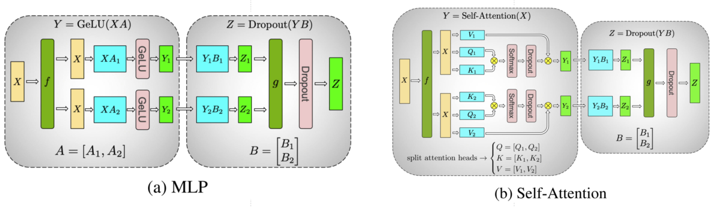
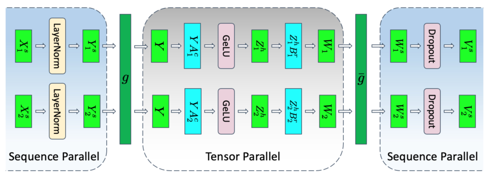
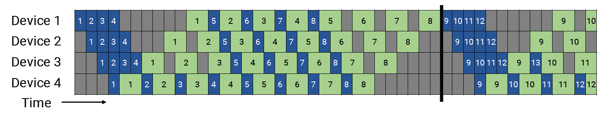
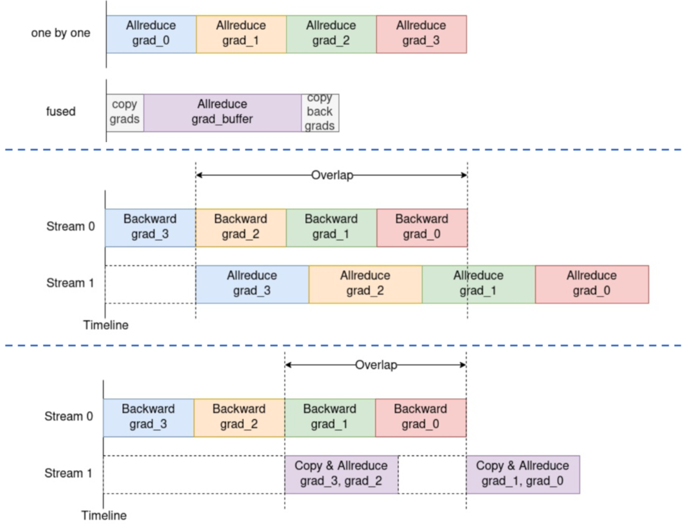
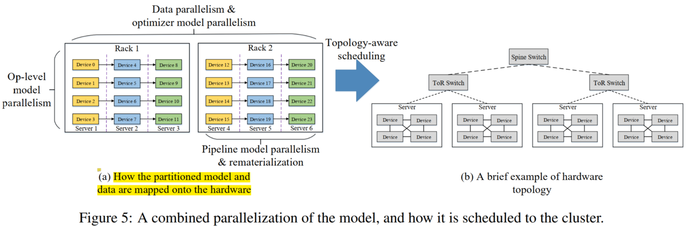
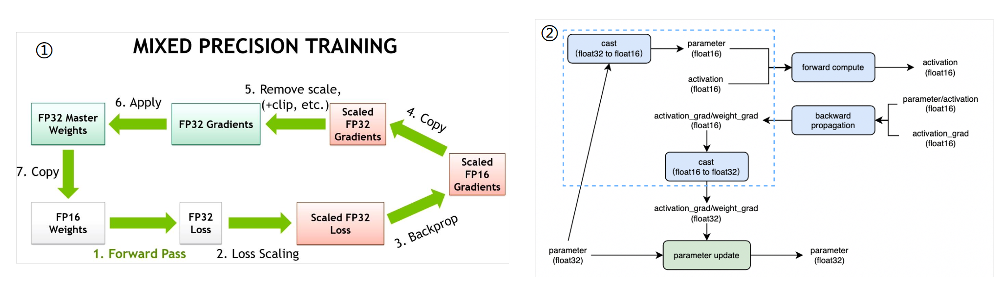
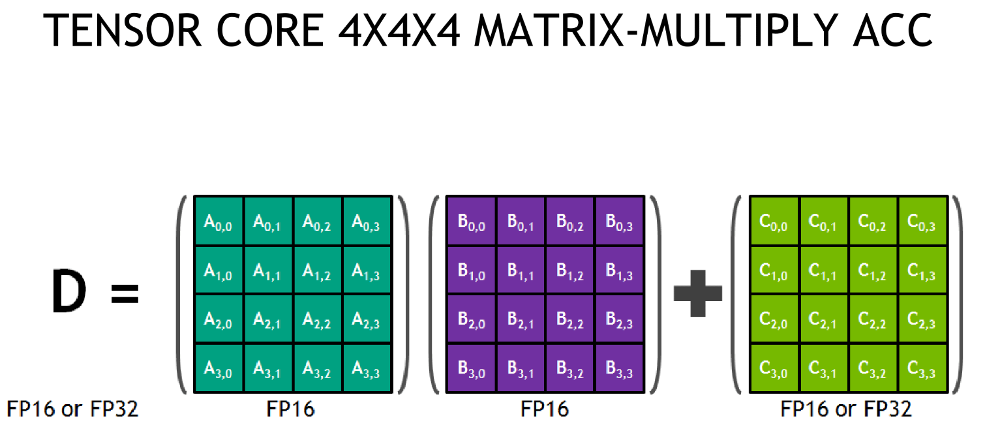
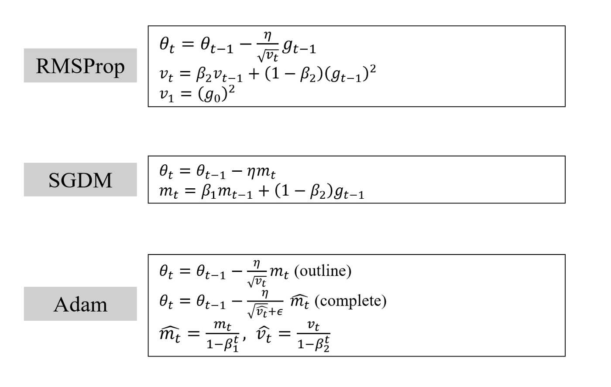
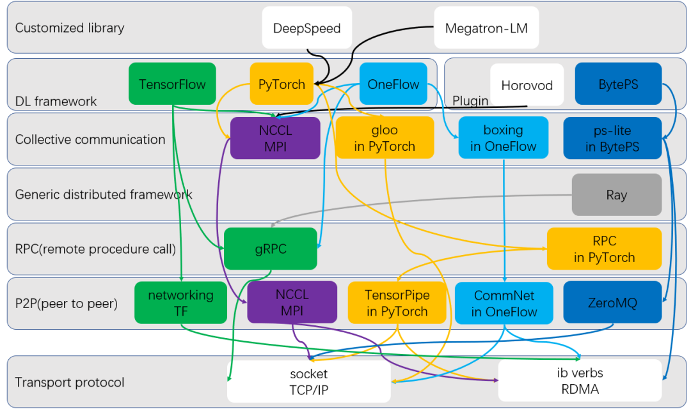
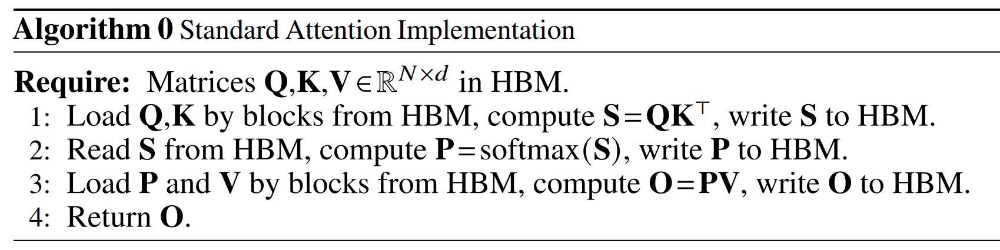

# 分布式训练
> https://mp.weixin.qq.com/s/cr-lYVvn1AQ7BN1VfzfuNg

## 训练并行方法
* 主要包含方法：数据并行、Pipeline 并行、tensor 并行、专家并行。后三者都可以笼统归为模型并行
* 带宽：NVLink > PCIE Switch >= infiniband > EtherNet    
### Tensor并行，有多种方法
* 1d 切分: Megatron-LM (NVIDIA)，并行切分 hidden dimension 了
    * FFN (两层MLP) 和 Attention Layer
        * 都有权重 AB，其中 A 竖切 B 横切，最后 all-reduce（element-wise相加），都有通信算子 f 和 g
            * f：no operation in FP (forward pass)，all-reduce in BP
            * g：all-reduce in FP, no operation in BP
        * MLP 是直接切权重，Attention 是按 head 来切：例如一共 24 个 head 切 4 份，那每张卡上计算 6 个 head

            <p align="left" >
            
            </p>

* 2d 切分
    * 1d 基础上加上 sequence parallel：`Reducing Activation Recomputation in Large Transformer Models`
        * tensor 并行如上如所示，权重被切分了，中间的计算结果的激活也被切分了（例如 XA_1，XA_2）；但每张卡的 input activation 都没被切分，比如 LayerNorm 和 dropout 的激活
        * 这篇文章提出的方法一： sequence 并行：不产生额外数量的通信算子，只是算子类型变了；同时会将 LayerNorm 和 dropout 的激活 也切分了 
            * g：all-gather in FP，reduce-scatter in BP
            * g'：reduce-scatter in FP, all-gather in BP

                <p align="left" >
                
                </p>
        * 方法二：recompute activation
            * 详见上面的 paper：softmax/dropout/attention over V 的激活占存储很大，但 FLOPs 不大，可以对它们进行重计算即可；其他 matrix 乘法相关部分就不进行重计算了，这样能减小 memory，但不增加很多计算开销

                <p align="left" >
                
                </p>


    * 1d 基础上再切分 batch：Optimus_An Efficient 2D Method for Training Super-Large Deep Learning
* 其他  
    * Tesseract: Parallelize the Tensor Parallelism Efficiently，可以配置成 2d 或者 3d 切分
    * 3d: Maximizing Parallelism in Distributed Training for Huge Neural Networks


### pipeline 并行
* GPipe，PipeDream 分别为 同步和异步
* GPipie 中每个 worker 都需要保存图中 mini-batch 1234 的 activation（总计 micro_size 份激活），而一般 `micro_size >> pipeline_num`
* PipeDream-1F1B 体现在最后一个 worker，一次 forward 过后就执行一次 backward，从而解决 micro_size 份激活的内存开销问题
    * 但其可能会导致一个 mini-batch 在 forward 和 backward 的时候用的是不同的版本权重。例如下图红色箭头中 work-3 microbatch-4 的 forward 和 backward 之间被插入了 3 的 backward，使得权重改变了一次（和深度学习假设冲突了），会导致训练效果下降
    * 为了解决这个问题，Pipedream 每个 worker 最多需要存储 4 个版本的 weight（4 是 stage 数量，一般是比 microsize 数量小很多）

        <p align="left" >
        
        </p>

        > 图中 W_i(v) indicates weights on worker i with version v  
        > 红色箭头表示了一个 microbatch-4 的 FP 和 BP

* PipeDream 之后又有两种变体 PipeDream-2BW，PipeDream-Flash；目标是减少 GPipie bubble，但同时也不像 PipeDream 一样存很多版本权重，并且尽可能同步 flash
    * Megatron-2 用的就是 PipeDream-Flash（下图），需要存 p 份（流水线数量）激活 + 和一个权重版本（对内存最友好）
    * PipeDream-Flush 其会比初版 PipeDream 慢一些，主要体现在：
        * 和 GPipe 一样有定期的 flush（黑色线，而不像上图 PipeDream 中在第 4 个 batch 之后就没有 flush 了，所以 bubble 会变大）
            * 下图 microsize=8，pp=4，但每个 device 最多堆积 pp 个 microbatch 的前向（device 3）
        * 还有一个区别是 worker3 的 microbatch 1 backward 之后，不执行 microbatch 3 forward 了， 而是闲置等待，直到可以执行 microbatch 2 backward

        <p align="left" >
        
        </p>


### 数据并行
> [AI框架基础技术之深度学习中的通信优化](https://zhuanlan.zhihu.com/p/348982652)   
* FSDP 
    * 见 [deepspeed Zero](https://www.microsoft.com/en-us/research/blog/zero-deepspeed-new-system-optimizations-enable-training-models-with-over-100-billion-parameters)，通过权重、优化器切分让数据并行的维度也能切分权重，能进一步压低每张卡上所需要的显存
    * 如图所示，n 是 batchsize，d 是输入隐藏维度：DP 横切输入 X，MP 横切权重 W。FSDP 切分的方式跟随 DP，例如 device 12 作为一组，device 34 作为一组，两组之间权重需要靠通信共享）

        <p align="left" >
        
        </p>

* 数据并行中通信的优化：从 Parameter Server 到 Ring All-Reduce
    * 前者是 torch 的 DP，总通信量随节点数 N 增加线性增加
    * 后者是 DDP，总通信时间随节点数 N 增加保持恒定
* 数据并行中的进一步优化：通信融合 commuincation fusion
    * 让 反向传播梯度的计算、梯度的传输 在时间上 overlap。但注意：结合结合通信融合时，不能全部融合成一个了，这样通信时间就不能 hidden 了

        <p align="left" >
        
        </p>

### MoE 专家并行

> Paper：GShard，Fast MoE，Faster MoE，PR-MoE (Deepspeed)，SE-MoE，Switch Transformer

* 例如：一共 24 个 experts，并行度为2。那么会有一半的 GPU 处理 12 个 experts，另外一半处理另外 12 个；如果并行度为 1，那么意味着每个 GPU 都完全包含了 24 个 experts

* MoE routing 原理：回顾一下 transformer 原理
    * 因为 Transformer 权重的作用其实是把 `d1` 维的隐变量变为 `d2` 维度的，所以 token 和 token 之间的处理是可以在时序上独立进行的（但共享权重）。Transformer 为了提高运行效率，会让多个 token 组成一个序列，然后几个序列组成 batch 一起吃进去，所以起来像是并行在执行。MoE 要做的是把这一组组的序列先合并再按 token 拆开，分给不同的专家（所以要 reshard）
    * 专家并行类似一种结合了 数据并行和模型并行 的并行方法：**不同 expert 之间的权重不同，并且处理的 token 也不同**
        * 专家并行和模型并行一起用：模型并行用在在 Attention Layer 和 FFN，专家并行只用在 FFN
* MoE routing 流程
    * input tensor 大小：(G, S, M)，分别为：group 的数量、每个 group 里面序列长度（或 token 的数量）、每个 token 的隐变量尺寸
    * Algo2 第一行是在计算每个 token 分到每个专家上的置信度。矩阵相乘使得在 feature dimension 上吸收了（M 维度）。权重 `wg` 对应的 `ME` 没下划线，表示没有在设备上进行 shard。而 `G` 代表不同的 group，代表在设备上 sharded，也即不同设备分别计算了自己拿到的 batch 要分给哪些专家  
    * Algo2 第三/四行 见 第二张图：input 要先和 mask 做爱因斯坦求和，再 all-to-all reshard
        * 其中爱因斯坦求和时，因为不同机器按照 group 切分数据，`(GSEC, GSM)` 在每个机器上其实是 `(SEC，SM)`；然后因为 `S` 这个维度代表一个 group 中 token 的数量，而上面说到 token 被分配给不同 expert 了，所以 `S` 这个维度消失了，每台机器上实际在做 `(SEC，SM) -> ECM`

        * 加上跨机器这个维度，`ECM` 变为 `GECM`，然后 `E-G` 进行 `reshard` 变为 `EGCM` 

        <p align="left" >
        
        </p>
        <p align="left" >
        
        </p>


### 总结
* 一般对通信量：Tensor并行 > 专家并行 > 数据并行 > pipeline并行
    * 其中 数据并行和 pipeline并行 的比较，见 https://www.high-flyer.cn/blog/model_parallel-2/ ，当 Transform 变宽时，pipeline 并行通信量上更占优。**但这个规则不是死的，见下文**
    * 经验：
        * **首先满足 tensor 并行，把最高速的 intra-server gpu 通信留给 tensor 并行**
        * 然后考虑 数据并行 / pipeline并行，其中 pipeline并行 是为了使得能够适应 GPU memory（对于超大模型）

* 例子一：如下图两个八卡 node，那么
    * node 内做的是张量并行，node之间做的是 pipeline并行，如果 node 数对于 pipeline 数量有富余，node 之间再做数据并行  
    * 但如下图，node 数有富余，所以 node 内部三种并行都有做：pipeline并行（GPU 01 相对于 45）、数据并行（GPU 01 相对于 23）、tensor并行（GPU 0相对于 1）
    * 一般来讲，切分方式的由近到远：**张量并行 > 优化器切并行 > 数据并行 > 流水线并行**

        <p align="left" >
        
        </p>

* 例子二：Pangu-Alpha 训练的并行方式：
    * 同一个 server 的卡之间（一般是8卡），tensor并行中的 all-reduce 通常是无法隐藏的
    * 一个 rack 的 server 之间，pipeline 并行
    * 不同 rack 之间，数据并行（+优化器切分并行）
    * PS：pangu 的训练是用带宽最小的 Cross-Rack 通信做了数据并行，看起来和上面说的 `数据并行通信量一般 > pipeline并行` 矛盾了
        
        * **Paper 里面做了解释，数据并行的通信 可以和BP 在时间上重叠，所以不紧要，怎么方便怎么来**：Deploying data parallelism and optimizer parallelism across racks is due to that the induced communication operators are not on the critical path of the training iteration, which could be fused and overlapped with backward propagation to improve the performance
    
        <p align="left" >
        
        </p>

* 例子三：MOE 模型的训练并行方法
    * 用了 数据并行 + 模型并行 + 专家并行
    * 没有 pipeline 并行了，专家并行替流水线并行在 server 之间进行；这需要 server 之间的交换机支持 all-to-all 算子

        <p align="left" >
        
        </p>


<br>

## fp32/fp16/bf16、混合精度、训练溢出
> [好文：如何解决混合精度训练大模型的局限性问题](https://www.51cto.com/article/746136.html)  

### fp32/fp16/bf16
* fp32/fp16 绝大多数硬件都支持，所以可以用混合精度训练提高吞吐；但 bf16/tf32 只有新的硬件才支持，V100/昇腾910等不支持
* fp16 的表示范围为 [6\*10e−5 ~ 65504]，FP32 是 1.4\*10e-45 ~ 3.4*10e38
* bf16 具有和 fp32 相同的 range，但精度（也就是两个最小单位之间的间隔）降低
    * bf16/fp32 进行混合精度训练，可以减少溢出几率
    * 对于大型 transformer，bf16 损失的精度被证明不怎么影响收敛
* tf32 是 A100 中引入的新格式，用于替代 fp32，也即可以全程 tf32 训练或 bf16/tf32 混合训练

    <p align="center" >
    
    </p>

### 混合精度训练的要点
bf16/fp32 混合训练因为两种格式在 range 对齐了，并且 bf16 比 fp16 range 更大，所以比 fp16/fp32 混合训练稳定性更高。但 fp16/fp32 混合训练 GPT-3 大模型也是完全可行的，只要解决可溢出问题，有以下几个要点：
   
* fp32权重备份 + loss scaling 解决溢出问题
    * 对 loss 进行 scale：见左图，主要是为了防止 fp16 的梯度下溢，计算出 scaled fp32 的梯度后，更新 master weight 时，还需要将梯度 unscale 回去
    * gradient 备份流程：见右图，所有前向后向都可以全用 fp16 (weight、gradient 全用 fp16)，只在 master weight 更新的时候，才用 fp32

        <p align="left" >
        
        </p>

* 处理 NaN 的 batch 
    * dynamic loss scale (PyTorch 中采用的这种方案）  
    在一个 window 内，如果没有上溢 NaN/Inf，loss scale 变大（例如乘2）；如果有上溢 NaN/inf，则降低 loss scale，并跳过该 batch，不更新梯度
    * 或将 INF 值强行改为 FP16 的最大值（饱和模式的溢出检测，对精度可能有影响）；最好需要直接跳过 Inf/NAN 的 batch

* 基于 Tensorcore 进行矩阵乘加： 

    在某些模型中，fp16 矩阵乘法的过程中，是可以用 fp32 进行矩阵乘法中间结果的累加，以减舍入误差，保证精度    

    这也是为什么有些人说，只有 Volta 及之后有 TensorCore 的 GPU (例如V100)，才能利用 fp16+混合精度来进行加速。其他 GPU 如果硬要用 fp16，只能做 fp16 的 multiply-add operation，会有较大精度损失

    <p align="left" >
    
    </p>

* 一般混合精度训练，fp32 和 fp16（bf16）分别用在哪
   * 计算
      * 正向反向矩阵乘 fp16 进 fp16 出（优化方案是 Tensor 后接非线性算的子 matmul fp32 出，或上文 TensorCore 方案） 
      * 非线性算子 softmax，layernorm 用 fp32 计算；最后一步计算 logits 的 mlp（这个影响较小）
      * MoE 的 router 要用 fp32，见 Switch Transformer Table 2
      * 大模型网络特别深的话，resiudal 用 fp32 计算（减小累计误差）
      * 数据并行维度很大的话：数据并行 accum_all_reduce_grad 尝试用 fp32
   * 模型及梯度存储：fp32 master weight，fp32 momentum，fp32 variance；其余前向后向计算时，存一个 fp16 权重，一个 fp16 梯度（这个 fp16 梯度会被 cast to 32 来更新优化器）
   * 通信：主要是 reduce 相关的算子，包含 all reduce、reduce scatter、reduce 本身；根据条件选择 fp32 或 16
      * 数据并行/模型并行涉及：all-reduce
      * 优化器并行 和 序列并行 包含 reduce-scatter


### 如何提升混合精度训练的稳定性
* 用 fp16（以及之后的 fp8）训练时，需要用动态 scale  

    有时可能会遇见 loss scale 降为 1 不再回升，同时训练 loss 要么跳涨要么停滞不下降（相当于没在训练了）。解决方案：可以改变超参，包括 **降低lr**，**增大 warm up step**，**改变初始 loss scale**，或 **增大优化器的 epsilon**（这样做会损失一部分优化器自适应学习率的能力）

    * 改变 lr，warmup，改变 loss scale 等：为了让梯度在一个合理的范围内，而不要产生某些特别奇怪的奇异值，尽可能减少溢出的概率

    * 关于改变优化器的 epsilon   
        * 在混合精度训练中的影响
            * **按照混合精度训练惯例**，优化器内部的 momentum，variance 都是用 fp32 进行的；这种情况下，改变 epsilon 的帮助可能不大
        * 如果优化器用 fp16，epsion 的影响会比较大
            * 如果梯度的二阶矩过小，分母 `v_t+ε` 在 fp16 中下溢出变为 0（fp16 最小值为 5.96e-8，但 epsilon 一般设为 1e-8），反而会上溢，模型的改变量变为很大，从而导致训练不收敛

                <p align="left" >
                
                </p>
            
    * loss scale 不再上升/loss 停滞：
        
        因为每个 window 中都有 Nan。Adam 优化器中分母 `v_t+ε` 这一项没有严重到下溢，只是因为时不时有 NaN 发生，导致 loss scale 上不去保持为1。因为 loss scale 不够大，模型其实一直在下溢，几乎不再更新    

    * loss 跳涨：和 Adam 有关
        
        当出现一个难度较大的 batch（outlier，例如全是代码数据），在这个 batch 中梯度出现上溢 NaN 了，如果用的饱和模式（Nan 被赋成 fp16 的最大值）。通过这些异常batch 之后，因为有 momentum，并且 loss scale 因为溢出减小，之后 batch 的梯度可能就一直下溢了

* 对 softmax 进行数值稳定性改造
    > [如何防止softmax函数上溢出 (overflow) 和下溢出 (underflow)](https://www.codelast.com/%E5%8E%9F%E5%88%9B-%E5%A6%82%E4%BD%95%E9%98%B2%E6%AD%A2softmax%E5%87%BD%E6%95%B0%E4%B8%8A%E6%BA%A2%E5%87%BAoverflow%E5%92%8C%E4%B8%8B%E6%BA%A2%E5%87%BAunderflow/)

    用 f(x-max) 代替 f(x)；再把 log 内的除法改成 log 见的减法，分子的exp和log低效了、分母避免了下溢

    <p align="center" >
    
    </p>

* 其他
    * 如何尽可能早地发现溢出的可能？    
    一般经验是，在训练前期，可以用一个 Tensor Collection Hook (TCH)，收集溢出比率，比率在 1% 以下并保持稳定而非上升趋势，后期发生溢出可能性较小

    * 出现 loss spike 的原因？  
    见 PaLM Paper 5.1节，不一定是只因为数据不好，可能来源于模型某种状态和数据的耦合。因为用导致 spike 的数据但换一个 ckpt 就不会产生

### 溢出案例分析：fp16/32 混合训练时的下溢问题

* 溢出分为上溢、下溢。动态 scale 的机制是，上溢 loss scale 会减半。如果 window 设为 1000，也即 1000 个 step 不上溢，就将 loss scale 加倍。如果最后控制在一个稳定的 scale 范围，训练中出现梯度的最大值约等于 max/scale。由此会有两个推论：
    * 选取较小的 window，scale 会偏大；选取较大的 window，scale 会偏小  
    原因：假设梯度的分布不变，包含大于 max_value/scale 的梯度的 step 会产生上溢，而这些 step 占比为 1/window（统计意义上），如上图。或者简单理解为，window 变小，scale 上升更快点

* 实际训练中可能出现一种状况，如上图右边，loss 随着 scale 下降会缓慢上升，然后 scale 恢复后又继续下降
    * 原因：上溢引起 scale 下降，scale 下降后没有及时恢复又诱发下溢，导致一些权重的参数被错误赋为 0
    * 解决方案：减小 scale window size，梯度通信用 fp32

* 用 fp32 进行梯度通信累加得到的 scale vs. fp16 的梯度通信累加得到的 scale
    * 以 fp16/32 混合精度训练为例，fp16 范围为 [6\*10e−5 ~ 65504]。scale 可能到 10e7 就上不去了，且 scale 下降到 10e6 会发生下溢。那么梯度的范围可估算为：`[6*10e-5/10e6，65504/10e7] = [6*10e-11，6.5*10e-3]`，平均梯度可通过 globalnorm 估算（globalnorm算的是所有梯度的平方和的开方，假设是 0.5，模型 100B （1e11）参数，平均梯度就是 5\*10e-6）
    * window 相同，有一种情况是，fp16 梯度通信会有一些精度问题，导致出现一些异常的梯度值（例如超过 `65504/10e6`，虽然绝对值不大，但相对梯度的平均值很大了），就会导致上溢 scale 上不去。最后呈现出用 fp32 进行梯度通信的 scale 会更高

    <p align="center" >
    
    </p>

<br>

## 分布式深度学习框架
### Overview  
* 分布式深度学习框架网络传输的抽象层次：[对抗软件系统复杂性：恰当分层，不多不少](https://mp.weixin.qq.com/s?__biz=MzU5ODY2MTk3Nw==&mid=2247485568&idx=1&sn=22dc2fdec7d30bcc9d50b8ed0d49acec&chksm=fe4186b6c9360fa0fd66c979af18d8e7afa2e7dd4de4561638294d11856bd7ea9501bb2cfb17&scene=21#wechat_redirect) 
    <p align="left" >
    
    </p>
    
    * Ray 基于 gRPC，不支持高性能网络 RDMA 协议，有性能瓶颈
    * TensorFlow 的最初设计里，无论是控制还是数据传输都基于 gRPC 实现，也不能调用 RDMA，有性能瓶颈（后来有了 networking TF 插件改善了）


### Megatron
> https://github.com/nvidia/megatron-lm 

* 运行步骤
    * Docker pull 和 执行
    * 数据处理，改造 Tokenizer
    * Megatron 自带 Tokenizer：BertWordPieceLowerCase, BertWordPieceCase, GPT2BPETokenizer
    * Compiling dataset index
    * Compiling (only the first time for running) and loading fused kernels
* Megatron 代码学习
    * Tokenizer 及并行原理：https://zhuanlan.zhihu.com/p/388830967 
    * 代码：https://zhuanlan.zhihu.com/p/470279673 
* Megatron 中 FFN 实现：https://zhuanlan.zhihu.com/p/366906920 
    * 第一个线性层：input broadcast 到每一个设备上，权重竖切，`XW = X[W1, W2] = [XW1, XW2]`
    * 第二个线性层：横切（结果需要 all-reduce 相加）
* 版本
    * 第一代：Megatron-LM: Training Multi-Billion Parameter Language Models Using Model Parallelism，是 **tensor 并行 + 数据并行**
    * 第二代：Efficient Large-Scale Language Model Training on GPU Clusters
Using Megatron-LM，**在第一代基础上，加上了 pipeline 并行（用的 PipeDream-Flush）**

### Deepspeed 

* Zero 
    * 所以 ZeRO 提出：不用每个数据并行的节点上都存上所有层的相关信息；activation 的存储也可以 re-compute 省掉

    * 通俗易懂的讲解：**[ZeRO & DeepSpeed: New system optimizations enable training models with over 100 billion parameters](https://www.microsoft.com/en-us/research/blog/zero-deepspeed-new-system-optimizations-enable-training-models-with-over-100-billion-parameters/)**
* DeepSpeed 的本质：略微降低的效率去节省显存
    * DeepSpeed 核心是 `ZeRO`，本质上是一种 “节省显存” 的 **数据并行**，即：在数据并行下如何以更少的机器去跑更大的模型。DeepSpeed 假设了单层参数量可以在单张显卡上放得下，如果不满足这个假设，那么仍然需要使用 tensor并行，DeepSpeed 的 tensor并行是通过调用 Megatron 来实现的
    * 根据 NVIDIA 最新的那篇论文（链接：https://arxiv.org/abs/2104.04473 )，Megatron 在大规模训练的效率是超过 DeepSpeed 不少的
    * DeepSpeed 的论文一直强调：可以用更少机器训练更大的模型，但没有突出过在效率上的优势。DeepSpeed 后来又出了一篇论文：ZeRO-Infinity（链接：https://arxiv.org/abs/2104.07857 ），当单层参数量在单张显卡上放不下的时候，它通过对这一层算子切片，一片一片来执行，使得单卡也能跑起来一个巨大的层，可以理解成一种 “时间” 轴上展开的模型并行


### Megatron-Deepspeed 
> https://github.com/microsoft/Megatron-DeepSpeed  

* DeepSpeed version of NVIDIA's Megatron-LM that adds additional support for several features such as MoE model training, Curriculum Learning, 3D Parallelism, and others， 
Tensor 并行还是调用的 Deepspeed  
* **一般经验：借鉴 deepspeed 的写法，然后作为 extension 加在 Megatron-LM 上**


### PyTorch / Mindspore 框架内实现的并行训练
* PyTorch 
    * Tensor Parallelism：Megatron 已经实现了
    * Pipeline 并行：[官方 Pipeline Parallelism API](https://pytorch.org/docs/stable/pipeline.html)，基于 touchgpipe
    * Data Parallelism
        * 之前的 DP/DDP
        * 和 V1.11 推出的 [PyTorch Fully Sharded Data Parallel (FSDP)](https://pytorch.org/blog/introducing-pytorch-fully-sharded-data-parallel-api/)，框架自身实现了 DeepSpeed ZeRO 的功能

* [Mindspore：Distributed Training Design](https://www.mindspore.cn/doc/note/en/r1.1/design/mindspore/distributed_training_design.html) 
    * 包含三种：auto、semi-auto、hybrid
    * semi-auto 是指定了切分方式的，就按指定的来，没指定的就框架 auto
        * 例如一个 BN 接一个 MatMul，分别是数据并行、模型并行。那中间会存在张量重排，会用到 allgather + concat。Mindspore 会自动取搜索出这个通信策略
    * hybrid 是全手动写切分逻辑：https://www.mindspore.cn/tutorial/training/en/r1.1/advanced_use/save_load_model_hybrid_parallel.html 


<br>
<br>


## 通信算子
* 非规约算子：Broadcast、Scatter、Gather、All Gather、All-to-All
    <p align="left" >
    
    </p>
    
    * Scatter 和 Gather 互为反向，也即执行了 Scatter 再执行 Gather 之后能复原；
    * All Gather 效果上等于 Gather + Broadcast
    * All to All 的具体操作是：将节点 i 的发送缓冲区中的第 j 块数据发送给节点j，节点 j 将接收到的来自节点 i 的数据块放在自身接收缓冲区的第 i 块位置；有 N 个节点的话，每个节点就会有 N 个缓冲区
       * MoE 和数据并行维度变模型并行维度插入重排布时，会引入 All2All    


* 规约算子：Reduce、AllReduce、ReduceScatter
    * AllReduce = Reduce + Broadcast = ReduceScatter + AllGather
        
        <p align="left" >
        
        </p>

    * ReduceScatter 是一种并行归约算法，它将要规约的大数据分成多个部分，分配给不同的处理器执行局部归约操作（为了并行化）
* Torch `all_to_all`，`all_to_all_single` 最小测试样例：
   * `dist.all_to_all(output, input)` 要求 input output 都是 list；而 `all_to_all_single()` 的 input 和 output 都是一个 tensor
      * `all_to_all()` 运算要求 input 和 output 类型一样，并且 `input.shape[0]` 能被 group_size 整除，否则结果会出现意想不到的随机数
      * `all_to_all_single()` 运算要求 input 和 output 类型一样，并且 `len(input)` 能被 group_size 整除，否则结果会出现意想不到的随机数
      * input 和 ouput 可以是高维的，`all_to_all` 本质上时一个分布式的转置（在 input 第一维和 rank 之间）。所以除了第一维，其他维度都保序
   * 注意 input 和 output 的 dtype 和 shape 要匹配上，否则会出现数值错误或 ncclInvalidUsage Error
   * 下面有一个使用 `dist.all_to_all` 和 `dist.all_to_all_single()` 的例子
      ```python
      import torch
      import torch.distributed as dist
      import torch.multiprocessing as mp
      import os, math
      
      os.environ['MASTER_ADDR'], os.environ['MASTER_PORT'] = 'localhost', '6009'
      
      def generate_tensor(shape, rank):
          "generate tensor like tensor([[[ 0.,  1.], [ 2.,  3.], [ 4.,  5.]], ...]"
          input = torch.arange(math.prod(shape)) + rank*math.prod(shape)*1.0
          input = input.reshape(*shape)
          input = input.to(f"cuda:{rank}")
          return input
      
      def run_all2all_single(rank, world_size):
          dist.init_process_group("nccl", rank=rank, world_size=world_size)
          local_rank = dist.get_rank()
      
          shape = [4, 3, 2]
          input = generate_tensor([4, 3, 2], local_rank)
          output = torch.zeros(shape).to(f"cuda:{local_rank}")
      
          # 如果 input 和 output 类型不一样，all2all 将输出不正确数值
          assert input.dtype == output.dtype, "input output dtype are not the same"
          # 如果 all2all 输入数据的第一个维度不被 group size 整除，all2all 将输出不正确数值
          assert shape[0] % world_size == 0, "dim 0 of input/output tensor must divide equally by world_size"
          print(input, local_rank, input.dtype)
          
          dist.all_to_all_single(output, input)
          if local_rank == 0:
              print("-----")
          print(output)
          dist.destroy_process_group()
      
      def run_all2all(rank, world_size):
          dist.init_process_group("nccl", rank=rank, world_size=world_size)
          local_rank = dist.get_rank()
          input = [generate_tensor([2,3], local_rank), generate_tensor([3,3], local_rank)+0.5]
          output = []
          # 这里如果 rank 0 上第一个tensor的尺寸小于 [2,3]，或 rank 1 上第二个tensor尺寸小于 [3,3]，会报 ncclInvalidUsage Error
          # 如果 rank 0 第二个tensor，或 rank 1 第一个tensor尺寸变小，会出现数值问题
          if local_rank == 0:
              output = [torch.zeros([2,3]).to(f"cuda:{local_rank}"), torch.ones([2,3]).to(f"cuda:{local_rank}")]
          if local_rank == 1:
              output = [torch.zeros([3,3]).to(f"cuda:{local_rank}"), torch.ones([3,3]).to(f"cuda:{local_rank}")]
          print(input, local_rank)
          
          dist.all_to_all(output, input)
          if local_rank == 0:
              print("-----")
          print(output)
          dist.destroy_process_group()
      
      if __name__ == "__main__":
          n_gpus = 2
          run = run_all2all
          mp.spawn(run, args=(n_gpus,), nprocs=n_gpus, join=True)
      ```
* 一般而言都只用 `dist.all_to_all_single()`，因为其输入输出都是 tensor，可以用 torch.autograd 构造正反向（autograd 不对 list 生效）
   ```python
   class _AllToAll(torch.autograd.Function):
   
    @staticmethod
    def forward(ctx, input, input_splits, output_splits):  
        ctx.input_splits = input_splits
        ctx.output_splits = output_splits
        output = torch.empty([sum(output_splits), *input.shape[1:]], dtype=input.dtype).to(input.device)
        dist.all_to_all_single(output, input, output_splits, input_splits)
        return output
   
    @staticmethod
    def backward(ctx, grad_output):
        return (_AllToAll.apply(grad_output, ctx.output_splits, ctx.input_splits), None, None)
   ```
   详细例子，见 [all2all 多卡训练最小样例](./a2a_bp.py)


<br>

## 通信算子和并行方式的关系
### 概括
* 数据并行、张量并行、优化器并行会引入 Reduce（或 reduce 衍生的 all-reduce，reduce-scatter）    
* 流水线并行只 send/recv，不引入reduce
* 数据并行的通信一般和计算可以重叠隐藏，但张量并行的通信几乎无法隐藏（阻塞的），流水线并行中的通信在但个 microbath 是无法隐藏的，但在多个 microbatch 之间是可以隐藏的，bubble 也是无法消除的（只能尽量减少）

### 数据并行
* 数据并行训练，前向：各设备独立计算即可，不需要用到通信；后向：需要各设备实现梯度的 AllReduce    

* 其他场景，例如计算loss/accuracy，比如对各设备上的值进行求和，然后求平均等，也会用到 Reduce 操作

* 如上所述，AllReduce 有两种实现方式，分别是 Reduce + Broadcast = ReduceScatter + AllGather。这两种方式分别对应 parameter-server 和 Ring Reduce 方案：
    * parameter-server 的聚合方式，只用到 reduce 和 broadcast
    * Ring Reduce 方案：会分别用到 all_gather、reduce_scatter、send/recv、reduce
        * all_gather 首先将各个节点上的梯度信息收集到每个设备上
        * reduce_scatter 每个设备利用收集到的所有梯度，在本地计算减少后的梯度分块
        * send/recv 将减少后的梯度分块发送给环形拓扑中的下一个节点
        * reduce 节点收到相邻节点的梯度分块，局部reduce合并为新的梯度分块。
        * all_gather 最后环形遍历完成，再次进行 all_gather 收集每个节点的最终梯度。

### 张量并行
> 详细介绍见：https://www.zhihu.com/question/319355346 

* `Y = XW` 按行切分权重 W：只有正向有reduce

    X 需要按列切，W 按行切  
    正向是 Scatter X 为 X1 X2 --> 计算 Y1=X1W1，Y2=X2W2 --> reduce 为 Y  
    反向是 Y broadcast --> 各节点分别求梯度 dL/dX1，dl/dX2 --> concat 得到 X 的梯度  

    <p align="left" >
    
    </p>

* `Y = XW` 按列切分权重 W，只有反向有reduce

    X 不需要，W 按列切    
    正向 broadcast X --> XW1，XW2 分别计算得到 Y1 Y2 --> 然后 concat 得到 Y    
    反向是 scatter Y 得到 Y1 Y2 --> 各节点分别求梯度 --> reduce 得到 X 的梯度  

* **FFN 的张量并行：`Y = GELU(XA)B`（见 Megatron3 Paper）**

    * A列切，B行切；前向后向都会有一次 AllReduce（见下图的 f 和 f_bar）
    * 一次 AllReduce 的过程分为两个阶段，Reduce-Scatter 和 All-Gather，通信量表示为 2φ
    * Magetron3：Reducing Activation Recomputation
in Large Transformer Models 是把下图的 AllReduce 变成了 变成 `先AllGather + 计算 + 后ReduceScatter`，通信量没变，但是把 activation 也切分了

        <p align="left" >
        
        </p>

* **Attention 也是前向一次 AllReduce（f_bar），后向一次（f）**


### 优化器并行
* 优化器并行时，对于每个参数都会进行 AllGather 操作和 ReduceScatter 操作


<br>
<br>

# 大模型优化算法

## 位置编码
> https://zhuanlan.zhihu.com/p/525552086  
* 绝对位置编码
    * Sinusoidal 位置编码
    * 可学习的位置编码：weight 尺寸是 `（seq_len, hidden_size）`
    * 基于已有固定长度位置编码的层次分解
        * 其实是利用现有位置编码做线性组合 https://kexue.fm/archives/7947 
        * 仍需要 finetuning，效果损失可能较大
* 相对位置编码：推理长度可以大于训练长度，大多不加在 embedding 中，而加在 attention 矩阵上了
    * Rotary Position Embeddings
    * XLNet：Transformer-XL   
    * ALibi (ICLR22)：简单地在 attention 矩阵上加一个相对位置差距的矩阵，效果好于上述方法
        * ALibi + Flash Attention 实现 80k 序列长度：https://www.mosaicml.com/blog/mpt-7b 
* 长序列外推，见 [长序列外推算法](./Big_Models.md#长序列算法)
<br>

## 推理
### Decoding
主要步骤，选出 `累计置信度>top_p` 的 id，然后把这些 id 按 tempertature 处理之后的概率进行采样  
* `top_p` 又称 Nucleus Sampling，主要影响词汇量
* `temperature` 影响连贯性：过高可能不连贯

```python
def sample_probs(probs, temperature=1.0, top_p=0.85):
    sorted_probs = np.sort(probs)[::-1]
    cumulative_probs = np.cumsum(sorted_probs)
    cutoff = sorted_probs[np.argmax(cumulative_probs > top_p)]
    probs[probs < cutoff] = 0
    probs = probs**(1/temperature)
    return np.random.choice(a=len(probs), p=probs/np.sum(probs))
```

### 增量推理/全量推理、KV Cache
* 增量推理和全量推理
    * 增量推理每次输入的 seq_len 为 1，而全量推理每次为从句子开始到最新位置的总长度 
    * 假设 hidden_size 为 h，增量推理时，Q/K^T/V 的尺寸为分别为 (1,h)，(h,n+1), (n+1,h)，这里 n 就是需要 cache 的 K 和 V 的历史数据

    <p align="center" >
    
    </p>

* LLM 推理时分为 `prefill阶段 (吃prompt）`、`decoding阶段（串行输出）`
    * prefill 阶段，内存占用随 prompt 长度二次增长，`二次方显存是主要矛盾`；时间（计算复杂度）也应该是二次，但相比 decoding 的时间，不是主要矛盾
    * decode 阶段，利用增量推理内存占用是线性增长，推理时间也是线性；这时 `decode time 是主要矛盾`

<br>


## 降低 Multi-Head Attention 的平方复杂度
> 目标是高效计算 `Output = Softmax(QK^T)V`，并降低显存，QKV 和 output 尺寸都为 `N*d`  

### 需要重训练
* RMKV https://zhuanlan.zhihu.com/p/620469303 
    * Minimal RWKV Code：https://johanwind.github.io/2023/03/23/rwkv_details.html 
    * 串行版本利用上一个时间点的计算结果，实现 O(n) 的注意力
        * 方法起源于自回归：https://kexue.fm/archives/7546
        * Time-Mixing + Channel-Mixing，这里的 channel 也即 hidden-dimension
            * 两个模块中都有“token-shift”，也即上一个时间点的 x 乘上 mixture 参数和当前 x 混合
            * 总之就是让当前 token 和之前的 token 通过各种方法建立关联
        * 网络其他部分架构，和 transformer 差不多，见 paper，最后也包含 `final_layer_norm + MLP_head + Softmax`

        ```python
        # channel-mixing
        # 1. x 和上一步 x 混合
        # 2. 乘上权重 Wk，Wr 得到 k，r
        # 3. k 进行 ReLU 再平方，再乘上Wv 得到 vk（可以理解成 gating 分数）
        # 4. gaiting 分数乘上 sigmoid(r)，r 可以理解为 remember
        def channel_mixing(x, last_x, mix_k, mix_r, Wk, Wr, Wv):
            k = Wk @ ( x * mix_k + last_x * (1 - mix_k) )
            r = Wr @ ( x * mix_r + last_x * (1 - mix_r) )
            vk = Wv @ np.maximum(k, 0)**2
            return sigmoid(r) * vk, x
        
        # time-mixing
        # 1. 先将当前输出与上一时刻线性差值，乘上权重，得到 k、v、r
        # 2. 计算 wkv：wkv 是 v 的历史数据的加权平均，权重是 e^(bonus+k_i)*vi。wkv 是作为 gating 分数，会再乘上 sigmoid(r)
        # 3. 再计算下一次要用到的 分子num 和 分母den
        def time_mixing(x, last_x, last_num, last_den, decay, bonus, mix_k, mix_v, mix_r, Wk, Wv, Wr, Wout):
            k = Wk @ ( x * mix_k + last_x * (1 - mix_k) )
            v = Wv @ ( x * mix_v + last_x * (1 - mix_v) )
            r = Wr @ ( x * mix_r + last_x * (1 - mix_r) )

            wkv = (last_num + exp(bonus + k) * v) /      \
                (last_den + exp(bonus + k))
            rwkv = sigmoid(r) * wkv

            num = exp(-exp(decay)) * last_num + exp(k) * v
            den = exp(-exp(decay)) * last_den + exp(k)

            return Wout @ rwkv, (x,num,den)
        ```


* 利用矩阵乘法结合律，QKV 矩阵乘法先计算 KV，并用一个另外的核函数换掉 QK 的 Softmax
    * `Efficient Attention: Attention with Linear Complexities`
    * `Hydra Attention: Efficient Attention with Many Heads`
    * 这类方法两个问题：
        * Attention `O(n^2d)` 的复杂度变为 `O(nd^2)`，可能会增大推理的开销（增量推理 n=1）；虽然 transformer 整体的开销因为有其他层，还是 `O(d^2)`（n=1)；但需要实测
        * 怎样显示地加 attention mask，例如实现样本隔离的功能（每个 batch 里面的 mask 都不一样，不能用写死在 cuda kernel 里面的 mask
    * 所以一个小结，这类方法可能不太适应现在的 GPT，在 Bert 的时代是很好的工作

* Linear Transformer 方法（从局部稀疏化、或降低 QK^T 的秩出发）：Linformer, Linear Transformer, Reformer, Performer, BigBird 
    > https://0809zheng.github.io/2021/07/12/efficienttransformer.html  


* 上述方法本质上是降低 attention matrix 的秩，但不是没有副作用
    * `Low-Rank Bottleneck in Multi-head Attention Models`，Google 这篇中说到，即便是 O(n^2) 复杂度的 transformer 结构，由于 QKV Projection，当 per_head_dim 小于 seq_len 时，也会出现低秩的问题，会对准确度造成影响。所以提出固定 per_head_dim，改变 head_num
        * Paper 中 Table 1 做了一个实验，固定 dim=1024，增大 head_num 精度反而下降；和传统的认为 head 变多模型表现力更强正好相反
    * 延伸开来，针对长序列，对于上述进降低 attention matrix 秩的 linear transformer 方法
        * 当长序列 `seq_len >> per_head_dim*head_num` 时，为了控制 attention matrix 的尺寸，其尺寸是 (bs,num_head,seq_len,seq_len)，可以适当减少 head_num；一方面网络表现力可能会下降，但是缓解低秩和OOM的问题，可能利大于弊
        * 此外，上述进一步降低 attention matrix 秩的方法，一方面在序列较短时 overhead 反而增大（特别是增量推理 seq_len 其实等于 1 时），另一方面会加剧低秩的问题，需要结合实际情况考虑


### 不需要重训练（数学上等价）
> 主要降低了空间复杂度，没降低计算复杂度；甚至因为重计算有增加，但减少了很多 memory access，所以也能加速
  
* Self-attention Does Not Need O(n^2) Memory：https://zhuanlan.zhihu.com/p/445016136   

    * 原理       
        原始 attention layer 的计算步骤是计算出 `S=QK^T` 矩阵，再按行算 softmax。但这个 S 矩阵尺寸是 `(batch_size, num_head, seq_len, seq_len)`，当 seq_len 是 64k 时，显存占用是大问题  

        <p align="center" >
        
        </p>

        所以考虑，能不能不存这个非常大的 S 矩阵。其实是可以的，基本原理如下把 softmax 的并行计算变成串行。一个长度为 N 的向量，计算 softmax 实际上只需要 O(1) 外部存储   

        <p align="center" >
        
        </p>

    * 实现   
        * 上上图中，QKV 都是 N*d 尺寸，但 S 矩阵其实是按行取用的
            * 训练中，`seq_len=N`，但 softmax 可以按行计算，P 和 V 相乘得到 O 也可以按行
            * 增量推理中，天然 `seq_len=1`，S 矩阵尺寸为 1*N
            * 每一行的存储最大可以优化到 O(1)；所以不管训练还是推理，整个 attention layer 最大可以优化到 O(1) 空间复杂度，但这会拉低计算并行度
        * 实际实现中，每次计算 `O(sqrt(N))` 个元素的 softmax 值（也即上图每次计算两个），空间复杂度为 `O(sqrt(N))`

* Flash Attention
    > [Flash Attention 简记](https://zhuanlan.zhihu.com/p/582606847)  
    > 和 `Self-attention Does Not Need O(n^2) Memory` 相比，基本原理差不多，但把 batch_size 上的并行也考虑到了，算是上篇文章的一种 concrete 的工程实现

    相比原始 Attention，Flash Attention 用了两个技巧减少 attention layer 所需要的存储，并提高运算速度：Tiling 和 operator fusion  
    * `QK^T` 可以用 Tiling 矩阵分块来做。矩阵运算 `C=AB`，把矩阵 AB 分块，`C_ij = A 的第i行 和 B 的第j列的内积`，见 [Loop Tiling 的 CUDA 代码实现](../MLSys/CUDA_Program.md#with-shared-memory) 
    * Attention 矩阵的 softmax 是按行算的，`Softmax(QK^T)` 尺寸为 `N*N`，相当于 Output 的每一行都是 V 的 N 个 d 维向量按 softmax 结果做线性组合
    * 而按行计算 softmax 这个需求，其实可以和矩阵乘的 tiling 做 operator fusion。做矩阵乘法时候，顺便把 softmax 也算了

    * Block-sparse Flash Attention：固定 butterfly 形状的 attention mask

* ByteTransformer
    * 因为 FlashAttention 只用一个 threadblock，在 bs 较小时，可能用不满硬件资源；这篇文章利用多个 block，对不同 seq length 长度支持更好
    * 但在 bs 较大时，FlashAttention 还是有优势

<br>
