# 方差
## 样本方差 和 样本方差的无偏估计
方差：分母为N；样本方差的无偏估计，分母为 N-1  
* 直观的解释：如果在样本的均值给定的情况下，样本方差的无偏估计也是以 N 为分母的；但实际上，样本的均值本来也不是确定的，相当于实际的不确定度比 `以N为分母的方差` 大  
* 数学推导：https://www.zhihu.com/question/20099757/answer/13971886

<p align="center" >

</p>

## 协方差
> https://blog.csdn.net/zch1990s/article/details/80005940  
```python
import numpy as np
x = np.array([[0, 2], [1, 1], [2, 0]])  # shape (3,2)，3个样本，两个维度
y = np.cov(x.T)   # shape (2,2)，先转置，才能求维度和维度之间的 cov
```
求出的协方差，可以用来生成多元正态分布矩阵等等：
`np.random.multivariate_normal(mean, cov, size=None, check_valid=None, tol=None)`，这里 cov 要的是维度和维度之间的协方差，而不是样本和样本之间的相关系数

<br>


# 分布
* 伯努利分布重复 n 次就是二项分布
* 二项分布和 Beta 分布共轭
    * Beta分布，是一个事件出现的概率的概率密度分布  
    举个例子，通过过去的历史经验，我们知道运动员的三分命中率很难超过40%。假如老张是一个优秀老练的篮球后卫，其过去历史的三分命中率是35%，总投数为10000次，命中次为3500次。请问他在新赛季刚开始的时候，得到了一次三分投球机会，请问他这次投中的概率服从什么分布呢？我们必须清楚，**这个概率一定不是确定的，而是服从某种分布**。这个概率密度分布函数应该在0.35处最大，沿两边逐渐递减。实际上他命中的概率就服从beta分布，所以 Beta 分布可以理解为概率的概率

    * 共轭：先验与后验  
    根据贝叶斯定律，`后验概率P(θ|data) = 先验概率P(θ)*似然函数P(data|θ)/P(data)`，这里 `θ` 是模型参数，其中：     
      * `似然函数 P(data|θ)` 描绘的是：模型参数 θ 已经定下来了，出现某个 data 的可能性是多大  
      * `后验概率 P(θ|data)` 描绘的是：data出现了，模型参数 θ 的概率分布。通过最大化后验概率，就可以得到模型    

       在多次伯努利实验中，似然函数可以用二项分布表达，先验和后验可以用 Beta 分布描述（先验其实也是上一次的后验）    
       Beta 分布的两个参数 B(a, b) 正好是物理计数，a 代表正例个数，b 代表反例个数。`a/(a+b)` 代表这峰的位置，`a+b` 越大，beta 分布也就越窄（峰值位置的概率的可信度更高） 
        
       后验概率的更新方法见：https://www.zhihu.com/question/30269898/answer/123261564 ，形式是比较优美的   

        <p align="center" >
        
        </p>

* 多项分布和 Dirichlet 分布共轭
    > https://www.cnblogs.com/mercurysun/p/13931963.html
    * 类似于二项分布 和 Beta 分布的关系

        ```python
        # 掷6次骰子，1点到6点各出现一次。于是可以得到一个每一面在上的概率向量，而这个概率向量不是确定的（它服从狄利克雷分布），打印5次这个概率向量
        np.random.dirichlet((1,1,1,1,1,1), 5)
        # 输出
        [[0.10809771, 0.20665203, 0.37356706, 0.16629097, 0.04227898, 0.10311324],
        [0.02945716, 0.15565908, 0.3917251 , 0.00122295, 0.41365818, 0.00827752],
        [0.05997965, 0.09749087, 0.45065787, 0.01162155, 0.27004202, 0.11020804],
        [0.28493411, 0.345819  , 0.26229991, 0.06218243, 0.02848015, 0.0162844 ],
        [0.27543578, 0.10746597, 0.24076554, 0.2194201 , 0.00354662, 0.15336599]])

        # 投60次，每个面在上10次
        np.random.dirichlet((10,10,10,10,10,10), 5)
        # 输出
        [[0.16232684, 0.18316458, 0.15136794, 0.13208314, 0.21229593, 0.15876157],
        [0.15149954, 0.17152542, 0.13818261, 0.21960618, 0.14775583, 0.17143041],
        [0.20535253, 0.16066443, 0.16712831, 0.1486687 , 0.17545331, 0.14273271],
        [0.16003548, 0.16322083, 0.18979353, 0.17732615, 0.16594137, 0.14368264],
        [0.13556861, 0.16781649, 0.20356902, 0.12534922, 0.19523463, 0.17246203]
        # 可以看到，相比上面的输出结果更靠近 1/6
        ```

# ML 知识点拾遗
## VC 维
能被学习函数 h 打散的最大样本数，例如 R^2 平面中所有线性划分构成的假设空间的 VC 维为3  
如图所示, 当学习算法的 VC 维较低时, 训练误差和 ***泛化误差（也即 out-of-sample error）*** 之间的差异较小，但是对训练数据拟合能力较弱（in-sample error）；当学习算法的 VC 维过高时, 其对训练数据拟合的比较好, 但是将有很高的泛化误差界。
<p align="center" >
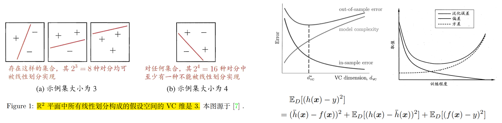
</p>

这里总的误差可以分为三部分：偏差，方差，噪音。   
如右图，***泛化误差*** 由偏差和方差（bias and variance）组成。bias 随着训练减少，variacne 则是慢慢增加（因为在训练不足时, 学习器的拟合能力
不够强, 训练数据的扰动不足以使学习器产生显著变化）。噪音是由于数据集标注 y 和真实本应该的标注 f(x) 之间有偏差造成的。
<p align="center" >
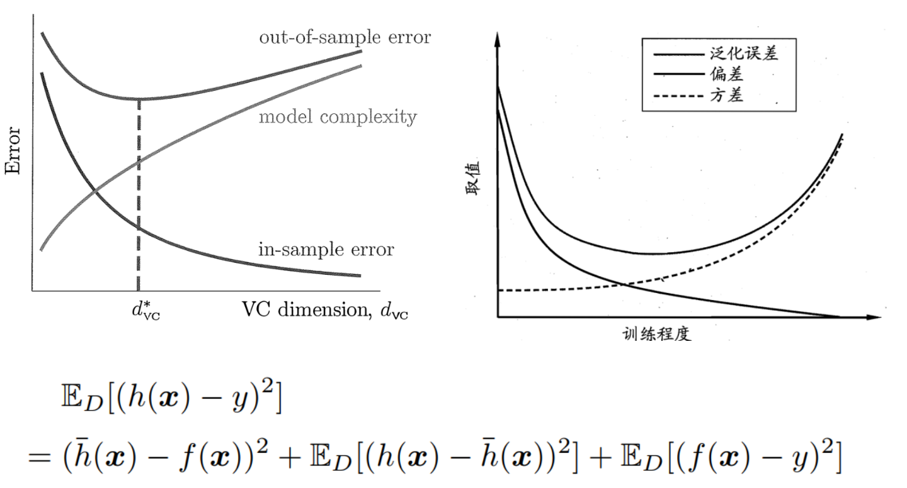
</p>


<br>

## 概率方法
### 概率方法建模的两步：进行概率假设、最大化后验概率
* 由贝叶斯公式，最大化后验概率 P(θ|D) 包含两项：似然分布 `p(D|θ)` 和先验分布 `p(θ)` ，这两项分别对应 ***经验风险*** 和 ***结构风险***  
* 其中最大似然 `p(D|θ)` 的目标是在 θ 的所有可能的取值中, 找到一个能使样本属于其真实标记的概率最大的值

    <p align="center" >
    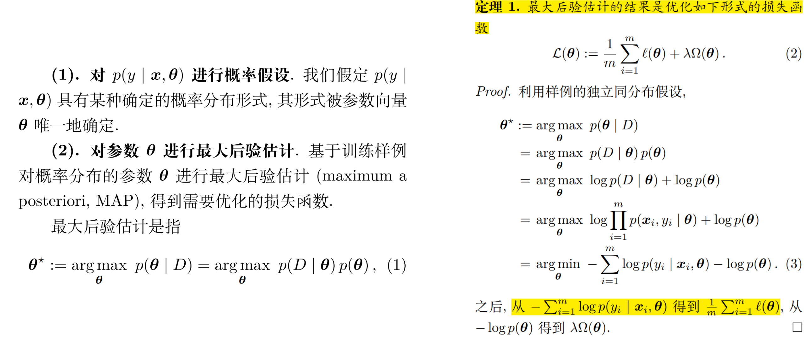
    </p>


### 四种常见的概率方法：
* 线性回归 (用于回归任务)
* 对数几率回归 (用于二分类任务)
* Softmax 回归 (用于多分类任务)
* 朴素贝叶斯分类器 (用于多分类任务)：是生成式模型

    下表中的概率假设和下下表中的噪声分布是一个东西，假设函数 h(x) 也即是回归的模型。softmax 回归的 `l(θ)` 其实可以简化为 `-log(q_c)`，其中 `q_c` 为 ground truth 类别所对应的 logit 
        <p align="center" >
        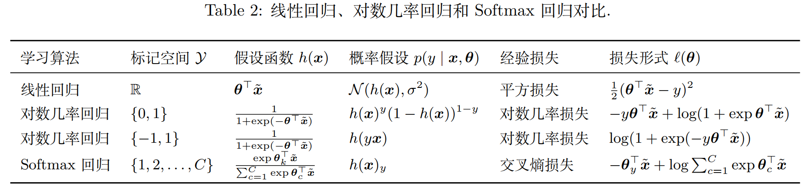
        </p>

### 线性回归
<p align="center" >
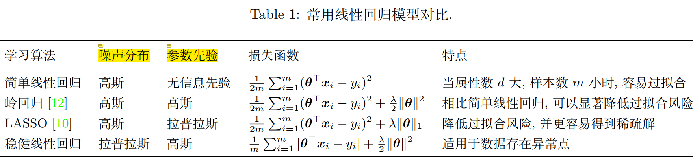
</p>

* 这里噪声分布是指 `p(y_i|x_i, θ)`，参数先验指的是 `p(θ)`。高斯噪音假设下，`p(y_i|x_i, θ)` 等效于 `(y_i - θx_i)^2`，所以损失函数是二次方

### 朴素贝叶斯分类器
* 判别式模型：直接对 `p(y|x)` 进行建模

* 生成式模型，朴素贝叶斯分类器是生成式模型：  
    * 其重点是先得到 `p(x|y)`
    * 具体步骤：先对联合分布建模：`p(x,y) = p(x|y)p(y)`，再由贝叶斯公式求 `p(y|x)`
    
* 朴素这个名字来源于两个假设，以避开从有限的训练样本直接估计 p(x|y) 的障碍：
    * 各属性（也即x1, x2等）条件独立： `p(x1,x2|y) = p(x1|y) p(x2|y)`
    * 每一个属性 i 对于每一个类 c 服从正态分布：`p(x_i|y=c) ~ N(μ_ci, σ^2_ci)`
    * 要估计的参数 θ 包含第 c 类样本在第 i 个属性上的高斯分步的均值 `μ_ci` 和方差 `σ^2_ci`
     

### 牛顿法和梯度下降
* 牛顿法最先是用于求零点的，需要计算斜率。但用于求极值，牛顿法需要计算原函数的海参矩阵的逆矩阵，计算量大；而梯度下降只用计算一阶导数
* 牛顿法不需要设置学习率，其学习率又由海参矩阵的逆决定，其收敛速度比梯度下降更快，但容易陷入鞍点（在鞍点时步长过小），不能拓展到小批量梯度下降
* 拟牛顿法：不用二阶偏导数而构造出可以近似海参矩阵（或海塞矩阵的逆）的正定对称阵

<br>

## 支持向量机
推导过程：
* 步骤1：点到超平面的距离  
* 步骤2：使得正样本和负样本之间的最小距离具体最大化
* 步骤3：进一步简化
* 步骤4：SVM的基本型
* 步骤5：将基本型写成拉格朗日函数形式，并消去 w 和 b，得到SVM的对偶形式
* 步骤6：SVM推理时的判断函数

    <p align="center" >
    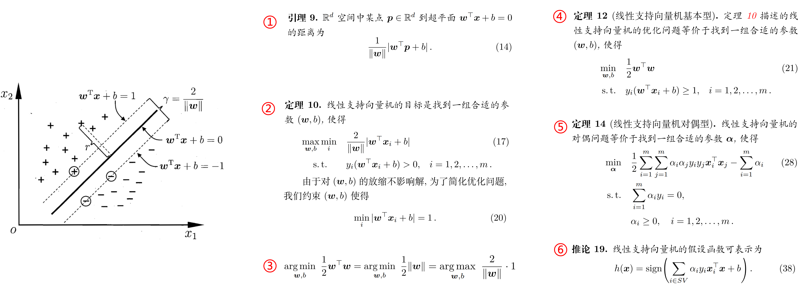
    </p>

核技巧
* 为避免线性不可分，现将数据映射到高维。观察到，在上面步骤5和6中，x 都是以内积的形式存在的，于是可以用核技巧将内积提前算好

    <p align="center" >
    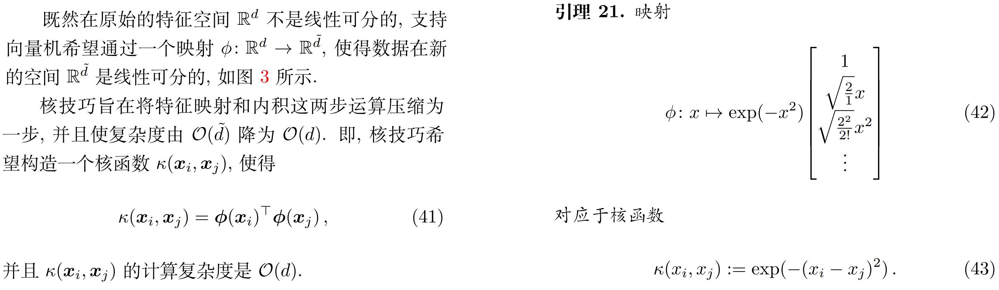
    </p>

软间隔支持向量机基本型  
* 步骤1：加入一个错误样本数量的乘法项目
* 步骤2：因为样本数量不可导，引入一个松弛变量，不仅和错误的数量相关，和错误的程度也相关
* 步骤3：其中和 epsilon 相关的两个限制条件和步骤2的定义等效
* 步骤4：soft svm 等效于 Hinge Loss + L2 正则；这也是为什么 SVM 的解有稀疏性（因为 hinge loss 中有一部分平坦的区域） 

    <p align="center" >
    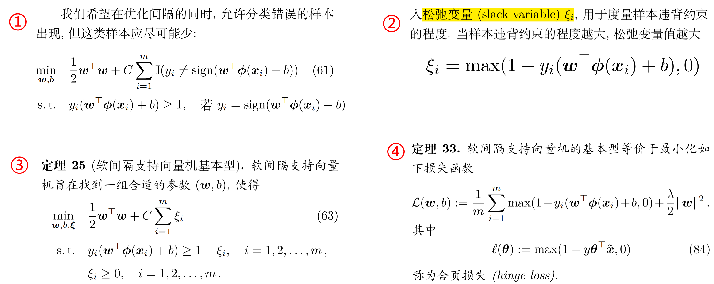
    </p>

<br>

## 集成学习
分为两大类：bagging (bootstrap aggregating) 和 boosting
* 随机森林属于 bagging；boosting 包含 AdaBoost 和 GradientBoosting
* bagging 主要降低 variance，boosting 主要降低 bias

### 决策树
决策树的生成过程采用分治法. 有三种情形会停止结点递归
* 当前节点包含的样本全属于同一类别
* 当前节点包含的属性集为空
* 当前节点包含的样本集为空  

常见的决策树有 ID3，C4.5，CART，他们主要是划分属性基于的 metric 不同  
* ID3中使用了信息增益选择特征，增益大优先选择。C4.5中，采用信息增益率选择特征，减少因属性分得过细导致信息增益大的问题。CART分类树算法使用基尼系数选择特征，基尼系数代表了模型的不纯度，基尼系数越小，不纯度越低，特征越好。这和信息增益（率）相反。
* CART 回归树做预测时，用叶子节点的均值来作为预测的输出结果
<p align="center" >
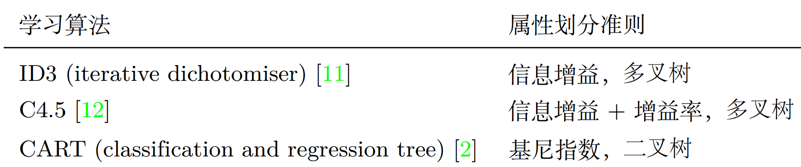
</p>

### Bagging
Bagging 主要依靠数据的自助采样法，也即来源于数据的波动
* 给定大小为 m 的数据集 D, 自助法采样将从 D 中 ***有放回地*** 采样 m 次得到数据集 D'。自助采样法在数据集较小，难以划分训练/测试集时比较有用。当 m 很大时，平均每个样本未被采样到的概率为 1/e = 36.8% 
* bagging 算法步骤：
    * 从 D 中有放回地采样，生成 B 个子训练集
    * 用着 B 个训练集训练 B 棵树
    * 对回归任务，B个预测值取平均；对分类任务，majority voting
* 随机森林：
    * 不仅利用 bagging 中来自数据的波动，还加入了决策树中属性的波动。具体地，对于每棵树，随机从总属性 d 类中随机选出 k 类，用这 k 类训练决策树。经验值：k = log2(d)
    * 基学习器之间的依赖性更弱了，更接近基学习器误差相互独立的假设

### Boosting
Boosting 的基本思路? 
* 先从初始训练集 D 训练出一个基学习器, 再根据基学习器的表现对训练样本分布进行调整. 使得先前做错的训练样本在后续受到更多关注, 然后基于调整后的样本分布来训练下一个基学习器，如此重复进行

AdaBoost（只适用于二分类）:
* 原来的优化目标是想最小化错误率 `e(h)`，adaboost 目标是优化加权后的错误率（公式12）
* Adaboost 算法：
    * α 是学习器 h_t 的权重
    * w_{t,i} 是时刻 t 样本 i 的权重
* 按以上算法可证明，adaboost 等效于优化指数损失函数

    <p align="center" >
    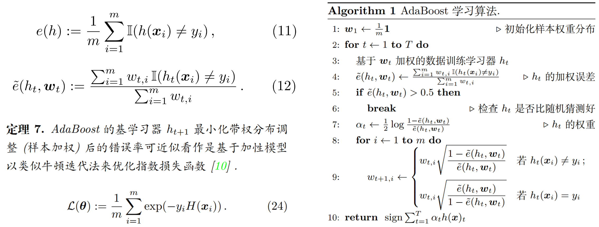
    </p>

GradientBoosting：
* 相比于 adaboost，gradient boost 能适用于任何损失函数
* 对 36 式的内层进行一阶泰勒展开，得到定理 8，也即 `h(x_i)` 需要去拟合的目标
    * 第5行：拟合了学习器 h_t
    * 第6行，使用 line search 找到最好的学习率使得loss最小
        <p align="center" >
        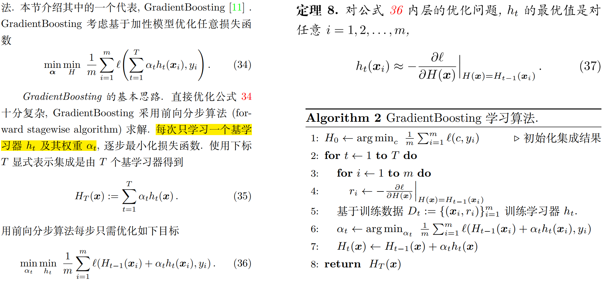
        </p>

XGBoost 和 GBDT：
* GradientBoosting 对损失函数进行一阶泰勒近似，XGBoost (Extreme Gradient Boosting)使用损失函数的二阶泰勒近似（类比基于一阶梯度的梯度下降和二阶梯度的牛顿法），相当于将海森矩阵用作步长，收敛更快

    <p align="center" >
    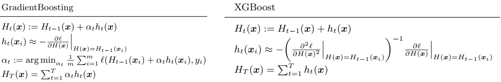
    </p>
* GBDT（gradient boosting descision tree）：决策树 (通常是 CART 回归树) + Gradient Boosting 集成 + 平方损失函数