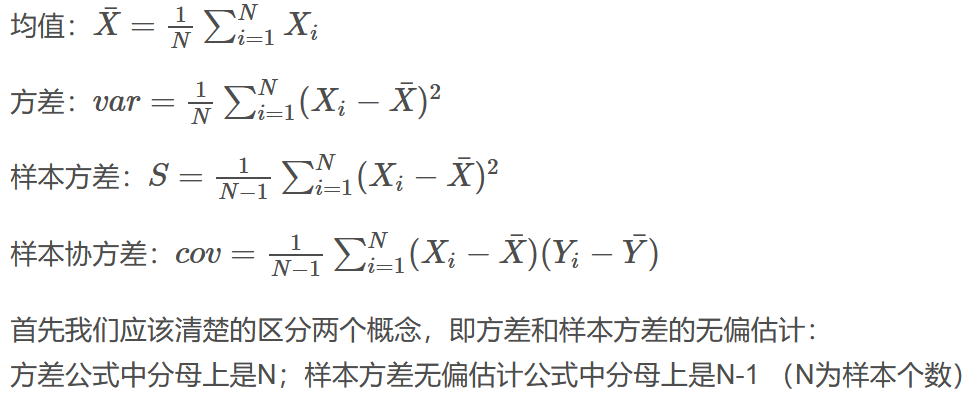
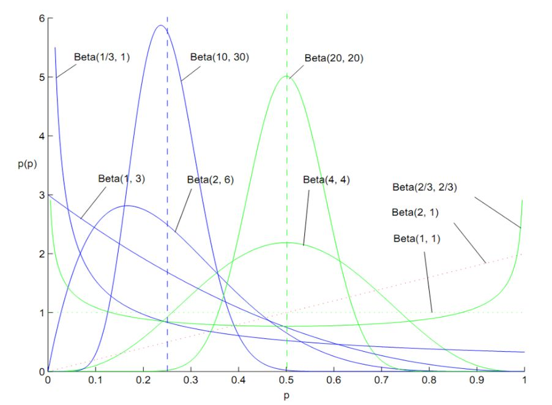

# 方差
## 样本方差 和 样本方差的无偏估计
方差：分母为N；样本方差的无偏估计，分母为 N-1  
* 直观的解释：如果在样本的均值给定的情况下，样本方差的无偏估计也是以 N 为分母的；但实际上，样本的均值本来也不是确定的，相当于实际的不确定度比 `以N为分母的方差` 大  
* 数学推导：https://www.zhihu.com/question/20099757/answer/13971886

<p align="center" >

</p>

## 协方差
> https://blog.csdn.net/zch1990s/article/details/80005940  
```python
import numpy as np
x = np.array([[0, 2], [1, 1], [2, 0]])  # shape (3,2)，3个样本，两个维度
y = np.cov(x.T)   # shape (2,2)，先转置，才能求维度和维度之间的 cov
```
求出的协方差，可以用来生成多元正态分布矩阵等等：
`np.random.multivariate_normal(mean, cov, size=None, check_valid=None, tol=None)`，这里 cov 要的是维度和维度之间的协方差，而不是样本和样本之间的相关系数

<br>
---

# 分布
* 伯努利分布重复 n 次就是二项分布
* 二项分布和 Beta 分布共轭
    * Beta分布，是一个事件出现的概率的概率密度分布  
    举个例子，通过过去的历史经验，我们知道运动员的三分命中率很难超过40%。假如老张是一个优秀老练的篮球后卫，其过去历史的三分命中率是35%，总投数为10000次，命中次为3500次。请问他在新赛季刚开始的时候，得到了一次三分投球机会，请问他这次投中的概率服从什么分布呢？我们必须清楚，**这个概率一定不是确定的，而是服从某种分布**。这个概率密度分布函数应该在0.35处最大，沿两边逐渐递减。实际上他命中的概率就服从beta分布，所以 Beta 分布可以理解为概率的概率

    * 共轭：先验与后验  
    根据贝叶斯定律，`后验概率P(θ|data) = 先验概率P(θ)*似然函数P(data|θ)/P(data)`，这里 `θ` 是模型参数，其中：     
      * `似然函数 P(data|θ)` 描绘的是：模型参数 θ 已经定下来了，出现某个 data 的可能性是多大  
      * `后验概率 P(θ|data)` 描绘的是：data出现了，模型参数 θ 的概率分布。通过最大化后验概率，就可以得到模型    

       在多次伯努利实验中，似然函数可以用二项分布表达，先验和后验可以用 Beta 分布描述（先验其实也是上一次的后验）    
       Beta 分布的两个参数 B(a, b) 正好是物理计数，a 代表正例个数，b 代表反例个数。`a/(a+b)` 代表这峰的位置，`a+b` 越大，beta 分布也就越窄（峰值位置的概率的可信度更高） 
        
       后验概率的更新方法见：https://www.zhihu.com/question/30269898/answer/123261564 ，形式是比较优美的   

        <p align="center" >
        
        </p>

* 多项分布和 Dirichlet 分布共轭
    > https://www.cnblogs.com/mercurysun/p/13931963.html
    * 类似于二项分布 和 Beta 分布的关系

        ```python
        # 掷6次骰子，1点到6点各出现一次。于是可以得到一个每一面在上的概率向量，而这个概率向量不是确定的（它服从狄利克雷分布），打印5次这个概率向量
        np.random.dirichlet((1,1,1,1,1,1), 5)
        # 输出
        [[0.10809771, 0.20665203, 0.37356706, 0.16629097, 0.04227898, 0.10311324],
        [0.02945716, 0.15565908, 0.3917251 , 0.00122295, 0.41365818, 0.00827752],
        [0.05997965, 0.09749087, 0.45065787, 0.01162155, 0.27004202, 0.11020804],
        [0.28493411, 0.345819  , 0.26229991, 0.06218243, 0.02848015, 0.0162844 ],
        [0.27543578, 0.10746597, 0.24076554, 0.2194201 , 0.00354662, 0.15336599]])

        # 投60次，每个面在上10次
        np.random.dirichlet((10,10,10,10,10,10), 5)
        # 输出
        [[0.16232684, 0.18316458, 0.15136794, 0.13208314, 0.21229593, 0.15876157],
        [0.15149954, 0.17152542, 0.13818261, 0.21960618, 0.14775583, 0.17143041],
        [0.20535253, 0.16066443, 0.16712831, 0.1486687 , 0.17545331, 0.14273271],
        [0.16003548, 0.16322083, 0.18979353, 0.17732615, 0.16594137, 0.14368264],
        [0.13556861, 0.16781649, 0.20356902, 0.12534922, 0.19523463, 0.17246203]
        # 可以看到，相比上面的输出结果更靠近 1/6
        ```

