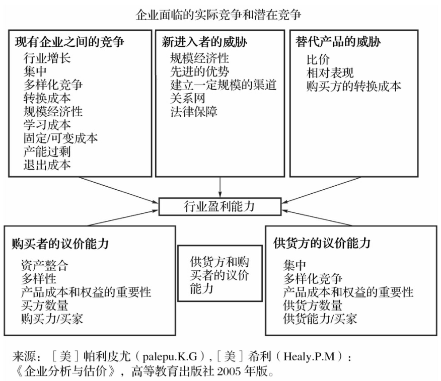
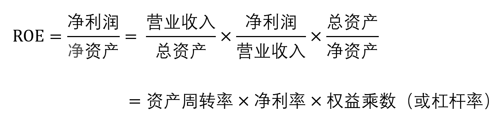

# 财务分析方法
## 同型分析：计算相对于总资产/总营收的百分比
资产负债表的同型分析为资产负债表的每个项目除以总资，例如：
* `固定资产/总资产`：反映了行业特征，`60%` 就比较高了，属于重资产类型的企业
* `应收账款/总资产`：`15%` 就很高了，说明不是回款不力，对下游话语权不是很强  

利润表的同型分析为利润表的每个项目除以营业收入，例如：
* `毛利率 = 毛利润/营业收入`：体现行业竞争环境和该企业的竞争力

同型分析在进行充分比较的前提下，能发挥最大的功效：
* 趋势分析：和自己的过去比
* 比较分析：和同行业比

## 比率分析
在原始的报表数据不能充分描述企业状况的时候，企业就需要在这些原始的财务数据之间做一些加减乘除的运算，计算所得的新数据即所谓的“比率”。下面是一些常见的比率分析指标：
### 盈利能力：行业竞争+上下游话语权+经营管理能力

    

* **行业竞争：毛利率**，毛利率越高意味着企业产品的竞争力越强。
优秀的企业，毛利率可以高达 `80%` 以上，比如贵州茅台。而毛利率低于 `25%` 的企业，后续的费用管理就会压力极大，净利率很难提高。
    * **毛利率重要的是和同业对比**，不同行业间差别较大，例如软件行业毛利率普遍较高，因为主要开销在员工工资上，计入了费用；医药行业药品原材料成本不高，但是研发成本高，主要开销也是计入了费用；而零售行业，毛利率就比较低

* 议价能力
    * 对上游的议价能力：应付账款、预付账款、原料的购买方数量及集中度  
    * 对下游的议价能力：应收账款、预收账款、客户数量及集中度  
    例如下图，造纸业以08年为分界点，从景气变为不景气：存货减少，应收账款变多，说明厂家进行了赊销（先发货再收款），议价能力下降，这是竞争加剧供大于求的一种信号。存货变成了应收账款也许是一件好事，因为存货朝现金迈进了一步，加快了资产的周转速度，但也有可能是一件坏事，如果应收账款不能收回来的话  
    `PS: 存货变多在大多数情况下是坏事，代表滞销。但一些特殊情况下，存货增多却是好事：比如贸易战背景下海康威视大量购买芯片，为可能发生的芯片禁运做准备；又如涪陵榨菜的产品通常需要经过数个月的腌制处理，它在新冠肺炎初期购买了较多菜头，以免之后购买出现困难`
        

        
        
 

* **企业的经营管理能力：净利率**，因为毛利润是营收扣除了成本，净利润则主要是扣除了研发、三费、税费等项目后的净值。其中的研发及三费支出，体现的就是企业的经营管理能力。净利率多少才称得上好呢？当然是越高越好，但因为各行各业商业模式的不同，研发及三费支出完全不同。净利率低于 `10%` 的行业和企业，可能就不那么吸引人了。

### 周转能力：衡量企业的营运能力  
* 周转天数 = 365/周转率
* 周转率
    * 总资产周转率：`收入/总资产`    
    * 应收账款的周转率：`收入/应收账款`，从企业卖出产品到收回所有货款的周期 
    * 流动资产的周转率：`收入/流动资产` 
    * 固定资产的周转率：`收入/固定资产`。在建工程越多，会影响固定资产周转率，因为在建工程并没投入使用  
    * 存货周转率：从采购原材料到卖出产品的周期。虽然用收入除以存货的方法计算存货周转率并非不可行，但现实中存在着一种更为常见的方法：**`成本/存货`**。因为在被出售之后，存货就转化成了营业成本，所以人们更习惯用成本除以存货的方式计算存货周转率

### 偿债能力
* 短期偿债能力
    * `流动比率 = 流动资产/流动负债`，反映企业短期偿债能力  
    * `速动比率 = （流动资产 - 存货 - 一年内到期的非流动资产 - 其他流动资产）/流动负债`；相比速动比率，速动比率是衡量企业短期偿债能力的一个更谨慎的指标，关注的是一年内能立马变现的高质量资产。
    * 流动资产的两个角色：
        * 为企业偿还流动负债作准备
        * 为企业的日常运营提供流动资金（例如购买原材料）
    * 中国国情下的流动比率：
        * 为什么在流动比率等于2的情况下，美国公司纷纷破产，而中国公司却活得好好的（大多数中国企业的流动比率都在1到2之间）？
        在中国，企业往往不用流动资产变现来偿还短期借款，而是借新债还旧债。在这样的模式之下，除非它所在的整个行业都完蛋，银行突然停止贷款，否则它还是能活得好好的。这样短期借款变成了长期借款的一种替代方式，需要通过变现流动资产来偿还的负债其实不包括短期借款
        * `中国国情下的流动比率 = 流动资产/(流动负债-短期借款)`，这个数值在2以下就比较危险（因为流动资产有两份角色），4以上就不算比较好
* 长期偿债能力
    * 从偿还利息的角度看：
        * `息税前收益 = 净利润 + 利息 + 所得税`
        * `利息收入倍数 = 息税前收益/利息`，例如为为4以上说明还利息上不用担心（通常用财务费用代替利息费用）
    * 从偿还本金的角度看：
        * `资产负债率 = 负债/总资产 = 负债/(负债+股东权益)`，中国上市公司的平均财务杠杆水平在45%左右

### 回报股东的能力
* 净资产收益率，Return on Equity  
`ROE = 净利润/净资产`
（能长期处在15%左右，就很好了）        
* 投资资本收益率，Return on Invested Capital  
`ROIC = 息前税后经营利润/全部投入资本`  
分子相比ROE中的R，加了利息费用，并且不包含各种非经常性损益；分母相比ROE中的E，加上了债权人的投资（`全部投入资本=总资产-无息负债`）
* 相比ROE，ROIC免去了非经常性损益和财务杠杆的影响。ROE衡量的是公司给股东带来的回报，ROIC衡量的是公司创造价值的能力，例如万科，ROE是22%左右，ROIC只有12%左右，是因为房地产行业本身有高杠杆的特性。`PS：ROIC不适用于金融行业（银行保险券商等），因为从报表中无从得到它们的全部投入资本`
* 关于经济利润  
企业一方面用了债权人的钱，一方面用了股东的钱；债权人的钱的资金成本在公司财务费用中已经体现了，但股东的钱的资金成本在净利润中并没有扣除（因为公司可以选择不分红，股东的钱有机会成本）。  
经济利润就是扣除了股东的资金成本之后的利润，而净利润只考虑了债权人的资金成本（贷款利息）。所以可能出现净利润为正，但是经济利润为负的情况。具体参见：`《一本书读懂财报---肖星》：怎样的公司才算好公司一章`

## 杜邦分析：

	

* 三个比率
    * 资产周转率：卖得多、轻资产、薄利多销、规模优势  
    * 净利率：卖的贵、产品满足个性化需求、差异化定价  
    * 权益乘数：负债较多，负债是有息 or 无息；流动 or 非流动；融资性 or 经营性？外部杠杆能否使得净利润等加速增长？

* 通过杜邦分析可以看出什么？
    * 公司的生意特性是轻资产还是重资产？公司的生意苦不苦？（例如经常需要自己先垫资）
    * 公司的护城河主要来源于规模优势还是优质的个性化服务？
    * 公司债务风险大不大？
    * 公司的盈利增长主要是内生性的，还是由于加大了外部杠杆？外部杠杆有没有起到助力内生性增长的作用？

 

# 什么样的才是好公司
## 现金流
为什么亚马逊、京东、美团、携程、滴滴这些企业连年亏损，股价却越来越高？持续利润亏损背后的企业价值，三个字：**现金流**，这些企业有个共同的特点，现金流很强大。

## 几种现金流的组合：
* 妖精型: 进入猪周期收获期之后的牧原股份，但往往这种公司的估值已经很高，安全边际不会太好  
* 奶牛型：茅台  
* 蛮牛型：2019年初猪周期开始时的牧原股份，处于大量融资并用于投资、扩大规模  
* 老母鸡型：长江电力，盈利大多用来分红了    
* 赌徒型：2019年左右的蔚来汽车等

	

### 净现比

	

`关注的是经营性现金流量净额，挤出了投资、筹资现金流。大于 1 为好 `   
把茅台理解为一个年轻人，就叫“小茅”吧：
* 经营性现金流：小茅有份好工作，上班赚的工资奖金是经营活动现金流入，上班通勤、吃饭、租房花的钱是经营活动现金流出。流入减流出就是小茅的经营活动现金流量净额。
* 投资性现金流：小茅工作攒下钱后，养成了理财习惯，每年都会拿出一些钱来做投资，买房产和股票，这些是投资活动现金流出，而以前买的房子收的房租、股票的现金分红是投资活动现金流入。流入减流出就是小茅的投资活动现金流量净额。
* 筹资性现金流：小茅有时趁着利率低，会跟银行借些钱，以及既有存款产生的利息，是筹资活动现金流入。而还本付息以及时常给爸妈寄回去的钱是筹资活动现金流出。流入减流出就是小茅的筹资活动现金流量净额。

小茅同学的现金流情况如下：
* 经营现金流净额持续为正：小茅的工作特别赚钱，而且工资和奖金都涨
* 投资现金流净额持续为负：小茅每年坚持做投资，买股票买房子，在投资上持续投入
* 筹资现金流净额持续为负：小茅有钱，不需要借钱，每年还拿一些钱分红

### 收现比
`收现比关注的是：是不是每个单位的营业收入都有收到的现金予以支持？`
* 如果收现比能等于或高于 100%，就表示企业更多收到了现金，而不是被赊账，好事
* 反过来，如果收现比显著低于 80%，就表示企业**被赊账**的情况很多，是不好的信号
* 收现比有可能超过 100%，原因在于货款一般包含了增值税，这部分会被计入“收到的现金”，但不会被计入“营业收入”，考虑这部分，理想情况下“收到的现金”应是“营业收入”的1.09-1.13倍。2015-2020年，茅台的收现比达到了 118.5%，说明茅台不接受赊账，经销商订货，钱必须先打过来

对于“收现比”低的企业，要弄清楚两件事儿：
* 为什么会有赊账问题？  
例如某公司，它进入了工程集采领域，新开拓了多家头部房企，营收和利润的增速非常快。这些客户本来是有供应商的，**那么它要抢夺份额，就要做些“牺牲”，先货后款算是一种战略性牺牲**，这种情况下是OK的

* 赊账客户的信用水平如何？  
它的大客户均为百强地产，大部分收入来自万科、碧桂园、恒大、绿地。虽然这些头部房企会以“赊账”的方式来占用上游供应商的资金，但它们的信用水平很好，最终“赖账”成为坏账的风险是很低的

## 企业未来发展
企业决策和经济活动之所以千差万别，至少有三方面原因：  
1. 行业环境存在差异
    * 行业本身是否是个好行业，是否会被新行业颠覆：例如缝纫机和医药行业
    * 行业竞争烈度怎样？
    * 行业本身的特征：是否重资产（制造业）？是否高杠杆（航空、银行、地产）？
2. 企业的战略定位
    * 是不是好的生意模式
    * 薄利多销还（低毛利高周转）是走差异化（高毛利低周转）？
3. 战略的执行能力： 
    * 企业管理层是否不思变、不思进取、是否短视、是否高傲自大？
    * 企业的优势主要是来源于什么（品牌、政策、人才、规模等）？这种优势在多大程度上能够继续保持？

 

# 一些财务风险的信号
## 经营不善的信号
> https://xueqiu.com/6615553088/129924864
* 盈利质量下降：营业收入增速低于应收账款增速，同时存货增加，预收账款减少（2019年格力电器）
* 产品滞销：产品提价后，产品销量没有增加（2018年东阿阿胶）

## 不自洽的逻辑
* 存货周转率逐年下降，毛利率却逐年上升  
存货周转率下降意味着公司产品销售遇到问题了，但是公司不仅没有降价促销，毛利率反而上升了

* 货币资金、有息负债双高  
例如 `货币资金收益率 = 利息收入/货币资金平均余额`和`融资成本 = 利息费用/有息负债`相比过低，说明货币资金大概率被占用了。为什么要给变相给银行创收呢？比如康美药业，长期的存贷双高，截止2018年半年报，公司货币资金余额为399亿元，同时有息负债（包括短期借款、长期借款、应付债券、其他负债等）高达347亿元，占净资产的比例分别为119%和104%。而且拉长周期看，康美药业的存贷双高并非一日形成的，从2010年开始，其货币资金和有息负债余额分别为28亿、28亿，占净资产的比例均为56%，占比一路上涨，尤其是近四年，一步一个台阶，公司的资产负债表上除了现金就是有息负债
## 一些可以粉饰利润的手段
* 大的在建工程  
对于资产负债表中的长期资产来说，往往通过折旧摊销的形式进入利润表。对于固定资产来说，如果是生产性的，往往通过计提折旧计入存货，存货卖出后再计入营业成本；如果是管理性质的，就是通过折旧计入管理费用；对于无形资产来说也一样。当然也有一些长期资产不计提折旧、摊销，例如在建工程。**在建工程科目，在建工程都是没达到生产条件的在建资产，因此没有转为无形资产或者固定资产，无需计提折旧**

* 投资性房产公允价值计价  
公允价值计量的投资性房地产科目：根据准则的规定，出租的房地产可以使用投资性房地产核算，**后续计量假如使用公允价值核算，就无须计提折旧。那么这些资产只创造收入，无需承担成本，那么使用成本模式自然比公允价值模式要保守的**
* 商誉科目  
根据现在准则的规定，商誉只需要进行减值测试，不需要按年摊销。因此这块资产虽然带来了大量的收益，但是并没有计入利润表摊销成本，也就是会虚胖
* 研发支出资本化   
研发支出可资本化计入无形资产，可费用化计入管理费用，**进行资本化对报表有美化作用**
