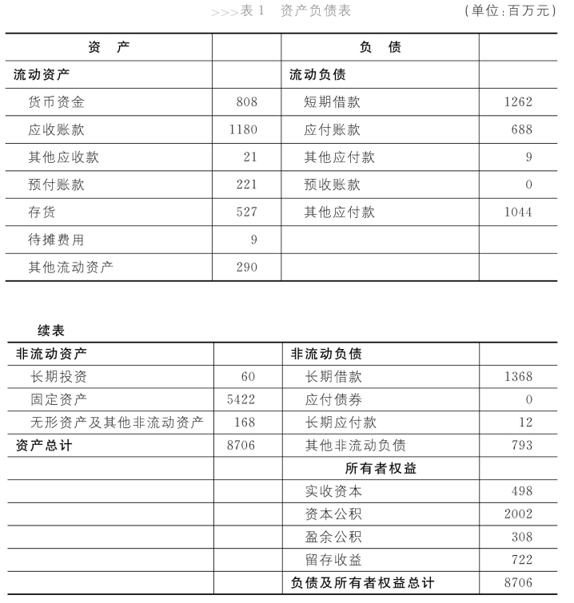
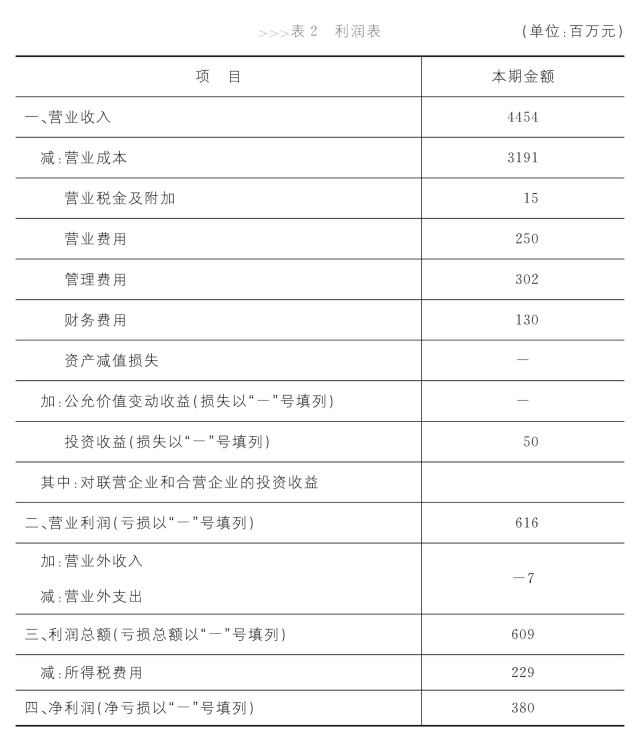

# 企业活动
企业干的三件事：**经营、投资、融资**  
* 融资：首先， 设立公司的时候， 公司的所有者或者说股东把钱投放到公
司来； 同时， 作为存续经营的企业， 我们还有可能去银行借钱。 因此， 我们便经历了一个***融资*** 的过程。
* 投资：接下来， 要怎么利用这笔钱呢？ 我去盖厂房、 买设备， 等到企业发展壮大之后， 我还有可能用这笔钱投资别的公司， 去参股、 去跟别人组建合资企业， 或者建一个子公司。 这就叫***投资*** 活动。
* 经营：那公司每天都在做的是什么事呢？ 公司每天都需要采购原材料、
生产产品、 销售产品、 回收货款……这些事天天都在进行， 这些活动
便是***经营*** 活动。

 

# 三张表的概述
> **利润表**：是对资产负债表中“盈余公积”和“未分配利润”这两个科目变动情况的展开与说明  
> **现金流量表**：是对资产负债表中资产项目下第一项“货币资金”变动情况的展开与说明

* 三张表之间的联系：
    * 利润表当中的一部分利润有可能被归入资产负债表中的未分配利润这一项
    * 净利润 和 现金净流量 之间的差值 = 资产负债表上非现金的资产和负债的变化
    * 任何支出都会在现金流量表都会体现出来，但它究竟会出现在利润表还是资产负债表上，取决于这个支出是和未来有关还是和现在有关。对未来有用的支出实际上是一个资产，通常会出现在资产负债表上（例如购买原材料）；和现在有关的支出则是一个费用（例如投放广告），会出现在利润表上

* 现金流量和利润谁更重要
    * 利润和现金流产生差异的原因是，资产负债表上非现金资产和负债的变化。这个时候资产的质量决定了纸面上的利润能不能最终转化为真金白银的现金流。例如商誉暴雷、坏账风险、库存滞销等都是因为资产质量差，导致之前的利润被多算了，而这些多算的利润，都会在未来某一时刻进行清算（这些资产的减值会体现在当期利润表上）。
    * 结论：当一个企业遭遇巨大风险的时候，关注风险是第一位的，现金流对它来说更重要；当企业经营活动的风险在相对可控的范围内时，利润就显得更为重要

* 三张表的侧重点不同：  
    > 资产负债表：家底  
    利润表：收益  
    现金流量表：风险状况和持续经营能力

    资产负债表只能描述制表时企业的财务状况，是一个时点的概念，能得知投入的本金是否得到保障。  

    利润表主要被用来描述企业的经营活动，能得知投入的本金有没有赚到钱。例如销售产品、各种费用、支付的所得税以及研发支出等，这些经济活动只与经营有关，**所以利润表是主要描述经营活动的一种财务报表。**  

    在经营活动中，也会存在应收账款、应付账款等项目，它们会被列在资产负债表中。当然，资产负债表还有很多其他的项目，让我们知道企业的固定资产有多少、无形资产有多少、长期投资有多少、短期借贷有多少、股东权益有多少……它们都属于投资或融资行为。**因此，资产负债表虽然与经营活动有那么一点点的关系，但和投资、融资才算是真正的“血亲”。**  

    看上去，企业的经营、投资和融资活动已经被资产负债表和利润表交代清楚了，这家企业已经不再需要第三张报表了。但事实的真相并不是这样，我们确实还有第三张报表——现金流量表。**现金流量表既涵盖了企业经营活动的现金流，也包括了企业投资和融资活动的现金流**，也就是说，它把企业的经营、投资、融资活动又重新描述了一遍。看上去，现金流量表似乎做了一件重复的事儿。
    其实不然，不同于资产负债表和利润表，**现金流量表是站在风险的角度，揭示企业的风险状况和持续经营的能力。**  
    
    三张报表实际上是站在两个不同的角度。在第一个维度上，现金流量表描述了一家企业能否生存下去，即所谓风险的视角；在第二个维度上，**资产负债表和利润表则展示了倘若这家企业能够继续生存它将是什么样子：有多少家底，又有多少收益——即所谓收益的视角。**
    要了解一家企业，这两个维度缺一不可，企业需要在这两个维度之下全面了解自己的经营、投资、融资状况。这就是为什么每个企业都需要三张报表，而且一定是这三张报表的原因。 因为它们构成了一有机的整体，它们完整地、不多不少地描述了一家公司的所有经济活动

 

# 资产负债表：企业的单反相机

	

## 资产
### 资产如何计价？
* 历史成本计价法：按购买这个资产时所支付的金额计价。  
遵循谨慎、保守的计价准则：如果资产升值，就当作没看见；减值了，就记录下来。  
在历史成本的计价体系下，增加资产价值的唯一途径是发生一个新的交易。例如一个公司，重新买回之前卖掉的资产，就可以按照买回交易中的价格重新记录资产价值。

* 公允价值计价法：用市场价格来计价。  
一般只有金融资产和投资性房地产，可按公允价值来计价（投资性房地产指用于出租或出售使用的房地产，企业自己的办公楼、厂房等不属于投资性房地产）

* 重要等式：`股东权益 = 净资产 = 总资产-负债`
### 流动资产
流动资产按流动性从高到低排序:

* 货币资金
* 应收账款
* 其他应收款  
    * 例如出差的备用金（留着随时给员工报销的）
    * 例如私下借给别人的钱。既不是投资，也不是销售产品所得。也叫“占用资金”
* 预付账款
* 存货
    * 生产产品所需的“原材料”
    * 尚在生产过程中的“在产品”
    * 生产出来的“产成品”
* 待摊费用（或成为待摊资产）
    * 预付的房租、广告费用、开办一家企业的开办费等
* 其他流动资产

### 非流动资产
非流动资产：流动资产之外的资产。
* 长期投资:  
    指不满足短期投资条件的投资， 即不准备在一年或长于一年的经营周期之内转变为现金的投资。长期投资按其性质分为长期股票投资、 长期债券投资和其他长期投资。

* 固定资产：   
    * 指同时具有下列特征的有形资产： （1） 为生产商品、 提供劳务、 出租或经营管理而持有的；   
    （2） 使用寿命超过一个会计年度。  
    一个极端的例子：养鸡场的母鸡是固定资产，更细分的话是，生产性生物资产。公鸡则放在存货一栏。

    * 固定资产的折旧：在使用的过程中， 固定资产会逐渐损耗， 其价值也会随着损耗逐渐降低。 因此， 会计在记账的时候， 还需要不断描述这个损耗的量， 即折旧。  

* 无形资产
    * 品牌、专利、版权、商标、商誉等
    * 土地使用权（中国特色）  
    因为在其他很多国家，企业和个人有土地所有权，此时土地是固定资产而不是无形资产。在中国，个人或企业只有使用权，没有所有权

### 关于资产的概念辨析
* 资产 和 财产物资  
    * 有些财产物资不是资产：  
    厂房、设备、存货等是资产。但是比如公司租用的办公楼，确实是物资，但不在报表上体现，不是资产，因为公司不是所有者。
    * 有些资产不是财产物资：  
    例如应收账款、预付账款，他们只是一种权利，而不是真实存在的东西。

* 费用 和 资产  
一些固定资产在使用的过程中，会有损耗，这些损耗就是费用（或成本）。很大程度上，资产和费用只存在时间概念上的不同。

* 流动 和 非流动  
流动：一年内或者超过一年的一个营业周期内的；  
非流动：在一年或者超过一年的一个营业周期以上的  

## 负债
### 流动负债
* 短期借款  
还款期限在一年以下或者一年的，或一个经营周期内的各种借款

* 应付账款  
欠供应商的钱

* 预收账款  
预收的买方的钱

* 其他应付款  
比如小红的公司由于周转不灵，向小张的公司借款100万元。对于小张的公司来说，这100万元是其他应收款；而对于小红的公司来讲，这笔钱就叫其他应付款，是
一笔负债

* 其他流动负债  
例如，应付税款，应付工资

### 非流动负债
* 长期借款  
企业从银行或其他金融机构借入的期限在一年以上（不含一年）的借款 

* 应付债券  
企业为筹集资金而对外发行的期限在一年以上的长期借款性质的书面证明， 约定在一定期限内还本付息的一种书面承诺。例如各种可转债。
* 长期应付款  
一般情况下，长期应付款会跟一种交易有关，比如说租赁。在会计看来， 租赁分为两种，即经营性租赁和融资性租赁。如果是经营性租赁，则承租者未购买租赁物，只需向出租者支付租金即可，租入的资产不属于承租方，不在承租方的报表上出现，未来将要支付的租金也只需在支付时记入相应的费用。  
但融资性租赁的情况则完全不同，在会计看来，进行融资性租赁的企业其实是在用分期付款的方式购买一项资产，所谓的租金就是分期付款的款项。相应的，租入的资产被认为是承租方的资产，因此可以出现在报表上，未来将要支付的租金的总额也要在签署租赁合约时记入负债，这就是长期应付款。  
综上所述，经营性租赁是一种表外业务， 即相应的资产和负债都不出现在报表上，而融资租赁则是一种表内业务。
* 其他非流动负债

## 股东权益
* 股本  
在中国，股本等于注册资本。如果只是一家有限责任公司的资产负债表，那这个项目就得被称作“实收资本”。股本的总额体现了这个公司对外承担法律责任的上限。股本的组成确定了多个股东之间的权利义务关系（当公司有多个股东的时候，不是以他们的投资额来确定股权比例，而是一他们在股本中所占的比例确定股权比例）。

* 资本公积  
股东的实际投入资金比注册资金多出来的部分。举个例子：
比如说，小张打算投资小黄的公司，他想要投资之后，小张和小黄各占公司50%的股份。在小黄刚刚创立公司的时候，他投入了100万元，那么，为了获取和小黄相同的股权比例，小张是否也要投入100万元？显然不是。经过多年的经营，小黄的公司已经积累了相当多的财富和资本，为了获得该公司50%的股权，小张可能要投入500万元。那问题也来了，小黄和小张的股权比例是5∶5，而不是1∶5，这一点要如何展现在财务报表里呢？  
于是，会计们将小黄投入的100万元当作股本，将小张投入的500万元中的100万元也当作股本，而剩下的400万元则被放入资本公积里。也就是说，***当公司有多个股东的时候，不是以他们的投资额来确定股权比例，而是以他们在股本中所占的比例确定股权比例。*** 值得说明的是。放在资本公司的400万元可不是小张独有的，它是所有股东共有的。也就是说，小张拥有400万元资本公积中的200万元，小黄也同样拥有200万元。换句话说，小张刚刚投进来的500万元，瞬间就变成了300万元，小张也因此损失了200万元。真是奇怪了，既然如此，小张为什么还要做这赔本的买卖呢？显然在小张看来。只要丢掉这200万元，就能换来小黄公司50%的股权，相当值得。这种情况通常发生在投资者对被投资公司的未来收益看好的前提之下。

* 盈余公积 和 未分配利润   
盈余公积是法律不让公司分配的利润。中国的公司法规定，一个公司有了盈利之后，必须至少存留10%利润作为盈余公积。未分配利润是企业自己不想分的利润。

* 小结  
股本和资本公积都是股东出的钱，盈余公积和未分配利润都来源于净利润。四项加起来就是股东权益，也即净资产。

 

# 利润表：企业的摄像机

	

## 企业获得净利润的步骤

### 毛利 = 营业收入-营业成本
* 营业成本，是指企业因销售产品或者提供劳务而发生的费用。换一种理解，***营业成本是指期内销售产品的存货价值。***  
* 一般包含：直接材料，直接人工，固定资产折旧，无形资产摊销，制造费用，房租等等。

### 营业利润 = 毛利-营业税金-三费-三损益
* 营业税和增值税
    * 在利润表中，只会出现营业税，不会出现增值税，因为消费者在买东西时，把增值税已经交给了卖方，这笔钱从交到卖方手上的这一刻起，就不属于他，所以增值税体现在资产负债表的应交税金中。

* 三费：营业费用，管理费用，财务费用    
    * 营业费用：在生产和销售过程中产生的费用就是营业费用。比如说把货物从仓库运到销售场所的运费、仓储费、广告费和其他为了促销而支出的一些费用、销售人员的工资。
        * 不同类型工作人员的工资往往属于不同的项目：销售人员的工资属于营业费用，管理人员的工资属于管理费用。   
        * 不同类型的固定资产的折旧也属于不同的项目：门店的折旧属于营业费用，办公楼的折旧属于管理费用，而厂房的折旧属于生产成本。
    * 研发支出其中费用化的部分计入管理费用，广告支出计入营业费用。
    * 财务费用：借款利息减去存款利息的净额。

* 三损益：投资收益，资产减值损失，公允价值变动收益  
    * 按历史成本计价的：资产减值损失  
    * 按公允价值计价的：公允价值变动收益

### 利润总额 = 营业利润+营业外利润
* 营业外利润=营业外收入-营业外支出  
营业外收入：出售固定资产的收入，政府补助等...   
营业外支出：公益性捐赠支出，火灾地震所造成的损失等...

### 净利润 = 利润总额-所得税  
一般所得税占利润总额的25%及以上  

## 关于利润的概念辨析
* 利润 不等于 现金流
    * 有收入不等于收到现金：应收账款
    * 收到了钱却可能没有收入：预收账款，增值税
    * 有费用也不等于要付出现金：固定资产损耗
    * 付出了现金不一定会产生费用：企业预交了下一年的房租，换回了房子在下一年的使用权，得到了一项资产

* 生产成本 和 营业成本
    * 生产成本在资产负债表上，营业成本在利润表上。
    * 营业成本只是生产成本的一部分，是那些被卖掉的产品的生产成本。没被卖掉的产品的生产成本转化为了存货。  
    比如，企业花1000万元的货币资金用于购买原材料、发员工工资、水电等。那么公司的资产中少了3000万元，而存货中则多了3000万元。

* 仅扩大产量而不扩大销量，可以增加毛利润/毛利率  
    * 毛利 = 营业收入-营业成本。  
    * 因为生产具有边际效益，生产的量越大，每件产品的成本就越低。因为只有卖掉的产品的生产成本才算作营业成本，所以如果扩大产量缺不扩大销量，营业成本可能降低了。假设销售价格不变，而销量也不变，那最后毛利润其实增加了。
    * 这种情况下增加的毛利润，是以存货增加为代价。所以不能简单把毛利润（毛利率）增加看成业绩提升的表现。

* 研发支出  
研发支出有两种方法体现，但企业能够通过设计不同的组织结构，来实现不同的会计结果。
    * 研发支出费用化，也即计入管理费用，可以减少税收支出。  
    因为研发支出的回报具有很大不确定性。
    * 研发支出资本化，也即计入无形资产，优点是能美化财务报表。
        * 从外面购买技术的支出一般记在无形资产中，因为购买本身就说明该项技术的商业价值得到了认可
        * 技术研究成功之后，用于申请专利的这部分费用也可被计入无形资产。例如公司花了50万去研究技术，5000元申请专利，这5000元将被计入无形资产。
        * 有些公司的研发部门是独立的法人，为了获得技术。工资必须向自己的研发部门购买技术。这个时候，这项技术在这家公司就变成了外购的技术，也就可以被记录在无形资产当中。

 

# 现金流量表

	

* 现金流量表为什么存在？  

    > 现金流量表向我们展示了资产负债表上货币资金增减变化的原因

    有人说，如果我们用现金流量表上记录的所有现金的流入减去现金流量表上记录的所有现金的流出，就会得到现金净流量。因为现金流入会让企业的现金增加， 而现金流出则会让其现金减少，**所以现金净流量也就是企业现金的增减变化**。因此，现金流量表可以帮助企业得知自己目前的资金情况。  
    但也有人说，这一点资产负债表就能做到。资产负债表永远能让企业知道自己到底有多少钱；而对比年末的资产负债表和年初的资产负债表， 还可以进一步了解这一年中企业货币资金的增减变化。因此，想要了解现金的增减变化，完全不必依靠现金流量表。那现金流量表究竟为什么存在呢？它有什么独特的意义？  
    举例来说。 2013年，A公司经营活动的现金流量达到1个亿，投资活动和融资活动又分别耗费了8000万元和1000万元，因此，A公司的现金净流量达到了1000万元。同年，B公司经营活动的现金流量为-5000万元，投资活动的现金流量为-2000万元，但它获得了8000万元的融资性现金流量， 因此， B公司的现金净流量也达到了1000万元。  
    虽然现金净流量均为1000万元，也就是说在2013年中，这两家公司的现金都增加了1000万元，但我们对它们的印象却大不相同：我们会觉得第一家公司运行得很健康，完全能够自给自足；但第二家公司的经营活动却入不敷出、捉襟见肘。  
    企业当然最希望现金大多从经营活动流入，因为源自经营活动的流入一般是可以长久持续下去的。而在各种不同类型的流出中，企业最喜欢的是投资，因为投资的现金流出很可能在某一日创造出收益。**这就是为什么在了解现金的增减变化情况之外，还必须了解增减变化的原因，这也就是为什么企业需要一张现金流量表的原因。**
