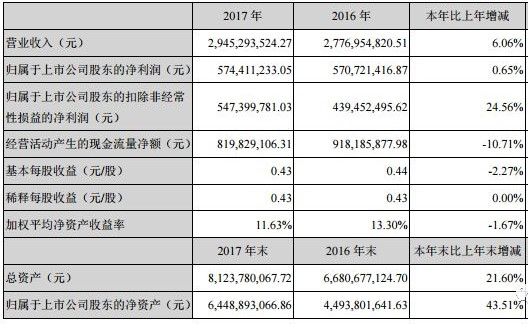

> 这一篇主要讲投资思想，也即怎样将公司分析和投资思维结合

 

# 投资体系
## 常识、概率、赔率、频率（情绪）
* 概率：在股价跌无可跌时，在稍微的利好（基本面可能并没有改善，而只是一个改善的预期）刺激下就能使得股价短期上涨几十个点。即便之后基本面的改善被证伪，也不亏，现有价格也足够反映了所有悲观预期，这是股价在低位时概率层面上的保证
* 赔率：如果基本面确实改善，可能会有几倍的赔率
* 股价低位更注重赔率，因为低价本身就一定程度确保了概率；高位应更注重概率，因为可能会面临本金永久性损失的风险
* 先赔率和先概率的区别：先概率要求基本面至少有向好的预期，先赔率更看重市场过分悲观带来的超跌

## 弱者体系：守正出奇
### 守正：保证不亏
守正也即风控，不亏为前提，赚多赚少交给运气
### 出奇：抓拐点
* 公司内生性的成长：
    * 周期行业的底部反转/朝阳市场市场空间扩大：猪周期、汽车周期、生物医疗创新药、高端制造业的国产替代
    * 市占率提升（产品竞争力提升）：海天味业、中顺柔洁
    * 作为龙头通过多元化突破了之前的行业天花板（整合了上下游或开辟了新的赛道）：涪陵榨菜
    * 公司内部治理效率提升：太极集团
* 外延式的机会：投资并购、国企混改、政策红利等

 

# 阅读财报的一般步骤
> [财报分析没有那么难（腾腾爸） ](https://mp.weixin.qq.com/s?__biz=MzIzNDU4OTMwMA==&mid=2247491392&idx=1&sn=5237a5b5c6cf4b3547b6e893d504454e&chksm=e8f5425bdf82cb4db819c84f3014a116c57f8bb35b2a5687be2494cd2a42d179d7a0c0d0fb1d&mpshare=1&srcid=0822LAg22lijoXvdqbalM8er&sharer_sharetime=1603959050758&sharer_shareid=f696b7bfdf3876c6bfc0824b37bf0020&scene=1&subscene=10000&clicktime=1603959070&enterid=1603959070&ascene=1&devicetype=android-29&version=27001353&nettype=WIFI&abtest_cookie=AAACAA%3D%3D&lang=zh_CN&exportkey=AwuT%2BRyafJ%2BGp4V1uNrE5Bw%3D&pass_ticket=KkSbGsfEgkZFvFH%2BiV9brqqQxursw0PsNvesmZ%2Bqng%2FA7OJjRJlBDNjHCh2Shi7a&wx_header=1)

## 第一步：找到表格 `公司主要会计数据和财务指标`

	

 
通过看这张表，达到两个目的：

* 对这家企业的整体财务状况有个大概地了解
    2017年相对2016年，营收增长6%，归母净利增长0.6%，扣非后净利增长却高达20%以上，经营性现金流量净额下降了10%，总资产增长了20%以上，净资产竟然增长了40%以上。几项主要数据的增长曲线完全不在一个频道上。这几项数据给我们构勒出了企业这样一个基本的画面：
    
    （1）近两年的营收及净利增长不佳，经营上可能碰到了困难  
    （2）企业的资产和净资产增长明显高于营收和净利润增长

* 由上一步分析，可以确定下步的财报阅读重点  
正常情况下，营业收入、净利润、经营性现金流净额、总资产、净资产的增长幅度应该是大体相配的，而这个公司出现了“异样”，所以要继续找寻这些“异样”的产生原因

## 第二步：公司是干什么的？经营情况怎样？股权结构怎样？
* 找到章节：公司业务概要，会有关于公司的描述
* 找到章节： 经营情况讨论与分析
    * 找到 `营业收入构成` 表格，主营业务有哪些？
    * 顺带回答了：为什么企业在营收及净利润增长不多的情况下，净资产反而有超过40%的大幅增长？因为有过一次非公开发行股票行为，也即“定增”，增厚了净资产。可搜索“募集资金使用”字眼查询。
* 股权结构：可搜索“控股股东”，看看股权结构是否稳固、健康？

## 第三步：看三表
> 严格来说会有八章表：资产负债表、利润表、现金流量表和所有者权益变动表。母公司的和合并报表的各4张，一共就是8张。作为投资者，关注合并报表中的资产负债表、利润表、现金流量表即可

### 判断企业价值的基本判断
追求有利润的营收、追求有现金的利润

### 资产负债表看什么：
1. 拿过一张资产负债表，先看看它的总资产、总负债、总股东权益，知道它大概的规模；
1. 看看资产中几个主要科目的数据及质量情况：应收账款、存货、商誉、其他应收款。通过同型分析，看谁的占比大，就重点分析谁。答案多在附注中找。别忘了搜索大法。
1. 负债部分就看有长期、短期借款、应付账款等项，计算企业的总的负债率，分析经营中的还债风险
    > 负债分为有息/无息，流动/非流动，融资性/经营性
    * 无息负债优于有息负债
    * 流动负债偿还期<1y，非流动负债偿还期>1y
    * 融资性：一般分为短期借款（一般用于临时资金周转）/长期借款（一般用于扩大生产经营、购置设备、建厂房等；经营性：应付账款票据，预收账款等

1. 计算一下所有者权益中盈余公积和未分配利润的占比，对企业过往的盈利能力有个大概的了解。

### 利润表看什么
1. 查看有无利润产生——有营收无利润，是一件糟糕的事情，排雷
1. 计算出主营业务利润，排出那些非经常性损益
1. 查看“或然项目”有无异常，并寻找到这种异常的原因——所有非持续性增加企业净利润的行为，都值得我们好好检验和审视一番。

### 现金流量表看什么
* 扣非净利润/净利润：净利润中有多少来源于公司的经营（是不是不务正业?）
* 经营活动现金流净额/净利润：主营业务怎样？净利润中有多少是通过经营拿到的真金白银?
* 自由现金流 = 经营活动现金流净额 - （购买固定资产、无形资产、其他资产所支付的现金）：公司现金流紧不紧张，是不是要大量垫资，坏账风险几何？

### 三张表的关系
* 利润表，是对资产负债表中“盈余公积”和“未分配利润”这两个科目变动情况的展开与说明
* 现金流量表，是对资产负债表中资产项目下第一项“货币资金”变动情况的展开与说明

 

# 缠论
* 有底背驰，为一买出现提供了可能，但一买要直到二买出现了才能够得以确认
* 不仅要看位置，还要看内部结构
    * 三买的前提是已经有了一买和二买，不是随便一个突破中枢后的回踩不破中枢上沿都是三买
    * 还要看这个回踩在次级别有没有走完次级别的abc结构，走完才算是真正的三买
* 任意中枢突破的回踩可以算是一个支撑位，但不是严格定义上的三买